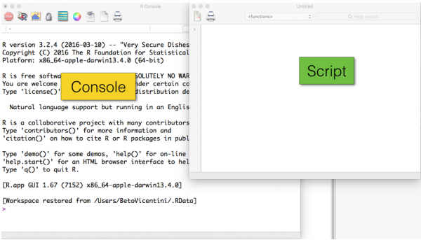
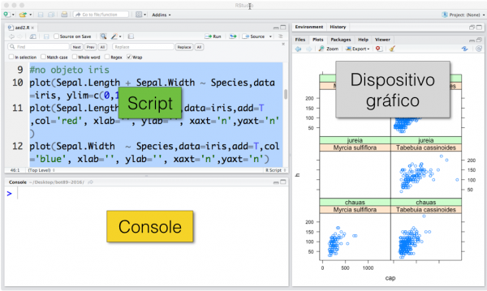

# (PART) Parte I {-}

# Conceitos introdutórios {#intro}

Recomendamos que o usuário siga a ordem dos capítulos, especialmente se é a primeira vez que o mesmo está lidando com o R.
Use o R via RStudio, é mais simples.
Busque executar cada script linha por linha, procurando entender o que cada linha faz e o que cada comando representa.
E para cada função nova, busque a [ajuda do R](#help), leia o que significam cada um dos argumentos.
Altere os argumentos das funções e veja o que acontece.
Explore!  


## Console e scripts

As figuras abaixo mostram imagens relativamente similares ao que os usuários do R padrão (Figura \@ref(fig:pad-r)) e RStudio (Figura \@ref(fig:studio-r)) verão ao iniciarem esses programas.  

```{r pad-r, out.width="101%", fig.cap = ' Imagem de uma sessão do R para Mac OSX com um janela de script aberta além do console.', eval = TRUE, echo = FALSE}

```

Ao abrirem o R ou o RStudio você terão basicamente duas janelas principais:

* **Console** - corresponde`a interface que interpreta o código da linguagem. Os códigos digitados aqui serão interpretados pelo R (Texto destacado em **verde** nas figuras \@ref(fig:pad-r), \@ref(fig:studio-r));

* **Script** - digitar um código curto no console é simples, mas quando o código é longo, é importante guardá-lo em algum lugar para executá-lo em qualquer momento. Para isso utilizamos scripts, que são arquivos de textos simples que podem ser salvo (extensão `.R`) numa pasta no seu computador e reutilizado (Texto destacado em **amarelo** nas figuras \@ref(fig:pad-r), \@ref(fig:studio-r)). Como um arquivo `.R` é um texto simples, ele é editável por qualquer editor de texto, como o Bloco de Notas ou [Notepad++](https://notepad-plus-plus.org/) para usuários Windows, [TextWrangler](https://www.barebones.com/products/textwrangler/) ou [BBEdit](https://www.barebones.com/products/textwrangler/) para usuários macOS, ou [gedit](https://help.gnome.org/users/gedit/stable/index.html.pt_BR) para usuários Linux. O editor de scripts do RStudio é excelente.

```{r studio-r, out.width="100%", fig.cap = ' Imagem de uma sessão do RStudio com três painéis abertos.', eval = TRUE, echo = FALSE}

```

## Linguagem objeto-orientada

A chave para entender o R é que trata-se de uma linguagem.
Uma linguagem para manipular objetos [@VenablesRipley2002].
Um objeto é identificado por uma palavra e veremos ao longo do curso que existem vários tipos de objetos.
Este é o conceito mais importante para entender o R.  

Para começar, digite algumas coisas no Console do seu R ou RStudio.
Por exemplo, digite uma fórmula matemática simples no console e o execute:

```{r}
3 + 5 + 10
```

O console retornou 18, isto é, o R funcionou como uma calculadora.
Portanto, números são interpretados como números pelo console.  

Agora vamos criar um objeto simples chamado `objnum` e atribuir texto a ele:

```{r}
objum <- "vou colocar um texto dentro do meu primeiro objeto" # enter
objum # enter
```

Vejam que `objum` é o nome do meu primeiro objeto, e tem como conteúdo o texto que nós atribuímos a ele.
Nós poderíamos ter chamado `objum` de qualquer coisa (sem espaços em branco):

```{r}
banana <- "vou colocar um texto dentro do meu primeiro objeto"
banana
# mesma coisa né?
```

Um objeto também pode virar outro objeto. Vejamos abaixo:

```{r}
objdois <- objum
objdois # pegou o conteúdo que eu coloquei em objum
```

Podemos guardar resultados de contas em um objeto:

```{r}
objtres <- 3 + 5 + 10
objtres
```

Note que o código exposto acima é geralmente o que está contido em um [script](https://pt.wikipedia.org/wiki/Linguagem_de_script), ou seja, a sequência de códigos que você escreveu e que o R interpretará para realizar o que foi dito.
Se você copiar e colar o trecho (ou os trechos) de código acima em um arquivo `.R`, você poderá executá-los tantas vezes quanto quiser.
Copie então todos os trechos de código expostos até então para a janela do script e salve-o como `script01.R` em alguma pasta no seu computador.  

Note também que dependendo do está incluso no script, o código apresenta cores diferentes para comentários, objetos, e símbolos de atribuição.
Isso ajuda a entender os elementos da sintaxe (vocabulário e gramática do R).
IDE's também mostram isso de forma colorida.  

Note também que, à direita do símbolo `#`, o texto no código acima fica cinza.
Este símbolo indica ao R que todo texto começando no `#` deve ser interpretado como texto apenas, e não como código.
Comentar códigos é uma prática que deve ser tornar rotineira a fim de facilitar o entendimento de cada script.  

Se você já está escrevendo um script num arquivo e não no console, selecione todo o texto na sua janela de script e digite `Control+R` (Windows), ou `Command+Enter` (Mac).
O conteúdo do script será executado no Console.
Note que o símbolo `#` não é interpretado pelo console.  

O R vem com vários scripts prontos, que são funções que executam alguma coisa.
Esses scripts são objetos de classe **função**, pois eles contêm um conjunto de códigos que utilizam parâmetros para executar um conjunto de passos.
Parâmetros são objetos que a função utiliza segundo as suas especificações.
Por exemplo, vamos listar os objetos criados no passo anterior:

```{r, opts.label='evalF'}
# digite
ls() # note os parênteses (); a função ls() lista os objetos criados por você: [1] "banana"  "objdois" "objtres" "objum"

# adicione um parâmetro à função, especificando o que você quer listar, apenas aqueles que contém no nome o padrão "obj"
ls(pattern = "obj") # [1] "objdois" "objtres" "objum"

# agora veja o que a função ls é
ls # note que não digitei os parênteses e ao digitar isso verei o script que está dentro da função ls que começa assim: function (name, pos = -1L, envir = as.environment(pos), all.names = FALSE, pattern, sorted = TRUE)  { ....
# note que os argumentos da função são os objetos que vão dentro do () da função e são utilizados pela função para executar alguma coisa, neste caso, lista objetos. Experimente mudando parâmetros:
ls(sorted = FALSE) # ele mostra os objetos na ordem que foram criados
```

## R-base e pacotes {#base-pacotes}

Como vimos acima, um script do tipo função é um objeto que executa um conjunto de comandos e recebe argumentos que modificam o que o script realiza. Existem dois tipos de funções:

* Funções do pacote `base` - funções que vêm junto com o R quando você faz o download do programa, como por exemplo as funções `length()`, `order()`, `sort()`, `sum()`, `mean()` etc;

* Funções de pacotes externos - pacotes (`packages` em inglês) são funções criadas por colaboradores e organizadas em pacotes que você pode baixar dos repositórios do R.

As funções do pacote `base` vêm junto com o programa e você não precisa se preocupar com isso.
Pacotes, por outro lado, devem ser instalados pelo usuário conforme a necessidade.
Por exemplo, para trabalhar com dados filogenéticos, você pode necessitar do pacote [ape](https://cran.r-project.org/web/packages/ape/index.html) [@R-ape], que já tem várias funções preparadas para análises filogenéticas.
Se você necessitar deste pacote, por exemplo, basta executar o seguinte comando no console do R:

```{r, eval = FALSE, echo = TRUE}
install.packages("ape")
```

Para trabalhar com pacotes você primeiro precisa definir um repositório, ou seja, um servidor, de vários disponíveis (espelhos do repositório oficial), de onde o R buscará o pacote desejado.
Pode-se também o menu do R ou do RStudio para instalar pacotes e definir um repositório padrão para sua instalação.  

Como tudo no R, você pode executar comandos que estão no menu usando funções.
Por exemplo, ao invés de usarmos o menu do R para definir um repositório e instalar um pacote, vamos executar estas ações por meio de um script:

```{r, eval = FALSE, echo = TRUE}
# isso pode não funcionar se estiver no INPA por causa do Proxy.
chooseCRANmirror() # seleciona repositório
install.packages("ape", dependencies = TRUE) # instala o pacote Ape
```

## Ajuda no R {#help}

Toda função no R, oriunda tanto do pacote base ou dos pacotes extras, possui um pedaço de texto chamado de "ajuda" e que possui uma instrução sobre a utilização da mesma.
Para obter esta instrução, é muito fácil. 
Basta executar uma das seguintes opções:

```{r, opts.label='evalF'}
# como exemplo vamos usar a função ls()
?ls # ou seja o comando é ?+"nome da função"
# ou então
help(topic = "ls") # nome da função como argumento da topic da função help
```

Ao digitar uma das opções acima, o R vai abrir uma janela (no RStudio, vai colocar esse resultado num dos painéis) contendo a página com a explicação da função:

```{r}
?ls
```

Todos esses trechos de ajuda (`?`) do R têm a mesma estrutura e devem ser acessados constantemente para o bom entendimento do funcionamento das funções e seus argumentos.  

## Área de trabalho vs. Pasta de Trabalho

Dois conceitos são fundamentais para trabalhar no R:

* Área de Trabalho (`environment` no R) - é o local dentro do R onde você coloca os objetos criados durante a execução de scripts. Você pode visualizar/apagar os objetos no Console:

```{r, opts.label='evalF'}
ls() # ls= listar - já vimos que isso lista os objetos criados por você e que estão na área de trabalho

?rm # veja o help desta função
rm(objum) # rm = remover - esta função apaga objetos da área de trabalho. No exemplo estamos apagando o objeto chamado objum, criado anteriormente
ls() # note agora que o objeto não existe mais

rm(list = ls()) # desse jeito apagamos todos os objetos que criamos anteriormente
ls() # note que não sobrou nenhum objeto
```

* Pasta de Trabalho (`working directory`- é o local (pasta) no seu computador que o R usa para salvar arquivos. É o caminho padrão para o R encontrar arquivos de dados, scripts, etc. Você pode trabalhar no R sem definir uma **Pasta de Trabalho** mas é muito mais simples se você usa este recurso. Experimente a seguinte script:

```{r, opts.label='evalF'}
getwd() # o nome desta função é abreviação de "get working directory" ou seja "pega a pasta de trabalho definida". A resposta deste código varia dependendo do seu sistema operacional. Mas a função retorna o caminho completo da pasta de trabalho atual
```

Toda vez que você usar o R, é uma boa prática primeiramente definir a *pasta de trabalho*, que é o local no seu computador onde você guarda os arquivos relacionados ao seu projeto (dados, scripts, resultados etc.).  

Você pode definir a *pasta de trabalho* usando o menu do R (`Arquivo ⇒ Diretório de Trabalho` no Windows; ou `Misc ⇒ Muda Pasta de Trabalho` no Mac).
Ou você pode usar uma função:

```{r, eval = FALSE, echo = TRUE}
?setwd # veja o help da função que iremos utilizar
minhapasta <- "/Users/BetoVicentini/Desktop/bot89-2016"
# se estiver usando windows:
# minhapasta = "c:/Users/BetoVicentini/Documents/bot89-2016"
# minhapasta = "c:\\/Users\\/BetoVicentini\\/Documents\\/bot89-2016"  #talvez precise usar barras invertidas

setwd(dir = minhapasta) # usa a funçao "set working directory" para especificar o diretório (pasta) de trabalho
# note que eu defini dir primeiramente como o objeto "minhapasta" usei esse objeto para especificar o objeto "dir", que é o único argumento da função setwd()
```

Objetos criados no R por você podem ser salvos como um arquivo no seu computador.
Você pode usar o menu do R ou RStudio para isso ou pode usar o comando abaixo:

```{r, opts.label='evalF'}
?save # veja o help desta função que vamos utilizar
?save.image # veja o help desta função que vamos utilizar

# se sua área de trabalho estiver vazia
ls() # se nao retorna nada porque voce apagou acima
# crie alguns objetos para o exercício
objum <- "um objeto de texto qualquer"
objum
objdois <- 18 # um objeto com um número qualquer
objdois
banana <- objum # um objeto idêntico a objum

# pronto, agora mostre todos os objetos na sua AREA DE TRABALHO
ls()

# agora salve esse objetos como um arquivo na sua PASTA DE TRABALHO
getwd() # veja onde o arquivo será salvo

# se voce quer salvar todos os objetos
save.image(file = "meusObjetos.Rdata")

# se voce quer salvar apenas alguns objetos
save(objum, banana, file = "meusObjetos2.Rdata")

# veja que na sua pasta de trabalho getwd() voce tem esses arquivos
dir() # lista arquivos na sua pasta de trabalho (análoga a função ls() que lista objetos)
dir(pattern = "Rdata") # lista apenas arquivos que tem no nome ".Rdata"

# apaga os objetos todos
rm(list = ls())
ls() # note que não tem mais objetos na sua área de trabalho, mas pode resgatar objetos que salvou num arquivo Rdata:
load(file = "meusObjetos2.Rdata") # puxa os objetos neste arquivo que está na sua pasta de trabalho
ls() # note que ele puxou os objetos objum e banana que salvamos acima neste arquivo

# puxe o outro arquivo gerado
load(file = "meusObjetos.Rdata") # puxa os objetos neste arquivo que está na sua pasta de trabalho
ls() # veja novamente os objetos na sua área de trabalho: Todos os objetos são listados. Se fizer isso e já houver objetos com o mesmo nome na sua área de trabalho, estes serão sobrepostos.
```

Portanto, *Área de Trabalho* e *Pasta de Trabalho* são dois conceitos fundamentais que você precisa entender bem, pois define como e onde você estará salvando informação quando usar o R, tanto em termos de objetos (área de trabalho) como em termos de arquivos (pasta de trabalho).  

Se você digita `q()`, que é a função para sair do R, ele geralmente lhe pergunta se você quer salvar os objetos numa área de trabalho padrão (que o R puxa quando você o inicia):

```{r, opts.label='evalF'}
q() # sai do R
# vai perguntar no Console algo do tipo "Save workspace image to ~/Desktop/bot89-2016/.RData? [y/n/c]:"
# note que o arquivo não tem nome apenas extensão ".RData" e é salvo na pasta de trabalho definida com setwd().
```

Códigos de scripts podem ser executados no console sem necessidade de abrir o script. Por exemplo, suponha que eu tenha salvo o seguinte script num arquivo `script01.R`:

```{r, opts.label='evalF'}
objum <- "meu primeiro objeto de texto"
objdois <- 18 # meu primeiro objeto numérico
banana <- objum
```

Se este arquivo Scrip01.R está na minha pasta de trabalho, então posso executá-lo com a função `source()`:

```{r, opts.label='evalF'}
dir(pattern = ".R") # mostra os arquivos .R que estão na pasta de trabalho
rm(list = ls()) # apaga todos os objetos, para ver que ele irá criar os objetos indicados no arquivo
ls() # nao tem nenhum objeto
source("script01.R")
ls() # os objetos foram criados como especificado no script
```

## Dicas de organização do trabalho

Você irá manipular diversos arquivos durante a execução de qualquer projeto e precisa organizar os arquivos para não se perder e poder voltar a eles quando necessário.  

A grande vantagem de realizar a análise de dados, produção de figuras etc, no R é criar um processo replicável, e é preciso ser bem organizado com os arquivos para poder reutilizar o processo com novos dados ou adaptá-lo para novas análises.
Isso implica, entre outras coisas, em:

* Organizar o projeto em uma pasta no seu computador exclusiva para ele;  

* Definir um critério lógico para dar nome aos arquivos do projeto;  

* Organizar arquivos em subpastas segundo a necessidade, por exemplo, uma subpasta para dados, outra para figuras, outras para tabelas geradas e outros resultados. Pode inclusive colocar a criação dessas pastas nos scripts do R, que ele cria na pasta de trabalho ('getwd()') que deve ser a pasta do seu projeto através de (funções do R para manipular arquivos e pastas);  

* O código dos seus scripts devem ser escritos de forma genérica para que ele possa ser usado com qualquer outro conjunto de dados que tenha a mesma estrutura que os seus (variáveis). Ou seja, o código deve ser escrito não em função do conteúdo dos seus dados mas apenas na estrutura (i.e. as colunas dos seus dados) deles. Esta é a chave para uma programação eficiente e para a replicabilidade. Isso significa que um resultado obtido a partir dos seus dados não deve ser manualmente atribuído a nenhum objeto no script, apenas atribuído a partir do objeto contendo o resultado.  

A definição da pasta de trabalho (**working directory**) é fundamental simplificar a leitura de dados e salvar arquivos sem se preocupar com o caminho completo (**full path**) para cada arquivo, mas apenas o caminho relativo (**relative path**). Por exemplo, um arquivo numa pasta de projeto pode ter como caminho completo `/home/usuario/Desktop/meuprojeto/dados/morfometricos.xlsx`, e o caminho relativo à pasta de trabalho seria apenas `dados/morfometricos.xlsx`.
Da mesma forma para salvar resultados a partir do R.  

O [RStudio](https://rstudio.com/) [@rstudio] facilita esse processo para você, permitindo que você crie um projeto.
Um projeto basicamente consiste em definir uma pasta de trabalho para que, toda vez que você abrí-lo, a pasta que contem o arquivo de término `.Rproj` seja a sua pasta de trabalho. Alternativamente, você pode simplesmente indicar a pasta de trabalho toda vez que iniciar uma atividade utilizando as funções `setwd()` no console ou em um script.  

## Dicas de erros comuns de sintaxe da linguagem R

Abrir e esquecer de fechar parênteses, colchetes e aspas é um dos erros mais comuns no início da caminhada rumo ao aprendizado de qualquer linguagem de programação, e é necessário muita paciência^[Lembrem-se sempre de que vocês não são os únicos a ter de lidar com a frustração durante o aprendizado de uma linguagem de programação. É importante estarem conscientes dessa verdade. Vejam esta postagem: <https://www.codingame.com/blog/dealing-with-programming-frustration-the-right-way/>] por parte do usuário para aprender a lidar com a frustração dos sucessivos erros que aparecem no caminho.
Mesmo usuários mais experientes têm que aprender a lidar com os erros, que são comuns, o que levou o programador Patrick Burns a publicar um curioso livro sob o título [The R Inferno](https://www.burns-stat.com/pages/Tutor/R_inferno.pdf) [@Burns2012_rinferno].
Uma ferramenta útil para evitar tais problemas é o uso de uma IDE como o RStudio.
Há opções na configuração que autorizam o software a checar seu código e informá-lo de possíveis erros, além de proverem ao usuário uma ferramenta de limpeza do código.
Sugerimos fortemente a instalação de uma IDE para usar o R.
Segue então uma brevíssima lista de erros super comuns que iniciantes enfrentam no aprendizado da linguagem R.

### Parênteses

Lembre-se sempre de, ao abrir um parêntese, fechá-lo.
Caso contrário, a ação não se completará e seu console ficará travado com um sinal de `+` aguardando que seu código seja completo.
Neste caso, ficar completo significa fechar o parêntese.
Tente executar o código abaixo e verifique que o sinal de `+` ficará estagnado na tela de seu console.
Para sair desta tela, clique no console e depois tecle `Esc`.
Você verá que o sinal de `>` voltará a aparecer no console.

```{r, eval = FALSE}
erro <- c(1, 2, 3
```

Agora, execute o comando abaixo.
Ele será executado perfeitamente.

```{r, eval = TRUE}
erro <- c(1, 2, 3)
```

### Vírgulas

Ao concatenar elementos ou ao adicionar valores em argumentos de funções, é necessário lembrar sempre de colocar as vírgulas em seus devidos lugares.
Caso contrário ... mais um erro!
Tentem executar o código abaixo:

```{r, error = TRUE}
numeros <- c(1, 5, 6 7, 8)
```

O R dará o aviso `Error: unexpected numeric constant in "numeros <- c(1,5,6 7"` e encerrá a operação.
Executem agora o comando abaixo.
Será executado sem problemas.

```{r}
numeros <- c(1, 5, 6, 7, 8)
```


### Aspas

Textos são especificados dentro de aspas duplas `""` ou aspas simples `''`; tanto faz qual você usa, o importante é sempre que abrir aspas, fechar as aspas com o mesmo tipo.
Se seu texto tem acentos, use aspas duplas para delimitá-lo.
Aspas simples podem entrar num texto definido por aspas duplas, e vice-versa.
Rode isso no seu console:

```{r}
objum <- "um texto com 'aspas simples'"
objum

obj2 <- 'um texto com "aspas simples"'
obj2
# note que foi adicionada uma barra invertida, porque \" na sintaxe do Rsignifica aspas para confundir com as aspas que você usa para indicar textos.
```

### Números

Números são sempre especificados sem aspas; se você colocar qualquer número entre aspas, ele será interpretado como texto:

```{r}
obj1 <- 18
obj1 + 1 # essa fórmula irá funcionar porque obj1 é um número
obj2 <- "18"
```

Isso não vai funcionar porque `obj2` não é um número.

```{r, error = TRUE}
obj2 + 1
```

Caso você insista em rodar, receberá a seguinte mensagem: `Error in obj2 + 1 : non-numeric argument to binary operator`.

### Nomes de objetos

Nomes de objetos não podem ter espaço em branco e aspas são ignoradas:

```{r, error = TRUE}
obj 1 = "meutexto" #nao vai funcionar
```


```{r}
obj1 <- "meutexto" # vai funcionar
obj1

"obj1" <- "meu texto" # vai criar objeto obj1, ignorando as aspas
obj1
```


```{r, error = TRUE}
obj"1" = "meu texto" #nao vai funcionar
```


### Atribuição de objetos

A **atribuição de valores aos objetos** pode ser feita com dois operadores equivalentes, `=` ou `<-` (este pode ser utilizado no sentido inverso também `->`):

```{r}
obj1 <- "meu texto"

# ou pode escrever assim
obj1 <- "meu texto" # atribui

# ou assim
"meu texto" -> obj1 # atribui
obj1
```

### Busque entender as partes

Se você tiver dificuldade no entendimento de um script do R que está tentando rodar, separe os termos das linhas e expressões para entender o que cada parte está fazendo.
Também pode alterar os valores dos argumentos para entender o funcionamento de uma função, ou simplesmente digitar a função sem os parênteses para ver o script que ela contem.
Por exemplo, vejamos a expressão abaixo, que faz uso de um conjunto de dados chamado `iris`, que vem disponível com o R.

```{r}
obj1 <- paste(levels(iris$Species), tapply(iris$Sepal.Length, INDEX = iris$Species, mean, na.rm = TRUE), sep = " sépala média = ")
obj1
```

À primeira vista, a expressão parece complicada.
Vamos separar as partes e entender pedaço por pedaço.
Primeiro, vamos tentar entender quem é `iris`.
Vamos checar a estrutura de `iris`:

```{r}
str(iris) #veja a estrutura
```

Agora, vamos obter um sumário estatístico de `iris`:

```{r}
summary(iris) #veja o que é iris
```


Note que `iris$Species` contem 50 valores para três nomes e portanto eles estao sendo intepretados como categoria, isto é, é um fator.
Vamos ver os níveis desse fator com a expressão abaixo, contida na função executada anteriormente e que desejamos destrinchar:

```{r}
levels(iris$Species) #categorias especies do objeto factor iris$Species
```

Partamos para o segundo elemento dessa função, que é a expressão colocada abaixo:

```{r}
#o segundo elemento é o resultado de:
tapply(iris$Sepal.Length, INDEX = iris$Species, mean, na.rm = TRUE)
```

Essa expressão basicamente calcula a média dos 50 comprimentos de sépala para cada espécie.
Por fim, temos o último elemento da expressão que é o argumento `sep` pertencente à função `paste()`.
Este argumento é responsável por informar à função `paste()` qual separador nós vamos utilizar para separar os elementos contidos antes do argumento `sep`, isto é, separar o resultado de `levels(iris$Species)` da expressão `tapply(iris$Sepal.Length,INDEX=iris$Species,mean,na.rm=TRUE)`.
Nesse caso, vamos separar esses dois elementos com o texto `sépala média = `.

```r
paste(, sep ='sépala média = ')
```

Vamos agora ver o resultado da função que executamos lá em cima.
```{r}
#veja o resultado
obj1
```

Lembre-se sempre de checar também o código de qualquer função, para poder entender como ela funciona.
Vejamos os casos das funções `paste()` e `tapply()`, utilizadas neste exercício.
Para checar o código de uma função, geralmente basta executa o nome da função sem parênteses.
Vejamos:

```{r}
tapply
```

```{r}
paste
```

## O R como calculadora

O R é uma calculadora potente. Os exemplos abaixo mostram a informação básica necessária ao uso da ferramenta.

### Operadores

* Operadores de atribuição: 

  + use `=` ou `<-` ou `->` para atribuir __valor__ a __objeto__ ou objeto a objeto

* Operadores matemáticos:

  + `+` e `-` são respectivamente adição e subtração;
  + `*` e `/` são respectivamente multiplicação e divisão;
  + `^` equivale à exponenciação.

Vamos testar os operadores abaixo.
Execute cada operação, linha a linha:

```{r}
3 + 3
```


```{r}
3 - 3
```


```{r}
3 * 3
```


```{r}
3 / 3
```


```{r}
3^3
```

Objetos numéricos podem ser usados nas fórmulas aritméticas:

```{r}
# atribua um valor a um ou mais objetos
obj <- 3
obj2 <- 3
```


```{r}
# utilize objetos para fazer contas
obj + obj2
```


```{r}
obj - obj2
```


```{r}
obj * obj2
```


```{r}
obj / obj2
```


```{r}
obj^obj2
```

### Precedência de parênteses

O uso de parênteses permite construir qualquer lógica de precedência no cálculo.
Vamos atribuir valores a três objetos e fazer operações matemáticas com eles para exemplificar:

```{r}
o1 <- 2
o2 <- 4
o3 <- 3
```

Os resultados não serão os mesmos para:

```{r}
o1 * o2^o3 - 1 # =127
```


```{r}
o1 * o2^(o3 - 1) # =32
```


```{r}
(o1 * o2)^o3 - 1 # =511
```


```{r}
(o1 * o2)^(o3 - 1) # =64
```

### Funções e constantes matemáticas

Algumas operações aritméticas podem ser realizadas com algumas funções genéricas que apresentamos no exemplo de código abaixo.
Veja o `?` para qualquer uma das funções abaixo e siga os links relacionados para ver todas as possibilidades dessas funções genéricas de uso genérico.  

```{r, echo = TRUE, eval = FALSE}
?srqt
?abs
?log
?log10
?sin
?cos
?asin
?ceiling
?floor
?round
```

Veremos adiante que essas funções e operações matemáticas são aplicáveis à vetores.  

```{r}
# Raiz quadrada
sqrt(9)
```


```{r}
# valor absoluto
abs(-12)
```


```{r}
abs(-66)
```


```{r}
abs(66)
```

```{r}
# logaritmo
log(10) # Logaritmo natural
```


```{r}
log(10, base = 10) # Logbase 10
```


```{r}
log10(10) # Também log de base 10
```

```{r}
# funções trigonométricas
pi # é uma constante do R, um objeto chamado "pi" que tem o valor de 3.141593
```


```{r}
sin(0.5 * pi) # Seno
```


```{r}
cos(2 * pi) # Coseno
```


```{r}
asin(1) # Arco seno (radianos)
```


```{r}
asin(1) / pi * 180
```

```{r}
# arredondamentos
# dois valores
a <- 3.51
b <- 3.49
```


```{r}
# para o valor mais alto (ceiling = teto)
ceiling(a)
```


```{r}
ceiling(b)
```


```{r}
# para o valor mais baixo (floor = chão)
floor(a)
```


```{r}
floor(b)
```


```{r}
# arredonda dependendo se casa decimal é maior ou menor que 0.5
round(a)
```


```{r}
round(b)
```

### NA e valores afins {#valor-na}

Frequentemente no R, quando você realiza uma operação errada ou inválida, o R retorna um dos seguintes códigos (constantes lógicas), que **são entendidos pelo R como esses valores** e portanto podem ser usados na atribuição à objetos:
  
*  `NA` = valores ausentes (faltando);

*  `NAN` ou not a number = valores inválidos;

*  `Inf` = infinito;

* `-Inf` = infinito negativo.

```{r, opts.label='evalF'}
?NA # veja o help sobre isso
```


```{r}
# um valor infinito negativo
-5 / 0
```


```{r}
# um valor infinito positivo
10 / 0
```
Note que o símbolo `Inf` serve como valor:

```{r}

500000000000000000 / Inf
```

Ele pode ser atribuído a um objeto:

```{r}
# e que posso atribui-lo a um objeto
mf <- Inf
500 / mf
```


```{r}
# valor inválido/inexistente
sqrt(-1)
```


```{r}
# valores ausentes entram na matemática
2 * NA
2 * NaN
```

## Exercícios

Como prática, vamos iniciar com dois exercícios do **notaR** para que você se familiarize tanto com a linguagem R quanto com o sistema **notaR**:

* Resolva o exercício [101.01 Bem vindo ao notaR](http://www.lage.ib.usp.br/notar/exercicio.php?exerc=29).
* Resolva o exercício [101.05 Remoção Com Critério](http://www.lage.ib.usp.br/notar/exercicio.php?exerc=15).
