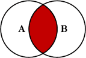
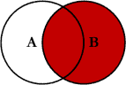
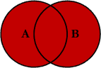
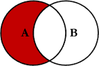

--- 
title: "Curso básico de introdução à linguagem R"
subtitle: "Disciplina BOT89 - PPGBOT INPA"
author: "Alberto Vicentini e Ricardo de Oliveira Perdiz"
date: "Última atualização: `r Sys.Date()`"
site: bookdown::bookdown_site
knit: bookdown::render_book
documentclass: krantz
# documentclass: book
bibliography: bot89-introR.bib
biblio-style: apalike
link-citations: true
links-as-notes: true
colorlinks: true
always_allow_html: true
lot: yes
lof: yes
fontsize: 12pt
lang: pt-br
url: 'https\://intror.netlify.app/'
github-repo: LABOTAM/IntroR
description: "Este livro é um guia básico para conhecer a sintaxe básica da linguagem de programação R e o potencial de utilizá-la como ferramenta científica."
---

```{r, setup, include = FALSE}
knitr::opts_template$set(evalF = list(echo = TRUE,
                                      eval = FALSE))

knitr::opts_template$set(executa = list(echo = FALSE,
                                        eval = TRUE))

knitr::opts_template$set(executa_mostra = list(echo = TRUE,
                                               eval = TRUE))
options(knitr.duplicate.label = "allow")
options(
  knitr.table.format = function() {
    if (knitr::is_latex_output()) {
      "latex"
    } else if (knitr::is_html_output()) {
      "html"
    } else {
      "pipe"
    }
  }
)
```

```{r load_packages, eval = TRUE, include = FALSE, echo = FALSE, message = FALSE}
description <- readr::read_lines("DESCRIPTION")
libs <- unlist(stringr::str_split(gsub("Imports: ", "", grep("Imports: ", description, value = TRUE)), ", "))
sapply(libs, library, logical.return = T, character.only = T)
```

```{r build-pkg-bib, eval = TRUE, include = FALSE, echo = FALSE, message = FALSE}
knitr::write_bib(
  c(.packages(), "readxl", "data.table", "rgdal", "taxize", "lattice"),
  'pkg-bib.bib')
```

```{r compila-readme, eval = FALSE, include = FALSE, echo = FALSE, message = FALSE}
rmarkdown::render("README.Rmd", output_format = "md_document", encoding = 'UTF-8')
```

```{r converte-rmd-r, eval = TRUE, include = FALSE, echo = FALSE, message = FALSE}
capitulos <- list.files(pattern = "^[0-9]")
capitulos_out <- gsub("\\.Rmd", ".R", capitulos)
capitulosR_output_names <- paste0("codigo/", capitulos_out)
purrr::walk2(
  capitulos,
  capitulosR_output_names,
  ~knitr::purl(.x, output = .y, documentation = 2)
)
```

# Prefácio {-}

Este livro foi criado inicialmente para servir como um material de apoio básico aos estudantes da disciplina Preparação de dados para Análises Estatísticas - Introdução ao R (BOT-89) do [Programa de Pós-Graduação em Ciências Biológicas (Botânica)](http://www.portais.atrio.scire.net.br/inpa-ppgbot/index.php/pt/) do INPA, ofertada desde o ano de 2011.  

Inicialmente, a disciplina consistiu de uma modificação da documentação do curso de [Introdução à Linguagem R](http://ecor.ib.usp.br/doku.php) oferecida pelo [Programa de Pós-graduação em Ecologia](https://posecologia.ib.usp.br/) do Instituto de Biociências da Universidade de São Paulo, atualmente ministrada pelo professor Dr. [Alexandre Adalardo de Oliveira](http://labtrop.ib.usp.br/), e que contem aulas de autoria dos professores Drs. A. A. de Oliveira, [João Luís Ferreira Batista](http://cmq.esalq.usp.br/), [Paulo Inácio K. L. Prado](http://ecologia.ib.usp.br/let/doku.php?id=prado:start), e Rodrigo Augusto Santinelo Pereira [@Batista2009].
Como exemplo, parte dos dados (dados de [avistamento de aves no Cerrado](https://github.com/LABOTAM/IntroR/blob/main/dados/aves_cerrado.csv) e [Levantamento em Caixetais](https://github.com/LABOTAM/IntroR/blob/main/dados/caixeta.csv)) utilizados em nossas aulas são originários desta disciplina da Ecologia da USP.  

Modificações nessa estrutura foram feitas por Alberto Vicentini ao longo dos últimos 10 anos em disciplinas anuais ofertadas no Programa de pós-graduação em Ciências Biológicas (Botânica) do Instituto Nacional de Pesquisas da Amazônia (INPA).
Ricardo Perdiz transpôs as aulas originais formatadas em `dokuwiki` para o formato [Rmarkdown](https://rmarkdown.rstudio.com/).
Também fez correções e acrescentou (poucos) novos conteúdos.  

Nossa meta é prover uma introdução básica da linguagem de programação R, que é extremamente poderosa para manipulação de dados, análises estatísticas, produção de gráficos e de documentos dinâmicos, e cujo domínio oferece um grande ganho de produtividade a todo cientista e facilita o entendimento de métodos analíticos.
Ressaltamos que **isto não é um curso de estatística**.  

## Estrutura do livro {-}

```{block2, type = "rmdwarning"}
Este livro está em constante atualização. Você pode encontrar os arquivos de Rmarkdown que geraram este livro neste endereço:
  <https://github.com/LABOTAM/IntroR/tree/main>. Se você tiver alguma contribuição a fazer, seja na forma de correções, críticas, ou o desejo de contribuir ativamente com o projeto, sinta-se à vontade para abrir um problema no repositório do livro: <https://github.com/LABOTAM/IntroR/issues>. Grato!
```


O livro está dividido em três partes.
A primeira parte contem 10 capítulos e aborda os ensinamentos básicos para o usuário aprender a usar a linguagem como uma ferramenta científica.  

* **Capítulo \@ref(intro)** aborda os aspectos básicos da linguagem R, o software que utilizamos para usar a linguagem, pacotes com funções, como solicitar ajuda sobre funções, dicas de organização das pastas, e o R como uma calculadora.
* **Capítulo \@ref(vetores)** aborda a criação, indexação, e operações matemáticas com vetores no R.
* **Capítulo \@ref(mat-dframe)** aborda a criação, indexação, filtragem, importação e exportação de matrizes e data.frames.
* **Capítulo \@ref(lista-objcompl)** ensina a criar, indexar, e filtrar listas e objetos complexos.
* **Capítulo \@ref(func-graf)** aborda as funções gráficas do pacote `base` do R.
* **Capítulo \@ref(iter-cflux)** aborda dois conceitos chave em qualquer linguagem de programação: iteração e controles de fluxo.
* **Capítulo \@ref(sumar-dados)** abrange o tópico de sumarização de dados, explicando tabelas de contagem, tabelas dinâmicas e junção de tabelas.<!-- NOTA! Junção de tabelas não parece se encaixar aqui, hein, Beto? -->
* **Capítulo \@ref(manip-txt-arq-pasta)** ensina ferramentas básicas para a manipulação de textos, arquivos e pastas.
* **Capítulo \@ref(amost-aleat)** ensina de maneira breve funções para amostragens aleatórias e distribuições de valores.
* **Capítulo \@ref(extr-dados)** abrange o uso de funções customizadas para extração de variáveis morfológicas de notas de texto obtidas de espécimes de plantas.  

A segunda parte contem tutoriais curtos de análise exploratória de dado (AED).
A AED **deve ser iniciada ainda durante a coleta de dados**, pois através dela podemos conhecer nossos dados e acompanhar como estamos coletando esses dados.
AED baseia-se largamente em técnicas visuais (gráficos) e pode levar entre 20 a 50% do tempo das análises.
Os capítulos abaixo exemplificam algumas ferramentas do R para fazer AED:

* **Capítulo \@ref(aed-checa-dados)** aborda a checagem inicial dos dados.
* **Capítulo \@ref(aed-univar)** aborda a AED em dados univariados.
* **Capítulo \@ref(aed-bivar)** aborda a AED em dados biivariados.
* **Capítulo \@ref(aed-multivar)** aborda a AED em dados multivariados.  

Por fim, temos o apêndice contendo materiais suplementares:

* **Apêndice \@ref(base-tidyverse)** inclui uma discussão breve sobre o universo de pacotes conhecidos como [Tidyverse](https://www.tidyverse.org/), comparando-os com o pacote `base` do R.
* **Apêndice \@ref(unzip)** apresenta um tutorial para baixar e descomprimir arquivos `.zip` dentro R.
* **Apêndice \@ref(videos)** apresenta uma lista de vídeos gravados por nós, autores, abordando diversos tópicos deste livro e que podem auxiliar o aprendizado da linguagem.
* **Apêndice \@ref(chernoff)** apresenta um código para gerar as [caras de Chernoff](http://www.fics.edu.br/index.php/augusto_guzzo/article/view/67/78), que é uma maneira divertida de aprender a lidar com dados multivariados.  

<!-- Outra maneira é usar a opção de editar os arquivos fonte diretamente no GitHub, acessando o botão **Edit** disponível na versão digital do livro. -->
<!-- Ao optar por esse caminho, você será levado à página do código fonte e poderá editar o arquivo diretamente no GitHub. -->
<!-- Após as modificações, você terá a possibilidade de gerar um **[Pull request](https://docs.github.com/pt/github/collaborating-with-issues-and-pull-requests/about-pull-requests)** que será analisado por nós. -->
<!-- Caso aceitemos a modificação proposta, seu nome será incluído entre os contribuidores do livro.   -->

## Agradecimentos {-}

Agradecemos aos Drs. Alexandre Oliveira, João Luís Ferreira Batista, Paulo Inácio K. L. Prado, e Rodrigo Augusto Santinelo Pereira, por permitirem o uso de conteúdo parcial da disciplina introdutória ministrada por eles na USP como base para a criação deste livro.  


## Pré-requisitos {-}

Devido ao modo como foi construído, este livro pode ser tanto lido quanto "executado", uma vez que seus arquivos são o que chamamos de *Rmarkdown*, uma linguagem que mistura texto com código.
Sendo assim, o livro pode ser visualizado em computadores, em celulares modernos, e em *tablets*.
Não é necessário ter um computador próprio, apesar de que possuir um facilita o aprendizado.
Entendemos que nosso país ainda carece de muito investimento na melhora da qualidade de vida da população em geral, o que inclui acesso facilitado aos bens de informática.
Desta forma, providenciamos duas maneiras de o leitor deste livro fazer bem uso das informações aqui contidas.  

## Caso você possua um computador {-}

### Instale o R {-}

Baixe e instale o [R](https://www.r-project.org/), próprio para o seu sistema operacional.  

### Instale um ambiente de desenvolvimento integrado - IDE {-}

Recomendamos que o software [RStudio](https://www.rstudio.com/products/rstudio/download/) seja instalado no seu computador, pois ele foi criado facilitar a interação do usuário com os múltiplos recursos oferecidos pela linguagem, em especial os inúmeros pacotes desenvolvidos por funcionários desta empresa, entre os quais se inclui o pacote [bookdown](https://github.com/rstudio/bookdown), utilizado para construir este livro online.
Ademais, ambientes de desenvolvimento integrado (do inglês *Integrated Development Environment*, **IDE**) como este software têm o objetivo de prover ao usuário mais ferramentas na interação entre o código e o resultado da execução do código, além de facilitar o uso de ferramentas alternativas para construção de texto mesclado com códigos (e.g., LaTeX, Markdown etc), o que permite uma dinamicidade na construção de textos acadêmicos.  

Existem outras alternativas de software, tais como o [Atom](https://atom.io/) e o [Visual Studio Code](https://code.visualstudio.com/). Fique à vontade para escolher.  

### Baixe os pacotes abaixo {-}

Serão necessários o uso de alguns pacotes de R (veja seção \@ref(base-pacotes) para entender o que são pacotes de R) para poder fazer uso tanto do repositório localmente quanto fazer uso das próprias aulas.
Então, rode o comando abaixo para instalar esses pacotes em seu computador:

```{r, eval = FALSE}
install.packages(c('rmarkdown', 'bookdown', 'knitr', 'kableExtra', 'ape', 'labdsv', 'vegan', 'maps', 'readxl', 'readr', 'data.table', 'rgdal', 'taxize'))
```

Há uma lista de pacotes que serão utilizados apenas no apêndice \@ref(base-tidyverse).
Eles não são necessários para acompanhar o curso, mas caso você chegue a este apêndice, eles serão necessários.
Portanto, caso queira já instalá-los, execute o comando abaixo:

```{r, eval =  FALSE}
install.packages(c('ggplot2', 'dplyr', 'tibble', 'tidyr', 'purrr', 'magrittr'))
```


### Baixe o repositório para seu computador {-}

Acesse a [página do repositório](https://github.com/LABOTAM/IntroR) contendo os código fonte deste livro (Fig. \@ref(fig:repo)).

```{r repo, fig.cap = 'Imagem inicial do repositório hospedado no GitHub contendo o código fonte deste livro.', eval = TRUE, echo = FALSE, out.width="80%"}
knitr::include_graphics("figuras/repo.png")
```

Busque um botão de cor **verde** chamado *Code* (Fig. \@ref(fig:baixa-repo)).
Clique neste botão e aparecerão algumas opções.
Clique no botão **Download Zip**, destacado em vermelho na figura \@ref(fig:baixa-repo), e escolha onde você quer salvar o arquivo.

```{r baixa-repo, fig.cap = 'Destaque do botão "Code" (retângulo "azul" pontilhado circundando o botão, com uma seta "azul" apontando para o mesmo botão) presente na página inicial do repositório hospedado no GitHub contendo o código fonte deste livro. Há um outro retângulo de cor "vermelha" destacando a opção `Download Zip.`', eval = TRUE, echo = FALSE, out.width="60%"}
knitr::include_graphics("figuras/baixa_repo.png")
```

Após baixar, descomprima este arquivo `.zip`, escolha onde você deseja guardar a pasta, e comece a acessar os arquivos.  

Os arquivos contendo cada capítulo deste livro são listados abaixo e podem ser encontrados na [página inicial do repositório](https://github.com/LABOTAM/IntroR):

```{r, eval = TRUE, echo = FALSE}
cat(capitulos, sep = "\n")
```

Você pode tanto utilizar os arquivos escritos em formato [Rmarkdown](http://www.botanicaamazonica.wiki.br/labotam/doku.php?id=bot89:precurso:rmarkdown:inicio) e executar os códigos em cada célula de código (**code chunks**) ou usar os scripts contidos na pasta `codigo`, que nada mais são do que os capítulos do livro convertidos para um script de R, isto é, em formato `.R`.
Nesses scripts, todos os pedaços de texto, incluindo cabeçalhos e comentários estão precedidos de `#'`; o que for código aparecerá sem `#'` precedentes.
Clique no nome dos scripts abaixo para levá-lo direto ao arquivo dentro do repositório.  

```{r mostra-scrpt-r, eval=TRUE, echo=FALSE, message=FALSE, results='asis'}
cat(paste0("* [", gsub("codigo/", "", capitulosR_output_names), "](https://github.com/LABOTAM/IntroR/tree/main/", capitulosR_output_names, ")"),
    sep = "\n")
```

## Caso você não possua um computador {-}

O Google oferece um serviço chamado [Google Colab](https://research.google.com/colaboratory/faq.html) que pode ser utilizado em computadores, em celulares modernos com acesso à internet e possuídores de um navegador, e em tablets.  

Em breve, apresentaremos aqui um endereço contendo todo o conteúdo deste livro já convertido para o formato de um Jupyter Notebook, que é o modelo de arquivo utilizado pelo Google Colab.  

<!-- Nós convertemos o conteúdo deste livro para um Jupyter Notebook e o colocamos nesta plataforma. -->
<!-- Você pode acessar este arquivo pelo endereço XXX INCLUIR ENDERECO AQUI. -->
<!-- Por ser uma ferramenta nova, nós não sabemos de possíveis erros que possam ocorrer ao executar os comandos deste livro nesta plataforma. -->
<!-- Caso você encontre algum erro, abra um problema em nosso repositório e nos informe do ocorrido.   -->

## O que é o R e por qual razão você deve se preocupar em programar {-}

### O R em poucas palavras {-}

> *O R é um software livre e gratuito de desenvolvimento coletivo e é muito útil para quem trabalha com ciências e precisa manipular e analisar dados, gerar gráficos e publicações dinâmicas. Tem uma comunidade enorme de usuários e colaboradores e está disponível gratuitamente em diversos repositórios espalhados pelo mundo* (https://cran.r-project.org/).  

> *O R foi criado para permitir a melhor e mais ampla exploração de dados possível, (...) mas sempre explicando a natureza dos métodos utilizados, num formato aberto (livre) e compreensível* [@Chambers2008].  

> *O R é uma linguagem de programação; você conversa com o R através de um código*.  

> Por ser uma linguagem de programação, **no R você pode fazer tudo**. A pergunta não é sobre **SE** o R faz alguma coisa, mas **COMO** fazer no R alguma coisa. E há várias maneiras de fazer a mesma coisa no R. É fundamental aprender a falar R, pois sabendo falar você pode dizer do seu jeito.  

> *Todo estudante de ciências deveria aprender a programar, porque programar lhe ensina a pensar* (Steve Jobs). Usar o R é a melhor forma de aprender estatística porque você precisa de fato entender o que está fazendo ao escrever um código.  

> **Aprender a programar é como aprender um novo idioma**; aprendendo o R fica mais fácil aprender outras linguagens de programação e lhe ajuda a aprender inglês, e o inglês lhe facilita falar R.  

> **O R é uma fantástica ferramenta para fazer gráficos**; veja exemplos em http://www.r-graph-gallery.com.  

> Com o desenvolvimento da linguagem na última década, você pode gerar aplicativos ([Shiny](https://shiny.rstudio.com/)) e relatório dinâmicos usando [Rmarkdown](http://www.botanicaamazonica.wiki.br/labotam/doku.php?id=bot89:precurso:rmarkdown:inicio), facilitando a formatação gráfica e a reprodutibilidade dos seus artigos, relatórios e projetos científicos.  

### Por que programar? {-}

> A maioria dos programas de computador não é muito boa. O código no seu laptop, televisor, telefone, carro é geralmente mal documentado, inconsistente e pouco testado. Por que isso importa para a ciência? Porque transformar dados brutos (`raw data`) em artigos científicos geralmente requer um pouco de programação, o que significa que a maioria dos cientistas escreve software (Nick Barnes, 2010, [Publish your computer code](http://www.nature.com/news/2010/101013/full/467753a.html), Nature News).  

> **É tentador tratar todas as coisas como se fossem pregos, se a única ferramenta que você tem é um martelo** (Abraham Maslow, 1996, [Lei do Instrumento](https://en.wikipedia.org/wiki/Law_of_the_instrument))! Liberte-se da camisa de força dos softwares de estatística que limitam as análises que você pode fazer e como pode fazer.  

> *Um dos objetivos da análise estatística é o de destilar um conjunto longo e complicado de dados em um número pequeno de estatísticas descritivas que façam sentido. Muitos dos pacotes estatísticos de computadores modernos, no entanto, fazem exatamente o oposto disso. Eles produzem automaticamente um número excessivo de resultados que termina sendo aceito sem crítica; pode levar à super interpretação dos dados; e incentiva o mal hábito de __jogar dados e cuspir resultados__ (data trawling). O R, por outro lado, não lhe diz nada a não ser aquilo que você peça explicitamente* [@Crawley2007].  

> (...) aprender a programar é importante porque desenvolve habilidades analíticas e de resolução de problemas. É uma atividade criativa, um meio de expressar idéias abstratas. Assim, programar é divertido e é muito mais do que uma habilidade profissional. Ao projetar programas, aprendemos muitas habilidades que são importantes para todas as profissões. Essas habilidades podem ser resumidas como: (1) Leitura crítica, (2) Pensamento analítico, (3) Síntese criativa ([Why programming is important](http://programmingstage.blogspot.com.br/2012/05/why-programming-is-important.html)).  

> *Uma das coisas mais importantes que você (como cientista) pode fazer é dedicar um tempo para aprender uma linguagem de programação de verdade. Aprender a programar é como aprender outro idioma: exige tempo e treinamento, e não há resultados práticos imediatos. Mas se você supera essa primeira subida íngreme da curva de aprendizado, os ganhos como cientista são enormes. Programar não vai apenas livrar você da camisa de força dos pacotes estatísticos, mas também irá aguçar suas habilidades analíticas e ampliar os horizontes de modelagem (..) e estatística* [@Gotelli2013].  

```{r, out.width="101%", fig.cap = "Curvas de aprendizagem do aluno Sabichão (Geek) e de um aluno que tem medo de código (non-geek).", eval = TRUE, echo = FALSE}
knitr::include_graphics("figuras/aprendizadogeekvsnongeek.png")
```

## Análise exploratória de dados (AED) {-}

### O que é AED e por que fazer AED? {-}

> Em estatística, análise exploratória de dados (AED) é uma abordagem para analisar conjuntos de dados visando resumir as suas principais características, particularmente com métodos gráficos e visuais.
Um modelo estatístico pode ou não ser usado, mas AED objetiva principalmente ver o que os dados podem nos dizer para além da modelagem ou de testes de hipóteses. A AED foi promovida por [John Tukey](https://en.wikipedia.org/wiki/John_Tukey) para incentivar estatísticos a explorar dados e, eventualmente, formular novas hipóteses que possam levar à nova coleta de dados e a experimentos.
AED é diferente de análise de dados inicial (AID), que foca mais estreitamente na verificação de suposições necessárias aos modelos de testes de hipóteses, manipulação de valores ausentes e transformações de variáveis, conforme necessário.
AED abrange AID (Texto traduzido da [WikiPedia](https://en.wikipedia.org/wiki/Exploratory_data_analysis)).  


```{r, out.width="100%", eval = TRUE, echo = FALSE}
knitr::include_graphics("figuras/aed.png")
```


> Muitas vezes esquecemos como funciona a ciência e a engenharia. Idéias vêm mais frequentemente de exploração anterior do que de descargas atmosféricas. (...) **Encontrar a pergunta é muitas vezes mais importante do que encontrar a resposta**. Análise exploratória de dados é uma atitude, uma flexibilidade que depende de visualização gráfica, não é um conjunto de técnicas [@Tukey1980].  

Em sistemática e taxonomia, uma ciência histórica, a análise exploratória é fundamental, pois é através dela que podemos postular boas hipóteses e usar teste de hipóteses para confirmá-las.

> Aplicar a análise exploratória de dados para criar hipóteses e então usar os mesmos dados para testar essas hipóteses deve ser evitado.
Se alguém tem conhecimento *a priori* limitado, então uma abordagem válida é criar dois conjuntos de dados: aplicar exploração de dados sobre o primeiro conjunto para criar hipóteses e usar o segundo conjunto de dados para testar essas hipóteses .
Tal processo, no entanto, só é prático para conjuntos de dados grandes.
Independentemente da situação específica, o uso constante e a estruturação de relatórios transparentes de exploração sistemática de dados melhorariam a qualidade da pesquisa ecológica e de quaisquer recomendações que ela produziria [@Zuuretal2010].  

A análise exploratória não é *dragagem* de dados! Assume-se que o pesquisador formulou hipóteses biológicas plausíveis *a priori* amparadas pela teoria.  

### Objetivos da AED {-}

* Controlar a qualidade dos dados;
* Sugerir hipóteses para os padrões observados (novos estudos);
* Apoiar a escolha dos procedimentos estatísticos de testes de hipótese;
* Avaliar se os dados atendem às premissas dos procedimentos estatísticos escolhidos.

### Para ler {-}

Dois artigos que você deveria ler: @Tukey1980 e @Zuuretal2010.  

## Exercícios no **notaR** {-}

Ao fim de alguns capítulos, disponibilizaremos em seções chamadas **Exercícios** uma lista de endereços ligados ao [notaR](http://www.lage.ib.usp.br/notar/index.php), um sistema criado para auxiliar no aprendizado da linguagem R desenvolvido pelo laboratório de Ecologia Teórica da Universidade de São Paulo [@Chalometal2012].

### Conhecendo o **notaR** {-}

Os exercícios do notaR obrigam o usuário a construir um script de R a partir de um enunciado, acabando por fugir do tradicional **copia-cola** de tutoriais de R.
Muitos exercícios no sistema não obrigam o usuário a estar autenticado (estar logado usando login e senha) no sistema para poder fazê-los.
Leia com atenção o enunciado de cada exercício antes de iniciar a construir o seu script.  


Uma lista de todos os exercícios **notaR** incluídos neste livro está relacionada abaixo:

* Resolva o exercício [101.01 Bem vindo ao notaR](http://notar.ib.usp.br/exercicio/29).
* Resolva o exercício [101.05 Remoção Com Critério](http://notar.ib.usp.br/exercicio/15).
* Resolva o exercício [102.04 Biomassa de Árvores](http://notar.ib.usp.br/exercicio/19).
* Resolva o exercício [102.02 Sequências](http://notar.ib.usp.br/exercicio/12).
* Resolva o exercício [102.03 Conta de Luz](http://notar.ib.usp.br/exercicio/4).
* Resolva o exercício [102.01 Área Basal](http://notar.ib.usp.br/exercicio/17).
* Resolva o exercício [102.05 Variância na Unha](http://notar.ib.usp.br/exercicio/5).
* Resolva o exercício [101.03 Objetos de Data](http://notar.ib.usp.br/exercicio/18).
* Resolva o exercício [103.01 Distância entre cidades](http://notar.ib.usp.br/exercicio/23).
* Resolva o exercício [103.02 Criação de um data frame](http://notar.ib.usp.br/exercicio/2).
* Resolva o exercício [103.03 Criando uma Matriz](http://notar.ib.usp.br/exercicio/13).
* Resolva o exercício [302.02 Histogramas (frequência)](http://notar.ib.usp.br/exercicio/66).
* Resolva o exercício [302.07 Gráficos com trechos selecionados do data.frame/matriz](http://notar.ib.usp.br/exercicio/71).
* Resolva o exercício [302.04 Box-plots](http://notar.ib.usp.br/exercicio/67).
* Resolva o exercício [302.05 Gráficos de dispersão](http://notar.ib.usp.br/exercicio/69).
* Resolva o exercício [302.06 Matriz de dispersão](http://notar.ib.usp.br/exercicio/70).
* Resolva o exercício [Editando parâmetros gráficos](http://notar.ib.usp.br/exercicio/75).
* Resolva o exercício [104.01 Sintetizando dados](http://notar.ib.usp.br/exercicio/14).
* Resolva o exercício [103.05 Classes de Objetos](http://notar.ib.usp.br/exercicio/21).
* Resolva o exercício [103.04 Lendo e salvando seus dados ](http://notar.ib.usp.br/exercicio/22).
* Resolva o exercício [103.7 Cara ou coroa](http://notar.ib.usp.br/exercicio/34).
* Resolva o exercício [103.9 Lembrando matrizes e listas](http://notar.ib.usp.br/exercicio/37).

<!-- Alunos inscritos na disciplina precisam estar autenticados para fazer os exercícios obrigatórios. O login de cada aluno inscrito na disciplina é o seu email informado na inscrição e a senha será informada pelos professores. Outros exercícios são opcionais e qualquer pessoa pode entrar no site e fazer exercícios sem autenticação. -->
<!-- Avaliação será baseada em: -->
<!-- Notas nos exercícios feitos no NotaR e indicados noTutorial de Introdução ao R. -->
<!-- Para validar a nota precisa estar logado no sistema. -->
<!-- Login, senha e prazos serão informados na sala virtual; -->
<!-- Entrega de uma análise exploratória de dados, seus ou dados que serão disponibilizados para a disciplina; -->

## Referências úteis {-}

Listamos abaixo algumas referências importantes para complementar o seu estudo:

* [Apostila USP-BIE-5782](http://ecologia.ib.usp.br/bie5782/doku.php?id=bie5782:02_tutoriais:tutorial4:start).
* [Introdução ao R no site do R](https://cran.r-project.org/doc/manuals/R-intro.html).
* [Introdução ao uso do programa R de Victor Landeiro e Fabricio Baccaro](https://6e938257-ec28-4b42-9917-4ed33b2f1d0b.filesusr.com/ugd/e086b2_0d0de99bbb204ca68e079b4ae11b87d6.docx?dn=A_apostila_de_introdu%C3%A7%C3%A3o_ao_R_vers%C3%A3o_6.3.1_2018.docx).
* [Relatórios dinâmicos com R Markdown](http://www.botanicaamazonica.wiki.br/labotam/doku.php?id=bot89:precurso:rmarkdown:inicio).

<!--chapter:end:index.Rmd-->

# Sobre os autores {-}

Alberto é doutor em Ecologia, Evolução e Sistemática, com uma ênfase em Evolução pela Universidade do Missouri, Saint Louis (University of Missouri Saint Louis).
É cientista do Instituto Nacional de Pesquisas da Amazônia (INPA) desde o ano de 2009.
Ministra anualmente disciplinas ligadas ao Programa de pós-graduação em Ciências Biológicas do INPA, como **Preparação de dados para análises Estáticas - Introdução ao uso de linguagem R (BOT-89)**, **Delineamento Experimental e Amostral (BOT-90)**, e **Teoria e Prática de Sistemática Filogenética (BOT-99)**.
É colíder do grupo de pesquisa [Ecologia e Evolução de Plantas da Amazônia](http://dgp.cnpq.br/dgp/espelhogrupo/38425) do Conselho Nacional de Desenvolvimento Científico e Tecnológico (CNPq).  

[Ricardo](https://www.ricardoperdiz.com) é doutor em Ciências Biológicas (Botânica) pelo INPA.
Seus principais interesses são estar e se divertir com a família, trabalhar na floresta coletando e admirando a beleza da Natureza, trabalhar no herbário e laboratório, e também adora se divertir na frente do computador analisando dados e escrevendo.
Ama correr e pedalar, e também se divertir e aprender com sua filha.  


<!--chapter:end:00-autores.Rmd-->

\mainmatter

# (PART) Parte I {-}

Um passo a passo para conhecer a sintaxe básica da linguagem de programação e o potencial de usar o R como ferramenta científica.  

# Conceitos introdutórios {#intro}

Recomendamos que o usuário siga a ordem dos capítulos, especialmente se é a primeira vez que o mesmo está lidando com o R.
Use o R via RStudio, é mais simples.
Busque executar cada script linha por linha, procurando entender o que cada linha faz e o que cada comando representa.
E para cada função nova, busque a [ajuda do R](#help), leia o que significam cada um dos argumentos.
Altere os argumentos das funções e veja o que acontece.
Explore!

## Console e scripts

As figuras abaixo mostram imagens relativamente similares ao que os usuários do R padrão (Figura \@ref(fig:pad-r)) e RStudio (Figura \@ref(fig:studio-r)) verão ao iniciarem esses programas.

```{r pad-r, out.width="101%", fig.cap = ' Imagem de uma sessão do R para Mac OSX com um janela de script aberta além do console.', eval = TRUE, echo = FALSE, out.width="33%"}
knitr::include_graphics("figuras/r_padrao.png")
```

Ao abrirem o R ou o RStudio você terão basicamente duas janelas principais:

* **Console** - corresponde`a interface que interpreta o código da linguagem. Os códigos digitados aqui serão interpretados pelo R (Texto destacado em **verde** nas figuras \@ref(fig:pad-r), \@ref(fig:studio-r));

* **Script** - digitar um código curto no console é simples, mas quando o código é longo, é importante guardá-lo em algum lugar para executá-lo em qualquer momento. Para isso utilizamos scripts, que são arquivos de textos simples que podem ser salvo (extensão `.R`) numa pasta no seu computador e reutilizado (Texto destacado em **amarelo** nas figuras \@ref(fig:pad-r), \@ref(fig:studio-r)). Como um arquivo `.R` é um texto simples, ele é editável por qualquer editor de texto, como o Bloco de Notas ou [Notepad++](https://notepad-plus-plus.org/) para usuários Windows, [TextWrangler](https://www.barebones.com/products/textwrangler/) ou [BBEdit](https://www.barebones.com/products/textwrangler/) para usuários macOS, ou [gedit](https://help.gnome.org/users/gedit/stable/index.html.pt_BR) para usuários Linux. O editor de scripts do RStudio é excelente.

```{r studio-r, out.width="100%", fig.cap = ' Imagem de uma sessão do RStudio com três painéis abertos.', eval = TRUE, echo = FALSE}
knitr::include_graphics("figuras/rstudio.png")
```

## Linguagem objeto-orientada

A chave para entender o R é que trata-se de uma linguagem.
Uma linguagem para manipular objetos [@VenablesRipley2002].
Um objeto é identificado por uma palavra e veremos ao longo do curso que existem vários tipos de objetos.
Este é o conceito mais importante para entender o R.

Para começar, digite algumas coisas no Console do seu R ou RStudio.
Por exemplo, digite uma fórmula matemática simples no console e o execute:

```{r}
3 + 5 + 10
```

O console retornou 18, isto é, o R funcionou como uma calculadora.
Portanto, números são interpretados como números pelo console.

Agora vamos criar um objeto simples chamado `objnum` e atribuir texto a ele:

```{r}
objum <- "vou colocar um texto dentro do meu primeiro objeto" # enter
objum # enter
```

Vejam que `objum` é o nome do meu primeiro objeto, e tem como conteúdo o texto que nós atribuímos a ele.
Nós poderíamos ter chamado `objum` de qualquer coisa (sem espaços em branco):

```{r}
banana <- "vou colocar um texto dentro do meu primeiro objeto"
banana
# mesma coisa né?
```

Um objeto também pode virar outro objeto. Vejamos abaixo:

```{r}
objdois <- objum
objdois # pegou o conteúdo que eu coloquei em objum
```

Podemos guardar resultados de contas em um objeto:

```{r}
objtres <- 3 + 5 + 10
objtres
```

Note que o código exposto acima é geralmente o que está contido em um [script](https://pt.wikipedia.org/wiki/Linguagem_de_script), ou seja, a sequência de códigos que você escreveu e que o R interpretará para realizar o que foi dito.
Se você copiar e colar o trecho (ou os trechos) de código acima em um arquivo `.R`, você poderá executá-los tantas vezes quanto quiser.
Copie então todos os trechos de código expostos até então para a janela do script e salve-o como `script01.R` em alguma pasta no seu computador.

Note também que dependendo do está incluso no script, o código apresenta cores diferentes para comentários, objetos, e símbolos de atribuição.
Isso ajuda a entender os elementos da sintaxe (vocabulário e gramática do R).
IDE's também mostram isso de forma colorida.

Note também que, à direita do símbolo `#`, o texto no código acima fica cinza.
Este símbolo indica ao R que todo texto começando no `#` deve ser interpretado como texto apenas, e não como código.
Comentar códigos é uma prática que deve ser tornar rotineira a fim de facilitar o entendimento de cada script.

Se você já está escrevendo um script num arquivo e não no console, selecione todo o texto na sua janela de script e digite `Control+R` (Windows), ou `Command+Enter` (Mac).
O conteúdo do script será executado no Console.
Note que o símbolo `#` não é interpretado pelo console.

O R vem com vários scripts prontos, que são funções que executam alguma coisa.
Esses scripts são objetos de classe **função**, pois eles contêm um conjunto de códigos que utilizam parâmetros para executar um conjunto de passos.
Parâmetros são objetos que a função utiliza segundo as suas especificações.
Por exemplo, vamos listar os objetos criados no passo anterior:

```{r, opts.label='evalF'}
# digite
ls() # note os parênteses (); a função ls() lista os objetos criados por você: [1] "banana"  "objdois" "objtres" "objum"

# adicione um parâmetro à função, especificando o que você quer listar, apenas aqueles que contém no nome o padrão "obj"
ls(pattern = "obj") # [1] "objdois" "objtres" "objum"

# agora veja o que a função ls é
ls # note que não digitei os parênteses e ao digitar isso verei o script que está dentro da função ls que começa assim: function (name, pos = -1L, envir = as.environment(pos), all.names = FALSE, pattern, sorted = TRUE)  { ....
# note que os argumentos da função são os objetos que vão dentro do () da função e são utilizados pela função para executar alguma coisa, neste caso, lista objetos. Experimente mudando parâmetros:
ls(sorted = FALSE) # ele mostra os objetos na ordem que foram criados
```

## R-base e pacotes {#base-pacotes}

Como vimos acima, um script do tipo função é um objeto que executa um conjunto de comandos e recebe argumentos que modificam o que o script realiza. Existem dois tipos de funções:

* Funções do pacote `base` - funções que vêm junto com o R quando você faz o download do programa, como por exemplo as funções `length()`, `order()`, `sort()`, `sum()`, `mean()` etc;

* Funções de pacotes externos - pacotes (`packages` em inglês) são funções criadas por colaboradores e organizadas em pacotes que você pode baixar dos repositórios do R.

As funções do pacote `base` vêm junto com o programa e você não precisa se preocupar com isso.
Pacotes, por outro lado, devem ser instalados pelo usuário conforme a necessidade.
Por exemplo, para trabalhar com dados filogenéticos, você pode necessitar do pacote [ape](https://cran.r-project.org/web/packages/ape/index.html) [@R-ape], que já tem várias funções preparadas para análises filogenéticas.
Se você necessitar deste pacote, por exemplo, basta executar o seguinte comando no console do R:

```{r, eval = FALSE, echo = TRUE}
install.packages("ape")
```

Para trabalhar com pacotes você primeiro precisa definir um repositório, ou seja, um servidor, de vários disponíveis (espelhos do repositório oficial), de onde o R buscará o pacote desejado.
Pode-se também o menu do R ou do RStudio para instalar pacotes e definir um repositório padrão para sua instalação.

Como tudo no R, você pode executar comandos que estão no menu usando funções.
Por exemplo, ao invés de usarmos o menu do R para definir um repositório e instalar um pacote, vamos executar estas ações por meio de um script:

```{r, eval = FALSE, echo = TRUE}
# isso pode não funcionar se estiver no INPA por causa do Proxy.
chooseCRANmirror() # seleciona repositório
install.packages("ape", dependencies = TRUE) # instala o pacote Ape
```

## Ajuda no R {#help}

Toda função no R, oriunda tanto do pacote base ou dos pacotes extras, possui um pedaço de texto chamado de "ajuda" e que possui uma instrução sobre a utilização da mesma.
Para obter esta instrução, é muito fácil.
Basta executar uma das seguintes opções:

```{r, opts.label='evalF'}
# como exemplo vamos usar a função ls()
?ls # ou seja o comando é ?+"nome da função"
# ou então
help(topic = "ls") # nome da função como argumento da topic da função help
```

Ao digitar uma das opções acima, o R vai abrir uma janela (no RStudio, vai colocar esse resultado num dos painéis) contendo a página com a explicação da função:

```{r}
?ls
```

Todos esses trechos de ajuda (`?`) do R têm a mesma estrutura e devem ser acessados constantemente para o bom entendimento do funcionamento das funções e seus argumentos.

## Área de trabalho vs. Pasta de Trabalho

Dois conceitos são fundamentais para trabalhar no R:

* Área de Trabalho (`environment` no R) - é o local dentro do R onde você coloca os objetos criados durante a execução de scripts. Você pode visualizar/apagar os objetos no Console:

```{r, opts.label='evalF'}
ls() # ls= listar - já vimos que isso lista os objetos criados por você e que estão na área de trabalho

?rm # veja o help desta função
rm(objum) # rm = remover - esta função apaga objetos da área de trabalho. No exemplo estamos apagando o objeto chamado objum, criado anteriormente
ls() # note agora que o objeto não existe mais

rm(list = ls()) # desse jeito apagamos todos os objetos que criamos anteriormente
ls() # note que não sobrou nenhum objeto
```

* Pasta de Trabalho (`working directory`- é o local (pasta) no seu computador que o R usa para salvar arquivos. É o caminho padrão para o R encontrar arquivos de dados, scripts, etc. Você pode trabalhar no R sem definir uma **Pasta de Trabalho** mas é muito mais simples se você usa este recurso. Experimente a seguinte script:

```{r, opts.label='evalF'}
getwd() # o nome desta função é abreviação de "get working directory" ou seja "pega a pasta de trabalho definida". A resposta deste código varia dependendo do seu sistema operacional. Mas a função retorna o caminho completo da pasta de trabalho atual
```

Toda vez que você usar o R, é uma boa prática primeiramente definir a *pasta de trabalho*, que é o local no seu computador onde você guarda os arquivos relacionados ao seu projeto (dados, scripts, resultados etc.).

Você pode definir a *pasta de trabalho* usando o menu do R (`Arquivo ⇒ Diretório de Trabalho` no Windows; ou `Misc ⇒ Muda Pasta de Trabalho` no Mac).
Ou você pode usar uma função:

```{r, eval = FALSE, echo = TRUE}
?setwd # veja o help da função que iremos utilizar
minhapasta <- "/Users/BetoVicentini/Desktop/bot89-2016"
# se estiver usando windows:
# minhapasta = "c:/Users/BetoVicentini/Documents/bot89-2016"
# minhapasta = "c:\\/Users\\/BetoVicentini\\/Documents\\/bot89-2016"  #talvez precise usar barras invertidas

setwd(dir = minhapasta) # usa a funçao "set working directory" para especificar o diretório (pasta) de trabalho
# note que eu defini dir primeiramente como o objeto "minhapasta" usei esse objeto para especificar o objeto "dir", que é o único argumento da função setwd()
```

Objetos criados no R por você podem ser salvos como um arquivo no seu computador.
Você pode usar o menu do R ou RStudio para isso ou pode usar o comando abaixo:

```{r, opts.label='evalF'}
?save # veja o help desta função que vamos utilizar
?save.image # veja o help desta função que vamos utilizar

# se sua área de trabalho estiver vazia
ls() # se nao retorna nada porque voce apagou acima
# crie alguns objetos para o exercício
objum <- "um objeto de texto qualquer"
objum
objdois <- 18 # um objeto com um número qualquer
objdois
banana <- objum # um objeto idêntico a objum

# pronto, agora mostre todos os objetos na sua AREA DE TRABALHO
ls()

# agora salve esse objetos como um arquivo na sua PASTA DE TRABALHO
getwd() # veja onde o arquivo será salvo

# se voce quer salvar todos os objetos
save.image(file = "meusObjetos.Rdata")

# se voce quer salvar apenas alguns objetos
save(objum, banana, file = "meusObjetos2.Rdata")

# veja que na sua pasta de trabalho getwd() voce tem esses arquivos
dir() # lista arquivos na sua pasta de trabalho (análoga a função ls() que lista objetos)
dir(pattern = "Rdata") # lista apenas arquivos que tem no nome ".Rdata"

# apaga os objetos todos
rm(list = ls())
ls() # note que não tem mais objetos na sua área de trabalho, mas pode resgatar objetos que salvou num arquivo Rdata:
load(file = "meusObjetos2.Rdata") # puxa os objetos neste arquivo que está na sua pasta de trabalho
ls() # note que ele puxou os objetos objum e banana que salvamos acima neste arquivo

# puxe o outro arquivo gerado
load(file = "meusObjetos.Rdata") # puxa os objetos neste arquivo que está na sua pasta de trabalho
ls() # veja novamente os objetos na sua área de trabalho: Todos os objetos são listados. Se fizer isso e já houver objetos com o mesmo nome na sua área de trabalho, estes serão sobrepostos.
```

Portanto, *Área de Trabalho* e *Pasta de Trabalho* são dois conceitos fundamentais que você precisa entender bem, pois define como e onde você estará salvando informação quando usar o R, tanto em termos de objetos (área de trabalho) como em termos de arquivos (pasta de trabalho).

Se você digita `q()`, que é a função para sair do R, ele geralmente lhe pergunta se você quer salvar os objetos numa área de trabalho padrão (que o R puxa quando você o inicia):

```{r, opts.label='evalF'}
q() # sai do R
# vai perguntar no Console algo do tipo "Save workspace image to ~/Desktop/bot89-2016/.RData? [y/n/c]:"
# note que o arquivo não tem nome apenas extensão ".RData" e é salvo na pasta de trabalho definida com setwd().
```

Códigos de scripts podem ser executados no console sem necessidade de abrir o script. Por exemplo, suponha que eu tenha salvo o seguinte script num arquivo `script01.R`:

```{r, opts.label='evalF'}
objum <- "meu primeiro objeto de texto"
objdois <- 18 # meu primeiro objeto numérico
banana <- objum
```

Se este arquivo Scrip01.R está na minha pasta de trabalho, então posso executá-lo com a função `source()`:

```{r, opts.label='evalF'}
dir(pattern = ".R") # mostra os arquivos .R que estão na pasta de trabalho
rm(list = ls()) # apaga todos os objetos, para ver que ele irá criar os objetos indicados no arquivo
ls() # nao tem nenhum objeto
source("script01.R")
ls() # os objetos foram criados como especificado no script
```

## Dicas de organização do trabalho

Você irá manipular diversos arquivos durante a execução de qualquer projeto e precisa organizar os arquivos para não se perder e poder voltar a eles quando necessário.

A grande vantagem de realizar a análise de dados, produção de figuras etc, no R é criar um processo replicável, e é preciso ser bem organizado com os arquivos para poder reutilizar o processo com novos dados ou adaptá-lo para novas análises.
Isso implica, entre outras coisas, em:

* Organizar o projeto em uma pasta no seu computador exclusiva para ele;

* Definir um critério lógico para dar nome aos arquivos do projeto;

* Organizar arquivos em subpastas segundo a necessidade, por exemplo, uma subpasta para dados, outra para figuras, outras para tabelas geradas e outros resultados. Pode inclusive colocar a criação dessas pastas nos scripts do R, que ele cria na pasta de trabalho ('getwd()') que deve ser a pasta do seu projeto através de (funções do R para manipular arquivos e pastas);

* O código dos seus scripts devem ser escritos de forma genérica para que ele possa ser usado com qualquer outro conjunto de dados que tenha a mesma estrutura que os seus (variáveis). Ou seja, o código deve ser escrito não em função do conteúdo dos seus dados mas apenas na estrutura (i.e. as colunas dos seus dados) deles. Esta é a chave para uma programação eficiente e para a replicabilidade. Isso significa que um resultado obtido a partir dos seus dados não deve ser manualmente atribuído a nenhum objeto no script, apenas atribuído a partir do objeto contendo o resultado.

A definição da pasta de trabalho (**working directory**) é fundamental simplificar a leitura de dados e salvar arquivos sem se preocupar com o caminho completo (**full path**) para cada arquivo, mas apenas o caminho relativo (**relative path**). Por exemplo, um arquivo numa pasta de projeto pode ter como caminho completo `/home/usuario/Desktop/meuprojeto/dados/morfometricos.xlsx`, e o caminho relativo à pasta de trabalho seria apenas `dados/morfometricos.xlsx`.
Da mesma forma para salvar resultados a partir do R.

O [RStudio](https://rstudio.com/) [@rstudio] facilita esse processo para você, permitindo que você crie um projeto.
Um projeto basicamente consiste em definir uma pasta de trabalho para que, toda vez que você abrí-lo, a pasta que contem o arquivo de término `.Rproj` seja a sua pasta de trabalho. Alternativamente, você pode simplesmente indicar a pasta de trabalho toda vez que iniciar uma atividade utilizando as funções `setwd()` no console ou em um script.

## Dicas de erros comuns de sintaxe da linguagem R

Abrir e esquecer de fechar parênteses, colchetes e aspas é um dos erros mais comuns no início da caminhada rumo ao aprendizado de qualquer linguagem de programação, e é necessário muita paciência^[Lembrem-se sempre de que vocês não são os únicos a ter de lidar com a frustração durante o aprendizado de uma linguagem de programação. É importante estarem conscientes dessa verdade. Vejam esta postagem: <https://www.codingame.com/blog/dealing-with-programming-frustration-the-right-way/>] por parte do usuário para aprender a lidar com a frustração dos sucessivos erros que aparecem no caminho.
Mesmo usuários mais experientes têm que aprender a lidar com os erros, que são comuns, o que levou o programador Patrick Burns a publicar um curioso livro sob o título [The R Inferno](https://www.burns-stat.com/pages/Tutor/R_inferno.pdf) [@Burns2012_rinferno].
Uma ferramenta útil para evitar tais problemas é o uso de uma IDE como o RStudio.
Há opções na configuração que autorizam o software a checar seu código e informá-lo de possíveis erros, além de proverem ao usuário uma ferramenta de limpeza do código.
Sugerimos fortemente a instalação de uma IDE para usar o R.
Segue então uma brevíssima lista de erros super comuns que iniciantes enfrentam no aprendizado da linguagem R.

### Parênteses

Lembre-se sempre de, ao abrir um parêntese, fechá-lo.
Caso contrário, a ação não se completará e seu console ficará travado com um sinal de `+` aguardando que seu código seja completo.
Neste caso, ficar completo significa fechar o parêntese.
Tente executar o código abaixo e verifique que o sinal de `+` ficará estagnado na tela de seu console.
Para sair desta tela, clique no console e depois tecle `Esc`.
Você verá que o sinal de `>` voltará a aparecer no console.

```{r, eval = FALSE}
erro <- c(1, 2, 3
```

Agora, execute o comando abaixo.
Ele será executado perfeitamente.

```{r, eval = TRUE}
erro <- c(1, 2, 3)
```

### Vírgulas

Ao concatenar elementos ou ao adicionar valores em argumentos de funções, é necessário lembrar sempre de colocar as vírgulas em seus devidos lugares.
Caso contrário ... mais um erro!
Tentem executar o código abaixo:

```{r, error = TRUE}
numeros <- c(1, 5, 6 7, 8)
```

O R dará o aviso `Error: unexpected numeric constant in "numeros <- c(1,5,6 7"` e encerrá a operação.
Executem agora o comando abaixo.
Será executado sem problemas.

```{r}
numeros <- c(1, 5, 6, 7, 8)
```


### Aspas

Textos são especificados dentro de aspas duplas `""` ou aspas simples `''`; tanto faz qual você usa, o importante é sempre que abrir aspas, fechar as aspas com o mesmo tipo.
Se seu texto tem acentos, use aspas duplas para delimitá-lo.
Aspas simples podem entrar num texto definido por aspas duplas, e vice-versa.
Rode isso no seu console:

```{r}
objum <- "um texto com 'aspas simples'"
objum

obj2 <- 'um texto com "aspas simples"'
obj2
# note que foi adicionada uma barra invertida, porque \" na sintaxe do Rsignifica aspas para confundir com as aspas que você usa para indicar textos.
```

### Números

Números são sempre especificados sem aspas; se você colocar qualquer número entre aspas, ele será interpretado como texto:

```{r}
obj1 <- 18
obj1 + 1 # essa fórmula irá funcionar porque obj1 é um número
obj2 <- "18"
```

Isso não vai funcionar porque `obj2` não é um número.

```{r, error = TRUE}
obj2 + 1
```

Caso você insista em rodar, receberá a seguinte mensagem: `Error in obj2 + 1 : non-numeric argument to binary operator`.

### Nomes de objetos

Nomes de objetos não podem ter espaço em branco e aspas são ignoradas:

```{r, error = TRUE}
obj 1 = "meutexto" #nao vai funcionar
```


```{r}
obj1 <- "meutexto" # vai funcionar
obj1

"obj1" <- "meu texto" # vai criar objeto obj1, ignorando as aspas
obj1
```


```{r, error = TRUE}
obj"1" = "meu texto" #nao vai funcionar
```


### Atribuição de objetos

A **atribuição de valores aos objetos** pode ser feita com dois operadores equivalentes, `=` ou `<-` (este pode ser utilizado no sentido inverso também `->`):

```{r}
obj1 <- "meu texto"

# ou pode escrever assim
obj1 <- "meu texto" # atribui

# ou assim
"meu texto" -> obj1 # atribui
obj1
```

### Busque entender as partes

Se você tiver dificuldade no entendimento de um script do R que está tentando rodar, separe os termos das linhas e expressões para entender o que cada parte está fazendo.
Também pode alterar os valores dos argumentos para entender o funcionamento de uma função, ou simplesmente digitar a função sem os parênteses para ver o script que ela contem.
Por exemplo, vejamos a expressão abaixo, que faz uso de um conjunto de dados chamado `iris`, que vem disponível com o R.

```{r}
obj1 <- paste(levels(iris$Species), tapply(iris$Sepal.Length, INDEX = iris$Species, mean, na.rm = TRUE), sep = " sépala média = ")
obj1
```

À primeira vista, a expressão parece complicada.
Vamos separar as partes e entender pedaço por pedaço.
Primeiro, vamos tentar entender quem é `iris`.
Vamos checar a estrutura de `iris`:

```{r}
str(iris) #veja a estrutura
```

Agora, vamos obter um sumário estatístico de `iris`:

```{r, eval=FALSE, echo=TRUE}
summary(iris) #veja o que é iris
```

```{r eval=TRUE, echo=FALSE}
kable(summary(iris))
```

Note que `iris$Species` contem 50 valores para três nomes e portanto eles estao sendo intepretados como categoria, isto é, é um fator.
Vamos ver os níveis desse fator com a expressão abaixo, contida na função executada anteriormente e que desejamos destrinchar:

```{r}
levels(iris$Species) #categorias especies do objeto factor iris$Species
```

Partamos para o segundo elemento dessa função, que é a expressão colocada abaixo:

```{r}
#o segundo elemento é o resultado de:
tapply(iris$Sepal.Length, INDEX = iris$Species, mean, na.rm = TRUE)
```

Essa expressão basicamente calcula a média dos 50 comprimentos de sépala para cada espécie.
Por fim, temos o último elemento da expressão que é o argumento `sep` pertencente à função `paste()`.
Este argumento é responsável por informar à função `paste()` qual separador nós vamos utilizar para separar os elementos contidos antes do argumento `sep`, isto é, separar o resultado de `levels(iris$Species)` da expressão `tapply(iris$Sepal.Length,INDEX=iris$Species,mean,na.rm=TRUE)`.
Nesse caso, vamos separar esses dois elementos com o texto `sépala média = `.

```r
paste(, sep ='sépala média = ')
```

Vamos agora ver o resultado da função que executamos lá em cima.
```{r}
#veja o resultado
obj1
```

Lembre-se sempre de checar também o código de qualquer função, para poder entender como ela funciona.
Vejamos os casos das funções `paste()` e `tapply()`, utilizadas neste exercício.
Para checar o código de uma função, geralmente basta executa o nome da função sem parênteses.
Vejamos:

```{r}
tapply
```

```{r}
paste
```

## O R como calculadora

O R é uma calculadora potente. Os exemplos abaixo mostram a informação básica necessária ao uso da ferramenta.

### Operadores

* Operadores de atribuição:

  + use `=` ou `<-` ou `->` para atribuir __valor__ a __objeto__ ou objeto a objeto

* Operadores matemáticos:

  + `+` e `-` são respectivamente adição e subtração;
  + `*` e `/` são respectivamente multiplicação e divisão;
  + `^` equivale à exponenciação.

Vamos testar os operadores abaixo.
Execute cada operação, linha a linha:

```{r}
3 + 3
```


```{r}
3 - 3
```


```{r}
3 * 3
```


```{r}
3 / 3
```


```{r}
3^3
```

Objetos numéricos podem ser usados nas fórmulas aritméticas:

```{r}
# atribua um valor a um ou mais objetos
obj <- 3
obj2 <- 3
```


```{r}
# utilize objetos para fazer contas
obj + obj2
```


```{r}
obj - obj2
```


```{r}
obj * obj2
```


```{r}
obj / obj2
```


```{r}
obj^obj2
```

### Precedência de parênteses

O uso de parênteses permite construir qualquer lógica de precedência no cálculo.
Vamos atribuir valores a três objetos e fazer operações matemáticas com eles para exemplificar:

```{r}
o1 <- 2
o2 <- 4
o3 <- 3
```

Os resultados não serão os mesmos para:

```{r}
o1 * o2^o3 - 1 # =127
```


```{r}
o1 * o2^(o3 - 1) # =32
```


```{r}
(o1 * o2)^o3 - 1 # =511
```


```{r}
(o1 * o2)^(o3 - 1) # =64
```

### Funções e constantes matemáticas

Algumas operações aritméticas podem ser realizadas com algumas funções genéricas que apresentamos no exemplo de código abaixo.
Veja o `?` para qualquer uma das funções abaixo e siga os links relacionados para ver todas as possibilidades dessas funções genéricas de uso genérico.

```{r, echo = TRUE, eval = FALSE}
?srqt
?abs
?log
?log10
?sin
?cos
?asin
?ceiling
?floor
?round
```

Veremos adiante que essas funções e operações matemáticas são aplicáveis à vetores.

```{r}
# Raiz quadrada
sqrt(9)
```


```{r}
# valor absoluto
abs(-12)
```


```{r}
abs(-66)
```


```{r}
abs(66)
```

```{r}
# logaritmo
log(10) # Logaritmo natural
```


```{r}
log(10, base = 10) # Logbase 10
```


```{r}
log10(10) # Também log de base 10
```

```{r}
# funções trigonométricas
pi # é uma constante do R, um objeto chamado "pi" que tem o valor de 3.141593
```


```{r}
sin(0.5 * pi) # Seno
```


```{r}
cos(2 * pi) # Coseno
```


```{r}
asin(1) # Arco seno (radianos)
```


```{r}
asin(1) / pi * 180
```

```{r}
# arredondamentos
# dois valores
a <- 3.51
b <- 3.49
```


```{r}
# para o valor mais alto (ceiling = teto)
ceiling(a)
```


```{r}
ceiling(b)
```


```{r}
# para o valor mais baixo (floor = chão)
floor(a)
```


```{r}
floor(b)
```


```{r}
# arredonda dependendo se casa decimal é maior ou menor que 0.5
round(a)
```


```{r}
round(b)
```

### NA e valores afins {#valor-na}

Frequentemente no R, quando você realiza uma operação errada ou inválida, o R retorna um dos seguintes códigos (constantes lógicas), que **são entendidos pelo R como esses valores** e portanto podem ser usados na atribuição à objetos:

*  `NA` = valores ausentes (faltando);

*  `NAN` ou not a number = valores inválidos;

*  `Inf` = infinito;

* `-Inf` = infinito negativo.

```{r, opts.label='evalF'}
?NA # veja o help sobre isso
```


```{r}
# um valor infinito negativo
-5 / 0
```


```{r}
# um valor infinito positivo
10 / 0
```
Note que o símbolo `Inf` serve como valor:

```{r}

500000000000000000 / Inf
```

Ele pode ser atribuído a um objeto:

```{r}
# e que posso atribui-lo a um objeto
mf <- Inf
500 / mf
```


```{r}
# valor inválido/inexistente
sqrt(-1)
```


```{r}
# valores ausentes entram na matemática
2 * NA
2 * NaN
```

## Exercícios

Como prática, vamos iniciar com dois exercícios do **notaR** para que você se familiarize tanto com a linguagem R quanto com o sistema **notaR**:

* Resolva o exercício [101.01 Bem vindo ao notaR](http://notar.ib.usp.br/exercicio/29).
* Resolva o exercício [101.05 Remoção Com Critério](http://notar.ib.usp.br/exercicio/15).

<!--chapter:end:01-intro.Rmd-->

# Objeto I - Vetores {#vetores}

## Vetores e operações vetoriais I

Vetor no R é um tipo de objeto que concatena múltiplos valores de uma mesma classe.
É fundamental que você entenda vetores para poder entender objetos mais complexos.  

### Criação de Vetores

A função `c()` é usada na criação de vetores, pois combina ou concatena elementos.
Podemos concatenar números:

```{r, echo = TRUE, eval = TRUE}
# um vetor de números
v1 <- c(3, 3.14, pi, 37.5, 38)
v1
```

Podemos concatenar textos:

```{r, echo = TRUE, eval = TRUE}
v2 <- c("a", "banana", "maça", "pera", "jabuticaba")
v2
```
Podemos concatenar valores lógicos (veremos adiante como isso é importante):

```{r, echo = TRUE, eval = TRUE}
v3 <- c(TRUE, TRUE, FALSE, FALSE)
v3
```

Podemos abreviar os valores lógicos `TRUE` como `T` e `FALSE` como `F`:

```{r, echo = TRUE, eval = TRUE}
# c(TRUE, TRUE, FALSE, FALSE) e o mesmo que
v4 <- c(T, T, F, F)
v4
```

Vejamos se `v3` é semelhante a `v4`:

```{r, echo = TRUE, eval = TRUE}
v3 == v4
```

Note que `TRUE` e `FALSE` são valores lógicos e essas palavras são entendidas apenas como tal quando em maiúsculas e sem aspas `"` pelo R.
Tente executar o comando abaixo para ver o que acontece quando utilizamos esses valores em letras minúsculas:

```{r, echo = TRUE, eval = FALSE}
v5 <- c(true, true, false, false) 
```

O R retorna a mensagem de erro `Error: object 'true' not found` pois ele procura pelo primeiro objeto de nosso vetor ` c(true, true, false, false)` na área de trabalho e, ao não encontrar, ele retorna esta mensagem de erro, justamente por não compreender `true` como um vetor lógico, e sim como um objeto!
Se nós atribuímos valores a esses objetos, então a concatenação funciona, podendo assim atribuirmos este vetor ao objeto `v5` (ou com qualquer nome que desejamos):

```{r, echo = TRUE, eval = TRUE}
true <- TRUE
false <- FALSE
v5 <- c(true, true, false, false)
v5
```

Há no R valores constantes armazenados em objetos que podem ser chamados a qualquer momento por nós.
São objetos que concatenam valores de texto, isto é, são vetores de texto.
Vejamos abaixo alguns deles:

```{r, echo = TRUE, eval = TRUE}
# essas constantes do R são vetores de texto
LETTERS # letras maiusculas
```

```{r, echo = TRUE, eval = TRUE}
letters # letras minusculuas
```

```{r, echo = TRUE, eval = TRUE}
month.abb # meses abreviados
```

```{r, echo = TRUE, eval = TRUE}
month.name # meses por extenso
```

### Sequências Numéricas & Repetições

É possível criar vetores numéricos usando a função `seq()` ou o operador `:`.

```{r, echo = TRUE, eval = TRUE}
# usando o :
1:10 # cria uma sequencia de números inteiros 1 a 10
```


```{r, echo = TRUE, eval = TRUE}
20:0 # cria uma sequencia de números inteiros 20 a 0
```

```{r, echo = TRUE, eval = TRUE}
0:-20 # cria uma sequencia de números inteiros 0 a -20
```

usando a função `seq()` temos maior controle das sequências:

```{r, opts.label='evalF'}
?seq # veja o help da função
```


```{r, echo = TRUE, eval = TRUE}
seq(from = 1, to = 10, by = 0.5) # de 1 a 0 a cada 0.5
```


```{r, echo = TRUE, eval = TRUE}
seq(from = 10, to = 0, by = -0.5) # de 10 a 0 a cada 0.5
```

```{r, echo = TRUE, eval = TRUE}
seq(from = 100, to = 0, length.out = 10) # 10 valores igualmente espaçados de 100 a 0
```

É possível criar vetores repetindo valores através da função `rep()`:

```{r, echo = TRUE, eval = TRUE}
# para números
rep(5, times = 3) # cria um vetor com três elementos de valor 5
```


```{r, echo = TRUE, eval = TRUE}
rep(1:5, times = 3) # cria um vetor com três repetições da sequência de 1 a 5
```


```{r, echo = TRUE, eval = TRUE}
rep(1:5, each = 3) # cria um vetor repetindo três vezes cada elemento da sequência de 1 a 5
```

Podemos também utilizar a função `rep()` com vetores de texto:

```{r, echo = TRUE, eval = TRUE}
# para textos
obj <- c("banana", "maça", "pera")
rep(obj, times = 3)
```


```{r, echo = TRUE, eval = TRUE}
rep(obj, each = 3)
```

## Operações Matemáticas com Vetores

Todas as operações aplicadas a um vetor são aplicadas a cada um de seus elementos:

```{r, echo = TRUE, eval = TRUE}
meuvetor <- 1:5 # uma sequencia de 1 a 5
mv2 <- meuvetor * 3 # uma sequencia onde cada valor de meuvetor foi multiplicado por 3
mv2
```


```{r, echo = TRUE, eval = TRUE}
mv2 <- meuvetor / 3 # uma sequencia onde cada valor de meuvetor foi divido por 3
mv2
```


```{r, echo = TRUE, eval = TRUE}
# se usar uma função matemática com um vetor ela afetará cada elemento indivualmente
meuvetor <- c(49, 25, 16, 4, 1)
sqrt(meuvetor) # raiz quadrada de cada elemento em meuvetor
```

Operações com dois ou mais vetores são pareadas.
Se os vetores têm o mesmo comprimento (mesmo número de elementos), então a operação é feita par a par, na ordem em que os elementos aparecem no vetor:

```{r, echo = TRUE, eval = TRUE}
v1 <- c(1, 5, 10, 15)
v2 <- c(2, 4, 8, 16)
v1 + v2 # soma dos valores individuais e pareados
```


```{r, echo = TRUE, eval = TRUE}
v1 * v2
```


```{r, echo = TRUE, eval = TRUE}
v1^v2
```

```{block, type = "rmdidea"}

**REGRA DA RECICLAGEM** - se os vetores não têm o mesmo comprimento (mesmo número de elementos), então a operação é feita par a par, mas o vetor mais curto é reciclado, i.e. os elementos do vetor mais curto são repetidos sequencialmente até que a operação seja aplicada a todos os elementos do vetor mais longo (o R dará uma aviso quando a operação envolver vetores de tamanhos diferentes, pois às vezes não é isso que queremos).

```

A mais simples operação para entender a regra da reciclagem é a operação entre um vetor longo e um vetor atômico de um único valor:

```{r, echo = TRUE, eval = TRUE}
v1 <- c(1, 5, 10, 15) # vetor com 4 elementos
v2 <- 2 # vetor com 1 elemento
v1 * v2 # cada elemento de v1 é multiplicado pelo único valor do vetor2
```


Mas a reciclagem se aplica em todos os casos de operação entre vetores de tamanhos diferentes:

```{r, echo = TRUE, eval = TRUE}
v1 <- c(1, 5, 10, 15) # vetor com 4 elementos
v2 <- c(3, 2) # vetor com 2 elemento
v1 * v2 # os valores de v1 são multiplicados par a par pelos valores de v2. Como v2 tem apenas 2 elementos, eles são repetidos 1 vez
```

```{r, include = FALSE}
ob <- rep(c(0, 1), each = 5)
oc <- 1:3
```


Quanto temos vetores de tamanhos não múltiplos entre si, como por exemplo o objeto `ob` de tamanho `r length(ob)` e o objeto `oc` de tamanho `r length(oc)`, o R executa a operação, porém retorna uma mensagem de alerta em que diz que o vetor de tamanho maior (`ob`) não é múltiplo do vetor de tamanho menor (`oc`):

```{r, echo = TRUE, eval = TRUE}
ob <- rep(c(0, 1), each = 5)
oc <- 1:3
ob * oc
```

## Funções com Vetores

Algumas funções operam sobre todo o vetor e não sobre cada elemento individualmente.
Essas funções são utilizadas constantemente no R e, portanto, devemos conhecer as principais:

* `length()` e `sort()` - comprimento e ordenação de vetores

```{r, echo = TRUE, eval = TRUE}
meuvetor <- 10:1
mv2 <- seq(30, 99, by = 3)
length(meuvetor) # quantos elementos tem meu vetor1
```


```{r, echo = TRUE, eval = TRUE}
length(mv2) # quantos elementos tem meu vetor2
```


```{r, echo = TRUE, eval = TRUE}
length(meuvetor) / length(mv2) # operação com os resultados
```


```{r, echo = TRUE, eval = TRUE}
mvord <- sort(meuvetor) # ordena os elementos em ordem crescente
mvord
```


```{r, echo = TRUE, eval = TRUE}
sort(mvord, decreasing = TRUE) # ordena os elementos em ordem decrescentes
```

* `mean()`, `sd()`, `min()`, `sum()` etc. - funções de estatística descritiva:

```{r, opts.label='evalF'}
?mean # veja ajuda de uma dessas funções e navegue por outras
```


```{r, echo = TRUE, eval = TRUE}
v1 <- c(2, 4, 6, 8, 4, 3, 5, 7)
sum(v1) # soma de todos os valores
```


```{r, echo = TRUE, eval = TRUE}
mean(v1) # média aritimética dos valores
median(v1) # valor da mediana
sd(v1) # desvio padrão
var(v1) # variância
sqrt(var(v1)) # desvio padrão, pois este é a raíz quadrada da variância
min(v1) # valor mínimo
max(v1) # valor máximo
range(v1) # mínimo e máximo
diff(v1) # intervalos (diferenças entre valores consecutivos) entre os valores do vetor
cumsum(v1) # soma cumulativa dos valores
```

## Classes de vetores e fatores {#classes}

Para entender os conceitos, vamos primeiro conhecer algumas funções úteis no entendimento das classes de objetos do R e algumas funções importantes: `class()`, `is.[class]()` e `as.[class]()`.  

Vetores têm classes diferentes e todos os elementos de um vetor pertencem à mesma classe.

As principais classes são:

* `numeric` (=double, i.e. inclui casas decimais);

* `integer` (numérico mas de valor inteiro);

* `character` (texto);

* `logical` (verdadeiro ou falso);

* `date` (para datas).

A função `class()` nos permite saber a classe de um objeto do R.

```{r, opts.label='evalF'}
?class # veja o help dessa funcao
```


```{r, echo = TRUE, eval = TRUE}
v1 <- 1:20 # um vetor de números inteiros
class(v1)

v2 <- seq(1, 10, by = 0.5) # um vetor de números
class(v2)

v3 <- rep(c("A", "B"), each = 10) # um vetor de palavras (character)
class(v3)

v4 <- c(T, T, F, F) # um vetor lógico
class(v4)

v4 <- c(10, "A", 20, "B") # um vetor com misto de números e letras será convertido para texto
class(v4)
v4
# veja que em v4 os elementos 10 e 20 viraram palavras, porque vetor só aceita elementos da mesma classe e enquanto um número pode ser convertido em texto, um texto não pode ser convertido em número. Por isso tudo é convertido para texto para a informação seja perdida (i.e. vire NA)
```

As funções genéricas `is.[class]()` permitem você perguntar se um vetor é de uma determinada classe (`is?`).
Ao utilizar essas funções, o R retornará um vetor lógico, ou seja, verdadeiro ou falso dependendo da classe do objeto:

```{r, echo = TRUE, eval = TRUE}
v1 <- 1:20 # um vetor de números inteiros
is.integer(v1) # verdadeiro
is.numeric(v1) # também verdadeiro porque números inteiros também são números

v3 <- rep(c("A", "B"), each = 10) # um vetor de palavras
is.character(v3) # verdadeiro
is.numeric(v3) # falso, porque o vetor contém palavras

v4 <- c(10, "A", 20, "B") # um vetor com misto de números e letras
is.numeric(v4) # falso, porque o vetor contém apenas palavras

v4 <- c(T, T, F, F) # um vetor lógico
is.logical(v4) # verdadeiro
is.numeric(v4) # falso
is.character(v4) # falso
```

As funções genéricas `as.[class]()` (as = 'como uma?') permitem você converter um vetor de uma classe para outra.
Em alguns casos, isso faz sentido; em outros, o retorno será de valores inexistentes (`NA`) ou não numéricos (`NaN`).

```{r, echo = TRUE, eval = TRUE}
# conversão total
v1 <- 1:20 # um vetor de números inteiros
as.character(v1) # converte para texto um vetor numérico

# conversão parcial
v4 <- c(10, "A", 20, "B") # um vetor com misto de números e letras
as.numeric(v4) # converte cada elemento separadamente (regra da reciclagem é aplicada), o R vai conseguir mudar os textos que são números, mas as letras serão substituídas por NA e um aviso será dado quando isso acontecer

# um vetor de texto não pode virar número
v3 <- rep(c("A", "B"), each = 10) # um vetor de palavras
as.numeric(v3) # todos viram NA pois a conversão é inválida

# mas um vetor lógico pode virar número
v4 <- c(T, T, F, F) # um vetor lógico
as.numeric(v4) # verdadeiro vira 1 e falso vira 0 - isso é muito útil e é por isso que operações matemáticas funcionam com vetores lógicos:
sum(v4)
mean(v4)
min(v4)
```

O `factor` (=fator) na linguagem do R é um tipo especial de vetor com elementos de texto (classe `character`), em que os valores de texto são categorias.
Isso tem algumas vantagens operacionais e sempre que o R precisa de um vetor de texto no formato de `factor`, ele converte automaticamente (se possível).
No entanto, é muito importante que você entenda a diferença entre um vetor de classe `character` e um vetor de classe `factor`.
Isso vai aparecer o tempo todo enquanto você usa o R e algumas vezes você precisará converter de um para outro.
Funções importantes a serem memorizadas são:

* `levels()` - para ver (ou modificar) os níveis ou categorias de um fator;

* `as.factor()` e  `as.vector()` - para converter entre fator e vetor.

```{r, echo = TRUE, eval = TRUE}
# um exemplo de um vetor de palavras
mvv <- c("abacate", "banama", "mamão", "uva")
# repetindo cada fruta 3 vezes
mvv <- rep(mvv, each = 3)
# veja conteúdo
mvv

# qual a classe desse vetor?
class(mvv)

# vamos converter esse vetor de character para um fator
mvv2 <- as.factor(mvv)
class(mvv2) # de fato mudou para factor
mvv2 # compare a estrutura deste objeto com mvv (apareceu a a palavra Levels:, que mostra as categorias existentes no fator)
# por ser um fator você pode
levels(mvv2) # você pode ver os níveis do fator, ou seja as categorias que ele contém)
levels(mvv2) <- c("abacate", "banana", "mamão", "uva") # você pode mudar/corrigir os níveis, aqui corrigindo banama por banana
mvv2 # veja como mudaram as categorias e os valores
as.numeric(mvv2) # você pode converter o fator em numérico, de forma que cada categoria vire um número (muito útil isso)
as.numeric(mvv) # nao pode fazer a mesma coisa com um vetor de palavras
```

A função `as.Date()` converte um vetor de trecho em um objeto de classe `date`.
Datas são uma classe especial, que permite operações artiméticas para calcular distâncias temporais.

```{r, echo = TRUE, eval = TRUE}
# muitas vezes queremos calcular tempo entre duas observações, como por exemplo, entre duas medições consecutivas num estudo sobre crescimento de plantas

# Qual a diferença em dias entre duas datas?
data1 <- "31/03/1964"
data2 <- "17/04/2016"
```


```{r, echo = TRUE, eval = FALSE}
# eu nao posso simplesmente subtrair esses valores
data2 - data1
```

O R retorna uma mensagem de erro (`Error in data2 - data1 : non-numeric argument to binary operator`) porque esses objetos são de classe texto, e operações matemáticas só são permitidas com números ou datas.
Vejam que a classe dos objetos criados acima são do tipo "texto" (`character`):


```{r, echo = TRUE, eval = TRUE}
class(data1)
class(data2)
```
Porém, se convertermos esses objetos para a classe `Date`, então poderemos fazer operações matemáticas com eles:

```{r, echo = TRUE, eval = FALSE}
# mas o R tem um classe para datas
# entao fazemos a conversao
?as.Date # veja o help dessa função
```


```{r, echo = TRUE, eval = TRUE}
data1 <- as.Date(data1, format = "%d/%m/%Y")
data2 <- as.Date(data2, format = "%d/%m/%Y")
# agora a classe mudou
class(data1)
class(data2)
# posso fazer matemática com data
data2 - data1

# note o argumento format, ele importa para o R possa entender o formato de sua data
data3 <- "2016-04-21" # formato americano
as.Date(data3, format = "%d/%m/%Y") # se eu usasse isso com o mesmo formato acima, o resultado é NA, porque está mal especificado

# mas mudando a simbologia do argumento format
as.Date(data3, format = "%Y-%m-%d")

# ele reconhece
```


## Indexação {#indexacao}

Já vimos que vetores são conjuntos de valores da mesma classe (seção \@ref(vetores)).
Esses valores tem uma posição dentro do vetor, ou seja, possuem um **índice**.  
Já vimos também que podemos alterar a ordem dos valores, utilizando a função `sort()`, ou seja, alterar a posição dos elementos no vetor.  

O índice identifica os elementos do vetor individualmente:

* pode ser um número equivalente à posição do elemento no vetor,

* ou pode ser um nome, quando os elementos do vetor tiverem um nome.

Entender indexação é fundamental para escrever bons códigos no R, pois isso se aplica também às matrizes e às outras classes de objetos do R. 

Aqui vamos ver indexação de vetores, que é dada pelo operador `[]`.  

### Usando índices numéricos

```{r, echo = TRUE, eval = TRUE}
# um vetor simples
v1 <- 1:10
v1[1] # valor na posição/índice 1
v1[8] # valor na posição/índice 8

# em outra ordem
v1 <- 1:10
v1 <- sort(v1, decreasing = TRUE) # ordena decrescente
v1[1] # valor na posição/índice 1
v1[8] # valor na posição/índice 8
```

### Usando índices de nomes

Índices de nomes são elementos essenciais na manipulação de dados reais, pois nomes de linhas (seus registros) e nomes de colunas (suas variáveis) são nomes dos elementos que compõem a sua matriz.
Índice de nomes preservam o identificador dos seus objetos (registros).
Podemos atribuir nomes aos elementos do vetor usando a função `names()`.
Uma outra função útil se chama `paste()`, muito utilizada na manipulação de textos.  

```{r, opts.label='evalF'}
?paste # veja o help da função paste
?names # veja o help da função names
```


```{r, echo = TRUE, eval = TRUE}
# um vetor simples
v1 <- 1:10
# criando um vetor para usar como nomes
v2 <- paste("nome", v1, sep = "") # significa = use a regra da reciclagem e cole (paste) a palavra 'nome' com cada valor do vetor v1, sem separador
v2 # é portanto um conjunto de textos
# note que é muito mais rápido fazer isso do que escrever nome1, nome2 ... nome10, certo?

# agora vamos atribuir v2 como nome dos elementos de v1
# para isso é importante que v1 e v2 tenham o mesmo comprimento
length(v1)
length(v2)

names(v1) # deve ser nulo, pois os elementos não tem nome
names(v1) <- v2 # atribuimos os nomes
v2 # pronto agora os elementos tem nome

# posso usar o nome como índice para pegar elementos
v1["nome8"] # valor do elemento que tem nome = nome8
v1[8] # isso deve ser equivalente, pois criamos os nomes assim

# mas note a diferença quando reordenamos o vetor e mudamos os valores de posição
v3 <- sort(v1, decreasing = T)
v3[8] # o índice numérico pega outro valor
v3["nome8"] # o indice de nome pega o mesmo valor (PRESERVA)
```


## Vetores e operadores lógicos {#vetor-operador-logico}

Para manipular dados no R, entender vetores lógicos e operadores lógicos é fundamental.
Vetores lógicos são vetores de verdadeiros (`TRUE` ou apenas `T`, sempre em letras maiúsculas) ou falsos (`FALSE` ou `F`).
Eles podem ser convertidos em vetores numéricos e, portanto, operados matematicamente (`T` = 1, e `F` = 0).  

### Fazendo perguntas à vetores {#perg-vetores}

Vetores lógicos podem ser respostas às perguntas feitas por **operadores lógicos**:

* `>` - é maior que?

* `<` - é menor que?

* `>=` - é maior igual a?

* `<=` - é menor igual a?

* `==` - é igual a?

* `!=` - é diferente de?

* `%in%` - compara conteúdo de vetores

Há ainda a função `duplicated()` que busca valores repetidos em um vetor.
O resultado desta função é um vetor contendo `TRUE` ou `FALSE`. 
Valores que possuam o valor `TRUE` são duplicados.
Para checar os duplicados, devemos filtrar o resultado desta ação (veja na seção \@ref(vetor-filtro-logico)).

<!-- Há funções úteis que auxiliam na filtragem de dados utilizando valores lógicos. -->
<!-- A primeira se chama `grep()`, que busca parte de palavras em um vetor, e a segunda chama-se `duplicated()`, que busca valores repetidos.   -->

```{r, echo = TRUE, eval = TRUE}
# um vetor numerico
v1 <- 1:20
# quais valores de v1 são maiores ou iguais a 10
p1 <- v1 >= 10 # vai retornar um vetor lógico
p1
# soma dos verdadeiros responde "quantos valores de v1 são maiores ou iguais a 10, pois apenas esses valores são verdadeiros ou seja são 1)
sum(p1)
# experimente os demais operadores

# a regra da reciclagem também se aplica neste conceito
v1 <- 1:20
v2 <- 1:20
p2 <- v1 == v2 # compara cada par dos vetores que são idênticos
p2 # é o vetor lógico resultando, todos os valores são verdadeiros
# portanto, as seguintes expressões também são verdadeiras
sum(v1 == v2) == length(v1)
# ou então
sum(v1 == v2) == length(v2)

# valores duplicados
vv <- c(2, 2, 2, 3, 4, 5)
vv # apenas o dois é duplicado
duplicated(vv) # note que esta função retorna TRUE apenas para dois dos três valores 2 (o primeiro não é duplicado)

# comparando vetores
v1 <- c(1, 2, 3, 4)
v2 <- c(4, 4, 5, 6)
v1 %in% v2 # quantos elementos de v1 existem em v2
sum(v1 %in% v2) # apenas 1
v2 %in% v1 # quais elementos de v2 estão em v1
sum(v2 %in% v1) # os dois quatro

notas.dos.alunos <- c(6.0, 5.1, 6.8, 2.8, 6.1, 9.0, 4.3, 10.4, 6.0, 7.9, 8.9, 6.8, 9.8, 4.6, 11.3, 8.0, 6.7, 4.5)
## Quantos aprovados?
sum(notas.dos.alunos >= 5)
# Qual a proporção de aprovados?
prop <- sum(notas.dos.alunos >= 5) / length(notas.dos.alunos)
prop
# ou em texto
paste(round(prop * 100), "%", sep = "")
```
  
Podemos usar também vetores de texto e fatores em conjunto com operadores lógicos.  

```{r, echo = TRUE, eval = TRUE}
# E VETORES DE TEXTO?
v1 <- rep(c("banana", "pera", "laranja", "limão"), 10)
v1 # um vetor de palavras
# quantos elementos são iguais a banana
v1 == "banana"
sum(v1 == "banana")
# também poderia perguntar: quantos elementos de v1 contém banana
sum(v1 %in% "banana")
v1 %in% "banana"

# no caso acima == e %in% funcionam igual, mas o operador %in% é util quando quisermos comparar dois vetores de character
v2 <- c("banana", "pera", "abacate")
v1 %in% v2 # quais elementos de v1 correspondem a elementos de v2
sum(v1 %in% v2) # quantos são? 10 laranjas e 10 peras
v2 %in% v1 # quais elementos de v2 estão em v1
sum(v2 %in% v1) # quantos são (apenas laranja e pera, abacate não está)
```


Operadores auxiliares permitem combinar perguntas:

* `&` equivale a `E` - essa condição E essa outra;

* `|` equivale a `OU` - essa condição OU essa outra;

* `!` - inverte os valores da pergunta


```{r, echo = TRUE, eval = TRUE}
# um vetor
v1 <- 1:20
v1
p1 <- v1 > 5 & v1 <= 15 # quais elementos de v1 são maiores que 5 E menores ou iguais a 15
sum(p1) # quantos são?
p1 <- v1 > 5 | v1 <= 15 # quais elementos de v1 são maiores que 5 OU menores ou iguais a 15
sum(p1) # quantos são

# !exclamação NEGA ou INVERTE verdadeiros e falsos
v1 <- 1:20
sum(v1 == 5) # quantos v1 são iguais a 5?
sum(!v1 == 5) # quantos v1 são diferentes de 5?

sum(v1 > 5) # quantos v1 são maiores que 5?
sum(!v1 > 5) # quantos v1 são menores que 5?

# texto
v1 <- rep(c("banana", "pera", "laranja", "limão"), 10)
v1 # um vetor de palavras
vl <- v1 == "banana" & v1 == "pera" # quantos elementos de v1 sao banana E sao pera
vl
sum(vl) # nenhum valor satisfaz as duas condicoes

vl <- v1 == "banana" | v1 == "pera" # quantos elementos de v1 sao banana ou sao pera
vl
sum(vl) # tem 20 valores que satisfazem 1 das condições
# isso é o mesmo que pergunta desse outro jeito:
sum(v1 %in% c("banana", "pera"))
```

### Filtrando dados com vetores lógicos {#vetor-filtro-logico}

Vetores lógicos podem ser usados como índices (Seção \@ref(indexacao)) para filtrar elementos de um vetor.
É através deste conceito que podemos filtrar dados de matrizes e criar subconjunto de dados.  

```{r, echo = TRUE, eval = TRUE}
# um vetor com sequencia de 1 a 100
v1 <- 1:100

p1 <- v1 > 15 # Pergunta 1 quantos são maiores que 15
v1[p1] # valores que satisfazem a pergunta 1

p2 <- v1 <= 20 # Pergunta 2 quantos são menores ou iguais a 20
v1[p2] # valores que satisfazem a pergunta 2

# quantos satisfazem as duas perguntas
p3 <- p1 & p2
v1[p2] # valores que satisfazem as duas perguntas
```

A função `grep()` permite a busca de uma palavra (ou pedaço dela) em um vetor de palavras.
Mais de uma palavra pode ser buscada ao mesmo tempo.  

```{r, opts.label='evalF'}
?grep # veja o help dessa função e seus argumentos
```


```{r, echo = TRUE, eval = TRUE}
# um vetor de palavras
v1 <- rep(c("banana", "pera", "laranja", "limão"), 5)
grep("an", v1) # quais elementos tem a palavra 'an' no nome?
# note que é case.sensitive (depende se é maiusculo ou minúsculo)
grep("An", v1) # não encontra nada
grep("An", v1, ignore.case = T) # mas eu posso dizer para ele ignorar se é minusculo ou maiúsculo e ele encontra novamente
# quem sao esses elementos
vl <- grep("An", v1, ignore.case = T) # pega os índices desses elementos
v1[vl]
unique(v1[vl]) # valores únicos desse vetor
```

### Perguntando por valores ausentes - NA {#filtro-dados-ausentes}

Vimos anteriormente como o R codifica valores ausentes (seção \@ref(valor-na)): converte em uma classe lógica definida pela palavra `NA` em maiúsculo.
E nossos dados frequentemente têm valores ausentes.
Isso vai gerar avisos indesejáveis e impedir certas análises.
Então, muitas vezes precisamos tirar registros com valores ausentes ou colunas com muitos valores ausentes.  

Perguntar por valores ausentes no R é feito por uma função especial chamada `is.na()`.
A resposta da função é um vetor lógico indicando quem é e quem não é `NA`.
Há uma outra função chamada `na.omit()` que elimina valores `NA` de um vetor.  

```{r, opts.label='evalF'}
?is.na # veja o help
```


```{r, echo = TRUE, eval = TRUE}
# um vetor com NAs
v1 <- c(NA, NA, 1, 2, 3, 4, 5, 6)
is.na(v1) # quem é NA?
v2 <- v1[!is.na(v1)] # criar um vetor novo com quem não é NA (note o !)
v2
```


```{r, echo = TRUE, eval = FALSE}
# isso também pode ser feito com na.omit()
?na.omit # veja o help dessa função
```


```{r, echo = TRUE, eval = TRUE}
v3 <- na.omit(v1)
v3 # a diferença é que criou um objeto de classe na.omit
v3 <- as.vector(v3) # isso elimina a diferença, convertendo em vetor
v3 # agora é idêntico a v2

# agora suponha o seguinte vetor
v4 <- c("NA", "NA", "pera", "banana", "mamão")
is.na(v4) # ops todos são falsos
# isso porque "NA" é texto e não um objeto de classe lógica
class(NA)
class("NA")
# mas eu poderia corrigir isso
v4[v4 == "NA"] # vejo
v4[v4 == "NA"] <- NA # corrijo
v4
is.na(v4) # agora dois são NAs
# note que agora todos são diferentes de "NA" como texto
v4[!v4 == "NA"]
# mas isso de mostra quem não é corretamente
v5 <- v4[!is.na(v4)]
v5
```

## Para saber mais: {#sabermais-vetores}

Veja nossas vídeoaulas com parte do conteúdo deste capítulo:

* [Criação de vetores](https://youtu.be/qXSZkGoDk1Y).
* [Sequências numéricas e repetições](https://youtu.be/PJ02yj0gnWc).
* [Indexação](http://www.botanicaamazonica.wiki.br/labotam/lib/exe/fetch.php?media=bot89:precurso:5vetores:video01_bot89-2020-04-07_07.38.30.mp4).
* [Vetores e Operadores Lógicos](http://www.botanicaamazonica.wiki.br/labotam/lib/exe/fetch.php?media=bot89:precurso:6vetores:video01_bot89-2020-04-07_07.52.00.mp4).

## Exercícios

* Resolva o exercício [102.04 Biomassa de Árvores](http://notar.ib.usp.br/exercicio/19).
* Resolva o exercício [102.02 Sequências](http://notar.ib.usp.br/exercicio/12).
* Resolva o exercício [102.03 Conta de Luz](http://notar.ib.usp.br/exercicio/4).
* Resolva o exercício [102.01 Área Basal](http://notar.ib.usp.br/exercicio/17).
* Resolva o exercício [102.05 Variância na Unha](http://notar.ib.usp.br/exercicio/5).
* Resolva o exercício [101.03 Objetos de Data](http://notar.ib.usp.br/exercicio/18).


<!--chapter:end:02-vetores.Rmd-->

# Objeto II - Matrizes e `data.frames` {#mat-dframe}

## Matriz vs. `data.frame`

Objetos de classe `matrix` ou `data.frame` são objetos bidimensionais (tem linhas e colunas), e constituem a forma como nossos dados estão organizados.
Precisamos entender a diferença entre essas classes e suas propriedades.  

Objetos de classe `matrix` contêm linhas e colunas, mas os valores de toda a matriz são da mesma classe (`numeric`, `character`, ou `logical`, por exemplo).
Operações matemáticas com matrizes utilizam matrizes numéricas, portanto, de uma única classe, `matrix`.  

Objetos de classe `data.frame` tambêm contém linhas e colunas, mas podem misturar colunas de classes diferentes (`numeric` e `character`, `factor`, e `logical`, por exemplo).
Quando importamos dados ao R, geralmente atribuímos os dados a um objeto de classe `data.frame`.

Podemos converter um objeto de classe `matrix` para `data.frame` e vice-versa, usando as funções `as.data.frame()` ou `as.matrix()`.
Porém, quando convertemos os dados para um objeto de classe `matrix`, todos os dados passam a ser da mesma classe, geralmente havendo perda de dados.  

### Criando matrizes

Poder criar uma matriz no R é muito útil para várias finalidades como, por exemplo, simular dados em testes de permutação ou preencher uma tabela com resultados de uma análise.
Matrizes podem ser criadas de diferentes formas (e.g., pode juntar matrizes pelas linhas e colunas, ou pode extrair sub-matrizes de uma matriz).
Para criar matrizes, a função básica se chama `matrix()`:

```{r, echo = TRUE, eval = FALSE}
# veja o help da função
?matrix

# a função se usa assim: matrix(data = NA, nrow = 1, ncol = 1, byrow = FALSE, dimnames = NULL)
# onde:
# data = NA #um vetor de comprimento igual ao número de células desejadas que é nrow*ncol.
# byrow = FALSE #A forma de preenchimento da planilha pelos dados em data. Se byrow=TRUE, então ele preenche pelas linhas, senão pelas
# colunas
# nrow = número de linhas
# ncol = número de colunas
# dimnames = um objeto do tipo lista (que ainda não vimos), com dois vetores, um com os nomes das linhas, outro com os nomes das colunas.
```


```{r}
# exemplo 1 - matriz de 3x3 com zeros
mm <- matrix(data = 0, nrow = 3, ncol = 3, byrow = F, dimnames = NULL)
mm
# note que data tem comprimento 1, apenas 1 valor. Pela regra da reciclagem ele é repetido até completar o total necessário dado por nrow*ncol

# exemplo2 - matriz de 3x3 com valores
dd <- 1:9 # nove valores
mm <- matrix(data = dd, nrow = 3, ncol = 3, byrow = F, dimnames = NULL)
mm
# mudando byrow para TRUE preenchemos pelas linhas
mm2 <- matrix(data = dd, nrow = 3, ncol = 3, byrow = TRUE, dimnames = NULL)
mm2

# exemplo3 - matriz de 3x3 com valores e nomes de colunas e linhas
# define dimensao
nrow <- 3
ncol <- 3
# define data
dd <- 1:9 # nove valores
# define nome de colunas
cln <- paste("coluna", 1:ncol, sep = "")
# define nome de linhas
lln <- paste("linha", 1:nrow, sep = "")

mm <- matrix(data = dd, nrow = nrow, ncol = ncol, byrow = F, dimnames = list(lln, cln))
mm
```

Para unir ou criar matrizes (e `data.frames`) temos duas funções úteis:

* `rbind()`, que vem do inglês *row bind*, ou seja, cole linhas;

* `cbind()`, que vem do inglês *column bind*, ou seja, cole colunas.

```{r}
# vetores numéricos de mesmo comprimento
v1 <- 1:10
v2 <- 10:1
v3 <- 11:20
# essas duas condições devem ser verdadeiras
length(v1) == length(v2)
length(v1) == length(v3)

# entao posso criar uma matriz juntando esses vetores em linhas ou colunas
mml <- rbind(v1, v2, v3)
class(mml) # criou um matrix
mml
# ou
mmc <- cbind(v1, v2, v3)
class(mmc)

# ou se eu já tenho uma matriz, posso usar essas funções para adicionar novas linhas ou colunas
novovetor <- 31:40

# por linha
ncol(mml) == length(novovetor) # neste caso o número de colunas da matrix precisa ser igual ao número de elementos no vetor
mml <- rbind(mml, novovetor) # junto a matrix existente com o novo vetor, adicionando uma nova linha
mml
# note que a nova linha recebeu como nome o nome do objeto que continha o dado

# por coluna
nrow(mmc) == length(novovetor) # neste caso o número de linhas da matrix precisa ser igual ao número de elementos no vetor
mmc <- cbind(mmc, novovetor) # junto a matrix existente com o novo vetor, adicionando uma nova coluna
mmc
# note que a nova coluna recebeu como nome o nome do objeto que continha o dado
```

### Criando `data.frames`

Objetos de classe `data.frame` são tabelas de dados, apresentam duas dimensões, e permitem misturar dados de classes diferentes, numéricos, texto (character ou factor) e lógicos.
Quando importamos nossos dados ao R, em geral criamos objetos de classe `data.frame`.
Para criar ou converter dados em data.frames, podemos usar as funções `data.frame()` e `as.data.frame()`.

```{r, echo = TRUE, eval = FALSE}
?data.frame # veja o help das funções acima
```


```{r, echo = TRUE, eval = FALSE}
# a funcao que cria o objeto é
data.frame(..., row.names = NULL, check.rows = FALSE, check.names = TRUE, stringsAsFactors = default.stringsAsFactors())

# de todos os argumentos os mais importantes são:
# ...  #que pode ser vetores ou tag = vetor (os dados da tabela)
# stringsAsFactors #que especifica se queremos os textos como vetores ou fatores
```


```{r}
# exemplo 1 -
# Primeiro criamos alguns dados
# um vetor numerico
v1 <- 1:10
# um vetor de letras do mesmo comprimento usando a constante LETTERS
v2 <- LETTERS[1:10]
# um vetor de palavras de mesmo comprimento
v3 <- rep(c("fulano", "jose", "joaquim", "martin"), length.out = length(v1))

# Juntamos num data.frame com fatores
dd <- data.frame(v1, v2, v3, stringsAsFactors = T)
class(dd) # é um data frame
dim(dd) # dimensoes, linhas e colunas
ncol(dd) # numero de colunas
nrow(dd) # numero de linhas
str(dd) # estrutura do objeto (veja as classes das colunas)

# JUNTAMOS SEM FATORES
dd2 <- data.frame(v1, v2, v3, stringsAsFactors = FALSE)
class(dd2) # é um data frame
str(dd2) # estrutura do objeto (veja as classes das colunas)

# juntamos com nome de colunas (tag = vetor)
dd2 <- data.frame(RegistorID = v1, CodigoZ = v2, Pessoa = v3, stringsAsFactors = FALSE)
dd2

# agora vamos usar o cbind que vimos acima
dz <- cbind(v1, v2, v3)
# ou entao usando tag=vetor para ter nomes das colunas de acordo
dz <- cbind(RegistorID = v1, CodigoZ = v2, Pessoa = v3)
class(dz) # isso cria uma matriz
str(dz) # todos os dados são da mesma classe (texto)
dz <- as.data.frame(dz) # convertemos num data.frame
class(dz) # é um data.frame
str(dz) # converte numeros para numerico e texto para fator
dz <- as.data.frame(as.matrix(dz), stringsAsFactors = FALSE) # convertemos num data.frame sem fatores
str(dz) # converte numeros para numerico e texto para character
```

###  Funções importantes na manipulação de matrizes e `data.frames`

As funções `head()` e `tail()` mostram o cabeçalho e rodapé tanto para matrizes como para `data.frames`, respectivamente.
Vejam o `?` dessas duas funções:

```{r, echo = TRUE, eval = FALSE}
?head
?tail
```


```{r}
# Primeiro criamos alguns dados
# um vetor numerico
v1 <- 1:10
# um vetor de letras do mesmo comprimento usando a constante LETTERS
v2 <- LETTERS[1:10]
# um vetor de palavras de mesmo comprimento
v3 <- rep(c("fulano", "jose", "joaquim", "martin"), length.out = length(v1))
# juntamos com nome de colunas (tag = vetor) e com
dd2 <- data.frame(RegistorID = v1, CodigoZ = v2, Pessoa = v3, stringsAsFactors = TRUE)
# cabeçalho
head(dd2) # primeiras 6 linhas
head(dd2, 3) # três primeiras linhas

# rodapé
tail(dd2) # seis últimas linhas
tail(dd2, 3) # três últimas linhas
```

As funções `dim()`, `nrow()` e `ncol()` informam as dimensões de matrizes e data.frames, número de linhas, e número de colunas, respectivamente.

```{r}
dim(dd2) # vetor com dois valores, número de linhas e número de colunas
nrow(dd2) # número de linhas do data.frame ou matrix
ncol(dd2) # número de colunas do data.frame ou matrix
nrow(as.matrix(dd2))
ncol(as.matrix(dd2))
```

As funções `str()` e `summary()` informam a estrutura dos `data.frames` e o resumo dos dados, respectivamente.

```{r}
str(dd2) # mostra a estrutura do objeto, quais colunas, classes de colunas e total de valores
```


```{r, eval=FALSE, echo=TRUE}
summary(dd2) # mostra para cada coluna a variação encontrada: estatística descritiva de variáveis numéricas, contagem por categoria de fatores, etc. Veremos isso adiante.
```

```{r, eval=TRUE, echo=FALSE}
kable(summary(dd2))
```

As funções `colnames()` e `rownames()` permitem VER e ATRIBUIR valores de nomes de linhas e colunas em data.frames e matrizes.
Em um `data.frame`, os nomes de linhas DEVEM SER ÚNICOS e não podem ter duas linhas com o mesmo nome.
São códigos que identificam registros únicos.
Isso é muito importante para o entendimento dos identificadores dos seus dados.

```{r}
# vamos criar uma matriz com nomes de linhas e colunas
mm <- matrix(1:9, nrow = 3, ncol = 3, dimnames = list(paste("linha", 1:3, sep = ""), paste("coluna", 1:3, sep = "")))
# e converter essa matrix para um data.frame
dd <- as.data.frame(mm)

# vamos também criar outra matriz SEM nomes de linhas e colunas
mm2 <- matrix(1:9, nrow = 3, ncol = 3)
# e converter essa matrix para um data.frame
dd2 <- as.data.frame(mm2)
dd2
```


```{r}
# para os objetos com nomes podemos ver os nomes
rownames(mm)
rownames(dd)
colnames(mm)
colnames(dd)
```


```{r}
# para os objetos sem nomes
rownames(mm2) # nulo, não tem nome
```


```{r}
rownames(dd2) # números em formato de texto
```


```{r}
colnames(mm2) # nulo, não tem nome
```


```{r}
colnames(dd2) # V1 a Vncol(dd) - ele cria nomes das colunas
# note que no caso do data.frame dd2, apesar de não ter nome de linha e coluna, o R criou uma para ele. DATA.FRAMES SEMPRE TEM NOME DE LINHAS E COLUNAS. Note que o nome das linhas apesar de números correspondentes aos índices, são de fato TEXTO
```


```{r}
# essas funções permitem VER mas também permitem ATRIBUIR (modificar) nomes
# modificando quem já tem nome (matriz, mas funciona igual para dd)
colnames(mm) # nomes atuais
colnames(mm) <- c("novonome1", "novonome2", "novonome3")
mm # veja como o nome das colunas mudou
# mudando apenas o nome da coluna2
colnames(mm)[2] <- "colunaDOIS"
colnames(mm) # nomes atuais

# atribuindo quando não tem nome
colnames(mm2) # está vazio ou não existe (NULL)
colnames(mm2) <- paste("banana", 1:ncol(mm2), sep = "-")
mm2 # agora tem nome de coluna
rownames(mm2) # nomes de linhas também está vazio
rownames(mm2) <- paste("chuchu", 1:nrow(mm2), sep = ".")
mm2 # agora tem nomes de linha e coluna
```

Vamos tentar atribuir um mesmo nome de linha `teste1` a duas linhas de nossa matriz `mm2` e ver o que acontece:

```{r}
rownames(mm2)[1:2] <- "teste1" # coloque o nome teste1 para as linhas 1 e 2 FUNCIONA PARA MATRIX
```

Reparem que um mesmo nome de linha pode ser utilizado em mais de uma linha de uma matriz. Será que isso pode ser feito em um `data.frame`? Vejamos:

```{r, echo = TRUE, eval = FALSE}
rownames(dd)[1:2] <- "teste1" # nao funciona, porque ele não aceita nomes repetidos de linhas em DATA.FRAMES
```


## Indexação de matriz e `data.frame`

Entender indexação é fundamental para manipular dados no R.
Em indexação de vetores (seção \@ref(indexacao)), vimos que é possível usar números, códigos/nomes ou valores de verdadeiro ou falso (lógico), como elementos para visualizar, filtrar e mudar dados em vetores unidimensionais.  

O mesmo operador, `[]`, pode ser usado para indexação de uma matriz ou um `data.frame`.
A única diferença é que, por matrizes e `data.frames` serem bidimensionais, precisamos indicar a qual dimensão estamos nos referindo.
Portanto o operador de indexação para matrizes e data.frame tem a seguinte estrutura, `[indiceDeLinha , indiceDeColuna]`, em que a vírgula separa os índices de linha e coluna.  

### Matrizes

```{r}
# vamos criar uma matriz
mm <- matrix(1:9, nrow = 3, ncol = 3, dimnames = list(paste("linha", 1:3, sep = ""), paste("coluna", 1:3, sep = "")))
# veja a matriz criada
mm

# USANDO INDICE NUMÉRICO
mm[1, 2] # mostra o elemento da linha 1 e coluna 2
mm[1, ncol(mm)] # mostra o elemento da linha 1 e última coluna
mm[nrow(mm), ncol(mm)] # mostra o elemento da última linha e última coluna
mm[, 1] # mostra a coluna 1
# eu posso juntar indices de matrizes e vetores na mesma linha
mm[, 1][2] # mostra o segundo elemento do vetor correspondente a primeira coluna
mm[1, ] # mostra a linha 1
mm[nrow(mm), ] # mostra a ultima linha

mm[, 1:2] # mostra as duas primeiras colunas
mm[1:2, 1:3] # mostra as duas primeiras linhas e duas primeiras colunas
mm[3:nrow(mm), ] # mostra da linha tres a ultima linha

mm[c(3, 1), c(3, 2)] # mostra as linhas 3 e 1 e colunas 3 e 2 (nessa ordem)

# USANDO INDICES DE NOMES
mm["linha1", ] # mostra a linha 1 - note que poderia ser outro nome, poderia ter chamado no inicio do script a linha 1 de "banana"
mm[, "coluna1"] # mostra a coluna 1
mm[c("linha3", "linha1"), c("coluna3", "coluna1")] # mostra a linhas 3 e 1 e colunas 3 e 1. NOTE QUE POSSO ASSIM INVERTER AS COLUNAS E LINHAS

# SE EU POSSO VER EU POSSO MUDAR
mm
mm[1, 3] # elemento da linha 1 coluna 3
mm[1, 3] <- 33 # mudei o elemento
mm[2, 2:3]
mm[2, 2:3] <- mm[2, 2:3] * 10 # mudei os valores das colunas 2 e 3 para a linha 2, multiplicando o original por 10
mm[2, 2:3]
mm
```

### `data.frame`

O operador `[indiceDeLinha , indiceDeColuna]` também funciona para `data.frames`.
Outro operador útil na manipulação de `data.frames` é o `$`.
Ele permite a visualização e atribuição de valores a qualquer coluna.  

```{r}
# vamos criar uma matriz com nomes de linhas e colunas
mm <- matrix(1:9, nrow = 3, ncol = 3, dimnames = list(paste("linha", 1:3, sep = ""), paste("coluna", 1:3, sep = "")))
# veja a matriz criada
mm

# convertemos para um data.frame
dd <- as.data.frame(mm)
dd$coluna1 # pego a coluna 1 (note que o nome da coluna vai sem "aspas")
```

Veja que o uso do operador `$` não funciona em matrizes:

```{r, echo = TRUE, eval = FALSE}
mm$coluna1 # veja como não funciona para o objeto matrix
```


```{r}
dd$coluna1[2] # vejo o segundo elemento da coluna1
# isso é o mesmo que
dd[2, "coluna1"]
# se eu vejo eu posso mudar
dd[2, "coluna1"] <- 10
dd$coluna1[3] <- 20
dd$coluna3 # pego a coluna tres

# também posso adicionar uma nova coluna
dd$novacoluna <- LETTERS[1:nrow(dd)]
dd # agora tenho uma nova coluna
```


```{r, echo = TRUE, eval = FALSE}
# ou poderia usar outra forma
dd[, "nova2"] <- LETTERS # nao vai funcionar por estou atribuindo um vetor muito mais longo do que tenho linhas
```


```{r}
length(LETTERS) > nrow(dd) # essa expressão é verdadeira
dd[, "nova2"] <- LETTERS[1:nrow(dd)] # isso tem o mesmo comprimento e funciona
dd

# posso adicionar uma coluna vazia
dd$outracoluna <- NA
dd

# e ainda outra (lógica)
dd$maisuma <- TRUE
dd
```

Adicionar colunas em uma matriz é um pouco diferente do que se faz com um `data.frame`:

```{r, echo = TRUE, eval = FALSE}
# primeiro nao posso usar $ porque matrix não entende isso
class(mm) # é uma matrix
mm$colun3 # isso nao funciona
```


```{r}
mm[, "coluna3"] # isso funciona
# adicionando uma coluna
```


```{r, echo = TRUE, eval = FALSE}
mm[, 4] # isso nao existe
mm[, 4] <- log(mm[, "coluna3"]) # isso não funciona
```


```{r}
# poderia usar a função cbind que vimos anteriormente
mm <- cbind(mm, LOGCOLUNA3 = log(mm[, "coluna3"])) # assim eu posso
```


## Filtrando e ordenando matrizes e `data.frames`

### Filtragem de dados

Já vimos como fazer perguntas sobre vetores (Seção \@ref(perg-vetores)) e obter vetores lógicos ou valores de índices que nos permitem extrair ou filtrar de vetores os dados que satisfazem às condições das perguntas feitas.
Aqui vamos estender isso para objetos de classe `matrix` e `data.frame`, porque é através de vetores lógicos ou de matrizes lógicas que podemos filtrar dados de objetos bidimensionais.  

```{r, echo = TRUE, eval = FALSE}
?iris # veja o help do R sobre Edgar Anderson's Iris Data que explica esses dados que vem com o R
```


```{r}
class(iris)
str(iris) # estrutura, veja as colunas

# vamos filtrar os dados de uma das especies
unique(iris$Species) # vemos os valores únicos
# ou, tendo em vista que é um fator
levels(iris$Species)
sp1 <- levels(iris$Species)[1]
# quais linhas correspondem a essa especie
vl <- iris$Species == sp1
sum(vl) # numero de linhas que satisfazem a pergunta
nrow(iris) # numero total de linhas no data.frame
# filtrando os dados eu simplesmente uso o vetor lógico como índice de linha. O novo objeto criado terá apenas as linhas em que vl é verdadeiro
iris.sp1 <- iris[vl, ]
nrow(iris.sp1) == sum(vl) # entao esta condição é verdadeira

# filtrar segundo duas colunas
vl <- iris$Species == sp1 # seja da especie em sp1
sum(vl) # quantas sao?
vl2 <- iris$Sepal.Length <= 5 # tenha sepala menor ou igual a 5
sum(vl2) # quantas sao?
# combinando as duas perguntas
vll <- vl & vl2
sum(vll) # quantas sao?
# filtrando
ff <- iris[vll, ]
class(ff) # novo data.frame resultando do filtro realizado
nrow(ff) == sum(vll) # isso deve ser verdadeiro
```

#### Dados com valores ausentes

As funções`is.na()` e `na.omit()` vistas anteriormente (Seção \@ref(filtro-dados-ausentes)) permitem eliminar linhas e colunas que tenham valores ausentes.
A presença de valores às vezes impede certas análises de serem executadas.  

```{r}
# vamos fazer uma cópia do objeto iris e modificar ele acrescentando alguns NAs
dd <- iris
# tem algum NA originalmente?
sum(is.na(dd)) # não tem

# qual a dimensão?
dim(dd)
# pega 10 valores aletórios entre 1:150 (linhas)
v1 <- sample(1:nrow(dd), size = 10, replace = F)
# nessas linhas acrescenta NAs na coluna 2
dd[v1, 2] <- NA
# pega outros 10 valores aletórios entre 1:150 (linhas)
v1 <- sample(1:nrow(dd), size = 10, replace = F)
# nessas linhas acrescenta NAs na coluna 3
dd[v1, 3] <- NA

# pronto agora temos um data.frame com NAs
sum(is.na(dd)) # tem 20 NAs na tabela

# quais linhas tem NA
vl <- is.na(dd[, 2]) | is.na(dd[, 3]) # ou é NA em 2 ou em 3 que foi onde mudei
dd[vl, ]

# use na.omit() para eliminar todas as linhas que NA em alguma coluna
sum(is.na(dd)) # tem 20 valores
dd2 <- na.omit(dd)
sum(is.na(dd2)) # nao tem mais nenhum
```


### Ordenação de dados

Para ordenar matrizes e `data.frames`, é preciso entender a diferença entre duas funções:

* `sort()` ordena um vetor e retorna os valores ordenados;

* `order()` ordena um vetor e retorna os **índices dos valores ordenados**. É isso que deve ser utilizado para ordenar matrizes e `data.frames`.

```{r, echo = TRUE, eval = FALSE}
?sort
?order
```


```{r}
# ordenação
str(iris)

# funcao SORT()
o1 <- sort(iris$Sepal.Length) # pega os valores ordenados da coluna comprimento de sépala
o1 # sao valores de sepalas do menor para o maior
# em ordem decrescente
o2 <- sort(iris$Sepal.Length, decreasing = T)
o2 # sao valores de sepalas do maior para o menor

# FUNCAO order()
# qual o indice dos valores ordenados em ordem crescente?
o3 <- order(iris$Sepal.Length)
o3 # esses valores correspondem aos INDICES dos valores ordenados
# entao para ver os valores ordenados
iris$Sepal.Length[o3]
# então isso deve ser totalmente verdadeiro:
iris$Sepal.Length[o3] == sort(iris$Sepal.Length) # as comparações para a par são identicas
# então esta expressão também é verdadeira:
sum(iris$Sepal.Length[o3] == sort(iris$Sepal.Length)) == nrow(iris)

# portanto a função sort ordena os valores e funcao order mostra apenas os indices dos valores ordenados. Assim, posso usar a funcao order() para ordenar data.frames, matrizes e vetores
idx <- order(iris$Sepal.Length) # indice das linhas ordenadas segundo o comprimento das sepalas
# compara com o original:
sum(iris$Sepal.Length[idx] == iris$Sepal.Length) == nrow(iris) # é FALSO porque em iris as linhas não estão originalmente ordenadas segundo o comprimento.

# vamos mudar isso
novo.iris <- iris[idx, ] # pego o vetor de indices dos valores ordenados e uso na indexacao para ordenar o objeto original segunda a coluna escolhida
idx2 <- order(novo.iris$Sepal.Length) # indice das linhas ordenadas segundo o comprimento das sepalas
# note que agora essa expressão é verdadeira, porque o original já está ordenado segundo essa coluna
sum(novo.iris$Sepal.Length[idx2] == novo.iris$Sepal.Length) == nrow(novo.iris) # é FALSO


# AGORA ORDENANDO POR MULTIPLAS COLUNAS
idx <- order(iris$Species, iris$Sepal.Length, decreasing = TRUE) # por especie e por sepala em ordem decrescente

# ordena segundo essas duas colunas
novo.iris <- iris[idx, ]
novo.iris[, c("Species", "Sepal.Length")]

# para cada especie esta ordenado por sepala:
novo.iris[novo.iris$Species == "versicolor", ]$Sepal.Length
novo.iris[novo.iris$Species == "virginica", ]$Sepal.Length
```


## Importando e exportando dados no R

```{block, type = "rmdwarning"}

ATENÇÃO! Se você utiliza Windows, e no seu gerenciador de arquivos os arquivos aparecem sem **extensão** (`.csv`, `.txt`, `.doc` etc.), mude nas suas preferências para não **ocultar extensões de arquivos conhecidos**. Dessa forma você consegue ver os arquivos pelo tipo (extensão).  

```

Existem diversas funções para importar dados para objetos do R, incluindo funções para ler arquivos do Excel (`.xls`, ou `.xlsx`), arquivos XML, arquivos `*.DBF` etc.
O R também tem pacotes que interagem diretamente com bancos de dados (mysql, postgres, sql etc.).
Não cobriremos a importação desses tipos aqui, mas você pode pesquisar sozinho no rede.  

É frequente encontrarmos problemas de acentuação e na transferibilidade entre sistemas operacionais diferentes (Mac, Linux, Windows).
A palavra chave aqui é [codificação de caracteres](https://en.wikipedia.org/wiki/Character_encoding) (em inglês, "character encoding").  

### Arquivos de texto simples para estocar dados

Muitos dados que obtemos online e os próprios scripts do R são do formato mais simples que existe, que são arquivos de texto, geralmente arquivos salvos com extensões `.csv` ou `.txt`.
Arquivos desse tipo podem ser abertos em qualquer editor de texto, em qualquer sistema operacional e em qualquer versão.
Isso garante arquivamento, longevidade e transferibilidade.
Portanto, é a melhor forma de salvar seus dados e compartilhá-los.

Qualquer arquivo desse tipo pode ser lido pelos os editores de script do R ou RStudio.
Pode também exportar planilhas do Excel ou LibreOffice (e afins) para esse formato.
Vamos nos concentrar neste curso em lidar com arquivos deste tipo.  

É importante atentar em arquivos de texto contendo dados tabulados para:

* O **separador** das colunas pode ser `;`, tabulação (no R = ''\t''), `,`, ou qualquer símbolo que indique a separação das colunas (ou seja não está nas células);

* Casas decimais podem ser separadas por `.` ou `,`.

```{block, type = "rmdidea"}

DICA: Procure saber como seus dados estão antes de tentar importá-los, de forma a indicar corretamente o delimitador e o separador das casas decimais adequados. Você evitará assim muita dor de cabeça!

```


* Datas - colunas com datas constituem um objeto de classe `date` no R, que a converte em número que pode ser usado em operações matemáticas. Dependendo de como seus dados estão formatados no original, é comum a inversão de mês com dia entre, por exemplo, o sistema inglês (MM-DD-YYYY)  e o sistema português (DD-MM-YYYY). Tenha controle disso!

Por isso, recomenda-se que:

* Defina um padrão que você sempre usará para formatar seus dados ANTES de importá-los ao R. Dessa forma você irá memorizar rapidamente como importar os dados do jeito que você sempre prepara;

* Padronize a codificação dos caracteres (UTF8 é padrão Mac e Linux; Latin1 é padrão Windows) em arquivos `.txt`;

* Padronize o separador de casa decimal (ponto ou vírgula?);

* Pradonize a quebra de linha, i.e., o que indica no texto o início de uma nova linha (novamente, isso é diferente entre Mac, Linux e Windows);

* Padronize se colunas de texto vão entre aspas;

* Padronize como você dá nome às colunas;  nome de colunas e de linhas não devem ser muito longos, e deve-se **evitar acentos ou espaços em branco em nomes de colunas**. Isso é muito importante!

* Se você usa planilhas, recomendamos usar uma versão de software livre da família LibreOffice/OpenOffice pois eles permitem um maior controle da exportação dos dados, o que inclui controlar o tipo de codificação de caracter dos dados de saída e também separadores das colunas, anto para ler como para salvar arquivos de planilhas.

### Importando dados {#import-dados}

#### Pacote base do R

A principal função para importar dados no R é `read.table()`.
Ela funciona para importar arquivos em formato de texto simples (`.csv`, `.txt`).  

Vamos utilizar um conjunto de [dados contendo as coordenadas geográficas dos municípios brasileiros](https://github.com/LABOTAM/IntroR/blob/main/dados/municipiosbrasil.csv) para praticar a importação dos dados.
Baixe-o para a sua pasta de trabalho.  

Em seguida, abra o arquivo com um editor de texto simples (Bloco de Notas, Notepad++, TextWrangler, gedit, etc.) e veja como ele está formatado.
Verifique:

* Qual é o separador de colunas?;

* Qual é a codificação dos caracteres? (consegue ver e editar isso no seu editor?);

* Qual é a quebra de linha? (consegue ver e editar isso no seu editor?

* Aspas duplas ou simples definem colunas? (este arquivo não tem nenhuma aspas!)

Vamos agora abrir este arquivo no LibreOffice (ou similar, como o Excel).
Busque os comandos de importação para poder importar o arquivo de texto^[Isso é mais fácil de ser feito no LibreOffice/OpenOffice].
Veja os controles na importação quanto aos elementos acima:

* Salve o arquivo como `*.ods`;

* Salve novamente como `*.csv` - veja como você tem controle na exportação quanto aos elementos acima.

```{r, echo = TRUE, eval = FALSE}
# se você colocou o arquivo na sua pasta de trabalho, ele deve estar visível por
dir(pattern = "csv")
```


```{r, echo = TRUE, eval = FALSE}
# então posso ler sem precisar especificar o caminho até o arquivo
# veja o help da função antes de começar
?read.table
# os seguintes argumentos são mais importantes:
# sep = " " #o codigo que separa as colunas, o padrão é espaço
# quote = "\"'"  #o que define células de texto - o padrão é interpretar tanto aspa simples como dupla presentes
# dec = "." #ponto é a casa decimal padrão
# header = FALSE #a primeira linha não tem o nome de colunas
# as.is = FALSE #o padrão é converter texto em fatores, se usar T não fará isso
# na.strings #se definir, pode informar aqui que símbolos em células inteiras que sejam interpretados como valores ausentes (NA)
# encoding #codificação da acentuação. o padrão é 'unknown' (desconhecido), na qual ele reconhece segundo o sistema operacional. As opções mais usadas são 'latin1' ou 'utf8' e alterne com isso se você tem problemas com acentos.
```


```{r, echo = TRUE, eval = FALSE}
# o arquivo original tem os seguintes formatos:
# colunas separadas por tabulação (no R isso é definido pela expressão regular "\t")
# decimal com ponto
# não tem aspas definindo as colunas de texto.
# a primeira linha é o nome das colunas.
# Então, para ler posso usar:
dd <- read.table(file = "municipiosbrasil.csv", sep = "\t", header = T)
class(dd) # data.frame
dim(dd) # dimensão do objeto
head(dd) # cabeçalho do data.frame

# veja o que aconteceria se eu achasse que no meu arquivo as colunas são separadas por vírgula
dd2 <- read.table(file = "municipiosbrasil.csv", sep = ",", header = T)
head(dd2)
dim(dd2) # apenas 1 coluna, porque o separador informado não é o mesmo dos dados

# e se o encoding do meu arquivo estiver errado?
dd3 <- read.table(file = "municipiosbrasil.csv", sep = "\t", header = T, encoding = "latin1")
dd3[5562, ] # veja o que aconteceu com os acentos nessa linha
dd[5562, ] # no original o encoding não é "latin1"

# veja a estrutura do objeto correto
str(dd)
# Poxa, todas as colunas são fatores, mesmo as colunas Latitude e Longitude que são numéricas.
# Deve ter algum valor nessas colunas que não são numéricos.
# Quais são?
vl <- is.na(as.numeric(as.vector(dd$Latitude))) # quais são NA quando eu converto para numérico? Pois esses devem ser valores de texto e não numéricos. Note que converti o fator para vetor antes de converter para numérico. A função is.na pergunta o que é NA, pois os textos que não podem ser convertidos para número serão valores ausentes (NA)
sum(vl)
dd[vl, ] # essas linhas tem a palavra "NULL" para Latitude e Longitude no arquivo original (volte lá para confirmar), e o R não reconheceu isso como ausente NA. Como vetores devem ser da mesma classe, os números dessas colunas foram codificados como texto e as colunas convertidas a fatores de texto que é o padrão da função read.table()
```

Podemos usar o argumento `na.strings` para corrigir isso durante a importação:  

```{r, echo = TRUE, eval = FALSE}
dd4 <- read.table(file = "municipiosbrasil.csv", sep = "\t", header = T, dec = ".", na.strings = c("NULL", "NA", ""))
# qualquer CELULA INTEIRA que contenha NULL ou NA ou esteja vazia SERÁ INTERPRETADA COMO VALOR AUSENTE e codificada como NA no R.
str(dd4)
# note que agora as colunas Latitude e Longitude foram interpretadas como número

# mas o que acontece se informamos mal a casa decimal?
dd5 <- read.table(file = "municipiosbrasil.csv", sep = "\t", header = T, dec = ",", na.strings = c("NULL", "NA", ""))
str(dd5)
# como tem ponto como definição de casa decimal no arquivo de dados, as colunas numéricas foram novamente interpretadas como texto.

# Texto como vetores ou fatores?
dd4 <- read.table(file = "municipiosbrasil.csv", sep = "\t", header = T, dec = ".", na.strings = c("NULL", "NA", ""))
str(dd4) # todas as colunas de texto neste objeto foram interpretadas como fatores
# o argumento as.is permite corrigir isso. "as is" significa "como está" nos dados originais, então valores de texto são lidos como vetores de caracteres não codificados em fatores.
dd6 <- read.table(
  file = "municipiosbrasil.csv",
  sep = "\t",
  header = T,
  dec = ".",
  na.strings = c("NULL", "NA", ""),
  as.is = TRUE
)
str(dd6) # diferentemente do objeto anterior, não há mais fatores
```


```{r, echo = TRUE, eval = FALSE}
# Lembram que colocamos o endereco do arquivo mais acima?
# podemos usar um endereco da internet para baixar um arquivo
dd7 <-
  read.table(
    "https://github.com/LABOTAM/IntroR/blob/main/dados/municipiosbrasil.csv",
    sep = "\t",
    header = TRUE
  )
dd7
head(dd7)
# a função read.table tem vários outros argumentos. Veja o help e entenda isso bem.
```

#### Pacote readr

A principal função para ler arquivos do pacote `readr` [@R-readr] se chama `read_delim()`.
Funciona de maneira parecida com o `read.table()` com algumas pequenas diferenças: não converte colunas de texto que possam ser categorizadas em fatores (`read.table()` faz isso por padrão), retorna um `tibble` no lugar de um data.frame (`tibbles` são `data.frames` diferentes na maneira como aparecem no console; além de mostrar apenas uma porção dos dados, para cada coluna há a indicação do tipo de variável presente), assume por padrão que o dado importado possui cabeçalho.
Existem outras diferenças que podem ser melhor entendidas na página do pacote (https://github.com/tidyverse/readr).
Os argumentos possuem nomes diferentes do que os utilizados em `read.table()` e, como este, importa arquivos em formato de texto simples (*.csv* , *.txt*).

```{r, echo = TRUE, eval = FALSE}
# pacote readr
# usando como exemplo o mesmo arquivo municipiosbrasil.csv
library("readr")
rr1 <- read_delim("municipiosbrasil.csv", delim = "\t")
rr1
dd7
dim(rr1)
dim(dd7)
```

Como no pacote `base`, também podemos ler arquivos diretamente da rede:

```{r, echo = TRUE, eval = FALSE}
rr2 <- read_delim("https://github.com/LABOTAM/IntroR/blob/main/dados/municipiosbrasil.csv", delim = "\t")
rr2
```

#### Pacote data.table

A principal função para ler arquivos do pacote `data.table` [@R-datatable] se chama `fread()`.
Este pacote é muito conhecido devido à velocidade de suas ações, funcionando perfeitamente para dados grandes.
Esta função possui uma particularidade: o usuário não precisa indicar o separador; automaticamente ele descobre o separador e lê o arquivo.
Em casos especiais, é necessário a indicação do separador com o argumento `sep`, igual ao `read.table()`.
Ao ler um arquivo, a função retorna também um `data.frame`, porém com certas particularidades quanto à impressão do resultado na tela do console, como acontece com a função `read_delim()` do pacote `readr`.
Mais informações, leiam atentamente o site do pacote: <https://github.com/Rdatatable/data.table>.
O pacote como um todo é uma excelente ferramenta na manipulação de dados.
Como os pacotes citados acima, esta função é capaz de importar arquivos em formato de texto simples (`.csv` , `.txt`).

```{r, echo = TRUE, eval = FALSE}
# pacote data.table
# usando como exemplo o mesmo arquivo municipiosbrasil.csv
library("data.table")
dt1 <- fread("municipiosbrasil.csv")
dt1
```

Também podemos ler arquivos diretamente da rede, providenciando um endereço que contenha um arquivo de texto simples:

```{r, echo = TRUE, eval = FALSE}
dt2 <- fread("https://github.com/LABOTAM/IntroR/blob/main/dados/municipiosbrasil.csv")
dt2
```

#### Importando do Excel diretamente

Utilizamos o pacote `readxl`[@R-readxl] para ler dados de arquivos Excel, isto é, arquivos `.xlsx` ou `.xls`.
A principal função para importar dados deste pacote se chama `read_excel()`.
Os principais erros aqui podem ser por células unidas, cabeçalhos no topo da planilha, e acentos.
Veja o `?` das funções usadas para conhecer parâmetros opcionais para resolver esses possíveis problemas.  

```{r, echo = TRUE, eval = FALSE}
# instale o pacote
library("readxl")

# se o arquivo for xls
# Salve o arquivo municipiosbrasil.csv como xlsx ou xls
meuxlsx <- "municipiosbrasil.xlsx"
dd <- read_excel(path = meuxlsx, sheet = 1)
dd
dd <- as.data.frame(dd)
dd

# se o arquivo for xls
meuxls <- "municipiosbrasil.xls"
dd <- read_excel(path = meuxls, sheet = 1)
dd
dd <- as.data.frame(dd)
dd
```

### Exportando dados

#### Pacote base do R

A principal função do pacote `base` do R para exportar dados se chama `write.table()`.
Ela funciona para exportar arquivos em formato de texto simples (`.csv`, `.txt`) e usa basicamente os mesmos argumentos da função `read.table()`.  

```{r, echo = TRUE, eval = FALSE}
?write.table # veja o help - recomendo usar essa função genérica e evitar de usar atalhos tipo write.csv, que no fundo usam esta mesma função
```


Por se tratar de uma função do pacote `base`, não é necessário recorrer a função `library()` para chamar nenhum pacote, pois a função encontra-se disponível a qualquer momento para ser utilizada no R:

```{r, echo = TRUE, eval = FALSE}
# vamos usar o mesmo arquivo
dir(pattern = "csv")
# ler o arquivo para o R para ter algo a exportar
dd <- read.table(file = "municipiosbrasil.csv", sep = "\t", header = T, dec = ".", na.strings = c("NULL", "NA", ""), as.is = TRUE)
str(dd) # diferentemente do objeto anterior, não há mais fatores

# filtrando apenas para municipios do Amazonas:
vl <- dd$Province %in% "Amazonas"
sum(vl) # quantos são?
# ou, desse jeito que é identico:
vl <- dd$Province == "Amazonas"
sum(vl)
dd.am <- dd[vl, ]
nrow(dd.am) == sum(vl) # deve ser verdadeiro, certo?

# salvando esses dados num novo arquivo com diferentes formatações:
# separado por tabulação e textos sem aspas e células NA sem nada
write.table(dd.am, file = "muni-am1.csv", sep = "\t", na = "", quote = FALSE)
# separado por tabulação e textos com aspas e células NA sem nada
write.table(dd.am, file = "muni-am2.csv", sep = "\t", na = "", quote = TRUE)

# separado por vírgula e textos com aspas e células NA com a palavra valor.ausente
write.table(dd.am, file = "muni-am3.csv", sep = ",", na = "valor.ausente", quote = TRUE)

# separado por vírgula e textos com aspas e células NA vazios e não adicona nomes das linhas como primeira coluna (row.names=FALSE). Pode deslocar a primeira linha na sua planilha SE você NAO USAR este argumento)
write.table(dd.am, file = "muni-am4.csv", sep = ",", na = "", quote = TRUE, row.names = FALSE)

# separado por tabulação e textos sem aspas e células NA vazias, sem nomes das linhas, e quebra de linha no formato do windows (eol = "\r\n")
write.table(dd.am, file = "muni-am5.csv", sep = ",", na = "", quote = TRUE, row.names = FALSE, eol = "\r\n")

# ABRA OS ARQUIVOS GERADOS NO SEU EDITOR DE TEXTO E COMPARE AS FORMATAÇÕES GERADAS
```

#### Pacote `readr`

A principal função do pacote `readr`para exportar dados se chama `write_delim()`.
Ela exporta `data.frames` em formato de texto simples (`.csv`, `.txt`), utilizando basicamente os mesmos argumentos da função `read_delim()`, pertencente ao mesmo pacote.  

```{r, echo = TRUE, eval = FALSE}
# exportando dados com pacote readr
# utilizando mesmo objeto criado com pacote base
write_delim(dd.am, "muni-am6.csv", delim = "\t")
write_delim(dd.am, "muni-am7.csv", delim = ";")
```

#### Pacote `data.table`

A principal função do pacote `data.table` para exportar `data.frames` em formato de texto simples (`.csv`, `.txt`) se chama `fwrite()` e usa basicamente os mesmos argumentos da função `read_delim()`, pertencente ao pacote `readr`.  

```{r, echo = TRUE, eval = FALSE}
# exportando dados com pacote data.table
# utilizando mesmo objeto criado com pacote base
fwrite(dd.am, "muni-am8.csv", sep = "\t")
```

### Outras funções úteis

A função `scan()` lê um arquivo de texto em qualquer formato para um vetor ou lista no R.
Trata-se de uma função genérica que é bom memorizar.
Vamos usar o mesmo arquivo `municipiosbrasil.csv` para demonstrar sua utilidade:

```{r, echo = TRUE, eval = FALSE}
# esta função é muito util para ler linha por linha um arquivo de texto que você quer explorar.
dd <- scan(file = "municipiosbrasil.csv", what = "complex", sep = "\n")
```

```{r, include = FALSE, message = FALSE}
load("dados/dd.rda")
load("dados/dd2.rda")
```


```{r, echo = TRUE, eval = TRUE}
class(dd)
length(dd) # cada linha é um elemento do vetor
dd[1]
```


```{r, echo = TRUE, eval = FALSE}
# usando tabulação
dd2 <- scan(file = "municipiosbrasil.csv", what = "complex", sep = "\t")
```


```{r, echo = TRUE, eval = TRUE}
class(dd2)
length(dd2) # cada célula é um elemento deste vetor
dd2[1:5]

# nao faz muito sentido com esses dados que tem formato de tabela, mas essa função pode ser usada com qualquer arquivo de tipo texto, por exemplo:
# de um artigo no qual você quer buscar palavras e tabular palavras chaves?
# num log de uma análise feita por outro software (nao no R) do qual você quer extrair resultados a partir da lógica complicada do texto de resultado)
# etc.
```


## Para saber mais: {#sabermais-indexacao-matrizes-dframes}

* Vídeoaula de [Indexação de matrizes e `data.frames`](https://youtu.be/CJILnDzVviQ).
* Vídeoaula de [filtragem e ordenação de matrizes](http://www.botanicaamazonica.wiki.br/labotam/lib/exe/fetch.php?media=bot89:precurso:3matrizes:video01_bot89-2020-04-08_11.41.08.mp4).

## Exercícios

* Resolva o exercício [103.01 Distância entre cidades](http://notar.ib.usp.br/exercicio/23).
* Resolva o exercício [103.02 Criação de um data frame](http://notar.ib.usp.br/exercicio/2).
* Resolva o exercício [103.03 Criando uma Matriz](http://notar.ib.usp.br/exercicio/13).


<!--chapter:end:03-matrizes_dframes.Rmd-->

# Objeto III - Listas e objetos complexos {#lista-objcompl}

## Listas {#listas}

O resultado de muitas análises são objetos de classe `list` e você precisa entender o que isso significa.
Listas permitem organizar diferentes classes de objetos numa estrutura hierárquica organizada.
Uma mesma lista pode incluir elementos que são vetores de qualquer classe, matrizes, data.frames etc.
Listas são criadas pela função `list()`.
A indexação de listas é dado pelo operador `[[indice_ou_nome]]` ou `lista$` seguida do nome (se os elementos da lista tem nome; e.g. `lista$nomeDeUmElementoDaLista`).  

```{r, eval = FALSE, echo = TRUE}
?list # veja o help
```


```{r}
# um vetor simples
v1 <- 1:10
class(v1)
# outro vetor simples
v2 <- LETTERS
class(v2)
# uma matriz simples
mm <- matrix(1:9, nrow = 3, ncol = 3)
class(mm)
# um data.frame
dd <- iris
dd
class(dd)

# criamos uma lista simples
v1
v2
mm
dd
ml <- list(v1, v2, mm, dd)
class(ml) # deve ser lista
length(ml) # número de elementos
names(ml) # os elementos dessa lista não tem nome
str(ml) # veja a estrutura do objeto
ml[[1]] # o elemento 1 é o vetor
ml[[2]] # o segundo também
ml[[1:2]] # note que retorna apenas o segundo... nao funciona como vetor para pegar mais de um elemento, pois a estrutura é complexa
ml[[1]][3] # terceiro elemento do vetor que está no elemento 1 da lista


ml[[3]] # é uma matrix
ml[[3]][1, 3] # valor da primeira linha e da terceira coluna da matrix que o objeto 2 da lista

ml[[4]] # é uma data.frame
ml[[4]][, 1] # a primeira coluna deste data.frame
ml[[4]]$Sepal.Length # mesma coisa

# uma lista pode conter listas
mll <- list(list(v1, v2), mm, dd) # o primeiro elemento virou uma lista com dois vetores
class(mll[[1]]) # é uma lista agora
mll[[1]][[1]] # a sublista 1 do elemento 1 da lista
mll[[1]][[2]] # a sublista 2 do elemento 1 da lista

# criamos uma lista com nomes
ml <- list(VETOR1 = v1, MATRIZ = mm, TABELA = dd)
class(ml)
str(ml)
names(ml) # nome dos elementos
ml[["VETOR1"]]
ml$VETOR1 # ou assim, da mesma forma que uma coluna de um data.frame

ml[["TABELA"]][, "Sepal.Length"] # coluna do data.frame em TABELA
ml[["TABELA"]]$Sepal.Length # idem
ml$TABELA$Sepal.Length # idem também
```


## Objetos complexos {#obj-complexos}

Em alguns casos como, por exemplo, em arquivos de dados espaciais (shapefiles), que apresentam estruturas complexas que incluem as especificações dos polígonos, pontos ou linhas, a projeção espacial e os dados associados, exige-se um objeto que possua uma estrutura de complexidade similar.  

Nestes casos, é importante que você conheça o operador `@`, que permite extrair elementos desses objetos.
Em alguns casos você terá que usá-lo para entender o objeto ou para pegar elementos dos mesmos objetos.  

A função `slotNames()` permite ver os elementos que podem ser extraídos com o operador `@`.
Abaixo mostramos um exemplo através de um mapa dos municípios brasileiros.
Para isso, vamos precisar baixar um arquivo (https://github.com/LABOTAM/IntroR/blob/main/dados/municipiosshape.zip).
Baixe este arquivo comprimido que contem os arquivos de um único *shapefile*.
Descomprima-o na sua pasta de trabalho e você perceberá que haverá vários arquivos associados.
Para trabalhar com esses arquivos, vamos utilizar os pacotes `maps` [@R-maps] e `rgdal` [@R-rgdal].  

```{r, opts.label='evalF'}
# vamos precisar de dois pacotes para dados espaciais
# se não tiver instalado, instale com as dependencias
# install.packages(c("maps", "rgdal"), dependencies = TRUE)
library("maps")
library("rgdal")

# agora mudem o diretorio para pasta que contem os arquivos shape
# lembre que voces podem tanto utilizar a funcao `setwd()` quanto clicar em Ferramentas/Tools na barra de opcoes do RStudio para mudar o diretorio de trabalho
dir(pattern = "shp") # lista arquivos shape na pasta
# veja o help da função para ler shapefiles
?readOGR

# le o shape file com objeto espacial no R
mp <- readOGR(dsn = "MUNICIPIOS.shp", layer = "MUNICIPIOS", encoding = "UTF-8")
plot(mp) # veja o mapa

class(mp) # é um objeto de classe SpatialPolygonsDataFrame
str(mp) # a estrutura é complexa

# tem elementos definidos por $, que interpretado diretamente, é corresponde a um data.frame que é o dado associado à cada polígono no arquivo (attribute table do shapefile).
names(mp)
mp$NOME_MUNI
dim(mp)

# tem elementos definidos por @
# ver o help da função
# ?slot
# slotNames(mp) #lista quais são esses elementos


mp@data # é o mesmo data.frame que é automaticamente reconhecido na expressão acima
dim(mp) == dim(mp@data)
names(mp) == names(mp@data)

# area do mapa dos municipios (os limites em latitude e longitude da área)
mp@bbox
plot(mp@bbox)
# adicionamos o mapa mundi sobre isso
map(add = T)

# mp@polygons define cada poligono individualmente numa lista
class(mp@polygons)
mp@polygons[[1]] # um elemento qualquer
class(mp@polygons[[1]])
str(mp@polygons[[1]])

# veja que este objeto tem vários elementos definidos por @
# slotNames(mp@polygons[[1]]) #slots desse objeto
mp@polygons[[1]]@labpt # o centroid do polígono 1 que é o municipio de:
mp@data$NOME_MUNI[1] # Chuí

# qual elemento é manaus?
gp <- grep("Manaus", mp@data$NOME_MUNI)
# pega o polígono de manaus
manaus <- mp@polygons[[gp]]
class(manaus)
str(manaus)

# plota manaus
# dev.off() #fecha dispositivos gráficos podes precisar disso
map(xlim = mp@bbox["x", ], ylim = mp@bbox["y", ])
polygon(manaus@Polygons[[1]]@coords, col = "red")
# centroides do poligono de manaus
ctro <- manaus@Polygons[[1]]@labpt
ctro[2] <- ctro[2] + 1.5 # adiciona 1.5 graus na latitude para não plotar sobre o poligono do municipio
# plota no nome
text(x = ctro[1], y = ctro[2], labels = "Manaus", cex = 0.8)
```

<!--chapter:end:04-listas_objComplexos.Rmd-->

# Funções gráficas {#func-graf}

## Dispositivos Gráficos

Existem dois principais tipos de **dispositivos (Devices) gráficos** no R que basicamente significam onde você imprimirá um gráfico ou figura.
Isso pode ocorrer:

* Na tela do computador (monitor), ou seja, em janelas do R ou do RStudio onde você visualiza gráficos;

* Em um arquivo em formato `.pdf`, `.jpeg`, `.tiff`, `.png`, `.eps` etc.

### Função `plot()`

A função `plot()` (ou `plot.default()`) é a principal função genérica para gerar gráficos no R.
Veremos isso com mais detalhes na seção [Funções gráficas de alto nível](#graf-alto-nivel).
Aqui demonstraremos o uso da função simplificadamente para facilitar as demais explicações.
Entenda que geramos gráficos com essa função.
Vamos a um exemplo muito simples:

```{r, cache = TRUE}
# o objeto R do iris como exemplo
str(iris)
# plotando comprimento de sépala vs. comprimento de pétalas e colorindo os pontos de acordo com as espécies
vcl <- c("yellow", "green", "blue")[as.numeric(iris$Species)] # cria um vetor de cores para cada linha em Iris segundo especie
# plota a figura
plot(iris$Sepal.Length, iris$Petal.Length, type = "p", pch = 21, bg = vcl, cex = 0.8)
```

Muitos argumentos da função `plot()` são parâmetros gráficos (Seções \@ref(par-graficos-p1) e \@ref(par-graficos-p2)).  

### Dispositivos de Tela

Quando você usa funções para gerar um gráfico, o R ou RStudio usa automaticamente um dispositivo de tela.
No entanto, você pode abrir novas janelas com as seguintes funções:

* `X11()` ou `x11()` funcionam no Mac, Linux e Windows;

* `quartz()` funciona apenas no Mac;

* `windows()` funciona apenas no Windows.

```{r, opts.label='evalF'}
?device # veja o help da função e as opções de devices
X11() # irá abrir uma janela nova

# vamos plotar o mesmo gráfico do exercício anterior
vcl <- c("yellow", "green", "blue")[as.numeric(iris$Species)] # cria um vetor de cores para cada linha em Iris segundo especie
# plota a figura
plot(iris$Sepal.Length, iris$Petal.Length, type = "p", pch = 21, bg = vcl, cex = 0.8)

# irá fechar essa nova janela
dev.off()

quartz() # num mac abre uma janela sem dar nenhum aviso (funciona melhor que X11() no Mac)
vcl <- c("yellow", "green", "blue")[as.numeric(iris$Species)] # cria um vetor de cores para cada linha em Iris segundo especie
# plota a figura
plot(iris$Sepal.Length, iris$Petal.Length, type = "p", pch = 21, bg = vcl, cex = 0.8)

dev.off() # fecha
```

### Listar e controlar dispositivos

Existem funções que permitem trabalhar com vários dispositivos ao mesmo tempo, controlando o uso dos dispositivos abertos.
Pode haver, por exemplo, várias janelas diferentes mostrando gráficos diferentes durante um trabalho.
As principais funções para trabalhar com dispositivos são:

* A função `dev.list()`lista todos os dispositivos abertos no momento (geralmente o dispositivo padrão, que é sempre o número 1, é ignorado na lista), retornando o número (ordem de abertura) e o nome de cada um;

* `dev.cur()` mostra qual o dispositivo que está ativo (em inglês, *current*). Se há vários abertos, haverá sempre um que estará ativo naquele momento e se você enviar uma figura, ela sairá neste dispositivo;

* `dev.set()` torna ativo um determinado dispositivo;

* `dev.off()` fecha o dispositivo atual ou vários. Esta é a função dessa lista que é a mais usada na prática.  

```{r, opts.label='evalF'}
# vamos primeiro fechar todos os dispositivos
dev.off(which = dev.list())
dev.list() # vai retornar NULL por não há dispositivos abertos
# vamos abrir vários dispositivos
X11() # primeira janela extra
X11() # segunda janela e mesma figura com cores diferentes
X11() # terceira janela e mesma figura com cores diferentes

# coloque e redimensione as janelas para ter as tres visiveis na tua tela e volte aqui.

# veja os dispositivos abertos
dev.list()

# qual o atual
dev.cur() # o ultimo que abrimos, né

dev.set(2)
# vamos mudar para o segundo e plotar algo
plot(iris$Sepal.Length, iris$Petal.Length, type = "p", cex = 0.8)

# vamos mudar para o terceiro e plotar outra coisa
dev.set(3)
dev.cur() # deve responder 3
vcl <- c("yellow", "green", "blue")[as.numeric(iris$Species)]
plot(iris$Sepal.Length, iris$Petal.Length, type = "p", pch = 21, bg = vcl, cex = 0.8)

# vamos mudar para o quarto e plotar a mesma coisa com outras cores
dev.set(4)
dev.cur() # deve responder 4
vcl <- c("red", "blue", "white")[as.numeric(iris$Species)]
plot(iris$Sepal.Length, iris$Petal.Length, type = "p", pch = 21, bg = vcl, cex = 0.8)

# vamos fechar o dispositivo atual
dev.cur()
dev.off()
dev.cur() # mudou automaticamente porque voce fechou o 4
dev.off() # mesma coisa fechou o ativo
dev.cur() # sobrou o 3
# fechar este também
dev.off()
dev.list() # nao tem mais nenhum aberto
```

### Dispositivos de arquivos

Há vários dispositivos para gerar arquivos com imagens.
As funções em geral têm o nome do tipo de arquivo gerado.
Vamos ver dois exemplos apenas, mas a mesma lógica se aplica a qualquer um dos dispositivos listados no `?` dos dispositivos (execute o comando `help('device')` e veja a explicação sobre os dispositivos (*devices*)).  

Essas funções são ótimas ferramentas para incluir nos seus scripts visando a produção de figuras para uma publicação.
Procure na revista em que você deseja publicar seu artigo as especificações técnicas das figuras.
Em seguida, cheque os parâmetros das funções gráficas (Seções \@ref(par-graficos-p1) e \@ref(par-graficos-p2)) para você ser capaz de gerar figuras na especificação exata da revista selecionada.  

### Figuras vetoriais em `pdf` ou `postscript`

Em nossa opinião, as funções `pdf()` e `postscript()` são as mais importantes para a geração de figuras, porque elas geram arquivos de excelente qualidade por serem vetoriais.
Não há a necessidade de se definir a resolução, porque nesse tipo de imagem isso não existe.  

```{r, cache = TRUE}
# plotando a figura na tela é o que fazemos normalmente
vcl <- c("yellow", "green", "blue")[as.numeric(iris$Species)]
plot(iris$Sepal.Length, iris$Petal.Length, type = "p", pch = 21, bg = vcl, cex = 0.8)
```


```{r, opts.label='evalF'}
# salvando a figura num PDF
?pdf # veja o help dessa função e seus argumentos, especialmente width e height
# abre o dispositivo para pdf
pdf(file = "meupdf.pdf", width = lcm(15), height = lcm(10))
# lcm() apenas pega valores em cm e converte em polegadas que é a especificação padrão da funcao pdf. Portanto largura e altura de cada página do PDF é definida por esses argumentos
# plota a figura
plot(iris$Sepal.Length, iris$Petal.Length, type = "p", pch = 21, bg = vcl, cex = 0.8)
dev.off() # fecha o pdf
# só será possível ver o pdf se tiver fechado ele.
getwd() # o pdf foi gerado nessa pasta

# se voce incluir vários gráficos. O pdf irá gerar várias páginas ao mesmo tempo.
# abre o dispositivo para pdf
pdf(file = "meupdf2.pdf", paper = "a4")
# tamanho papel A4
# plota a figura 10 vezes
for (i in 1:10) {
  plot(iris$Sepal.Length, iris$Petal.Length, type = "p", pch = 21, bg = vcl, cex = 0.8)
}
dev.off() # fecha o pdf
# veja que o arquivo 2 tem várias páginas
```

### Figuras raster

As funções `jpeg()`, `png()` e `tiff()` geram imagens em pixels, cuja qualidade depende muito da definição da resolução.  

```{r, opts.label='evalF'}
# formato jpeg sem controlar a resolucao (usando units='px' ou pixel)
# abre o dispositivo no formato desejado
jpeg(filename = "meujpeg.jpg", width = 600, height = 400, units = "px")

# plota alguma coisa
vcl <- c("yellow", "green", "blue")[as.numeric(iris$Species)]
plot(iris$Sepal.Length, iris$Petal.Length, type = "p", pch = 21, bg = vcl, cex = 0.8)

# fecha o jpeg
dev.off()

# ABRA O ARQUIVO E FAÇA UM ZOOM GRANDE
# note que os pixels são super visíveis

# AGORA MELHORANDO A RESOLUCAO
# formato jpeg com 300dpi
# abre o dispositivo no formato desejado
jpeg(filename = "meujpeg2.jpg", width = 15, height = 10, units = "cm", res = 300)

# plota alguma coisa
vcl <- c("yellow", "green", "blue")[as.numeric(iris$Species)]
plot(iris$Sepal.Length, iris$Petal.Length, type = "p", pch = 21, bg = vcl, cex = 0.8)

# fecha o jpeg
dev.off()
```


```{block, type = "rmdidea"}

DICA: Abra os três arquivos e compare a resolução deles, ampliando a imagem até visualizar o pixel. 
Note que em um `pdf` você nunca verá o pixel.
Por isso, recomendamos que vocÊ trabalhe sempre com a função `pdf()`.  


```

## Parâmetros gráficos, parte I - Margem, fonte, proporções {#par-graficos-p1}

Para fazer boas figuras no R, você precisa muitas vezes controlar **parâmetros gráficos dos dispositivos**, como margem da figura, tamanho de fonte, tipo da fonte, distância das legendas dos eixos x e y, se essas legendas são horizontais ou verticais, o tipo símbolos dos pontos, as cores dos simbolos etc.
Você pode definir esses parâmetros diretamente nas funções gráficas de alto-nível `highlevel plot> (..., <tag> = <value>)`, onde um valor (value) de um parâmetro (tag) pode ser adicionado diretamente como argumento de uma função de alto-nível.  

Alguns desses parâmetros, no entanto, só podem ser definidos através da função `par()`, que também define **parâmetros gráficos globais**, isto é, se você alterar os parâmetros através dessa função, isso será alterado para todos os gráficos que forem abertos posteriormente durante a mesma sessão do R.
Esta mesma função também permite visualizar os parâmetros gráficos.  

Leia atentamente o `?` da função [`par()`](http://stat.ethz.ch/R-manual/R-devel/library/graphics/html/par.html).
Você pode salvar os parâmetros globais antes de alterá-los.  

```{r, opts.label='evalF'}
?par # veja o help dessa função
```


```{r, cache = TRUE}
# você pode ver os parâmetros padrão:
par() # vejo todos os parâmetros
op <- par() # pego todos os parâmetros
class(op) # isso é uma lista
names(op) # esses são os nomes dos parâmetros

# a função par permite ver os valores atualmente definidos
par("family") # tipo de fonte nao tem
par("mar") # margens da figura em número de linhas


# a função para tem apenas 1 argumento além dos parâmetros gráficos
op2 <- par(no.readonly = TRUE)
class(op2)
# a diferença entre especificar no.readonly como verdadeiro (na primeria opção não especificada acima, o padrão é FALSE)
# é que a lista gerada pode ser usada para refazer alterações, ou seja, para resgatar os parâmetros gráficos padrão.

# ou seja, posso fazer:
par(op2) # para resgatar valores originais
```


```{r, opts.label='evalF'}
# mas não posso fazer o mesmo com a primeira opção
par(op) # porque op é uma lista diferente
```


```{r}
length(op) == length(op2) # tem comprimentos diferentes
identical(op, op2) # nao são identicas
```

### Margem da figura

```{r, cache = TRUE}
# Usando novamente o exemplo de iris
Sepalas <- iris$Sepal.Length
Petalas <- iris$Petal.Length

# especies como números
spp <- as.numeric(as.factor(iris$Species))
# uma cor para cada espécie
vcl <- c("yellow", "green", "blue")[spp]
# um simbolo para cada espécie
sbs <- c(21, 22, 23)[spp]

# plota a figura no dispositivo padrão
plot(Sepalas,
  Petalas,
  pch = sbs,
  bg = vcl,
  cex = 0.8
)

# ALTERANDO A MARGEM em NUMEROS DE LINHAS
# salva o valor padrao para resgatar ao final
op <- par(no.readonly = TRUE)
op$mar # esses são os valor atuais para Margem Inferior, Esquerda, Superior e Direita, respectivamente. #quando se referir a margem todos os parâmetros seguem a ordem ANTI-HORÁRIA iniciando na margem inferior
# reduzindo as margem direita e superior em número de linhas
par(mar = c(5, 4, 1, 0.5))
plot(Sepalas,
  Petalas,
  pch = sbs,
  bg = vcl,
  cex = 0.8
)

# voltando ao original
par(mar = op$mar)
```

### Aspecto dos eixos

```{r, opts.label='evalF'}
op <- par(no.readonly = TRUE)


# POSICAO DAS LEGENDAS DOS EIXOS
par("mgp") # três valores que correspondem ao número de linhas para: (1) Titulo dos Eixos; (2) valores dos eixos; (3) linha dos eixos

# TAMANHO DE FONTE DOS EIXOS É RELATIVO AO VALOR DE FONTE PADRÃO
par("cex") # tamanho padrão
par("cex.lab") # número que multiplicado por op$cex indica o valor da fonte dos títulos dos eixos
par("cex.axis") # dos valores


# TAMANHO DAS BARRAS DE CADA VALOR
par("tck") # geralmente não tem padrão definido pois é extraído de outros valores automaticamente, mas você pode controlar isso

# DIMINUINDO A FONTE DISSO
par(cex.lab = 0.8, cex.axis = 0.7)
plot(Sepalas, Petalas, pch = sbs, bg = vcl, cex = 0.8)

# note que isso muda se eu alterar o tamanho de fonte padrão par(cex)
par(cex = 2, cex.lab = 0.8, cex.axis = 0.7)
plot(Sepalas, Petalas, pch = sbs, bg = vcl, cex = 0.8)

# APROXIMANDO
par(mgp = c(1.5, 0.5, 0))
plot(Sepalas, Petalas, pch = sbs, bg = vcl, cex = 0.8)

# e agora
par(tck = -0.01) # note o valor negativo
plot(Sepalas, Petalas, pch = sbs, bg = vcl, cex = 0.8)

par(tck = 0.01) # se colocar positivo
plot(Sepalas, Petalas, pch = sbs, bg = vcl, cex = 0.8)

par(op) # restaurando valores originais
plot(Sepalas, Petalas, pch = sbs, bg = vcl, cex = 0.8)
```

### Proporção dos eixos

```{r, cache = TRUE}
op <- par(no.readonly = TRUE)

par("pty") # valor "m" maximiza a area disponível
plot(Sepalas, Petalas, pch = sbs, bg = vcl, cex = 0.8)

# agora mantendo a proporção dos eixos (sem esticar nenhum dos dois)
par(pty = "s")
plot(Sepalas, Petalas, pch = sbs, bg = vcl, cex = 0.8)

# se não notou diferença, expandir o dispositivo onde está desenhando a figura
```

### Múltiplas figuras na mesma tela ou página com `mfrow()` e `mfcol()`

Você pode colocar diferentes gráficos na mesma tela ou na mesma página de um pdf, por exemplo. Temos duas formas de fazer isso.
Os parâmetros `mfrow` e `mfcol` dividem os dispositivo em células de tamanhos idênticos.
Todas as figuras terão o mesmo tamanho.
A diferença entre os dois parâmetros é que `mfrow()` preenche o espaço por linhas, enquanto `mfcol()` preenche o espaço pelas colunas.  

```{r, cache = TRUE}
par(op)
par("mfrow") # o dispositivo não está divido: tem 1 linha e 1 coluna
plot(Sepalas, Petalas, pch = sbs, bg = vcl, cex = 0.8)

# EXEMPLO 1
# duas figuras no mesmo dispositivo
par(mfrow = c(1, 2)) # dividir o dispositivo em 1 linha e duas colunas
# plota a primeira figura
plot(Sepalas, Petalas, pch = sbs, bg = vcl, cex = 0.8)
# plota a segunda sem cores
plot(Sepalas, Petalas, pch = sbs, bg = NULL, cex = 0.8)

# EXEMPLO 2
par(mar = c(5.1, 4.1, 2.1, 2.1))
par(mfrow = c(2, 2)) # dividir o dispositivo em 2 linha e duas colunas
# plota quatro figuras identificas
for (f in 1:4) {
  plot(Sepalas, Petalas, pch = sbs, bg = NULL, cex = 0.8)
  # adiciona uma letra para você ver a ordem e comparar com o exemplo 3
  mtext(LETTERS[f], side = 3, line = 0, adj = 0, font = 2, col = "red") # esta é uma função de baixo nível que falaremos depois
}

# EXEMPLO 3
par(mfcol = c(2, 2)) # mesma coisa mas preenchendo por colunas (compare com a figura acima)
for (f in 1:4) {
  plot(Sepalas, Petalas, pch = sbs, bg = NULL, cex = 0.8)
  mtext(LETTERS[f], side = 3, line = 0, adj = 0, font = 2, col = "red")
}
```


```{r, opts.label='evalF'}
# colocando exemplo 2 e 3 num pdf
pdf(file = "meuPDFmfrow.pdf", paper = "a4")
# EXEMPLO 2 expandido
par(mfrow = c(3, 2)) # tres linhas e duas colunas
for (f in 1:6) {
  plot(Sepalas, Petalas, pch = sbs, bg = NULL, cex = 0.8)
  mtext(LETTERS[f], side = 3, line = 0, adj = 0, font = 2, col = "red")
}
# EXEMPLO 3 expandido
par(mfcol = c(3, 2))
for (f in 1:6) {
  plot(Sepalas, Petalas, pch = sbs, bg = NULL, cex = 0.8)
  mtext(LETTERS[f], side = 3, line = 0, adj = 0, font = 2, col = "red")
}
dev.off()
```

### Múltiplas figuras na mesma image usando a função `layout()`

A função `layout()` também permite dividir um dispositivo para múltiplas figuras, mas de uma forma muito mais complexa.  

```{r, opts.label='evalF'}
?layout # veja o help dessa função

# voce precisa definir uma matriz que indica:
# 1) o numero de figuras (valores da matriz)
# 2) a posição das figuras (numero de linhas e colunas)
# por exemplo, suponha que queremos plotar 3 figuras:
# 1 preenchendo a largura da página e metade da altura
# 2 outras figuras preenchendo a outra metada da altura
```


```{r, opts.label='evalF'}
# neste caso a figura 1 ira ocupar dois espacos
mm <- matrix(c(1, 1, 2, 3), nrow = 2, ncol = 2, byrow = T)
mm # a figura 1 irá ocupar a posicao do numero 1 na matriz
# a figura 2 irá ocupar a posicao do numero 2 nessa matriz
# a figura 3 irá ocupar a posicao do numero 3 dessa matriz
# a largura de cada coluna e linha é especificada pelos argumentos widths e heights e usaremos a função lcm() para especificar isso em centímetros
# divide o dispositivo
ml <- layout(mm, widths = rep(lcm(5), ncol(mm)), heights = rep(lcm(5), nrow(mm)))
# mostra a divisao feita
layout.show(ml)

# plota a primeira figura
plot(Sepalas, Petalas, pch = sbs, bg = vcl, cex = 0.8)
# a segunda
plot(Sepalas, Petalas, pch = sbs, bg = vcl, cex = 0.8)
# a terceira
plot(Sepalas, Petalas, pch = sbs, bg = vcl, cex = 0.8)
```

Podemos salvar essas figuras em um `pdf`:

```{r, opts.label='evalF'}
pdf(file = "meuPDFlayout.pdf", paper = "letter")
layout(mm, widths = rep(lcm(8), ncol(mm)), heights = rep(lcm(8), nrow(mm)))
# plota as tres figuras fazendo uma iteracao
for (f in 1:3) {
  plot(Sepalas, Petalas, pch = sbs, bg = NULL, cex = 0.8)
  mtext(LETTERS[f], side = 3, line = 0, adj = 0, font = 2, col = "red")
}
dev.off() # fecha o pdf
```


## Parâmetros gráficos, parte II - Símbolos e cores {#par-graficos-p2}

Você pode fazer o que quiser na produção de um gráfico no R.
Isso requer conhecer bem os parâmetros gráficos que já apresentamos de forma geral anteriormente (ver seção \@ref(par-graficos-p1)).
Aqui apresentamos alguns parâmetros de uso comum pelas funções gráficas de alto (Seção \@ref(graf-alto-nivel)) e baixo nível (seção \@ref(graf-baixo-nivel)), que definem símbolos e cores.
Você viu isso se leu o `?` da função `par()` e entendeu o que ela faz.  

Em gráficos de dispersão e/ou na necessidade de colocar qualquer símbolo em um gráfico qualquer, precisamos saber como definir símbolos, suas cores e seus tamanhos.
Os parâmetros gráficos que fazem isso são principalmente os seguintes:

* `pch` - define o tipo de símbolo para pontos;

* `lty` - define o tipo de símbolo para linhas;

* `col` e `bg` - respectivamente definem a cor de linhas e o "recheio" do ponto de símbolos, gráficos, polígonos etc;

* `cex` - define o tamanho de símbolos e texto;

* `lwd` - espessura das linhas.


### Tipo de símbolo - `pch`

Nós queremos símbolos, em geral, para adicionar em um gráfico os pontos referentes às nossas unidades amostrais.
Portanto, esse tipo de símbolo no R é chamado de `points`, e já vimos a função de baixo-nível `points()`, que depende desse argumento ou parâmetro.
O argumento `pch` pode ser um número^[Valores do argumento `pch` variam de 0 a 25; veja o `?` da função `points()` para saber quais são esses símbolos], que especifica um símbolo, ou símbolos de um único caractere [e.g. `c("A", "*","&", "?")`].  

```{r, opts.label='evalF'}
# veja o definido como parâmetro global
par("pch")

# o que isso quer dizer?
# vamos usar a função example()
?example # se quiser saber o que isso faz
# quando digitar o comando abaixo,
# vai precisar RESPONDER NO CONSOLE para prosseguir.
example("points")
# pare na terceira figura que esse exemplo gera.
par("pch") # este valor corresponde ao símbolo nessa figura.
# note que os símbolos de 21:25 permitem definir cor de linha e de recheiro, os demais apenas uma única cor
```


```{r, cache = TRUE}
# vamos gerar alguns exemplos com os dados de iris
class(iris)
dim(iris)
colnames(iris)
# com a definicao padrão de pch
par("pch")
Sepalas <- iris$Sepal.Length
Petalas <- iris$Petal.Length
plot(Sepalas, Petalas)

# colocando todas com um único símbolo diferente
plot(Sepalas, Petalas, pch = 25)

# colocando cada espécie com um único símbolo
# neste caso o argumento pch deve ter um vetor do número de linhas em iris, se for menor, pela regra da reciclagem, ele irá repetir os símbolo sem estar relacionado à coluna Species, que define qual linha é de qual espécie.
# então se eu definir apenas três simbolos, um para cada espécie:
plot(Sepalas, Petalas, pch = c("A", "&", "+"))
# eles vao aparecer misturados, isso não está de acordo com as espécies
# uma forma rápida de fazer isso, tendo em vista que o pch pode ser um valor numérico,
# é transformar o nome das minhas especies em números.
# Eu posso fazer isso se convertendo um fator para número, pois nele as categorias estão explicitamente definidas
spp <- iris$Species
class(spp) # já é um fator
# note que isso gera muitos NAs, já vimos isso antes
as.numeric(as.vector(spp))
# mas isso gera números por spp é um fator
as.numeric(spp)
# então se eu quero os símbolos 22,23,25 para representar minhas espécies, eu uso esses números para pegar esses valores pelos índices de um vetor:
pch.das.spp <- c(21, 23, 25)[as.numeric(spp)]
pch.das.spp
# posso usar isso como argumento em plot:
plot(Sepalas, Petalas, pch = pch.das.spp)
# pronto cada espécie é um símbolo diferente
```

### Tamanho dos pontos - `cex`

O argumento genérico `cex` especifica o tamanho dos pontos relativo ao padrão do dispositivo.
Aceita um valor numérico que é multiplicado pelo valor do seu dispositivo.
O padrão geral é 1, isto é, 100% do tamanho.
Se colocar 0.5 teremos 50%; se 1.5, teremos 150% do tamanho padrão.  

```{r, cache = TRUE}
# da etapa anterior
pch.das.spp <- c(21, 23, 25)[as.numeric(spp)]
# temos nosso gráfico com símbolos
plot(Sepalas, Petalas, pch = pch.das.spp)

# mudando o tamanho de todos os simbolos
plot(Sepalas, Petalas, pch = pch.das.spp, cex = 0.5)

# para maior
plot(Sepalas, Petalas, pch = pch.das.spp, cex = 1.5)

# um tamanho diferente por ponto (especie)
tm <- c(0.5, 1, 1.5)[as.numeric(spp)]
tm
plot(Sepalas, Petalas, pch = pch.das.spp, cex = tm)
```

### Linhas

Os argumentos `lwd` e `lty` controlam a espessura e o tipo das linhas, respectivamente.  

```{r, cache = TRUE}
data("AirPassengers") # veja esse conjunto de dados com ?datasets
class(AirPassengers)
plot(AirPassengers, ylab = "Número de Passageiros")
# mudando o tipo de linha
plot(AirPassengers, ylab = "Número de Passageiros", lty = "dotted")
# outro tipo
plot(AirPassengers, ylab = "Número de Passageiros", lty = "dotdash")
# mudando a cor e espessura
plot(AirPassengers, ylab = "Número de Passageiros", lty = "dashed", col = "red", lwd = 2)
```

### Cores de símbolos - `col` e `bg`

O argumento `col` define cores para os símbolos. No caso de símbolos de uma única cor, utilizamos apenas este argumento.
Já o argumento `bg` define as cores do preenchimento dos símbolos.  

```{r, cache = TRUE}
# o que definimos antes são símbolos que permitem definir cores para preenchimento e linha:
pch.das.spp <- c(21, 23, 25)[as.numeric(spp)]
# temos nosso gráfico com símbolos
plot(Sepalas, Petalas, pch = pch.das.spp)

# vamos adicionar as cores seguindo o mesmo raciocínio
cores.spp <- c("red", "blue", "yellow")[as.numeric(spp)]
cores.spp
plot(Sepalas, Petalas, pch = pch.das.spp, bg = cores.spp)
# podemos mudar a cor da linha desses simbolos (todos para verde pela regra da reciclagem especifico uma única vez)
plot(Sepalas, Petalas, pch = pch.das.spp, bg = cores.spp, col = "green")

# mudando simbolos
nsb <- c("*", "#", "+")[as.numeric(spp)]
plot(Sepalas, Petalas, pch = nsb, bg = cores.spp)
# note que apesar de bg estar especificando cores as cores nao foram adicionadas, porque colocamos no argumento de preenchimento.
# Mudando:
plot(Sepalas, Petalas, pch = nsb, col = cores.spp)
```

### Funções que definem cores

Cores podem ser definidas por palavras ou por códigos.
As funções `colors()` ou `colours()` listam cores pelo nome.  

```{r, opts.label='evalF'}
# lista todas as cores disponíveis pelo nome
colors()
# nossa tem 657 cores. Difícil, né?
# reduz para as mais distintas
colors(distinct = TRUE)
# ainda 502
```


```{r, opts.label='evalF'}
# eu posso pegar ou buscar por cores
ascores <- colors(distinct = TRUE)
vl <- grep("blue", ascores)
ascores[vl]
# 60 nomes que contém a palavra azul

# vamos ver todas as coresem umpdf longo
# vamos plotar pizzas coloridas com 10 cores cada
# 4 pizzas por página
```


```{r, opts.label='evalF'}
?pie # veja o help dessa função
```


```{r, opts.label='evalF'}
# abre um PDF
pdf("cores.pdf", width = lcm(29), height = lcm(21))

# vamos dividir o dispositivo em 2 colunas e 3 linhas (e diminuir a margem)
par(mfrow = c(2, 2), mar = c(3, 3, 3, 3), cex = 0.7)
ln <- length(ascores)
ln # sao 502 cores
ceiling(ln / 10) # , entao serao 51 pizzas

# plota cada pizza fazendo uma iteração:
idx <- 0 # o objeto nullo para usar de indice na iteracao para fazer de 10 em 10
for (p in 1:ceiling(ln / 10)) {
  de <- idx + 1 # cor do indice idx
  ate <- idx + 10 # ate cor do indice idx+10
  cls <- ascores[de:ate] # cores da pizza da iteracao p
  pie(rep(1, 10), col = cls, labels = cls)
  idx <- ate
}
dev.off() # fecha o pdf
```

As funções `rainbow()`  ou `terrain.colors()` geram gradientes de cores em um padrão definido.  

```{r, cache = TRUE}
# 10 cores do arco-iris
cls <- rainbow(n = 10)
pie(rep(1, 10), col = cls, labels = cls)

# 12 cores do arco-iris com 50% de transparencia
cls <- rainbow(n = 12, alpha = 0.5)
pie(rep(1, 12), col = cls, labels = cls)

# 12 cores do arco-iris, limitando o espectro
cls <- rainbow(n = 12, start = 0.1, end = 0.9)
pie(rep(1, 12), col = cls, labels = cls)


# 10 cores quentes
cls <- heat.colors(n = 10, alpha = 1)
pie(rep(1, 10), col = cls, labels = cls)

# 20 cores topográficas
cls <- topo.colors(n = 20, alpha = 1)
pie(rep(1, 20), col = cls, labels = cls)
# ou melhor
cls <- terrain.colors(n = 20, alpha = 1)
pie(rep(1, 20), col = cls, labels = cls)
```

As funções `rgb()` ou `hsv()` geram qualquer tipo de cor para ser utilizados nos gráficos.  

```{r, opts.label='evalF'}
?rgb # veja o help dessa funcao e veja as funcoes sob See Also
```


```{r, cache = TRUE}
# podemos entender melhor fazendo o caminho inverso
defs <- col2rgb("yellow") # extraimos as especificacoes de amarelo (cores primárias ) pela palavra
defs

# sem cor temos preto
cls <- rgb(red = 0, green = 0, blue = 0) # fazemos amarelo
pie(1, col = cls, labels = cls)

# fazemos amarelo
cls <- rgb(red = 255, green = 255, blue = 0, maxColorValue = 255)
pie(1, col = cls, labels = cls)

# tiramos verde
cls <- rgb(red = 255, green = 160, blue = 0, maxColorValue = 255)
pie(1, col = cls, labels = cls)

# tiramos verde e adicionamos azul
cls <- rgb(red = 255, green = 160, blue = 255, maxColorValue = 255)
pie(1, col = cls, labels = cls)

# tiramos azul-escuro (mais perto de 0)
cls <- rgb(red = 0, green = 0, blue = 150, maxColorValue = 255)
pie(1, col = cls, labels = cls)

# tiramos azul
cls <- rgb(red = 0, green = 0, blue = 255, maxColorValue = 255)
pie(1, col = cls, labels = cls)
```


## Funções gráficas de alto nível {#graf-alto-nivel}

Funções gráficas de alto-nível (*highlevel plots*) são as funções que usamos para gerar os gráficos.
Além da função genérica `plot()`, veremos apenas alguns poucos exemplos, mas existem diversas funções gráficas de alto nível, muitas das quais dependem de pacotes específicos.
Existem inúmeras outras funções de alto-nível, algumas do R-base, outras geradas por colaboradores na forma de [pacotes do R](https://cran.r-project.org/web/packages/).
A função `plot()` entende algumas dessas outras funções dos pacotes automaticamente, dependendo da classe do objeto, e você sequer  precisa usar o nome específico (veja o exemplo em plot.phylo(), abaixo).

No `?` do pacote graphics, você encontra ajuda para funções gráficas em geral:  

```{r, opts.label='evalF'}
demo("graphics") # execute este demostrativo - lembre-se de interagir no console do R para as figuras
?graphics # veja o help dessa função para alguns gráficos
```

### `plot()` - uma função genérica

A função `plot()` é a principal para produção de gráficos porque é uma **função genérica** que irá gerar um gráfico dependendo da [classe do objeto](#classes). Em muitos casos, não precisamos usar outras funções, porque a depender da classe do objeto, esta função  automaticamente entenderá o que você precisa.  

```{r, opts.label='evalF'}
?plot # veja o help dessa função
```

Suponha que tenhamos um vetor simples e numérico chamado `vv`:

```{r, eval = TRUE, echo = TRUE}
vv <- 1:10
# Qual e a classe desse vetor?
class(vv)
```

Vamos plotá-lo: 

```{r, cache = TRUE}
plot(vv)
```

Vamos mudar alguns argumentos da função `plot()`.
Acrescentaremos um tipo diferente de ponto (argumento `pch`), uma cor vermelha para o fundo do ponto (argumento `bg`), um novo texto para o eixo x (argumento `xlab`), um novo texto para o eixo y (argumento `ylab`), e um título para o plot (argumento `main`):

```{r, cache = TRUE}
plot(vv, pch = 21, bg = "red", xlab = "índice do vetor", ylab = "valor do vetor", main = "Plotando um vetor")
```

Vamos trabalhar agora com uma matriz de duas colunas:

```{r, cache = TRUE}
xx <- 1:10 # um vetor
yy <- 10:1 # o mesmo vetor invertido
mm <- cbind(xx, yy) # junta em uma matrix
# Qual a classe dessa matriz?
class(mm)
```

Vamos utilizar a matriz de duas colunas `mm` diretamente como primeiro argumento da função `plot()`:

```{r, cache = TRUE}
plot(mm, xlab = "Eixo X", ylab = "Eixo Y", main = "Plotando uma matriz de 2 colunas")
```

Podemos também especificar separadamente os eixos x e y, utilizando os vetores `xx` e `yy`, utilizados para compor a matriz `mm`:

```{r, cache = TRUE}
# ou poderia especificar diretamente os eixos xx e yy sem usar a matriz
plot(xx, yy, xlab = "Eixo X", ylab = "Eixo Y", main = "Plotando uma matriz de 2 colunas", pch = 21, bg = "purple")
```

Se temos um conjunto de dados e queremos ver a relação entre si de todas as colunas do conjunto, podemos simplesmente usar:

```{r, eval = TRUE, echo = TRUE}
class(iris) # um conjunto de dados no formato data.frame
```


```{r, cache = TRUE}
plot(iris)
# o nome dos eixos está na diagonal dessa figura
```

### `hist()`

Esta importante função serve para visualizar a variação de uma variável apenas.  

```{r, opts.label='evalF'}
?hist # veja o help
```

Vamos utilizar apenas a variável `Sepal.Length` do conjunto de dados `iris`:

```{r, eval = TRUE, echo = TRUE}
class(iris$Sepal.Length) # é um vetor
```


```{r, cache = TRUE}
hist(iris$Sepal.Length, xlab = "Comprimento de sépala (cm)", main = "Variação em Iris")
```
Vamos diminuir os espaçamentos entre as barras e colorí-las:

```{r, cache = TRUE}
# diminuindo os espaçamentos entre as barras e colorindo
hist(iris$Sepal.Length, xlab = "Comprimento de sépala (cm)", main = "Variação em Iris", breaks = 20, col = "red")
# note que o eixo y é a frequencia que o valor ocorre, ou seja, corresponde ao número de linhas em iris que tem valor
```


### `boxplot()`

Esta função é importante por mostrar a variação em uma variável qualquer em relação às categorias de um fator.
É uma das melhores formas gráficas para mostrar a distribuição de valores de uma variável em relação às categorias.  

```{r, opts.label='evalF'}
?boxplot
```


```{r, cache = TRUE}
# vamos usar o objeto iris
class(iris$Sepal.Length) # é um vetor
class(iris$Species) # é um fator
boxplot(iris$Sepal.Length ~ iris$Species, ylab = "Comprimento da sépala")

# você pode fazer a mesma coisa com a função plot() porque ela é genérica que irá reconhecer que sua fórmula 'valores~fator' pede por um boxplot
plot(iris$Sepal.Length ~ iris$Species, ylab = "Comprimento da sépala", xlab = "") # note que especificamos aqui que o eixo x não tem título (lab)
```

### `barplot()`

Esta função gera um gráfico de barras simples.  

```{r, opts.label='evalF'}
?barplot # veja o help dessa função
?VADeaths # veja o help desse conjunto de dados
```


```{r, cache = TRUE}
class(VADeaths)
VADeaths # taxas de mortalidade/1000 habitantes no estado da Virgínia em 1940
rownames(VADeaths) # cada linha é uma classe de idade
colnames(VADeaths) # cada coluna é sexo e cidade ou rural

# com as informações padrão
barplot(VADeaths) # cada cor é uma linha
barplot(VADeaths, beside = TRUE) # lado a lado (cada barra é uma linha)

# vamos colorir diferente, uma para cada linha
rownames(VADeaths)
cores <- rainbow(n = nrow(VADeaths))
cores # uma cor por linha
# essa é a correspondencia:
cbind(rownames(VADeaths), cores)

# plota com essas cores
barplot(VADeaths, beside = TRUE, col = cores)
```

### `plot.phylo()`

O pacote [Ape (Analyses of Phylogenetics and Evolution)](https://cran.r-project.org/web/packages/ape/index.html) [@R-ape] possui uma função para desenhar uma filogenia.
Caso você não tenha instalado o pacote `ape` ainda, faça-o assim:

```{r, opts.label='evalF'}
install.packages("ape")
```

Depois, siga o exemplo abaixo:  

```{r, cache = TRUE}
library(ape) # chama o pacote

# uma filogenia hipotética para exemplo
arv <- "(((A:1,B:1):2,C:3):0.5,((D:0.5,E:0.5):1,F:1.5):2);"

# lê essa filogenia para um objeto de classe phylo, que é uma classe para dendrogramas.
phy <- read.tree(text = arv)
class(phy)

# podemos plotar essa filogenia com
plot(phy)
# porque a função plot reconhece
# que objetos de classe "phylo" são árvores
# de fato ela usa a função plot.phylo() para gerar essa figura, que contém argumentos específicos para objetos dessa classe
```


```{r, opts.label='evalF'}
?plot.phylo # veja o help e os argumentos
```


```{r, cache = TRUE}
# portanto posso incluir argumentos de plot.phylo() quando uso a função plot() para plotar um objeto de classe phylo
plot(phy, no.margin = TRUE, tip.color = c(rep("red", 3), rep("blue", 3)))

# seria o mesmo que dizer
plot.phylo(phy, no.margin = TRUE, tip.color = c(rep("red", 3), rep("blue", 3)))
```

### `image()` e `countour()`

```{r, opts.label='evalF'}
# existe um conjunto de dados topográficos na base do R que vamos usar como exemplo
class(volcano) # é uma matriz
dim(volcano) # com 87 linhas e 61 uma colnas
volcano[1:5, 1:5] # os valores são altitude
hist(volcano, breaks = 20) # essa é a distribuição de valores de elevacao
range(volcano) # amplitude de variação
```


```{r, opts.label='evalF'}
# podemos usar algumas funções para visualizar um conjunto de dados que tem essa estrutura (matrix)
?image # veja o help
```


```{r, cache = TRUE}
image(volcano, col = heat.colors(12))
```


```{r, opts.label='evalF'}
?heat.colors # veja opções de gradientes continuos de cores
```


```{r, cache = TRUE}
# vamos mudar isso,
cores <- terrain.colors(12) # 12 categorias de cores
cores # o código é uma cor em HTML
image(volcano, col = cores)
# notem a cratera
```


```{r, opts.label='evalF'}
?contour # veja o help
```


```{r, cache = TRUE}
# outra opção é fazermos os contornos (ou curvas de nível neste caso do vulcão)
contour(volcano)
# vamos mudar o número de níveis para o mesmo usado para as cores
contour(volcano, nlevels = 12)

# vamos juntar essas figuras em uma só
image(volcano, col = cores)
contour(volcano, nlevels = 12, add = TRUE)
# note o argumento add=TRUE que indica para a função de alto-nível
# que ela não deve começar uma nova figura,
# apenas adiciona à uma já criada por outra função de alto-nível
# muitas funções de alto-nível tem esse argumento add, que, portanto, mimetiza o que função gráfica de baixo-nível faz
```

### `map()`

O pacote [maps](https://cran.r-project.org/web/packages/maps/index.html) [@R-maps] fornece funções para desenhar mapas com divisões administrativas.
A função `map()` é uma de alto-nível.
Veremos depois como adicionar sobre esses mapas informação através de funções de baixo-nível.  

```{r, opts.label='evalF'}
?maps::map # veja o help
```

Caso você não tenha instalado o pacote `maps` ainda, faça-o assim:

```{r, opts.label='evalF'}
install.packages("maps")
```

Agora, siga o exemplo abaixo:

```{r, cache = TRUE}
library(maps) # instalar se não tiver instalado
map() # mapa do mundo

map(region = "Brazil") # Brazil
# dev.off() #pode precisar fechar o dispositivo se estiver avisar que a figura é muito grande

dev.off()
sa <- c("Brazil", "Guyana", "French Guiana", "Suriname", "Venezuela", "Colombia", "Ecuador", "Trinidad-Tobago", "Peru", "Bolivia", "Paraguay", "Chile", "Argentina", "Uruguay", "Panama")
map(region = sa, col = "red", lty = "dashed")
```

### `xlim` e `ylim`

Esses dois parâmetros gráficos permitem ajustar o tamanho dos eixos de um gráfico, impondo limites.  

```{r, opts.label='evalF'}
# CONTROLANDO UM XLIM
plot(iris$Sepal.Length, iris$Sepal.Width, pch = 21, col = "red")
# vamos aumentar um pouco o eixo X
rg <- range(iris$Sepal.Length) # variacao atual
rg
# aumentar
rg2 <- rg + c(-1, +1) # adicionamos 1 unidade de cada lado
rg2
plot(iris$Sepal.Length, iris$Sepal.Width, pch = 21, col = "red", xlim = rg2)


# LIMITANDO UM MAPA POR SUAS COORDENADAS
dev.off()
library(maps) # instalar se não tiver instalado
map() # mapa do mundo
# alguns limites em latitude e longitude
lat0 <- -22
lat1 <- 5
long0 <- -80
long1 <- -30
dev.off()
map(xlim = c(long0, long1), ylim = c(lat0, lat1))
```


## Funções gráficas de baixo nível {#graf-baixo-nivel}

Funções de baixo nível são funções que permitem **ADICIONAR** elementos em um gráfico já aberto com as funções `plot()` ou `plot.new()`.
Muitas vezes você pode usar uma função de alto nível para fazer a mesma coisa com o argumento `add = TRUE`.
Vamos ver alguns exemplos mais comumente utilizados de funções de baixo-nível.  

### `legend()`

A função `legend()` permite colocar uma legenda sobre um gráfico aberto por uma função de alto nível.  

```{r, opts.label='evalF'}
?legend # veja o help dessa funcao
# vamos usar iris novamente
```


```{r, cache = TRUE}
Sepalas <- iris$Sepal.Length
Petalas <- iris$Petal.Length
nlevels(iris$Species) # contém três espécies
levels(iris$Species)
ascores <- c("red", "blue", "green")[as.numeric(iris$Species)]
# plota a figura
plot(Sepalas, Petalas, pch = 21, bg = ascores, cex = 0.8)

# vamos colocar uma legenda no canto direito inferior
# definimos o que vai na legenda
cores <- c("red", "blue", "green")
texto <- levels(iris$Species)
legend("bottomright", legend = texto, pt.bg = cores, pch = 21)

# ficou apertado né...
# aumentar o espacamento, colocar mais para dentro e tirar o box, diminuir o texto, aumentar o tamanho do ponto
# plota a figura
plot(Sepalas, Petalas, pch = 21, bg = ascores, cex = 0.8)
legend("bottomright", legend = texto, pt.bg = cores, pch = 21, y.intersp = 1.7, inset = 0.1, box.lwd = 0, cex = 0.8, pt.cex = 1.5)

# podemos colocar legendas também pela coordenada
plot(Sepalas, Petalas, pch = 21, bg = ascores, cex = 0.8)
legend(x = 7, y = 3, legend = texto, pt.bg = cores, pch = 21, y.intersp = 1.7, inset = 0.1, box.lwd = 0, cex = 0.8, pt.cex = 1.5)

# ou colocar fora da figura
# neste caso, primeiro dividimos o dispositivo em tres partes e plotamos a figura em 2 partes e a legenda em 1 parte
layout(matrix(c(1, 1, 2), nrow = 1, ncol = 3))
plot(Sepalas, Petalas, pch = 21, bg = ascores, cex = 0.8)
# usamos a função plot.new() para mudar de parte no dispositivo cirando um plot vazio
plot.new() # nao vai ver nada acontecendo
# agora plotamos a legenda nesse espaço
legend("left", legend = texto, pt.bg = cores, pch = 21, y.intersp = 1.7, inset = 0.1, box.lwd = 0, cex = 0.8, pt.cex = 1.5)
```

### `points()`

Esta função genérica serve para adicionar pontos, linhas, simbolos etc, segundo coordenadas `x` ou `x+y` em um gráfico aberto por uma função de alto nível.  

```{r, cache = TRUE}
layout(1) # restaurando para 1 se fez o script acima
# vamos usar um conjunto de dados de crescimento de laranja
data("Orange")
colnames(Orange) # número da árvore, idade, circunferencia nessa idade
head(Orange)
unique(Orange$Tree) # tem cinco árvores

# vamos plotar idade por circunferencia
# uma linha por árvore
# cada linha de um tipo e cor diferente

# definir tipos de linhas e cores
ascores <- c("red", "blue", "green", "yellow", "purple")
linhatipos <- c("solid", "dashed", "dotted", "dotdash", "longdash")

# uma cor por árvore
treeidx <- as.numeric(Orange$Tree)
cls <- ascores[treeidx]
cls
# um tipo de linha por arvore
tps <- linhatipos[treeidx]
tps

# fazemos uma figura
plot(Orange$age, Orange$circumference, lwd = 1, type = "b", col = cls, lty = tps)
# note que todas as linhas sairam com primeira cor e com o primeiro tipo
cls[1]
tps[1]
# nao dá para fazer assim, porque não especificamos como os pontos se ligam

# podemos no entanto colocar linha por linha
# desenhamos o gráfico com uma função de alto nível com os dados, mas vazia
plot(Orange$age, Orange$circumference, type = "n", xlab = "Idade", ylab = "Circunferência")
# adicionamo para cada árvore os pontos e as linhas
arvs <- as.numeric(levels(Orange$Tree))
pts <- arvs + 20 # simbolos para pontos
i <- 1
for (i in 1:length(arvs)) { # para cada arvore
  # filtra os dados
  dd <- Orange[Orange$Tree == arvs[i], ]
  # adiciona no gráfico aberto a linha e os pontos e uma vez (type='b', veja o argumento type)
  points(dd$age, dd$circumference, type = "b", pch = pts[arvs[i]], lty = linhatipos[arvs[i]], lwd = 1, col = ascores[arvs[i]], bg = ascores[arvs[i]])
}

# vamos adicionar uma legenda
txt <- paste("tree", arvs)
legend("bottomright", inset = 0.1, box.lwd = 0, legend = txt, pch = pts[arvs], pt.bg = ascores[arvs], lty = linhatipos[arvs], col = ascores[arvs], y.intersp = 1.5)
```

### `text()` e `mtext()`

`text()` e `mtext()`- funções para plotar textos (>= 1 caracter de comprimento) sobre uma figura de alto nível. text() plota dentro da área da figura através de coordendas, mtext() plota fora da área da figura com indicação do lado (side) e da distância da linha dos eixos (line).  

```{r, opts.label='evalF'}
?text # veja o help dessa função
# vamos usar iris novamente
```


```{r, cache = TRUE}
Sepalas <- iris$Sepal.Length
Petalas <- iris$Petal.Length
nlevels(iris$Species) # contém três espécies
levels(iris$Species)
ascores <- c("red", "blue", "green")[as.numeric(iris$Species)]

# vamos dar um código de texto para cada especie (suas primeiras letras maiusculo)
levels(iris$Species)
spp <- toupper(substr(iris$Species, 1, 2))
spp

# plota a figura, mas ao inves de simbolos adicionamos text
# poderiamos fazer isso se spp fosse apenas 1 caractere
plot(Sepalas, Petalas, pch = spp, col = ascores, cex = 0.8)
legend("bottomright", legend = levels(iris$Species), text.col = c("red", "blue", "green"), inset = 0.1, box.lwd = 0, y.intersp = 1.5)
# mas note que versicolor e virginica não se diferenciam, pois pch plota apenas 1 caractere quando o simbolo for texto

# podemos, no entanto, usar a funcao text para isso
plot(Sepalas, Petalas, type = "n")
text(Sepalas, Petalas, labels = spp, col = ascores, cex = 0.8)
txt <- paste("Iris", levels(iris$Species))
legend("bottomright", legend = txt, text.col = c("red", "blue", "green"), inset = 0.1, box.lwd = 0, y.intersp = 1.5)

# posso usar essa função para adicionar qualquer texto, em qualquer coordenada
text(4.5, 6, labels = "Exemplo Iris", adj = 0, col = "yellow")
# note o argumento adj que define o ajuste do texto em relacao à coordenada x y especificada (ajuste: 0 esquerda, 1 direita)
# apenas o x
text(x = 4.5, y = 6, labels = "Exemplo Iris", adj = 1, col = "black")

# o x e o y do ajuste (dois valores em adj)
text(x = 4.5, y = 6, labels = "Exemplo Iris", adj = c(0.3, 1), col = "purple")

# a funcao mtext plot for da área das coordenas da figura
# lado superior
mtext(side = 3, text = "A.", line = 1, col = "red", font = 2, cex = 2)
# lado superior esquerdo
mtext(side = 3, text = "A.", line = 1, col = "red", font = 2, cex = 2, adj = 0)

# lado inferior direito
mtext(side = 1, text = "B.", line = 1, col = "red", font = 2, cex = 2, adj = 1)
# mais para baixo
mtext(side = 1, text = "B.", line = 2.5, col = "red", font = 2, cex = 2, adj = 1)

# lado direito superior
mtext(side = 4, text = "C.", line = 1, col = "red", font = 2, cex = 2, adj = 1)

# lado direito no meio
mtext(side = 4, text = "C.", line = 1, col = "red", font = 2, cex = 2, adj = 0.5)
```

### `axis()`

A função `axis()` adiciona eixos individualmente.
É importante quando desejamos combinar dois gráficos em um só.  

```{r, opts.label='evalF'}
?axis
```


```{r, cache = TRUE}
# algumas vezes queremos adicionar eixos, ou formatar o eixo de uma forma individualizada
# por exemplo, na seguinte figura, queremos colocar o nome das especies no eixo y em posicao horizontal
plot(iris$Sepal.Length ~ iris$Species, horizontal = TRUE)

# o argumento para isso é par(las=2)
# se mudar isso eu mudo para todos os eixos
par(las = 2)
plot(iris$Sepal.Length ~ iris$Species, horizontal = TRUE)

# mas eu quero apenas o eixo y
par(las = 1) # voltamos ao padrao 1

# plotamos a figura sem esse eixo
plot(iris$Sepal.Length ~ iris$Species, horizontal = TRUE, yaxt = "n")
# adicionamos o eixo y na horizontal
axis(side = 2, las = 2)
# mas ele plotou números não é isso que eu quero
plot(iris$Sepal.Length ~ iris$Species, horizontal = TRUE, yaxt = "n")
# entao dizemos onde e o que queremos desenhar
axis(side = 2, at = 1:3, labels = levels(iris$Species))

# vamos mudar o titulo do eixo da variavel dependente (y) e apagar das especies
plot(iris$Sepal.Length ~ iris$Species, horizontal = TRUE, yaxt = "n", ylab = "Comprimento Sépalas", xlab = "")
# entao dizemos onde e o que queremos desenhar
axis(side = 2, at = 1:3, labels = levels(iris$Species))

# também posso adicionar eixos em outras posicoes
axis(side = 3)
```

### `abline()`

Esta função plota uma linha reta sobre um gráfico, ou uma linha de ajuste de uma correlação ou regressão.  

```{r, opts.label='evalF'}
# linha sobre o eixo
?abline # permite colocar linha em regressoes ou linhas retas simples
```


```{r, cache = TRUE}
plot(iris$Sepal.Length, iris$Petal.Length)
# um linha horizontal
abline(h = 4, col = "red", lwd = 2)
# uma linha vertical
abline(v = 6.3, col = "blue", lwd = 2)

# uma linha de uma regressao
rg <- lm(iris$Petal.Length ~ iris$Sepal.Length) # faço a regressao entre essas variaveis
abline(coef(rg), col = "darkgreen", lwd = 3, lty = "dotted") # plot pelos coeficientes
```

### `arrows()`, `rect()`, `polygon()` e `segments()`

Estas funções plotam flechas, retângulos, polígonos, ou segmentos de linhas sobre sobre gráficos, respectivamente.  

#### Flechas

```{r, opts.label='evalF'}
?arrows # veja o help
```


```{r, cache = TRUE}
# vamos criar um histograma
hist(iris$Sepal.Width, breaks = 20, col = "red")
# adicionar uma seta
arrows(x0 = 3.6, y0 = 5, x1 = 3.6, y1 = 10, lty = "solid", col = "blue")

# invertendo y0 e y1, diminuindo o tamanho da seta e colocando mais grosso
hist(iris$Sepal.Width, breaks = 20, col = "red")
arrows(x0 = 3.6, y0 = 10, x1 = 3.6, y1 = 5, lty = "solid", lwd = 3, col = "blue", length = 0.1)
```

#### Retângulos

```{r, opts.label='evalF'}
?rect # veja o help
```


```{r, cache = TRUE}
plot(1:10, 1:10, type = "n")
rect(xleft = 2, ybottom = 2, xright = 3, ytop = 4)
# com preenchimento
rect(xleft = 4, ybottom = 2, xright = 6, ytop = 4, density = 8, border = "red", col = "blue")

# com preenchimento total (density tem valor negativo (um qualquer))
rect(xleft = 7, ybottom = 2, xright = 8, ytop = 4, density = -1, border = "yellow", col = "blue", lwd = 5)
```

#### Polígonos

```{r, opts.label='evalF'}
?polygon # veja o help
```


```{r, cache = TRUE}
plot(1:10, 1:10, type = "n")
polygon(x = c(4, 7.5, 8.2, 6, 4), y = c(2, 2, 5, 8, 2), lwd = 2, col = "red")

plot(1:10, 1:10, type = "n")
polygon(x = c(4, 7.5, 8.2, 6, 4), y = c(2, 2, 5, 8, 2), lwd = 2, col = "red", density = 10)
```

#### Segmentos de linhas

```{r, opts.label='evalF'}
?segments
```


```{r, cache = TRUE}
plot(1:10, 1:10, type = "n")
segments(x0 = 2, y0 = 2, x1 = 4.5, y1 = 6, lwd = 2, col = "red")
segments(x0 = 2, y0 = 8, x1 = 7.5, y1 = 8, lwd = 2, col = "blue")
```

### `symbols()`

A função `symbols()` é uma de alto nível, mas com a adição do argumento `add=TRUE`, ela pode ser utilizada para adicionar sobre gráficos já plotados símbolos que expressam quantidades.  

```{r, opts.label='evalF'}
?symbols # ver o help
```


```{r, cache = TRUE}
plot(1:10, 1:10, type = "n")
xx <- c(3, 5, 7, 9)
yy <- c(3, 5, 7, 9)
zz <- c(0.1, 0.3, 0.4, 1) # tamanho em unidade gráfica
symbols(xx, yy, circles = zz, bg = "red", add = T, inches = FALSE)

plot(1:10, 1:10, type = "n")
symbols(xx, yy, squares = zz, bg = "blue", add = T, inches = FALSE)

# agora mais complexo, expressando proporção
plot(1:10, 1:10, type = "n")

# uma matrix que com tres colunas: largura do simbolo, altura do simbolo e proporcao que simbolo deve estar preenchido
v1 <- matrix(c(1, 1, 0.2), nrow = 1, ncol = 3) # 20% cheio
# ll = rep(v1,length(xx))
symbols(xx[1], yy[1], thermometers = v1, add = T, inches = FALSE)
v2 <- matrix(c(1, 1, 0.8), nrow = 1, ncol = 3) # 80% cheio
# ll = rep(v1,length(xx))
symbols(xx[2], yy[2], thermometers = v2, add = T, inches = FALSE)
```

## Funções gráficas interativas

### `locator()`

Esta função extrai coordenadas de um gráfico.  

```{r, opts.label='evalF'}
?locator # veja o help

# fazemos um gráfico
?trees # se quiser entender esses dados
data("trees")
class(trees)
colnames(trees)
Circunferencia <- trees$Girth
Altura <- trees$Height
plot(Circunferencia, Altura, type = "p", pch = 21, bg = "red")
locator(n = 1)
# clique na figura dentro do gráfico
# veja que no console há uma lista com os valores das coordenadas x e y

# pode fazer a mesma coisa já salvando as coordendas num ojbeto. Colete 2 pontos agora, traçando uma linha entre eles
cds <- locator(n = 2, type = "l")
cds # dois valores para cada coordenada
# posso usar os valores obtidos, por exemplo para plotar uma flexa
x0 <- cds$x[1]
x1 <- cds$x[2]
y0 <- cds$y[1]
y1 <- cds$y[2]
arrows(x0, y0, x1, y1, lwd = 2, col = "red")
```

### `identify()`

Esta função identifica os pontos de um gráfico.  

```{r, opts.label='evalF'}
?identify # veja o help

# fazemos um gráfico
data("trees")
Circunferencia <- trees$Girth
Altura <- trees$Height
# plotamos vazio
plot(Circunferencia, Altura, type = "n")
ss <- sample(1:nrow(trees), 1) # um valor de indice aleatorio
# um  ponto qualquer em vermelho
points(Circunferencia[ss], Altura[ss], pch = 21, cex = 1.5, bg = "red")
# o resto dos pontos em branco
points(Circunferencia[-ss], Altura[-ss], pch = 21, cex = 1.5, bg = "white")
# identificar pontos. Execute a funçào e selecione no ponto vermelho
identify(Circunferencia, Altura, n = 1, tolerance = 1)
# o numero que aparece no gráfico é o indice
# portanto, deve ser igual ao valor de
ss
trees[ss, ]
```


## Para saber mais: {#sabermais-disp-grafico}

(1). Vídeoaulas com conteúdos parciais deste capítulo:

  * [Dispositivos gráficos](http://www.botanicaamazonica.wiki.br/labotam/lib/exe/fetch.php?media=bot89:precurso:1plot:video01_bot89-2020-04-09_18.22.40.mp4);
  
  * [Parâmetros gráficos, parte I](http://www.botanicaamazonica.wiki.br/labotam/lib/exe/fetch.php?media=bot89:precurso:3plot:video01_bot89-2020-04-13_08.47.11.mp4);
  
  * [Parâmetros gráficos, parte II](http://www.botanicaamazonica.wiki.br/labotam/lib/exe/fetch.php?media=bot89:precurso:3plot:video01_bot89-2020-04-13_09.17.45.mp4);
  
  * [Parâmetros gráficos parte II](http://www.botanicaamazonica.wiki.br/labotam/lib/exe/fetch.php?media=bot89:precurso:4plot:video01_bot89-2020-04-13_10.15.19.mp4);
  
  * [Funções gráficas de alto nível](http://www.botanicaamazonica.wiki.br/labotam/lib/exe/fetch.php?media=bot89:precurso:2plot:video01_bot89-2020-04-13_11.26.19.mp4);
  
  * [Funções gráficas de baixo nível, parte I](http://www.botanicaamazonica.wiki.br/labotam/lib/exe/fetch.php?media=bot89:precurso:5plot:video01_bot89-2020-04-13_12.05.18.mp4);
  
  * [Funções gráficas de baixo nível, parte II](http://www.botanicaamazonica.wiki.br/labotam/lib/exe/fetch.php?media=bot89:precurso:5plot:video01_bot89-2020-04-13_13.07.07.mp4);
  
(2). [R Gallery](http://www.r-graph-gallery.com/) - página que tem exemplos de gráficos do R e os códigos correspondentes.

## Exercícios

Esta série de exercícios exemplificam algumas funções que serão retomadas no tutorial de AED (Capítulos \@ref(aed-checa-dados),  \@ref(aed-univar), \@ref(aed-bivar) e \@ref(aed-multivar)).
Procure exercitar o que aprenderam até aqui.
O conjunto de dados [alunos2018.txt](http://www.lage.ib.usp.br/notar/files/alunos2018.txt) será utilizado na maioria dos exercícios listados abaixo:

* Resolva o exercício [302.02 Histogramas (frequência)](http://notar.ib.usp.br/exercicio/66).
* Resolva o exercício [302.07 Gráficos com trechos selecionados do data.frame/matriz](http://notar.ib.usp.br/exercicio/71).
* Resolva o exercício [302.04 Box-plots](http://notar.ib.usp.br/exercicio/67).
* Resolva o exercício [302.05 Gráficos de dispersão](http://notar.ib.usp.br/exercicio/69).
* Resolva o exercício [302.06 Matriz de dispersão](http://notar.ib.usp.br/exercicio/70).
* Resolva o exercício [Editando parâmetros gráficos](http://notar.ib.usp.br/exercicio/75).

<!--chapter:end:05-funcoes_graficas.Rmd-->

# Iteração e controle de fluxo {#iter-cflux}

## Funções da família `apply()` {#func-apply}

Algumas funções da família `apply()` são muito úteis na manipulação de dados e descrição de dados.
Essas funções são muito poderosas, porque permitem você fazer iterações de forma simples, ou seja, você pode aplicar uma função a vários objetos simultaneamente com funções dessa família.
O que você faz com essas funções você também faz com as iterações que fazem uso da expressão `for(){}` (veja seção \@ref(iteracoes)), mas essas funções simplificam e aceleram o processo.  

### Em uma matriz

A função `apply()` poderia ser traduzida como: 

> aplique uma função (FUN) a todas as linhas ou colunas (MARGIN) de uma matriz (X):

```{r, opts.label='evalF'}
?apply # Veja o help
# os argumentos dessa função são:
# X = matrix
# MAGRIN = 1 indica linha, 2 indica colunas
# FUN = a função que você deseja aplicar
# ... ARGUMENTOS DESSA FUNCAO SE FOR O CASO

# TOTAIS MARGINAIS
# crie uma matriz
```


```{r, cache = TRUE}
X <- matrix(1:36, nrow = 4, ncol = 9)
colnames(X) <- paste("col", 1:ncol(X))
rownames(X) <- paste("ln", 1:nrow(X))
head(X) # cabeça da matriz criada

# calcule para todas as linhas:
# a soma dos valores
apply(X, MARGIN = 1, FUN = sum)
# o valor máximo
apply(X, MARGIN = 1, FUN = max)
# a média
apply(X, MARGIN = 1, FUN = mean)
# o desvio padrão
apply(X, MARGIN = 1, FUN = sd)

# para todas as colunas
# a soma dos valores
apply(X, MARGIN = 2, FUN = sum)
# o valor máximo
apply(X, MARGIN = 2, FUN = max)
# a média
apply(X, MARGIN = 2, FUN = mean)
# o desvio padrão
apply(X, MARGIN = 2, FUN = sd)
```

As funções `rowSums()`, `rowMeans()`, `colSums()`, ou `colMeans()` são equivalentes à função `apply()`.
Elas simplificam o uso para somas (em inglês, *sum*) e médias (em inglês, *mean*) de linhas (em inglês, *rows*) e colunas (em inglês, *columns*).
Se você conhece bem a função `apply()`, você pode fazer o que essas funções fazem e muito mais.
Portanto, ao dominar a função `apply()`, você acaba por não precisar se preocupar em aprender essas funções mais específicas.

```{r, opts.label='evalF'}
?rowSums
```


```{r, cache = TRUE}
rowSums(X) # soma de cada linha
rowMeans(X) # media de cada linha
colSums(X) # soma de cada coluna
colMeans(X) # média de cada coluna
```

### Em um vetor ou lista

A função `lapply()` aplica uma função `FUN` para cada elemento de um vetor ou de uma lista, e retorna um objeto de classe `list`.

```{r, cache = TRUE}
# muito simples, imprime algo linha por linha
ll <- lapply(LETTERS, print)
class(ll)
str(ll)

# suponha três vetores de tamanhos diferentes
v1 <- sample(1:1000, 50)
length(v1)
v2 <- sample(1:100, 30)
length(v2)
v3 <- sample(1000:2000, 90)
length(v3)
# imagina que isso esteja numa lista
ml <- list(v1, v2, v3)
class(ml)
length(ml)

# posso usar lapply para calcular a media desses vetores
lapply(ml, mean) # note que retorna uma lista
lt <- lapply(ml, mean) # podemos guardar
lt <- as.vector(lt, mode = "numeric") # e transformar num vetor. MODE neste caso é fundamental usar
lt
```

### Por categoria de um fator

A função `tapply()` aplica uma função `FUN` em uma coluna numérica individualizando os resultados para cada categoria de um determinado fator.

```{r, opts.label='evalF'}
# vamos usar os dados de Iris novamente
?iris
```


```{r, cache = TRUE}
# calculando o comprimento médio de sepálas pelas categorias de um fator (especies)
class(iris$Sepal.Length) # variavel numerica
class(iris$Species) # fator com categorias que correspondem a especies
tapply(iris$Sepal.Length, iris$Species, FUN = mean)

# calculando o comprimento máximo por especie
tapply(iris$Sepal.Length, iris$Species, FUN = max)

# a amplitude de variacao
tapply(iris$Sepal.Length, iris$Species, FUN = range)

# note que essa funcao sempre retorna um array (que é uma lista de fato, neste caso)
tm <- tapply(iris$Sepal.Length, iris$Species, FUN = min)
class(tm)
names(tm)
tm[["setosa"]] # indexadores de lista

tr <- tapply(iris$Sepal.Length, iris$Species, FUN = range)
class(tr)
names(tr)
tr[["setosa"]]
```


## Condicionais

Condicionais são expressões que permitem a um programa a tomada de decisões.
Vamos tratar aqui das condicionais `if ()`, `if () else {}`, e `ifelse ()` (veja a seção [Para saber mais](#sabermais-condic) para mais informações).

### Condicional `if ()`

A expressão `if ()` avalia um vetor atômico (ou de índice 1) lógico e executa o que estiver entre `{}` se o valor do vetor for verdadeiro (TRUE).

A estrutura básica de um `if ()` é:

```
if (condicao) {
  
  ação a ser realizada caso a condição seja VERDADEIRA
}
```

Dentro do par de parênteses, deve haver uma **condição.**
Condições em R são feitas com operadores lógicos: `==`, `!=`, `>`, `<` etc (veja a seção \@ref(#vetor-operador-logico) para relembrar; veja também a seção [Para saber mais](#sabermais-condic) pois apresenta *links* para vídeoaulas importantes).  

#### Exemplo 01

```{r, cache = TRUE}
perdiz_estuda_breu <- TRUE
perdiz_estuda_grama <- FALSE
perdiz_estuda_breu
perdiz_estuda_grama
if (perdiz_estuda_breu) {
  print("Breu pode ser Protium, Dacryodes, Trattinnickia, e é da família Burseraceae")
}

if (perdiz_estuda_grama) {
  print("Isso não vai dar imprimir")
}
```

Reparem na condição que deve ser satisfeita dentro dos parênteses: `TRUE`, para efetuar a ação; se `FALSE`, não executa a função:

```{r}
if (TRUE) {
  print("Eu executo!")
}

if (FALSE) {
  print("Eu não executo")
}
```

### Condicional `if ()` com o `else` 

A condicional `if ()` pode ser expandida para `if () { } else {}`: execute em `{}` se `if ()` for VERDADEIRO, caso contrário (== else), execute o que estiver entre o segundo par `{}`.

#### Exemplo 01

```{r}
meunumero <- 77
meunumero
if (meunumero == 76) {
  print("Meu número é o 3")
} else {

  # meu_else <- paste0("Mas pode ser o ", meunumero)
  # print(meu_else)
  # 1+1
  print(paste("Se eu somar o meu número ", meunumero, "com 3, eu vou obter ", meunumero + 3))
}
```

#### Exemplo 02

```{r}
familia <- c("Burseraceae", "Solanaceae", "Sapindaceae", "Rubiaceae")
clado <- c("Malvids", "Lamiids", "Malvids", "Lamiids")
apg <- data.frame(familia = familia, clado = clado, stringsAsFactors = FALSE)
apg
str(apg)
dim(apg)

malvids <- c("Burseraceae", "Sapindaceae")

meunumero <- 4
apg$familia[meunumero]
apg$familia[meunumero] %in% malvids
if (apg$familia[meunumero] %in% malvids) {
  malv_fam <- paste(malvids, collapse = " e ")
  malv_fam
  clado <- "Malvids"
  frase <- paste(malv_fam, clado, sep = " pertencem ao clado das ")
  frase
  print(frase)
} else {
  paste("A família", apg$familia[meunumero], "pertence ao clado das", apg$clado[meunumero])
}
```


### Condicional `ifelse()`

```
ifelse(condicao, executa se VERDADEIRO, executa se FALSO)
```

```{r, cache = TRUE}
set.seed(333)
familia
familias <- sample(familia, 100, replace = TRUE)
familias
table(familias)
familias
ifelse(familias == "Burseraceae", TRUE, FALSE)
ifelse(familias == "Sapindaceae", "Sapindaceae é a família do guaraná", "Não é Sapindaceae")
familias[3]

familias[1:10]
ifelse(familias == "Sapindaceae", "Sapindaceae da ordem Sapindales",
  ifelse(familias == "Burseraceae", "Burseraceae também é da ordem Sapindales", "Nenhuma dessas famílias é uma Sapindales")
)


sei_qual_ordem <- ifelse(familias == "Sapindaceae", "Sapindaceae da ordem Sapindales",
  ifelse(familias == "Burseraceae", "Burseraceae também é da ordem Sapindales", "Nenhuma dessas famílias é uma Sapindales")
)

meudf <- data.frame(familias, sei_qual_ordem)
meudf
```


## Iterações {#iteracoes}

Vocês usaram várias funções da família `apply`, especialmente `apply()` e `tapply()`, que são funções especiais que repetem uma mesma função `FUN` para cada objeto de um conjunto (vetores, matrizes, valores atômicos).
Essas funções utilizam portanto a lógica de iterações (em inglês, *loops*), ou seja, fazem a mesma ação repetidas vezes; em outras palavras, fazem *LOOPs*, dão voltas, realizam o mesmo percurso várias vezes, percorrem um circuito.  

As expressões `for(){}` e `while(){}` permitem fazer *LOOPs*, e *LOOPs* dentro de *LOOPS* com muita liberdade.
Aprendê-las é o mesmo que aprender todas as funções da família `apply` juntas (`apply()`, `tapply()`, `sapply()`, `lapply()`, `mapply()` etc).
Se você compreende os *LOOPS*, pode fazer o que essas funções fazem sem precisar delas (embora elas possam executar a tarefa mais rapidamente).  

### Iteração com `for(){}`

#### Exemplo 1

Um exemplo simples do que seria uma iteração com o comando `for(){}`:  

```{r}
# vamos imprimir na tela as letras do objeto LETTERS
for (let in 1:length(LETTERS)) {
  paraimprimir <- paste(LETTERS[let], " é a letra de índice ", let)
  print(paraimprimir)
}
``` 

Ou seja, para cada elemento do objeto `let`, assumindo os valores na sequência do elemento 1 ao elemento corresponden ao comprimento (== `length(LETTERS)`) do objeto LETTERS, execute o que está dentro de `{}`.  

#### Exemplo 2

```{r, cache = TRUE}
# Fazendo um loop com for(){} replicando o que a função apply() faz
# criamos uma matriz
vetn <- rnorm(100, 30, 1)
mvetn <- matrix(vetn, ncol = 10, dimnames = list(paste("linha", 1:10), paste("coluna", 1:10)))
head(mvetn)
# Fazendo algo == apply(mvetn,2,mean)
# cria um objeto para salvar o resultado
resultado <- NULL
for (coluna in 1:ncol(mvetn)) {
  # pega a coluna
  cl <- mvetn[, coluna]
  # calcula a media
  mcl <- mean(cl)
  print(paste("Média da coluna", colnames(mvetn)[cl], "=", round(mcl, 2)))
  # salva o resultado com a media do item anterior
  resultado <- c(resultado, mcl)
}
# adicona o nome das colunas
names(resultado) <- colnames(mvetn)
# ver o resultado
resultado
# identico ao apply, maior controle de como a média é aplicada
resultado == apply(mvetn, 2, mean)
```

#### Exemplo 3

Agora usando `for(){}` para fazer algo como o `tapply()`.  

```{r, opts.label='evalF'}
# Fazendo algo == tapply(mvetn[,2],mvetn$classe,sum)
# criamos uma matriz
vetn <- rnorm(100, 30, 1)
mvetn <- matrix(vetn, ncol = 10, dimnames = list(paste("linha", 1:10), paste("coluna", 1:10)))
# transformamos num data.frame adicionando uma coluna categorica
mvetn <- data.frame(classe = sample(paste("categ", 1:3, sep = ""), size = nrow(mvetn), replace = T), mvetn)
head(mvetn[, 1:5])
# cria um objeto para salvar o resultado
resultado <- NULL
# para cada categoria
for (ct in 1:length(levels(mvetn$classe))) {
  # pega a categoria
  cl <- levels(mvetn$classe)[ct]
  # filtra os dados (vetor logico)
  vl <- mvetn$classe == cl
  # calcula a soma dos dados da categoria
  soma <- sum(mvetn[vl, 2], na.rm = T)
  # imprime o passo
  print(paste("A soma da categoria", cl, " é igual a ", soma))
  # junta os resultados
  resultado <- c(resultado, soma)
}
# atribui nomes aos elementos do vetor de somas
names(resultado) <- levels(mvetn$classe)
# confere
resultado == tapply(mvetn[, 2], mvetn$classe, sum)
```

#### Exemplo 4

Calculando somas e médias de linhas, similar ao que podemos fazer com a função `apply()`:  

```{r, cache = TRUE}
somas <- NULL # objeto vazio para salvar soma de cada linha
medias <- NULL # objeto vazio para salvar medias de cada linha
for (i in 1:nrow(X)) { # para cada linha
  somai <- sum(X[i, ]) # soma dos valores na linha i
  somas <- c(somas, somai) # junta a somai com o resto (que estará vazio na primeira vez)
  mediai <- mean(X[i, ]) # média  dos valores na linha i
  medias <- c(medias, mediai) # junta as medias
}
# como a matriz tem nomes, acrescenta esses nomes aos vetores com resultados
names(medias) <- rownames(X)
medias
names(somas) <- rownames(X)
somas
```

### Iteração com `while(){}`

O comando `while(){}` funciona de forma parecida, mas faz algo `r toupper("enquanto")` (em inglês, *while*) a condição em `while(){}` seja verdadeira.
Um exemplo simples:

#### Exemplo 1

```{r, cache = TRUE}
# cria um vetor de valores aleatorizados
vet <- sample(10:100)
# amostra um valor do vetor até que este valor seja 10
conta <- 1
valor <- 0
while (valor != 10) {
  valor <- sample(vet, 1)
  print(paste("o valor selecionado na iteração", conta, "foi de ", valor))
  conta <- conta + 1
}
```


### Iteração com `for(){}` e a condicional `if(){}`

#### Exemplo 1

```{r, opts.label='evalF'}
# cria um vetor de valores aleatorizados
vet <- sample(10:100, 60, replace = T)
# amostra um valor do vetor até que este valor seja 10
for (v in 1:10000) {
  valor <- sample(vet, 1)
  if (valor == 10) {
    # se o valor selecionado aleatoriamente for 10, ou seja se a expressão valor==10 for TRUE execute:
    # imprima isso
    print(paste("A primeira vez que o valor 10 foi selecionado aleatoriamente foi quando o objeto v assumiu o valor de", v))
    # interrompa (quebre) o loop
    break # note este argumento
  } else {
    # caso contrario, valor!=10, imprime o valor selecionado e continua o loop
    print(paste("O valor selecionado foi ", valor, "no indice", v))
  }
}
```

É possível que o script acima repita as 10000 vezes do `for(){}` sem encontrar o valor 10, até porque o 10 pode não estar em vet se não for amostrado.  
<!-- A expressão `if(){}` não precisa necessariamente estar dentro de um loop, ela é independente.   -->


## Criando ou modificando funções

Funções são objetos que contêm um script que usa os argumentos (também objetos) para executar alguma coisa.
A expressão `function(){}` é utilizada para criar funções.
Criar funções é útil pois podem executar algo várias vezes (podendo ser de forma diferente) sem precisar reescrever o código todas às vezes.
Isso nos auxilia em práticas rotineiras como, por exemplo, na manipulação de um conjunto de dados de localização geográfica de espécimes botânicos. 
Podemos gerar um mapa personalizado de distribuição geográfica de cada espécie criando uma função para plotar um mapa, e depois utilizamos a aplicamos a função sobre a categoria, neste caso, a variável contendo o nome da espécie.
É muito útil também poder modificar uma função criada por outra pessoa, seja uma função de um determinado **pacote** ou uma função que você encontrou em uma página qualquer navegando pela internet.  

É muito simples construir uma função.
Há um bloco que deve ser sempre repetido:  

```
function(meu_argumento1, meu_argumento2, ...) {
  
  # AQUI FICAM AS AÇÕES DE SUA FUNÇÃO, COMO POR EXEMPLO
  
  return("resultado da função") #
  
} 
```

É costume sempre utilizar a função `return()` como último elemento da função para que algum objeto seja retornado ao usuário.

```{r, opts.label='evalF'}
?return # veja o help
```

### Exemplo I

Vamos fazer a nossa versão da função `mean()`, que tira a média aritmética dos valores de um vetor.  

```{r}
# Vamos fazer essa função na unha:
amedia <- function(x) {
  # x será um vetor de comprimento >=1 e todos os valores devem ser numéricos, senão precisamos avisar.
  # essa funçao ira retornar o valor do 'am' que definimos como nulo inicialmente
  am <- NULL
  # condicao 1
  c1 <- is.vector(x)
  # condicao 2
  xx <- as.numeric(x) # convertemos em numérico
  xx <- xx[!is.na(xx)] # tira o que não é número (o que não foi convertido ou está em branco)
  c2 <- length(xx) == length(x) # os comprimentos são iguais? e tem algum valor?
  if (c1 & length(xx) > 0) { # se for um vetor e houver algum valor numérico, pode calcular a média
    am <- sum(xx) / length(xx)
    if (!c2) { # se c1 for falso
      print(paste(length(x) - length(xx), " valores do vetor não são numéricos e foram excluídos")) # avisa
    }
  } else {
    print("O objeto não é um vetor ou não há valores numéricos") # avisa
  }
  return(am)
}
```

Vamos agora utilizar a função:

```{r}
v1 <- c(1, 2, 3, 4, 5, 6)
amedia(v1)

v1 <- c(3, 3, 3, 3, 3, 3, 3)
amedia(v1)

v1 <- c(3, 3, 3, 3, 3, 3, "A")
amedia(v1)

v1 <- LETTERS
amedia(v1)
```


### Exemplo II

Os *loops* por meio da expressão `for(){}` e a condicional `if` são muito úteis dentro de funções.
Sua função pode, por exemplo, ser construida para que um argumento possa assumir diferentes valores e, a depender do valor, executar uma coisa diferente.
Como exemplo, vamos criar uma função que contem o script do exemplo de `if`:

```{r, eval = TRUE, echo = TRUE}
# CRIA uma funcao com os seguintes argumentos:
# vet = um vetor de valores
# busca.valor = um valor para busca em vet
# nrun = numero de vezes da iteracao
minhafuncao <- function(vet, busca.valor, nrun) {
  # cria um loop do número de vezes (note o argumento nrun abaixo)
  for (v in 1:nrun) {
    # pega um valor aleatorio
    # amostra o indice aleatoriamente
    idx <- sample(1:length(vet), 1)
    valor <- vet[idx]
    # se o valor amostrado for igual ao valor procurado para
    if (valor == busca.valor) {
      # se o valor selecionado aleatoriamente for 10, ou seja se a expressão valor==10 for TRUE execute:
      # imprima isso
      # print(paste("A primeira vez que o valor 10 foi selecionado aleatoriamente foi quando o objeto v assumiu o valor de",v))
      # interrompa (quebre) o loop
      break # note este argumento
    } else {
      # caso contrario, valor!=10, imprime o valor selecionado e continua o loop
      # print(paste("O valor selecionado foi ",valor,"no indice",v))
    }
  }
  # o valor do objeto v será o último valor assumido na execucao do for(){}, se tiver encontrado será menor que nrun, caso contrario será ==nrun
  # se encontrou retorna o indice do valor (que é o último valor assumido por idx)
  # caso o último valor seja == ao valor buscado, ou que o ultimo v é menor que o especificado em nrun, retorna o indice do valor no vetor vet
  if (v < nrun | valor == busca.valor) {
    print(paste("Encontrei o valor", busca.valor, "no indice, ", idx, "do vetor indicado"))
    return(idx)
  } else {
    # caso contrário returna NA
    print(paste("Não encontrei o valor", busca.valor, "no vetor indicado"))
    return(NA)
  }
}
```

Vamos utilizar a função recém-criada:

```{r, eval = TRUE, echo = TRUE}
umvetor <- sample(10:100, 60, replace = T)
minhafuncao(vet = umvetor, busca.valor = 22, nrun = 1000)
retornou.isso <- minhafuncao(vet = umvetor, busca.valor = 22, nrun = 1000)
# e usar de novo com outros valores
umvetor <- sample(200:300, 50, replace = T)
sort(table(umvetor), decreasing = T)[1:10]
minhafuncao(vet = umvetor, busca.valor = 250, nrun = 10000)
retornou.isso <- minhafuncao(vet = umvetor, busca.valor = 250, nrun = 10000)
```

## Para saber mais: {#sabermais-condic}

(1) Acesse vídeoaulas com conteúdo parcial deste capítulo clicando no tópicos abaixo:

  * [Vetores e Operadores Lógicos](http://www.botanicaamazonica.wiki.br/labotam/lib/exe/fetch.php?media=bot89:precurso:6vetores:video01_bot89-2020-04-07_07.52.00.mp4);
  
  * [Condicionais no R](https://youtu.be/8Z_k02PwQZc)

(2) Auxílio do R - executem a expressão `?Control` no R e vejam a explicação sobre condicionais.  

<!--chapter:end:06-iteracoes_controleFluxo.Rmd-->

# Sumarização de dados {#sumar-dados}

## Tabelas dinâmicas {#tabela-dinamica}

A função `tapply()` calcula alguma funcão sobre um vetor numérico para cada categoria de um fator.
Já a função `aggregate()` faz o mesmo, mas permite múltiplos fatores e sempre retorna um `data.frame`.  

Vamos usar dados de parcelas em [caixetais](https://github.com/LABOTAM/IntroR/blob/main/dados/caixeta.csv), formações dominadas por *Tabebuia cassinoides* (Lam.) D.C. (Bignoniaceae), espécie comum da Mata Atlântica nos estados de São Paulo, Minas Gerais, Rio de Janeiro e Espírito Santo.
Baixe o arquivo para seu computador e instale-o na sua pasta de trabalho antes de seguir com os comandos abaixo.  

```{r, opts.label='evalF'}
caixeta <- read.table("caixeta.csv", sep = ",", header = T)
```

```{r, include = FALSE, message=FALSE}
load("dados/caixeta.rda")
```

```{r}
names(caixeta)
```


```{r, opts.label='evalF'}
## tapply: resumo de uma variavel numerica, separada por niveis de um ou mais fatores
?tapply # veja o help dessa função
```


```{r}
# altura máxima de cada especie
tapply(caixeta$h, INDEX = caixeta$especie, FUN = max)

# circunferencia media por localidade
tapply(caixeta$cap, INDEX = caixeta$local, FUN = mean)

## "Tabelas dinamicas": funcao aggregate
## Criar data.frame com altura media dos fustes por especie e por local
```


```{r, opts.label='evalF'}
?aggregate # veja o help dessa função
```


```{r}
names(caixeta)

# circunferencia máxima por especie
ob1 <- aggregate(caixeta$cap, by = list(especie = caixeta$especie), FUN = max)
class(ob1) # obtenho um data frame
```


```{r, eval=FALSE, echo=TRUE}
head(ob1)
```

```{r, eval=TRUE, echo=FALSE}
kable(head(ob1))
```

```{r}
# neste caso também poderia fazer assim
ob2 <- tapply(caixeta$h, caixeta$especie, max)
class(ob2) # mas neste caso nos temos um array (um vetor unidimensional)
ob2[1:10]

# mas se eu quiser por localidade e por especie, preciso usar aggregate
caixeta.alt <- aggregate(caixeta$h, by = list(local = caixeta$local, especie = caixeta$especie), FUN = max)
```

```{r, eval=FALSE, echo=TRUE}
head(caixeta.alt)
```

```{r, eval=TRUE, echo=FALSE}
kable(head(caixeta.alt))
```

```{r}
## Vamos calcular a area basal (soma da area de todo os fustes)

## calculando a area basal de cada fuste, considerando o fuste um círculo perfeito, poderíamos usar:
caixeta$ab <- caixeta$cap^2 / 4 * pi
## e agora criamos a planilha, com aggregate, somando as areas basais dos fustes
caixeta.2 <- aggregate(caixeta$ab, by = list(local = caixeta$local, parcela = caixeta$parcela, especie = caixeta$especie), FUN = sum)
class(caixeta.2)
head(caixeta.2)
```


## Tabelas de contagem

Vamos usar utilizar os mesmos dados de caixetas utilizados na seção \@ref(tabela-dinamica).
A função `table()` permite contar valores em fatores e vetores.  

```{r, opts.label='evalF'}
caixeta <- read.table("caixeta.csv", sep = ",", header = T)
```


```{r}
names(caixeta)
# tem a coluna especie
```


```{r, eval=FALSE, echo=TRUE}
# podemos resumir quantos individuos tem de cada espécie (considerando que cada linha é um individuo)
table(caixeta$especie)
```


```{r, eval=TRUE, echo=FALSE}
kable(table(caixeta$especie))
```


```{r}
# mostra as tres especies mais abundantes
sort(table(caixeta$especie), decreasing = T)[1:3]

# quantos individuos por localidade?
table(caixeta$local)

# especie por localidade
tb <- table(caixeta$especie, caixeta$local)
```


```{r, eval=FALSE, echo=TRUE}
head(tb, 3) # mostra as tres primeiras linhas
```

```{r, eval=TRUE, echo=FALSE}
kable(head(tb, 3)) # mostra as tres primeiras linhas
```


```{r}
# tabela de presenca e ausencia de especie por localidade
tb <- table(caixeta$especie, caixeta$local)
# quem tem mais de 0 individuos está presente
# portanto, substituo por 1
tb[tb > 0] <- 1
```


```{r, eval=FALSE, echo=TRUE}
head(tb)
```

```{r, eval=TRUE, echo=FALSE}
kable(head(tb)) # mostra as tres primeiras linhas
```


```{r}
# sendo assim, posso ver o numero de especie por localidade aplicando a suma das linha que tem 1 para cada coluna
apply(tb, 2, sum)
```


## Lógica da junção de tabelas

Unir tabelas é uma prática corriqueira com bases de dados.
É comum termos dados relacionados em tabelas diferentes, recurso que minimiza a entrada de redundância e portanto de erros nos nossos dados.  

É frequente também a necessidade de ter esses dados reunidos em uma só tabela.
Para unir tabelas, é necessário que duas tabelas diferentes possuam uma coluna em comum, a quem vamos chamar de **identificador**.
Vamos criar aqui uma situação artificial com os dados `iris`, mas imagine uma situação mais complexa com muitos dados.


```{r}
# uma tabela com os nomes das especies
spp <- unique(data.frame(
  GENUS = "Iris",
  SPECIES = iris$Species,
  stringsAsFactors = F
))
spp$fullname <- paste(spp$GENUS, spp$SPECIES)
spp
```

Vamos adicionar uns dados ao objeto `spp`.
Para isso, utilizaremos o pacote `taxize` [@R-taxize] para buscar nomes de espécies na rede.
Para fazer uso da função `tp_search()`, é necessário ter uma [chave API](https://en.wikipedia.org/wiki/Application_programming_interface_key), que nada mais é que uma senha para que você possa acessar serviços na rede sem a necessidade de um navegador.
Nós utilizamos uma chave obtida junto ao [Tropicos.org](https://www.tropicos.org/), base de dados do Jardim Botânico do Missouri (Missouri Botanical Garden).
O pacote `taxize` oferece uma função chamada `use_tropicos()` que abre o navegador na página de solicitação da chave API.
Você pode executar o comando, preencher o formulário e aguardar por sua chave:

```{r, eval = FALSE}
use_tropicos()
```

Para este exemplo, guardamos nossa chave API em um objeto chamado `tropicos_key` que, por motivos óbvios, não mostraremos aqui o que ele guarda:

```{r, opts.label='evalF'}
# install.packages("taxize")
library("taxize") # instale se nao tiver
sppinfo <- sapply(spp$fullname, tp_search, key = tropicos_key, type = "exact")
```

O resultado de nossa pesquisa foi estocado no objeto `sppinfo`.
Vamos pegar as colunas obtidas para todos os nomes:

```{r, include = FALSE}
load("dados/sppinfo.rda")
```

```{r}
keys <- table(unlist(lapply(sppinfo, names)))
keys <- names(keys[keys == length(sppinfo)])
keys
```

Juntemos agora tudo em um único `data.frame`:

```{r}
sppinfo <- as.data.frame(do.call(mapply, c(FUN = c, lapply(sppinfo, `[`, keys))), stringsAsFactors = F)
sppinfo
```

Vamos excluir os nomes ilegítimos:

```{r}
sppinfo <- sppinfo[-grep("illeg", sppinfo$nomenclaturestatusname, ignore.case = T), ]
sppinfo
```

Vamos agora criar um identificador compartilhado entre as tabelas:

```{r}
sppinfo$Species <- gsub("Iris ", "", sppinfo$scientificname)
```

Vamos bagunçar a ordem dos dados em `sppinfo` para mostrar como se procede a junção de tabelas:

```{r}
set.seed(4857)
sppinfo <- sppinfo[sample(1:3), ]
rownames(sppinfo) <- sppinfo$Species
```

Agora temos dois conjuntos de dados que em comum possuem a coluna `Species`, mas apresentam linhas diferentes:

```{r}
sppinfo
```


```{r}
head(iris)
```

Suponhamos que você queira adicionar à tabela `iris` uma coluna com informação que está na tabela sppinfo.
Podemos pensar em duas maneiras de executar esta ação.

### Maneira 1 - função `match()` {#juncao-tbl-maneira1}

Pegaremos as linhas da tabela `sppinfo` com correspondência a cada linha da tabela `iris`.
Para isso, devemos ter o **índice** da tabela `sppinfo` segundo o valor da coluna `Species`, que é o identificador em comum entre as duas tabelas:

```{r}
idxinfo <- match(iris$Species, sppinfo$Species)
```

Guardamos esta correspondência no vetor `idxinfo`, que possui o mesmo comprimento que o número de linhas que `iris` e contem o número das linhas (os **índices**!) da tabela `sppinfo`:

```{r}
# assim, seguindo indexacao numerica eu posso pegar informacoes da tabela sppinfo e colocar na tabela iris
iris$speciesComAutor <- sppinfo$scientificnamewithauthors[idxinfo]
head(iris)
```

Agora, vamos unir as duas tabelas:

```{r}
novoiris <- cbind(iris, sppinfo[idxinfo, ])
head(novoiris)
```

### Maneira 2 - índices nominais

A tabela `sppinfo` contem nomes de linhas que correspondem aos valores que estão na coluna `iris$Species`.
Portanto, para fazer a mesma coisa que fizemos na [maneira 1](#juncao-tbl-maneira1), nós poderíamos simplesmente filtrar através dos nomes das linhas da tabela `sppinfo`:

```{r}
iris$speciesComAutor <- sppinfo[iris$Species, ]$scientificnamewithauthors
# juntando as duas tabelas  completas
novoiris <- cbind(iris, sppinfo[iris$Species, ])
novoiris
```

## Junção de tabelas utilizando funções^[Texto publicado originalmente no blog de R.O.Perdiz (https://www.ricardoperdiz.com/blog/2020-04-juncao-tbl/)]

```{r setup-juncao-tabelas, eval = TRUE, include = FALSE}
colorize <- function(x, color) {
  if (knitr::is_latex_output()) {
    sprintf("\\textcolor{%s}{%s}", color, x)
  } else if (knitr::is_html_output()) {
    sprintf(
      "<span style='background: %s;'>%s</span>", color,
      x
    )
  } else {
    x
  }
}
# carrega pacotes
# library("kableExtra")
# library("knitr")
# library("magrittr")
```

O pacote `base` do R fornece uma função que executa essa ação, chamada `merge()`.
Porém, há alguns tipos de junções não podem ser executados com esta função, o que nos levará ao uso de vetores lógicos em conjunto com a função `interaction()`.
<!-- Podemos executar também as mesmas operações usando vetores lógicos e a função `match()`. -->
Daremos exemplos com essas duas novas maneiras.

### Dados para nossa prática

Utilizaremos três tabelas para esta prática:

(@) O `data.frame` `tab1` possui nomes de famílias, gêneros e epítetos específicos de algumas angiospermas:

```{r, opts.label='executa_mostra'}
familia <- c("Burseraceae", "Solanaceae", "Sapindaceae", "Rubiaceae", "Lauraceae")
generos <- c("Protium", "Trattinnickia", "Dacryodes", "Duckeodendron", "Markea", "Solanum", "Allophylastrum", "Cupania", "Thinouia", "Psychotria", "Duroia", "Cinchona", "Ocotea", "Licaria", "Rhodostemonodaphne", "Anisophyllea", "Freziera")
epitetos <- c("aracouchini", "burserifolia", "edilsonii", "cestroides", "ulei", "cyathophorum", "frutescens", "rubiginosa", "myriantha", "viridis", "eriopila", "amazonica", "delicata", "aureosericea", "recurva", "manausensis", "carinata")
tab1 <- data.frame(familia = c(rep(familia, each = 3), "Anisophylleaceae", "Pentaphylacaceae"), genero = generos, epiteto = epitetos, stringsAsFactors = FALSE)
```

```{r, opts.label='executa'}
kable(tab1, caption = "Tabela 1")
```

(@) O `data.frame` `tab2` contem um conjunto pequeno com alguns nomes de famílias, gêneros, e o nome de seus respectivos clados acima dos nomes de ordens segundo o @APG:

```{r, opts.label='executa_mostra'}
familia2 <- c("Burseraceae", "Solanaceae", "Sapindaceae", "Rubiaceae", "Annonaceae")
generos2 <- c("Protium", "Duckeodendron", "Thinouia", "Psychotria", "Guatteria")
clado <- c("Malvids", "Lamiids", "Malvids", "Lamiids", "Magnoliids")
tab2 <- data.frame(familia = familia2, genero = generos2, clado = clado, stringsAsFactors = FALSE)
```

```{r, opts.label='executa'}
kable(tab2, caption = "Tabela 2")
```


(@) O `data.frame` `tab3` corresponde à tabela 2, `tab2`, sem as famílias Solanaceae e Rubiaceae:

```{r, opts.label='executa_mostra'}
tab3 <- subset(tab1, familia %in% c("Burseraceae", "Sapindaceae"))
```

```{r, opts.label='executa'}
kable(tab3, caption = "Tabela 3")
```

### Maneira 3 - função `merge()`

O básico para entender a função `merge()` é saber que existem dois argumentos, `x` e `y`, que correspondem aos `data.frames` de entrada.
Quando unimos tabelas, existem junções que adicionam variáveis, e junções que filtram variáveis.
Vamos ver abaixo 4 tipos da primeira ( [junção interna](#interna), [junção à esquerda](#esquerda), [junção à direita](#direita), [junção total](#total)), e dois tipos desta última ( [semijunção](#semi) e [antijunção](#anti)).

#### Junção interna {#interna}

```{block, type = "rmdidea"}


Ao juntarmos tabelas `x` e `y`, temos todas as linhas de `x` em que há valores em comum com `y`, e todas as colunas de `x` e `y`. Se houver múltiplas *correspondências* entre `x` e `y`, todas as combinações retornam.

```




Em nosso exemplo, vamos unir as tabelas 1 e 2.
Ambas possuem em comum os identificadores `familia` e `genero`.
Para facilitar o entendimento, vamos verificar primeiro cada tabela com cores para checar as correspondências entre `x` e `y` nas variáveis em comum:

```{r junc-interna1, opts.label='executa'}
tab1 %>%
  dplyr::mutate(
    familia = cell_spec(familia, "html", background = ifelse(familia %in% tab2$familia, "yellow", "red")),
    genero = cell_spec(genero, "html", background = ifelse(genero %in% tab2$genero, "yellow", "red"))
  ) %>%
  kable(., caption = "Tabela 1", format = "html", escape = FALSE) %>%
  kable_styling(full_width = F, position = "left") # %>% as_image(., width = 3, height= 3, file = "./juncao-interna_tab1.png")
```


```{r junc-interna2, opts.label='executa'}
tab2 %>%
  dplyr::mutate(
    familia = cell_spec(familia, "html", background = ifelse(familia %in% tab1$familia, "yellow", "red")),
    genero = cell_spec(genero, "html", background = ifelse(genero %in% tab1$genero, "yellow", "red"))
  ) %>%
  kable(., caption = "Tabela 2", format = "html", escape = FALSE) %>%
  kable_styling(full_width = F, position = "left") # %>% as_image(., width = 3, height= 3, file = "./juncao-interna_tab2.png")
```

Reparem que os valores em que há correspondência entre `x` e `y` estão coloridos de `r colorize("amarelo", "yellow")`; para os em que não há correspondência, estão coloridos de `r colorize("vermelho", "red")`.
Agora, executemos a junção das duas tabelas:  

```{r, opts.label='executa_mostra'}
merge(x = tab1, y = tab2)
```

Vejam que houve a incorporação dos valores da coluna `epiteto`, presente apenas na tabela 2, em que há correspondência entre as tabelas 1 e 2.
É importante notar que as famílias `r colorize("Lauraceae, Anisophylleaceae, e Pentaphylacaceae", "red")` ficaram de fora, pois não são encontradas na tabela `y`, isto é, a tabela 2, assim como seus respectivos gêneros e epítetos associados a estes.
Gêneros presentes na tabela 1 de famílias em comum entre ambas as tabelas também não foram incorporados nessa junção, pois nãp encontram correspondência na tabela 2: `r colorize("Dacryodes, Trattinnickia, Markea, Solanum, Allophylastrum, Cupania, Duroia, Cinchona", "red")`.
Revejam o conceito de [junção interna](#interna) para entender o porquê desse acontecimento.  

#### Junção à esquerda {#esquerda}


```{block, type = "rmdidea"}

Ao juntarmos tabelas `x` e `y`, temos todas as linhas de `x`, e todas as colunas de `x` e `y`. Linhas em `x` sem correspência em `y` terão valores `NA` adicionados nas novas colunas. Se houver múltiplas *correspondências* entre `x` e `y`, todas as combinações retornam.

```


Continuaremos utilizando as tabelas 1 e 2.
Como mostrado anteriormente, ambas possuem em comum os identificadores `familia` e `genero`.
Chequemos novamente as cores das correspondências dentro de cada identificador, coloridas em `r colorize("amarelo", "yellow")`:

```{r junc-esq, opts.label='executa'}
kable(tab1, caption = "Tabela 1") %>%
  kable_styling(full_width = F, position = "left") %>%
  column_spec(1:3, background = "yellow") # %>% as_image(., width = 3, height= 3, file = "./juncao-esquerda_tab1.png")
```


```{r junc-esq2, opts.label='executa'}
tab2 %>%
  dplyr::mutate(
    familia = cell_spec(familia, "html", background = ifelse(familia %in% tab1$familia, "yellow", "red")),
    genero = cell_spec(genero, "html", background = ifelse(genero %in% tab1$genero, "yellow", "red")),
    clado = cell_spec(clado, "html", background = ifelse(tab2$genero %in% tab1$genero, "yellow", "red"))
  ) %>%
  kable(., caption = "Tabela 2", format = "html", escape = FALSE) %>%
  kable_styling(full_width = F, position = "left") # %>% as_image(., width = 3, height= 3, file = "./juncao-esquerda_tab2.png")
```

Em uma junção à esquerda, todas as linhas de `x` retornam após a junção.
Para executar este tipo de junção, acrescentaremos um novo argumento, `all.x = TRUE`, indicando que manteremos todas as linhas de `x`, isto é, o `data.frame` à esquerda, que é a tabela 1.

```{r, opts.label='executa_mostra'}
merge(x = tab1, y = tab2, all.x = TRUE)
```

Agora, temos uma nova situação. Para os valores de `x` sem correspondência em y, valores `NA` são acrescentados.
Reparem na coluna `clado` e vejam que isso ocorreu apenas nesta variável.
Por exemplo, vejam a família Anisophylleaceae. Ela ocorre apenas na tabela 1 e, portanto, não possui nenhum valor de `clado`a ssociado a ela, pois esta variável ocorre apenas na tabela 2. Com a junção das tabelas, essa variável é retida, porém sem a existência de um valor para a família, é inserido então o valor `NA`.
Temos também o caso de Annonaceae, presente na tabela 2. A família não é recuperada na junção interna, pois ela não existe na tabela 1 dentro da variável `familia` e, portanto, não apresenta correspondência com nenhum dado da tabela 1.
Revejam o conceito de [junção à esquerda](#esquerda) para entender o porquê desse acontecimento.  

#### Junção à direita {#direita}

```{block, type = "rmdidea"}

Ao juntarmos tabelas `x` e `y`, temos todas as linhas de `y`, e todas as colunas de `x` e `y`.Linhas em `y` sem correspência em `x` terão valores NA adicionados nas novas colunas. Se houver múltiplas *correspondências* entre `x` e `y`, todas as combinações retornam.

```




De maneira oposta à junção à esquerda, na junção à direita são mantidas todas as linhas de `y`.
Desta vez, o argumento a ser utilizado é `all.y = TRUE`.
Antes de executar a junção, vamos checar novamente as variáveis em comum e correspondências entre as tabelas `x` e `y`:

```{r junc-dir, opts.label='executa'}
tab1 %>%
  dplyr::mutate(
    familia = cell_spec(familia, "html", background = ifelse(familia %in% tab2$familia, "yellow", "red")),
    genero = cell_spec(genero, "html", background = ifelse(genero %in% tab2$genero, "yellow", "red")),
    epiteto = cell_spec(epiteto, "html", background = ifelse(tab1$genero %in% tab2$genero, "yellow", "red"))
  ) %>%
  kable(., caption = "Tabela 1", format = "html", escape = FALSE) %>%
  kable_styling(full_width = F, position = "left") # %>% as_image(., width = 3, height= 3, file = "./juncao-direita_tab1.png")
```


```{r junc-dir2, opts.label='executa'}
kable(tab2, caption = "Tabela 2") %>%
  kable_styling(full_width = F, position = "left") %>%
  column_spec(1:3, background = "yellow") # %>% as_image(., width = 3, height= 3, file = "./juncao-direita_tab2.png")
```

Agora executaremos a junção com o comando abaixo.
Não deixem de reparar no uso do argumento `all.y = TRUE`, pois ele é o responsável por agora manter todas as linhas da tabela 2 (== `y`):

```{r, opts.label='executa_mostra'}
merge(x = tab1, y = tab2, all.y = TRUE)
```

Notem que agora todos os dados da tabela 2 foram mantidos.
Houve a inserção de um valor `NA` para a família Annonaceae na variável `epiteto`, pois esta variável não está presente na tabela 2.
Revejam o conceito de [junção à direita](#direita) para entender o porquê desse acontecimento.  

#### Junção total {#total}

```{block, type = "rmdidea"}

Ao juntarmos tabelas `x` e `y`, temos todas as linhas e colunas de `x` e `y`. Onde não houver valores correspondentes, valores `NA` serão colocados nesses lugares.

```




Em uma junção total, uniremos todas as linha de `x` e `y` utilizando o argumento `all = TRUE`.

```{r, opts.label='executa_mostra'}
merge(x = tab1, y = tab2, all = TRUE)
```

Reparem que valores `NA` são colocados nos valores da tabela 2 referentes à coluna `epiteto`, ausente na tabela 1.
O mesmo se passa com valores da coluna `clado`, presente na tabela 2 e ausente na tabela 1.
Revejam o conceito de [junção total](#total) para entender o porquê desse acontecimento.  

#### Semijunção {#semi}

```{block, type = "rmdidea"}

Ao juntarmos tabelas `x` e `y`, temos todas as linhas de `x` onde houver valores correspondentes em `y`, mantendo apenas colunas de `x`. É parecida com a junção interna, porém difere desta por nunca duplicar valores de `x`, retornando sempre apenas valores de `x` que houver uma correspondência em `y`.

```




A semijunção é muito similar à junção interna, diferindo desta por não incorporar as colunas de `y`, pois apenas utiliza esta tabela para filtrar os dados de `x`, constituindo-se então em um tipo de junção que filtra variáveis.
Neste exemplo, utilizaremos as tabelas 1 e 3.
Ambas compartilham as colunas `familia` e `genero`.
Vamos checar primeiramente cada tabela e ver o que é compartilhado entre cada uma:

```{r semi-junc, opts.label='executa'}
tab1 %>%
  dplyr::mutate(
    familia = cell_spec(familia, "html", background = ifelse(familia %in% tab3$familia, "yellow", "red")),
    genero = cell_spec(genero, "html", background = ifelse(genero %in% tab3$genero, "yellow", "red")),
    epiteto = cell_spec(epiteto, "html", background = ifelse(tab1$genero %in% tab3$genero, "yellow", "red"))
  ) %>%
  kable(., caption = "Tabela 1", format = "html", escape = FALSE) %>%
  kable_styling(full_width = F, position = "left") # %>% as_image(., width = 3, height= 3, file = "./juncao-semi_tab1.png")
```


```{r semi-junc2, opts.label='executa'}
kable(tab3, caption = "Tabela 3") %>%
  kable_styling(full_width = F, position = "left") %>%
  column_spec(1:3, background = "yellow") # %>% as_image(., width = 3, height= 3, file = "./juncao-semi_tab3.png")
```

##### Maneira 4 - vetores lógicos e a função `interaction()`

Para executar uma semijunção com o pacote `base` do R, devemos fazer uso de vetores lógicos e da função `interaction()`, pois a função `merge()` não fornece uma maneira de se obter o que desejamos.  

Vamos então à prática^[Esta solução de semijunção é baseada no tutorial do pacote [poorman](https://nathaneastwood.github.io/2020/03/08/poorman-replicating-dplyrs-join-and-filter-join-functions-with-base-r/), recém-criado para emular as funções do pacote [dplyr](https://github.com/tidyverse/dplyr).].
As colunas compartilhadas por ambas as tabelas serão nossas `chaves`:

```{r, opts.label='executa_mostra'}
chaves <- c("familia", "genero")
```

Partimos então para filtrar na tabela 1 a combinação de linhas para esse conjunto de colunas utilizando a função `interaction()` do pacote `base` do R:

```{r, opts.label='executa_mostra'}
interaction(tab1[, chaves])
```

Essa função computa um vetor de fatores que representa a interação das colunas fornecidas na tabela 1.
Se fizermos isso com a tabela 3, poderemos saber quais combinações ocorrem em ambas as tabelas.

```{r, opts.label='executa_mostra'}
interaction(tab3[, chaves])
```

Agora utilizamos a mesma função `interaction` e o operador `%in%` para retornar um vetor lógico que utilizaremos para filtrar os valores da tabela 1 com correspondência na tabela 3.

```{r, opts.label='executa_mostra'}
linhas <- interaction(tab1[, chaves]) %in% interaction(tab3[, chaves])
linhas
```

```{r, opts.label='executa_mostra'}
tab1[linhas, ]
```


#### Antijunção {#anti}

```{block, type = "rmdidea"}

Retorna todas as linhas de `x` em que não há correspondência em `y`, mantendo apenas colunas de `x`.

```


Uma antijunção é ligeiramente diferente de uma semijunção pois ela retorna todas as linhas de `x` que não aparecem em y.
Portanto, podemos utilizar o inverso de nosso vetor lógico `linhas` e utilizar este inverso para filtrar as linhas da tabela 1 e ter nossa tabela antijunção entre `x` e `y`:

```{r, opts.label='executa_mostra'}
antilinhas <- !linhas
tab1[antilinhas, ]
```


## Para saber mais

* [Join in R](http://www.datasciencemadesimple.com/join-in-r-merge-in-r/);
* [Tudo sobre Joins (merge) em R](https://www.fulljoin.com.br/posts/2016-05-12-tudo-sobre-joins/);
* [Join com dplyr](https://rpubs.com/CristianaFreitas/311735);
* [Entendendo o JOIN do SQL (ou Junções)](https://www.sqlfromhell.com/entendendo-join-sql/) - Obtive as imagens aqui apresentadas desta página. Há uma boa explicação com SQL como pano de fundo para operações de junções de tabela.  

## Exercícios

* Resolva o exercício [104.01 Sintetizando dados](http://notar.ib.usp.br/exercicio/14).
* Resolva o exercício [103.05 Classes de Objetos](http://notar.ib.usp.br/exercicio/21).
* Resolva o exercício [103.04 Lendo e salvando seus dados ](http://notar.ib.usp.br/exercicio/22).
* Resolva o exercício [103.06 Acrescentando dados](http://notar.ib.usp.br/exercicio/24).
* Resolva o exercício [103.8 De vetor a data.frame ordenado](http://notar.ib.usp.br/exercicio/35).


<!--chapter:end:07-sumarizacao_dados.Rmd-->

# Manipulação de textos, arquivos e pastas {#manip-txt-arq-pasta}

## Funções para manipulação e busca de textos

### Colar ou concatenar textos

A função `paste()` concatena textos.

```{r, eval = FALSE, echo = TRUE}
?paste # veja o help dessa funcao
```

Vamos criar dois vetores de texto, `txt` e `txt2`, para, em seguida, concatená-los com esta função:

```{r, eval = TRUE}
# um vetor de texto
txt <- c("banana", "maça", "pera")
# outro vetor
txt2 <- LETTERS[1:3]
```


```{r, eval = TRUE}
# concatenamos os textos par a par
paste(txt, txt2)
# mudamos o separador
paste(txt, txt2, sep = "-")
```

Podemos também unir os elementos contidos em um vetor em um único elemento, separados por algum símbolo.
Basta usar o argumento `collapse` e indicar qual será o elemento que unirá os elementos contidos em um vetor:

```{r, eval = TRUE}
# imagine que queremos juntar os elementos de um vetor
# num único texto, separados por ";"
paste(txt, collapse = ";")
paste(txt, collapse = "/")
paste(txt, collapse = " e ")
paste(txt, collapse = " mais ")
```

### Quebrar ou desconcatenar textos

A função `strsplit()` quebra um vetor de texto segundo um separador determinado pelo argumento `split`, e retorna uma lista como resultado.

```{r, eval = FALSE, echo = TRUE}
?strsplit
```


```{r}
txt <- "Este é um texto com várias palavras"
strsplit(txt, split = " ")
```

Note que o resultado da ação é um objeto de classe lista:

```{r}
class(strsplit(txt, split = " "))
```

Então, para pegar o resultado da ação da função `strsplit()`, devemos usar o que aprendemos em [indexação de listas](#listas).
Para indexar listas, devemos usar duplo colchetes `[[n]]`, em que `n` é o número do elemento que desejamos reter.
Vejamos abaixo que retemos o resultado de `strsplit()` no vetor `txt` em um objeto `pl`:

```{r}
pl <- strsplit(txt, split = " ")
pl
```

Para pegar o tamanho do objeto `pl`, usamos `length(pl)` que nos dá o resultado de **`r length(pl)`**.
Por isso, se desejamos reter essa ação como um vetor de texto, nosso `n` é 1, logo, `[[1]]`:

```{r}
pl <- strsplit(txt, split = " ")[[1]]
pl
```

Agora o objeto `pl` é um vetor de texto e de tamanho corresponde ao número de palavras contidas no vetor:

```{r}
class(pl)
length(pl) # numero de palavras no texto
```

#### Um exemplo prático

Suponha que você tenha uma tabela em que o nome da espécie esteja em uma única coluna e você queira separar o gênero do epíteto.
Podemos usar a função `strsplit()` para resolver essa situação.
Vejamos:

```{r}
# um dado qualquer
spp <- c("Ocotea guianensis", "Ocotea longifolia", "Licaria tenuicarpa")
dap <- c(10, 20, 30)
dd <- data.frame(ESPECIE = spp, DAP = dap, stringsAsFactors = F)
dd
```

Vamos criar uma função para receber um vetor de texto e quebrá-lo segundo o separador `sep = " "`, isto é, vai quebrar a palavra onde houver um espaço `" "`.

```{r}
# criamos um funcao
peganome <- function(x, qual = 1, sep = " ") {
  # pega o texto e quebra segundo o separador informado
  xx <- strsplit(x, split = sep)[[1]]
  # retorna o valor
  return(xx[qual])
}
```

Com a função criada acima, `peganome()`, vamos utilizar a função `lapply()` para aplicar esta função sobre cada elemento do vetor `dd$ESPECIE`:

```{r}
# usamos essa funcao com o lapply para pegar o genero
lapply(dd$ESPECIE, peganome, qual = 1)
```

Repare que o resultado da ação é uma lista, pois `lapply()` sempre retorna uma lista!
Podemos converter esta lista em um vetor usando o procedimento abaixo:

```{r}
# como é uma lista transformamos num vetor
gg <- as.vector(lapply(X = dd$ESPECIE, FUN = peganome, qual = 1), mode = "character")
gg
```

Podemos também gerar um vetor de texto simplesmente utilizando a função `vapply()` para aplicar a função `peganome()` em cada elemento de `dd$ESPECIE`, informando à função `vapply()` que esperamos como retorno um vetor de texto de tamanho 1 (`FUN.VALUE = as.character(1)`).
O resultado é o mesmo obtido no objeto `gg`:

```{r}
vapply(X = dd$ESPECIE, FUN = peganome, FUN.VALUE = as.character(1), qual = 1)
```

Agora que temos o nome do gênero separado do epíteto, vamos guardar o nome do gênero estocado em `gg` no `data.frame` `dd`:

```{r}
# ADICIONAMOS NO OBJETO ORIGINAL
dd$GENERO <- gg
dd
```

Agora vamos pegar o epíteto da espécie, mudando o argumento `qual` da função `peganome()`:

```{r}
# usamos essa funcao com o lapply para pegar o epiteto
spp <- as.vector(lapply(dd$ESPECIE, peganome, qual = 2), mode = "character")
spp
```

Repetimos então o procedimento de guardar o epíteto `spp` em nosso `data.frame` `dd`:

```{r}
# adiciona
dd$SPP <- spp
# mostra
dd
str(dd)
```

### Altera caixa do texto

As funções `toupper()` e `tolower()` mudam a caixa do texto, isto é, convertem o texto para totalmente maiúsculas ou minúsculas, respectivamente.  

```{r}
txt <- "Um texto QUALQUER"
# transforma para caixa baixa
tolower(txt)

# caixa alta
toupper(txt)

# apenas a primeira letra em maiusculo
# temos que construir nossa funcao para isso
mudatexto <- function(x) {
  xx <- strsplit(x, split = "")[[1]]
  xx <- tolower(xx)
  xx[1] <- toupper(xx[1])
  xx <- paste(xx, collapse = "")
  return(xx)
}
txt
mudatexto(txt)
```

### Remove espaços em branco

A função `trimws()` remove espaços em branco no início e final do texto.  
Repare que isso ocorre no objeto `txt2` criado abaixo:

```{r}
txt2 <- "   Outro texto com espacos em branco no inicio e fim     "
```

Podemos removê-los usando a função `trimws()` e informando para o argumento `which` em qual(is) posição(ões) queremos remover os espaços em branco.
Vejamos:

```{r}
# Remove dos dois lados
trimws(txt2, which = "both")
# remove do lado direito
trimws(txt2, which = "right")
# Remove do lado esquerdo
trimws(txt2, which = "left")
```

### Substitui ou pega parte de texto

A função `gsub()` busca padrões de um texto para substituí-los por outro em um vetor de caracteres.  

Já a função `substr()` extrai ou substitui pedaços de um texto em um vetor de caracteres.  

Por fim, a função `nchar()` conta o número de caracteres contidos em um vetor de caracteres.  

```{r}
# substitui palavras ou parte de palavras
txt <- "Um texto que contém muita COISA"
gsub("m", "M", txt)
gsub("que", "o qual", txt)

# pega uma parte do texto
substr(txt, 1, 10)
substr(txt, 11, 20)

# qual o numero de caracteres num texto
nchar(txt)
substr(txt, nchar(txt) - 10, nchar(txt)) # dez ultimos caracteres
```


### Expressões Regulares

[Expressões regulares](https://pt.wikipedia.org/wiki/Express%C3%A3o_regular) são modelos lógicos para buscar caracteres em textos.
É uma ferramenta muito poderosa usada em computação. Não é fácil entender e usar expressões regulares, mas é muito poderoso e importante conhecer os recursos.
Aqui apresentamos apenas um exemplo muito simples do uso de expressões regulares.  

```{r}
txt <- "Um texto com varios numeros 1 2 9 no meio e 5 7 8 20 3456"
txt
# imagine que eu queira apagar todos os números desse texto
gsub("[0-9]", "", txt) # paga números de 0 a 9

# todas as letras minusculas
gsub("[a-z]", "", txt)

# todas as letras
gsub("[a-z|A-Z]", "", txt)

# todas as minúculas e numeros
gsub("[a-z|0-9]", "", txt)
```

Entender expressões regulares (*regular expressions*) é muito importante porque é fonte frequente de erros quando escrevemos códigos.
Algumas funções que buscam por padrões interpretam expressões regulares para buscar por padrões em objetos de texto.
Por exemplo, `gsub()` e `grep()` são duas funções parecidas, que buscam por um padrão (argumento `pattern`) em textos.
Enquanto `gsub()` busca e permite substituir o padrão por outro texto, `grep()` retorna o índice do elemento que contém o padrão de interesse.
O argumento `pattern`, citado anteriormente, pode ser um texto simples ou uma expressão regular, então é importante que você entenda um pouco sobre isso.
Expressões regulares podem ser bem complexas e até existem sites que lhe permitem entender e gerar uma expressão regular para uma busca especifica (veja abaixo na seção [**Para saber mais**](#sabermais-manip-txt-arqs-fld)).  

### Remove Acentos

Remover acentos e padronizar textos podem ser importantes quando estamos comparando dados.
Por exemplo, quando queremos verificar se os nomes que aparecem em uma coluna estão padronizados, devemos checar se há duplicidade de palavras devido à presença de um acento em uma palavra e ausência em outra (e.g., odores "cítrico" e "citrico" são computados como duas palavras diferentes).
Não há uma função específica, mas como tudo pode ser feito no R, uma solução é mostrada aqui.  

```{r}
txt <- "Palavrão ou bobalhão têm acentos"
# convertemos quebrando acentos
xx <- iconv(txt, to = "ASCII//TRANSLIT")
xx
# apagamos os acentos sozinhos
xx <- gsub("[~|^|~|\"|'|`]", "", xx)
xx

# podemos colocar isso numa funcao
removeacentos <- function(x) {
  xx <- iconv(x, to = "ASCII//TRANSLIT")
  xx <- gsub("[~|^|~|\"|'|`]", "", xx)
  return(xx)
}

# usando a funcao criada
removeacentos(txt)

txt2 <- "macarrão também tem acentos, né?"
removeacentos(txt2)
```

### Metacaracteres

Metacaracteres são caracteres que em uma expressão regular apresentam um significado especial e por isso não são interpretados como tal.
Alguns metacaracteres são:

* `.` encontra qualquer coisa que exista;

* `+` encontra o item que precede esse metacaractere uma ou mais vezes;

* `*` encontra o item que precede esse metacaractere zero ou mais vezes;

* `^` encontra qualquer espaço vazio no início da linha. Quando usado numa expressão de classe de caractere (veja abaixo), encontra qualquer caractere exceto aqueles que seguem esse metacaractere;

* `\$` encontra qualquer espaço vazio no final da linha;

* `|` operador que significa `OU` e é utilizado em buscas do tipo  `busque isso OU aquilo`;

* `(` e `)` para agrupamentos;

* `[` e `]` definem classes de caracteres em expressões regulares (veja abaixo na seção [Classes de caracteres](#classes-caracteres)).

Suponha que você importe ao R um conjunto de dados de uma planilha usando, por exemplo, a função `read.table()`, e que os nomes das colunas no original tinham muitos espaços em branco.
Como o R não aceita espaços em branco, ele substitui espaços por pontos ao utilizar esta função, então os nomes das colunas do `data.frame` dos dados terão muitos pontos, algumas vezes em sequência.
Suponha também que isso acontece toda vez que você importa dados ao R e já está cansado desse comportamento e você quer colocar no seu script um comando que elimina esses pontos, de forma a não se preocupar com isso no editor de planilhas onde estão os seus dados.  

```{r}
# vamos criar um data.frame que simule esta situação
Número.....da.......árvore <- c(1, 10, 15)
Diâmetro..cm. <- c(10, 15, 20)
Altura.....m.... <- c(15, 20, 39)
dados <- data.frame(Número.....da.......árvore, Diâmetro..cm., Altura.....m....)
class(dados)
dim(dados)
colnames(dados)
# nome de colunas, que também neste caso pode ser obtido com
names(dados)

nn <- names(dados)
# então digamos que eu queira substituir pontos multiplos por apenas 1 ponto. como eu quero manter 1 ponto eu poderia repetir várias vezes um substituicao de dois pontos por um ponto:
gsub(pattern = "..", replacement = ".", nn)
# estranho né? tudo virou ponto

# isso é porque . é um metacaractere e o R não interpreta isso como ponto. Ponto significa pega 'pega qualquer caractere' numa expressão regular

# pelo fato de ponto ser um metacaractere, precisamos indicar que queremos o caractere ponto e não o metacaractere. Você faz isso usando uma ou duas barras invertidas (backslash)
gsub(pattern = "\\.\\.", replacement = ".", nn)

# diminuiu o número de pontos, mas preciso fazer isso várias vezes para ficar com um único ponto
nn2 <- gsub(pattern = "\\.\\.", replacement = ".", nn)
nn2 <- gsub(pattern = "\\.\\.", replacement = ".", nn2)
nn2
nn2 <- gsub(pattern = "\\.\\.", replacement = ".", nn2)
nn2
# pronto consegui

# note que isso fica restrito a quantos pontos tem nos meus dados, e portanto, não é um método genérico ou eficiente em termos de programação, por o número que vezes que isso deve ser feito irá variar dependendo do conjunto de dados.

# seria mais fácil adicionar um metacaractere (+) e fazer isso uma única vez, sem necessidade de repetição:
nn
nn2 <- gsub(pattern = "\\.+", replacement = ".", nn)
nn2
# procurar por qualquer letra+
txt <- "qualqueeeeeer palavra"
gsub("e+", "E", txt)

# da mesma forma se eu quiser buscar pelo caractere + ao invés de usar o metacaractere, preciso usar a barra invertida:
txt <- c("um texto com simbolo +", "sem o simbolo")
gsub("+", "MAIS", txt) # nao funciona
gsub("\\+", "MAIS", txt) # funciona
```

### Classes de caracteres {#classes-caracteres}

Algumas classes de caracteres podem ser utilizadas em buscas com expressões regulares:

* `[0-9]` - busca números no vetor de caracteres;

* `[a-z]` - busca apenas caracteres minúsculos no vetor de caracteres;

* `[A-Z]` - busca apenas caracteres maiúsculos no vetor de caracteres;

* `[a-zA-Z]` - busca caracteres do alfabeto no vetor de caracteres;

* `[^a-zA-Z]` - busca não alfabéticos no vetor de caracteres;

* `[a-zA-Z0-9]` - busca elementos alfa-numéricos no vetor de caracteres;

* `[ \t\n\r\f\v]` - busca espaçamentos no vetor de caracteres. Espaçamentos podem ser quebras de linha, tabulações etc;

* `[]$*+.?[^{|(#%&~_/⇔✬!,:;❵\")}@-]` - busca caracteres de pontuação no vetor de caracteres.  

Perceb-se que estas classes permitem fazer buscas complexas.
Suponha que você precisa substituir todos os valores que não contenham letras ou números por `NA`:

```{r}
# suponha um vetor de palavras (nomes de cores neste exemplo)
vt <- colors()
# vejamos os 30 primeiros valores
head(vt, 30)
```


```{r}
# podemos mostrar os valores que contém branco:
grep("white", vt, value = TRUE)
```


```{r}
# se eu coloco white numa expressao regular
# vejamos os 30 primeiros valores
grep("[white]", vt, value = TRUE)[1:30]
# neste caso significa pegue qualquer elemento que contenha uma das letras indicadas: w, h, i, t ou e. Por isso a lista aumentou
```


```{r}
# pega só cores que tenham número
# vejamos os 30 primeiros valores
grep("[0-9]", vt, value = TRUE)[1:30]
```


```{r}
# neste caso é o mesmo que nao-alfabeticos
# vejamos os 30 primeiros valores
grep("[^a-zA-Z]", vt, value = TRUE)[1:30]
```


```{r}
# que tenham caracteres maiusculos
grep("[A-Z]", vt, value = TRUE) # nao tem nenhum neste vetor
```


```{r}
# minusculos
# vejamos os 30 primeiros valores
grep("[a-z]", vt, value = TRUE)[1:30]
```

### Barra invertida `\`

O uso da barra invertida `\` (em inglês, *backslash*) indica ao R que a expressão regular espera lidar com tabulações, quebra de linhas e outros símbolos especiais.
Isso é fundamental se você quer incluir/buscar num texto por aspas, parênteses, colchetes, barras, metacaracteres, etc.

```{r, eval = FALSE, echo = TRUE}
?Quotes # leia atentamente esse help
# criar um texto com aspas
```

Se você tentar executar o comando abaixo, perceberá que ele não funciona, porque as aspas são utilizadas para abrir e fechar textos.  

```
txt = "Um texto que tem "aspas" no meio" 
```

Porém, podemos combinar aspas simples e duplas para fazer isso:

```{r}
txt <- 'Um texto que tem "aspas" no meio'
txt
# veja que o R adicionou uma \ antes das aspas do texto, criando um escape character, que indica ao R que não interprete aquilo como abertura ou fechamento de textos
# entao eu posso fazer isso
txt <- "Um texto que tem \"aspas\" "
txt
# também funciona

# isso é importante quando buscamos valores
txt <- c("com \"aspas\"", "outro objeto")
grep("\"", txt) # qual elemento tem aspas
txt[grep("\"", txt)]

# barras
txt <- c("com \\ barras", "sem barras")
txt
grep("\\\\", txt) # isso é mais complicado, veja o número de barras que preciso para buscar por 1 barra num texto, porque barra desse jeito é o código que ele usa para buscar por códigos, então complica né?

# parentesis
txt <- c("sem parenteses", "com ()")
```


```r
grep("(", txt) # isso não funciona por parentesis é usado para abrir e fechar funcoes, o R se atrapalha
grep("\\(", txt) # assim funciona
grep("\\)", txt)
```


## Manipulação de pastas e arquivos

<!-- Suponha que você tem 2000 arquivos numa pasta e quer pegar os arquivos que contenham a palavra "folha" no nome e com cada arquivo você quer mudar o nome e salvar em outro local. -->

As funções abaixo auxiliam a checagem de arquivos dentro de pastas, possibilitam a criação de pastas, e a cópia de arquivos dentro do sistema.
Dominar essas funções e algumas outras correlatas são importantíssimas, por exemplo, no ramo da bioinformática.
No dia a dia, dominá-las também possibilitará que muito tempo seja poupado em atividades maçantes, como copiar ou mover muitos arquivos de uma pasta a outra.  

Vamos analisar o uso das funções `dir()`, `dir.create()` e `file.copy()` (vejam a seção [Para saber mais](#sabermais-manip-txt-arqs-fld) para mais informações).
Não esqueçam de checar o `?` de cada função (e.g., `?dir`) para auxiliar no entendimento do funcionamento de cada uma das funções.  

```{r, eval = FALSE, echo = TRUE}
# meu caminho
caminho <- "~/Documents/DOC/PROJETO_DOC/R/pkgs/BOT89-introR/tutorial/"
# lista todos os arquivos no caminho que sejam pdfs
arqs <- dir(caminho, pattern = ".pdf")

# renomeia os arquivos adicionando a data no final do nome
# cria funcao para gerar novos nomes
novonome <- function(x) {
  # separa as palavras
  xx <- strsplit(x, ".pdf")[[1]]
  # cola a data
  xx1 <- paste(xx, Sys.Date(), sep = "_")
  # junta novamente tudo
  xx <- paste(xx1, ".pdf", sep = "")
  # retorna o novo nome
  return(xx)
}

# agora copia cada arquivo para uma subpasta em caminho
novapasta <- paste(caminho, "/pdfs", sep = "")
dir.create(novapasta)

# salva os arquivos com mesmo nome na nova pasta
# cria uma funcao para isso
salvaarq <- function(arq, origem, destino) {
  from <- paste(origem, "/", arq, sep = "")
  to <- paste(destino, "/", novonome(arq), sep = "")
  file.copy(from, to)
}

# aplica a funcao a todos os arquivos
sapply(arqs, salvaarq, origem = caminho, destino = novapasta)

# pronto os arquivos devem ter sido copiados
dir(novapasta)
```


## Para saber mais: {#sabermais-manip-txt-arqs-fld}

(1) [RegExr is an online tool to learn, build, & test Regular Expressions (RegEx / RegExp)](http://regexr.com) - Página que ajuda o usuário a construir uma expressão regular.  

(2) Vídeoaulas - temos vídeosaulas disponíveis, gravadas com o material desta aula. Acesse-as nos *links* abaixo:

  * [parte I](https://youtu.be/at5XpBAT1sI);
  
  * [parte II](https://youtu.be/j6O6e96qmEc);
  
  * [Manipulação de pastas e arquivos](https://youtu.be/TbY5nEQTwLw).  

(3) Pacote [fs](https://github.com/r-lib/fs) - Um pacote que agrupa funções para manipulações de arquivos e pastas, e que apresenta algumas melhoras sobre o conjunto de funções do pacote base do R. Além disso, há alguns tutoriais disponíveis.

<!--chapter:end:08-manip_txt_arqs_pasta.Rmd-->

# Amostragens aleatórias {#amost-aleat}

## Funções para gerar permutações e simular dados

A função `sample()` aleatoriza valores em um vetor, com ou sem repetição, ou amostra um certo número de valores aleatoriamente de um vetor de valores.  

```{r, opts.label='evalF'}
# ALEATORIZANDO DADOS SEM AMOSTRAGEM
?sample
```


```{r}
# suponha um vetor de numeros
v1 <- 1:20
v1 # os numeros sao sequenciais

# se quiser embaralhar aleatoriamente
sample(v1)
sample(v1) # cada vez será diferente
sample(v1) # diferente de novo

# no exemplo acima, os numeros sao apenas embaralhados
table(v1) # cada valor só aparece uma vez
table(sample(v1)) # aqui tambem

# se eu quiser amostras com repeticao
table(sample(v1, replace = TRUE))
# ele repetiu alguns valores aleatoriamente
table(sample(v1, replace = TRUE)) # vai ser diferente toda vez que voce executa

# mas o comprimento é sempre o mesmo
length(v1)
length(sample(v1))
length(sample(v1, replace = T))

# agora com textos
table(LETTERS)
table(sample(LETTERS, replace = T))
```

Amostraremos `N` valores de um vetor qualquer:  

```{r}
# agora amostra um número qualquer de valores de um vetor qualquer:
umvetor <- seq(from = 0, to = 1000, by = 0.1)
length(umvetor)
head(umvetor, 10) # primeiros 10 elementos
# agora amostra 100 valores desse vetor que tem 9991 valores
umaamostra <- sample(umvetor, size = 100, replace = T)
# entao isso deve ser verdadeiro
length(umaamostra) == 100
# primeiros 10 valores amostrados
head(umaamostra, 10)
# histograma da amostra
hist(umaamostra, col = "red")
# note que a distribuição é uniforme, qualquer valor tem a mesma chance de ser amostrado
# faco outra vez e adiciono
outraamostra <- sample(umvetor, size = 100, replace = T)
# adiciono ao histograma anterior
hist(outraamostra, density = 10, add = T, col = "black")
# cada vez é diferente a sequencia de valores amostrados
```

## Distribuições aleatórias

O R disponibiliza um conjunto um conjunto de funções para gerar densidade, distribuição cumulativa, quantis e geração aleatória de variáveis com diferentes distribuições de probabilidade (veja a seção [Para saber mais](#sabermais-distribuicoes) para mais informações).  

Aqui vamos conhecer as funções que geram variáveis aleatórias para duas distribuições probabilísticas:

* [Distribuição normal](https://en.wikipedia.org/wiki/Normal_distribution);

* [Distribuição log-normal](https://en.wikipedia.org/wiki/Log-normal_distribution).  


```{r, opts.label='evalF'}
# veja no R o help para as funções para as diferentes distribuições disponíveis no R.
?Distributions
```

### Distribuição Normal

Segundo as companhias aéreas dos EUA, a largura dos quadris dos homens norte-americanos segue uma curva normal, com média de 14.4 polegadas, e desvio-padrão de 1 polegada.

#### `rnorm()`

Esta função permite gerar essa distribuição de valores aleatórios que seguem uma distribuição normal se soubermos a média e o desvio padrão.  

```{r, eval = FALSE}
?rnorm # veja o help da função
```

```{r}
amedia <- 14.4
osd <- 1
# vamos gerar 1000 valores aleatórios com essa distribuição
quadris <- rnorm(n = 1000, mean = amedia, sd = osd)
# visualizando essa distribuição de valores
hist(quadris)

# ou visualizando a densidade probabilística dessa distribuição
hist(quadris, probability = T)
# a linha da densidade
lines(stats::density(quadris), col = "red", lwd = 2)
```


#### `pnorm()`

Esta função permite responder à pergunta:

```{block, type = "rmdidea"}

Qual percentual de pessoas não cabe em um assento de 15 polegadas?

```


```{r, opts.label='evalF'}
# veja o help dessa função
?pnorm
```


```{r}
# qual o percentil/quantil da distribuição que é maior que 15 polegadas
# quem não cabe no assento?
qMaior15in <- pnorm(q = 15, mean = 14.4, sd = 1, lower.tail = F)
# note o argumento lower.tail=F (você quer apenas o percentil que está acima desse valor)
# ca. de 27%
qMaior15in
print(paste(round(qMaior15in * 100, 0), "% dos americanos não cabem em um assento de 15 polegadas", sep = ""))

# vamos visualizar isso
x <- sort(quadris) # ordenamos os quadris
y <- dnorm(x, mean = amedia, sd = 1) # calculamos a densidade probabilística desses valores
plot(x, y, type = "l", lwd = 2, col = "black", ylab = "Densidade Probabilística", xlab = "Quadris de americanos (inches)") # plotamos isso e temos nossa curva normal
# agora fazemos o mesmo para os quadris que satisfazem a condicao
abline(v = 15, lwd = 2, col = "blue") # o quadril da pergunta
xx <- sort(quadris[quadris >= 15])
yy <- dnorm(xx, mean = amedia, sd = 1)
# adicionamos isso na forma de um polígono
# coordenadas X do polígono (note que adicionei valores para poder fechar o polígono)
xxp <- c(15, xx, max(xx), 15)
# e adiciono também no eixo y
yyp <- c(0, yy, 0, 0)
# desenho o polígono correspondente
polygon(xxp, yyp, col = "red")
## a area desse polígono representa esse quantil
# (i.e. a porcentagem da população que tem quadril >= 15)
```

#### `qnorm()`

Esta função permite responder à pergunta:

```{block, type = "rmdidea"}

Qual largura de assento garante que 95% da população caberá?

```


```{r}
# agora fazemos o inverso da função pnorm, ao inves de informar o quantil,
# informamos o percentil
qnorm(p = 0.95, mean = 14.4, sd = 1)
# este é o tamanho do assento que inclui 95% dos valores
# numa distribuição normal com essa média e esse desvio padrão
tamanho95 <- qnorm(p = 0.95, mean = 14.4, sd = 1)
# graficando isso?
hist(quadris, prob = T)
# limite de tamanho
abline(v = tamanho95, col = "blue", lwd = 2, lty = "dashed")
# plota valores que estao dentro dessa distribuicao
hist(quadris[quadris < tamanho95], prob = T, add = T, col = "red")
```

#### `dnorm()`

A função `dnorm()` gera a densidade probabilística para um conjunto de valores, tendo em vista uma distribuição normal de mesma média e mesmo desvio padrão.
Podemos responder à pergunta:


```{block, type = "rmdidea"}

Qual a densidade probabilística para um valor de quadril de 12 polegadas? Ou seja, qual a probabilidade de amostrar na população uma pessoa com quadril de 12 polegadas?

```


```{r}
dq12 <- dnorm(x = 12, mean = 14.4, sd = 1)
dq12
# mostra na figura
# plota a densidade probabilística
hist(quadris, prob = T)
# coloca a linha
lines(stats::density(quadris), col = "red", lwd = 2)
# adicona um ponto que mostra a probabilidade do valor
points(x = 12, y = dq12, pch = 21, bg = "blue")
segments(0, dq12, 12, dq12, lty = "dotted", col = "blue", lwd = 2)
axis(side = 2, at = dq12, labels = paste(round(dq12 * 100, 0), "%", sep = ""), line = NULL, las = 2, col = "blue")
```

## Para saber mais: {#sabermais-distribuicoes}

(1) [Probability distributions](http://www.r-tutor.com/elementary-statistics/probability-distributions).  

## Exercícios

* Resolva o exercício [103.7 Cara ou coroa](http://notar.ib.usp.br/exercicio/34).
* Resolva o exercício [103.9 Lembrando matrizes e listas](http://notar.ib.usp.br/exercicio/37).

<!--chapter:end:09-amostragens_aleatorias.Rmd-->

# Extraindo dados de colunas descritivas {#extr-dados}

Na compilação de dados de especímenes botânicos, informações sobre a planta e o habitat estão em geral anotadas na forma de textos (notas), num formato pouco útil para entender os atributos dos organismos.
Os scripts aqui relacionados mostram exemplos de como extrair informações dessas colunas descritivas, categorizando informações de **habito**, **fertilidade**, **textura do solo**, **habitat**, **dap**, **altura**.  

## Dados categóricos

A lógica básica é simples.
Para cada tipo de informação (variável), buscaremos por um conjunto de palavras e suas variantes, e substituiermos todas elas por uma única palavra, criando estados de variação (**categorias**).
É importante pensar na ordem em que a busca é feita, pois em algumas notas descritivas duas palavras podem ser encontradas e você quer apenas uma delas.
Por exemplo, na busca por hábito você deveria buscar a palavra `epífita` antes da palavra `árvore`, porque se a coleta for de uma planta `epífita`, a palavra `árvore` pode aparecer como hospedeiro.
Não precisa se preocupar com acentos nem se a palavra está em caixa alta ou baixa.
Criaremos uma função para ignorar isso nas comparações.

### Passo 01 - Lista de referência

Você cria uma lista de referencia (veja a seção \@ref(listas-ref) para exemplos de listas de referência) para cada variável que quer buscar, composta de vetores com palavras ou parte de palavras a serem buscadas.
Cada vetor tem um nome, que é a palavra que define a categoria (estados de variação da variável).
A construção dessa lista deve ser baseada nas palavras que existem nos seus dados.
As listas de referência abaixo contêm alguns conjuntos de palavras que você pode ajustar para seu uso.
Vamos tomar como exemplo a variável hábito.
Teremos duas categorias que desejamos separar: arvoreta e árvore.
Vamos primeiro criar uma lista de referência usando a construção `obj[[nome.da.categoria]] = c(palavras.a.buscar)`.

```{r listas-ref-exemplo}
referencias <- list()
referencias[["arvoreta"]] <- c("arvoreta", "treelet", "arvore pequena", "arbolito", "small tree")
referencias[["árvore"]] <- c("arvore", "tree", "rvore", "arvo", "arbol", "avore")
referencias
```

Vejam que em nossa lista de referência `referencias` incluímos primeiramente arvoreta e depois árvore, porque **árvore** faz parte da palavra **arvoreta**, e nós desejamos diferenciar as duas categorias.
Note que erros de grafia e palavras em diferentes idiomas podem ser inseridos nesses vetores como palavras a serem buscadas.  

### Passo 02 - Funções que fazem a busca

Primeiro criaremos uma função `removeacentos()`, que pega um texto ou vetor de textos e remove acentos.
Isso é útil porque é frequente a mesma palavra aparecer com e sem acentos, por isso é melhor ignorar acentos nas comparações.  

```{r removeacentos}
removeacentos <- function(x) {
  # remove acentos
  xx <- iconv(x, to = "ASCII//TRANSLIT")
  xx <- gsub("[~|^|~|\"|'|`]", "", xx)
  return(xx)
}
```

E uma segunda função `pegavalor()`que usa a lista de referência para extrair os dados de um texto.
Nesta função, o argumento `x` é um vetor  de classe `character` de comprimento igual a **1** contendo o texto original a ser explorado.
O segundo argumento da função, `referencias`, é uma lista de comprimento maior ou igual a **1** referente as categorias a serem buscadas no elemento `x`:

```{r}
pegavalor <- function(x, referencias) {
  acategoria <- NA # objeto onde armazena a categoria caso encontre em x
  x <- x[!is.na(x)] # elimina elementos NA em x
  x <- removeacentos(x)
  if (length(x) == 1 & is.character(x)[1]) { # se x ainda for um texto
    for (t in 1:length(referencias)) {
      # se ainda não encontrou procura em outra referencia
      if (is.na(acategoria)) {
        words <- referencias[[t]] # pega as palavras a serem buscadas
        words <- words[!is.na(words)] # limpa caso haja NAs
        hab <- names(referencias)[t] # pega a categoria correspondente
        if (!is.null(hab) & !is.na(hab) & length(words) >= 1) {
          words <- removeacentos(words)
          found <- 0
          # para cada palavra chave busca em x e se encontrar anota
          for (g in 1:length(words)) {
            gp <- grep(words[g], x, ignore.case = T)
            if (length(gp) > 0) {
              found <- found + 1
            }
          }
          # se encontrou, atribui
          if (found > 0) {
            acategoria <- hab
          }
        }
      }
    }
  }
  # retorna o resultado
  return(acategoria)
}
```

### Passo 03 - Usando a função

Vamos utilizar dados de exemplo para testar a função. Baixe o arquivo presente neste endereço (https://github.com/LABOTAM/IntroR/blob/main/dados/pegados_dados_exemplo.csv).
Ele apresenta uma coluna com notas de exsicatas para ilustrar nosso exemplo.  

```{r, opts.label='evalF'}
# voce já deve ter os seguinte objetos: pegavalor(), removeacentos(), referencias
# le o arquivo de exemplo
dados <- read.table(file = "pegados_dados_exemplo.csv", sep = "\t", as.is = TRUE, na.strings = c("NA", "NULL", ""), header = TRUE)
```

```{r, include = FALSE, eval = TRUE}
load("dados/pegados_dados_exemplo.rda")
```


```{r}
txt.org <- dados$NOTAS_ORIGINAL # coluna com dados de notas (cada linha é um registro)
head(txt.org)
```

```{r}
habito <- sapply(txt.org, pegavalor, referencias = referencias)
table(habito) # o que estiver NA significa que ele não encontrou as palavras em referencias.
# adiciona com uma nova coluna em dados
dados$HABITO <- habito
```

## Listas de referência {#listas-ref}

As listas de referência abaixo podem ser úteis e você pode acrescentar termos de busca a cada categoria.
A ordem das categorias na lista deve ser pensada de forma que minimize erros.
Por exemplo, é importante primeiro encontrar `liana herbacea` e apenas depois definir `liana lenhosa` porque muitas vezes aparece apenas a palavra 'liana' que se refere a plantas lenhosas quando não diferenciada.  

O formato básico é:

>lista[["categoria a definir"]] = c(vetor com as palavras a serem encontradas que indiquem a categoria)

### Hábito da planta

```{r, opts.label='evalF'}
habito.refs <- list()
habito.refs[["liana herbácea"]] <- c("erva trepadeira", "trepadeira", "liana herbácea", "liana herbacea", "erva liana", "rastejante", "vine", "scandent vine", "erva liana")
habito.refs[["liana lenhosa"]] <- c("cipó", "liana", "liana sublenhosa", "liana lenhosa")
habito.refs[["hemiepífita"]] <- c("hemiepifita", "hemi-epifita", "hemiepiphyte", "hemi-epiphyte")
habito.refs[["epífita"]] <- c("epífita", "epiphyte")
habito.refs[["arvoreta"]] <- c("arvoreta", "treelet", "Trellet", "arvore pequena", "arbolito", "small tree")
habito.refs[["árvore"]] <- c("m de altura", "DAP:", "arvore", "tree", "rvore", "arvo", "arbol", "arbre", "Arbor", "Arv.", " DAP", "DBH ", " DBH", "DAP ", "D.A.P. ", "Árovore", "Arborea", "Ávore", "ÁRVIRE", "Arbóreo", "Tronco ", " PAP ", "Rrv.")
habito.refs[["arbusto"]] <- c("arbust", "shrub", "scrub", "subarbust", "arbust", "Shruv")
habito.refs[["hemiparasita"]] <- c("hemiparasit", "hemi-parasit")
habito.refs[["saprófita"]] <- c("saprofit", "saprophy")
habito.refs[["parasita"]] <- c("parasit")
habito.refs[["erva aquática"]] <- c("erva aquática", "erva aquatica", "Macrófita aquática", "macrofit", "macrophy", "aquatic herb")
habito.refs[["erva"]] <- c("erva", "herbace", "terrestre", "herbacia", "herb")
```

### Estado de fertilidade da amostra

```{r, opts.label='evalF'}
fertilidade.refs <- list()
fertilidade.refs[["flores"]] <- c(" flor", " petal", " flôr", " pétala", " estigma", " sépal", " sepal", " bract", " flower", " bráctea", "sicônio", "siconio", " estgimas", " espadice", " espádice", " ovário", "ovario", " tépala", " antera", " estame", "tepala", "Pétal", "Tépal", "Sépal", "espata", "corolla", "anthers")
fertilidade.refs[["botões"]] <- c(" botão", " botões", " botao", " botao", " bud")
fertilidade.refs[["frutos"]] <- c(" fruto", " fruit", "futo", "f ruto", "frutescencia", "frutescenc", "frutescênc", " legume", " semente", " cupula", " cúpula")
fertilidade.refs[["estéril"]] <- c("Estéril", "Sterile")
```

### Classes de hábitat

```{r, opts.label='evalF'}
habitat.refs <- list()
habitat.refs[["Floresta ciliar"]] <- c("Riverbank", "beria de rio", "beira de rio", "berra de rio", " ciliar", "galeria", "Gallery forest", "margem alta do igarap")
habitat.refs[["Floresta de igapó"]] <- c("igapo", "margin of black water igarapé")
habitat.refs[["Floresta Inundável"]] <- c("varzea", "flooded forest", "floresta indundavel", "periodicamente inundavel")
habitat.refs[["Campinarana"]] <- c("campinarana", "varillal", "chamisal", "wallaba", "curuni", "sandy soil", "Solo arenoso, dossel")
habitat.refs[["Campina"]] <- c("campina", "campinarana gramíneo lenhosa", "savannis areno")
habitat.refs[["Aquático"]] <- c("aquatic")
habitat.refs[["Vegetação secundária"]] <- c("Mata secundária", "Secondary forest", "capoeira", "Disturbed margin of road", "mata perturbada", "mata pertubada", "rea alterada", "beira de mata", "beira de estrada", "beira da estrada", "antropizada", "floresta secundária", "vegetação secundária")
habitat.refs[["Floresta de Baixio"]] <- c("Nomflooded moist forest", "baixio", "area encharcada", "encharcado", "Non-flooded moist forest", "Solo argiloso sujeito a inundação tempor")
habitat.refs[["Floresta de Vertente"]] <- c("vertente", "encosta", "slope", "Solo areno-argiloso")
habitat.refs[["Floresta de Platô"]] <- c("plato", "plateau")
habitat.refs[["Floresta de Terra Firme"]] <- c("Solo argiloso. Dossel", "Solo argiloso, dossel", "Mata de solo argiloso", "Upland hillside forest", "Upland forest", "Primary forest", "terra firme", "terra alta", "Terreno firme", "Floresta", "Mata primaria", "Mata de terra", "Terreno argiloso", "Mature forest")
habitat.refs[["Cerradão"]] <- c("cerradao")
habitat.refs[["Cerrado"]] <- c("cerrado", "savanna", "savana")
habitat.refs[["Campo rupestre"]] <- c("Campo rupestre")
```

### Textura do solo

```{r, opts.label='evalF'}
solo.refs <- list()
solo.refs[["pedregoso"]] <- c("pedregos", "pedral", "rock")
solo.refs[["areno-argiloso"]] <- c("areno-argilos", "areno argilos", "arenoso-argiloso", "arenoso argiloso", "argilo-arenoso", "argilo arenoso", "areno-arcill")
solo.refs[["argiloso"]] <- c("argilos", "agilos", "clay", "clayish", " loam", " arcill")
solo.refs[["arenoso"]] <- c("arenoso", "aenoso", "areia branca", "sand", "arrenoso")
solo.refs[["siltoso"]] <- c(" silte", " silt")
```

### Exsudato

```{r, opts.label='evalF'}
exsudato.refs <- list()
exsudato.refs[["látex"]] <- c("latex", "látex")
exsudato.refs[["resina"]] <- c("resina")
exsudato.refs[["seiva"]] <- c("seiva", " sap ")
exsudato.refs[["exsudato"]] <- c("exsudato", "exsudação", "exsudate")
```

## Extraindo altura e dap

Funções para extrair altura e diâmetro à altura do peito (DAP) de colunas descritivas.  

### Altura

```{r}
pegaaltura <- function(x) {
  x <- gsub("\\+/-", "", x)
  x <- gsub("  ", " ", x)
  x <- gsub("  ", " ", x)
  # print(x)
  pt1 <- "[-+]?[0-9]*[,.]?[0-9] m x"
  pt2 <- "[-+]?[0-9]*[,.]?[0-9]m x"
  pt3 <- "[-+]?[0-9]*[,.]?[0-9] m\\. x"
  pt4 <- "[-+]?[0-9]*[,.]?[0-9] m de altura"
  pt5 <- "[-+]?[0-9]*[,.]?[0-9] m\\. de altura"
  pt6 <- "[-+]?[0-9]*[,.]?[0-9]m d ealtura"
  pt7 <- "[-+]?[0-9]*[,.]?[0-9]m de alto"
  pt8 <- "[-+]?[0-9]*[,.]?[0-9] m de alto"
  pt9 <- "[-+]?[0-9]*[,.]?[0-9]m alto"
  pt10 <- "[-+]?[0-9]*[,.]?[0-9]m de altura"
  pt11 <- "[-+]?[0-9]*[,.]?[0-9] m tall"
  pt12 <- "[-+]?[0-9]*[,.]?[0-9]m tall"
  pt13 <- "[-+]?[0-9]*[,.]?[0-9] m\\. tall"
  pt14 <- "[-+]?[0-9]*[,.]?[0-9] m\\. Tall"
  pt15 <- "[-+]?[0-9]*[,.]?[0-9]m\\. tall"
  pt16 <- "Tree, [-+]?[0-9]*[,.]?[0-9]m"
  pt17 <- "Tree, [-+]?[0-9]*[,.]?[0-9] m"
  pt18 <- "Tree [-+]?[0-9]*[,.]?[0-9] m"
  pt19 <- "Tree [-+]?[0-9]*[,.]?[0-9]m"
  pt20 <- "to [-+]?[0-9]*v?[0-9] m"
  pt21 <- "Tree [0-9]*-[0-9]*m"
  pt22 <- "de [-+]?[0-9]*[,.]?[0-9] m"
  pt23 <- "de [-+]?[0-9]*v?[0-9]m"
  pt24 <- "de [0-9]*-[0-9]* m"
  pt25 <- "Tree [0-9]*-[0-9]* m"
  pt26 <- "de [0-9]*-[0-9]*m"
  pt27 <- "alt. [-+]?[0-9]*[,.]?[0-9] m"
  pt28 <- "[-+]?[0-9]*[,.]?[0-9] feet high"
  pt29 <- "[-+]?[0-9]*[,.]?[0-9] ft. high"

  pt30 <- "rvore [-+]?[0-9]*[,.]?[0-9]m"
  pt31 <- "rvore [-+]?[0-9]*[,.]?[0-9] m"
  pt32 <- "rvore, [-+]?[0-9]*[,.]?[0-9] m"
  pt33 <- "rvore, [-+]?[0-9]*[,.]?[0-9]m"

  pt34 <- "rbusto [-+]?[0-9]*[,.]?[0-9]m"
  pt35 <- "rbusto [-+]?[0-9]*[,.]?[0-9] m"
  pt36 <- "rbusto, [-+]?[0-9]*[,.]?[0-9] m"
  pt37 <- "rbusto, [-+]?[0-9]*[,.].?[0-9]m"
  pt38 <- "rvore +/- [-+]?[0-9]*[,.].?[0-9]m"
  pt39 <- "rvore ca. [-+]?[0-9]*[,.].?[0-9]m"
  pt40 <- "de [-+]?[0-9]*[,.].?[0-9] de altura"
  pt41 <- "altura [-+]?[0-9]*[,.].?[0-9]m"
  pt42 <- "altura [-+]?[0-9]*[,.].?[0-9] m"
  pt43 <- "of [-+]?[0-9]*[,.].?[0-9]m"
  pt44 <- "to [-+]?[0-9]*[,.].?[0-9]m"
  pt45 <- "Treelet [-+]?[0-9]*[,.].?[0-9]m"
  pt46 <- "rvore [-+]?[0-9]*[,.].?[0-9] m"
  pt47 <- "rvore, [-+]?[0-9]*[,.].?[0-9] m"
  pt48 <- "rvoreta, [-+]?[0-9]*[,.].?[0-9] m"
  pt49 <- "Fuste= [-+]?[0-9]*[,.].?[0-9] m"
  pt50 <- "Fuste= [-+]?[0-9]*[,.].?[0-9]m"
  pt51 <- "com [-+]?[0-9]*[,.].?[0-9] m. alt."
  pt52 <- "Height: [-+]?[0-9]*[,.].?[0-9] m"
  pt53 <- "Arbol [-+]?[0-9]*[,.].?[0-9]m"
  pt54 <- "Treelet, [-+]?[0-9]*[,.].?[0-9]m"
  pt55 <- "altura = [-+]?[0-9]*[,.].?[0-9]m"
  pt56 <- "Fuste = [-+]?[0-9]*[,.].?[0-9]m"
  pt57 <- "Fuste = [-+]?[0-9]*[,.].?[0-9] m"

  altura <- NA
  for (p in 1:57) {
    pt <- get(paste("pt", p, sep = ""))
    gp <- grep(pt, x, ignore.case = F)
    if (length(gp) > 0 & is.na(altura)) {
      # print(p)
      rmm <- strsplit(x, pt)[[1]]
      rmm <- rmm[rmm != "" & rmm != "." & !is.na(rmm)]
      xx <- x
      if (length(rmm) > 0) {
        for (r in length(rmm):1) {
          xx <- gsub(rmm[r], "", xx, fixed = T, useBytes = T)
        }
      }
      xx <- trimws(gsub("[A-Z]|\\(|\\)|:|=", "", xx, ignore.case = T), which = "both")
      xx <- gsub(",", ".", xx)
      tt <- grep("-", xx)
      if (length(tt) > 0) {
        xxx <- strsplit(xx, "-")[[1]]
        xxx <- xxx[xxx != ""]
        xxx <- gsub(" \\.", "", xxx)
        xx <- mean(as.numeric(trimws(xxx, which = "both")), na.rm = T)
      } else {
        xx <- strsplit(xx, " ")[[1]]
        xx <- trimws(xx, which = "both")
        xx <- xx[xx != "."]
        xx <- xx[1]
      }
      xx <- as.numeric(xx)
      if (!is.na(xx) && xx > 0) {
        altura <- xx
      } else {
        altura <- NA
      }
    }
  }
  return(altura)
}
```

### DAP

```{r}
pegadap <- function(x) {
  x <- gsub("\\+/-", "", x)
  x <- gsub("  ", " ", x)
  x <- gsub("  ", " ", x)
  # print(x)
  pt1 <- "x [-+]?[0-9]*[,.]?[0-9] cm de circ"
  pt2 <- "x [-+]?[0-9]*[,.]?[0-9] cm de di"
  pt3 <- "x [-+]?[0-9]*[,.]?[0-9]cm de di"
  pt4 <- "x [-+]?[0-9]*[,.]?[0-9]cm di"
  pt5 <- "m x [-+]?[0-9]*[,.]?[0-9] cm DAP"
  pt6 <- "m x [-+]?[0-9]*[,.]?[0-9] cm"
  pt7 <- "de [-+]?[0-9]*[,.]?[0-9] m de DAP"
  pt8 <- "[-+]?[0-9]*[,.]?[0-9] cm de DAP"
  pt9 <- "[-+]?[0-9]*[,.]?[0-9] cm (DAP)"
  pt10 <- "[-+]?[0-9]*[,.]?[0-9] cm dbh"
  pt11 <- "DAP [-+]?[0-9]*[,.]?[0-9] cm"
  pt12 <- "[-+]?[0-9]*[,.]?[0-9] cm D.A.P."
  pt13 <- "D.A.P. = [-+]?[0-9]*[,.]?[0-9] cm"
  pt14 <- "[-+]?[0-9]*[,.]?[0-9]cm de di"
  pt15 <- "[-+]?[0-9]*[,.]?[0-9]cm dap"
  pt16 <- "[-+]?[0-9]*[,.]?[0-9]cm. dia"
  pt17 <- "dbh. [-+]?[0-9]*[,.]?[0-9]cm"
  pt18 <- "[-+]?[0-9]*[,.]?[0-9]cm. in dia"
  pt19 <- "[-+]?[0-9]*[,.]?[0-9] cm de di"
  pt20 <- "[-+]?[0-9]*[,.]?[0-9] cm (DAP)"
  pt21 <- "DBH [-+]?[0-9]*[,.]?[0-9] cm"

  # x="Árvore de 13m de altura x 11cm de diâmetro do fuste."
  altura <- NA
  for (p in 1:21) {
    pt <- get(paste("pt", p, sep = ""))
    gp <- grep(pt, x, ignore.case = F)
    if (length(gp) == 1 & is.na(altura)) {
      # print(p)
      rmm <- strsplit(x, pt)[[1]]
      rmm <- rmm[rmm != "" & rmm != "." & !is.na(rmm)]
      xx <- x
      if (length(rmm) == 1) {
        for (r in length(rmm):1) {
          xx <- gsub(rmm[r], "", xx, fixed = T, useBytes = T)
        }
      } else {
        if (length(rmm) == 2) {
          n1 <- nchar(rmm[1])
          n2 <- nchar(rmm[2])
          n0 <- nchar(x)
          ns <- n1 + 1
          nt <- n0 - n2
          xx <- substr(x, ns, nt)
        } else {
          if (length(rmm) > 2) {
            xx <- NA
          }
        }
      }
      if (!is.na(xx)) {
        xx <- trimws(gsub("[A-Z]|\\(|\\)|:|=", "", xx, ignore.case = T), which = "both")
        xx <- gsub(",", ".", xx)
        tt <- grep("-", xx)
        if (length(tt) > 0) {
          xxx <- strsplit(xx, "-")[[1]]
          xxx <- xxx[xxx != ""]
          xxx <- gsub(" \\.", "", xxx)
          xx <- mean(as.numeric(trimws(xxx, which = "both")), na.rm = T)
        } else {
          xx <- strsplit(xx, " ")[[1]]
          xx <- trimws(xx, which = "both")
          xx <- xx[xx != "." & xx != "" & xx != "..."]
          xx <- xx[1]
          if (substr(xx, nchar(xx), nchar(xx)) == ".") {
            xx <- substr(xx, 1, nchar(xx) - 1)
          }
        }
        xx <- as.numeric(xx)
        if (xx > 0) {
          altura <- xx
        }
      }
    }
  }
  return(altura)
}
```

## Usando essas funções 

Vamos utilizar o conjunto `dados` carregado acima para utilizar as funções que criamos anteriormente:

```{r}
txt.org <- as.vector(dados$NOTAS) # sua coluna com dados descritivos
```

### Obtendo valores de altura

```{r}
# aplica a funcao
alts <- sapply(txt.org, pegaaltura)
head(alts)
```

```{r}
names(alts) <- NULL
# quais valores viraram NA (ou seja, não encontrou um valor de altura)
txt.org[is.na(alts)]
# histograma
hist(alts)
# adiciona ao conjunto de dados
dados$ALTURAm <- alts
```


### Obtendo valores de DAP

```{r}
# aplica a funcao
daps <- sapply(txt.org, pegadap)
head(daps)
```


```{r}
names(daps) <- NULL
# quais valores viraram NA (ou seja, não encontrou um valor de dap)
txt.org[is.na(daps)]
# histograma
hist(daps)
# adiciona ao conjunto de dados
dados$DAPcm <- daps
```

Reparem que ambas as funções ainda precisam de alguns ajustes.
Retirar variáveis de vetores de texto é algo complexo, especialmente quando não se há um padrão, fato observado comumente nas etiquetas de espécimes coletados e depositados em herbários.
Ainda assim, conseguimos extrair bastante informação da coluna de notas de texto estocada em `txt.org`.  

<!--chapter:end:10-extracao_dados.Rmd-->

# (PART) Parte II {-}

Tutorial para orientar a AED a ser realizada com dados de interesse do aluno.  

# Checagem dos dados {#aed-checa-dados}

No tutorial abaixo vamos usar dados de avistamento de aves em fisionomias de cerrado.
Baixem o arquivo contendo esses dados (https://github.com/LABOTAM/IntroR/blob/main/dados/aves_cerrado.csv) para a sua pasta de trabalho.  

Vamos praticar neste tutorial o uso de funções que nos mostram a estrutura e resumo dos dados.
Já vimos como utilizar essas funções na parte I deste livro.

```{block, type = "rmdidea"}

* `str()` - mostra a estrutura do objeto dos dados;
* `head()` e `tail()`- mostra a cabeça ou a cauda da sua tabela de dados, respectivamente;
* `summary()` - faz um resumo de todas as variáveis nos seus dados.  

```


Vamos começar importando os dados ao R:

```{r, eval = FALSE}
## Lendo a planilha com read.table
avesc <- read.table("aves_cerrado.csv", row.names = 1, header = T, sep = ";", dec = ",", as.is = T, na.strings = c("NA", "", "NULL"))
```

```{r, include = FALSE}
load("dados/aves_cerrado.rda")
```

Repare no argumento `na.strings` da função `read.table()`.
Ele é importante na importação de dados pois garante a codificação de valores ausentes usando a constante lógica `NA` do R.
Se você não definir isso, o padrão é reconhecer apenas células que tenham o texto **NA** como valor faltante.
Veja também o uso do argumento `as.is = TRUE`, que indica que não se deve converter colunas de texto em fatores (ou você pode usar o argumento `stringsAsFactors` para isso; este mesmo argumento é utilizado também na função `data.frame()`).
Vamos ver as primeiras 10 linhas do objeto `avesc`:

```{r}
head(avesc, 10)
```
Vamos criar uma cópia para usarmos depois.

```{r}
aves2 <- avesc
```

É sempre bom verificar se os dados foram importados corretamente.
É sempre um bom procedimento checarmos as dimensões do objeto com a função `dim()`, primeiras e últimas linhas e colunas do objeto com funções `head()` e `tail()` respectivamente

```{r}
dim(avesc) # a dimensao do objeto (linhas e colunas)
head(avesc, 3) # a cabeca do objeto (tres primeiras linhas)
tail(avesc, 3) # a cauda do objeto (tres ultimas linhas)
```


```{r}
avesc[nrow(avesc), ] # ultima linha
```
Parece que está tudo certo!
Vamos checar a estrutura do objeto:

```{r}
# mostra a estrutura do data.frame
str(avesc)
```

Reparem que há uma variável de texto (`chr`) e três variáveis de números inteiros (`int`).
Próximo passo é sempre checar um sumário estatístico das variáveis presentes no objeto usando a função `summary()`:

```{r, eval=FALSE, echo=TRUE}
# mostra um resumo da variacao nas colunas
summary(avesc)
```

```{r eval=TRUE, echo=FALSE}
kable(summary(avesc))
```


Há indicação de presença de valores `NA` nas variáveis numéricas, que são valores faltantes.

## Tem valores ausentes?

```{block, type = "rmdquestion"}

Há valores ausentes em nossos dados?
Eles são mesmo faltantes?
Ou seja, o que significam valores ausentes no seu conjunto de dados?

```


Podemos utilizar a função `is.na()` para encontrar a constante lógica `NA`, ou seja, a constante que indica valores ausentes (reveja o uso da função `is.na()` na seção \@ref(filtro-dados-ausentes)).
Vejam o `?` da constante lógica `NA` para entender o significado dela no R:

```{r, eval = FALSE}
?NA
```

Continuemos de onde paramos na seção anterior.
Vimos que há a presença de `NA` no `data.frame` `avesc`.
Chequemos quais registros (linhas) têm valores `NA`.
Vamos checar primeiramanete a variável `avesc$urubu`:

```{r, eval = FALSE}
avesc$urubu == NA ## erro: não retorna verdadeiro ou falso
avesc[avesc$urubu == NA, ] ## também não funciona
```

Reparem que os comandos acima, apesar de funcionarem, não respondem à nossa pergunta que é saber quais linhas possuem `NA`.
Para isso, devemos nos valer da função `is.na()`:

```{r}
is.na(avesc) # pergunta em todo o data frame: quem é NA?
!is.na(avesc) # inverte: quem não é NA?
avesc[!is.na(avesc)]
```

Proceder com o último comando gera um resultado confuso, pois o `data.frame` é convertido em um vetor de dimensão de 236 valores.
Podemos investigar da maneira abaixo.
Checamos qual é o tamanho total de valores presentes no objeto `avesc`, multiplicando o número de linhas pelo número de colunas através da expressão `(nrow(avesc) * ncol(avesc))`.
Temos então um número total de `r (nrow(avesc) * ncol(avesc))` valores possíveis em `avesc`.
E comparamos essa valor com o número de valores não faltantes em `avesc` através da expressão `length(avesc[!is.na(avesc)])`, que retorna `r length(avesc[!is.na(avesc)])`. 
Portanto, se não houver valores faltantes, a primeira expressão abaixo deve retornar verdadeiro (`TRUE`), e falso (`FALSE`) se houver valores faltantes:

```{r}
(nrow(avesc) * ncol(avesc)) == length(avesc[!is.na(avesc)])
```

Então quantos valores faltantes existem em nossos dados?

```{r}
# ou então, o número de valores NA no data.frame é de:
(nrow(avesc) * ncol(avesc)) - length(avesc[!is.na(avesc)])
```
O procedimento adotado acima pode ser difícil de entender.
Fazer essa pergunta por colunas torna o entendimento mais fácil:

```{r}
is.na(avesc$urubu) # quais são NA, vetor lógico
# mesmo que
is.na(avesc$urubu) == T
# e o contrário é (quem não é NA)
is.na(avesc$urubu) == F
# ou simplesmente
!is.na(avesc$urubu)
```

Vetores lógicos `TRUE` e `FALSE` podem ser somados. `TRUE` corresponde a 1, e `FALSE` a 0.
Usando o resultado de `is.na(avesc$urubu)` (ou qualquer outra variável de `avesc`) junto à função `sum()`, teremos então o número de valores faltantes na variável escolhida:

```{r}
sum(is.na(avesc$urubu)) # quantos sao?
sum(!is.na(avesc$urubu)) # quantos não são?
# e, isso é verdadeiro, né?
(sum(is.na(avesc$urubu)) + sum(!is.na(avesc$urubu))) == nrow(avesc)
```

Podemos perguntar quais posições do vetor lógico oriundo de `is.na(avesc$urubu)` são correspondentes a `NA` por meio da função `which()`.
Teremos como resposta um vetor de números inteiros indicando o número das linhas com valores `NA` na `urubu`:

```{r}
which(is.na(avesc$urubu)) # vetor com indices das posições que são NA
```

Vamos utilizar agora este resultado para filtrar o `data.frame` `avesc` e checar que linha é essa:

```{r}
avesc[which(is.na(avesc$urubu)), ] # mesma coisa, mas precisa de uma segunda função, então menos parcimonioso
```

Podemos filtrar também sem a função `which()`, usando apenas os vetores lógicos `TRUE` e `FALSE` oriundos da função `is.na()`:

```{r}
avesc[is.na(avesc$urubu), ] # mostra as linhas completas para os registros com NA na coluna urubu
```


```{r}

## para ver se tem NA em uma das tres colunas com nomes de aves: usamos o operador | (quer dizer 'ou')
meufiltro <- is.na(avesc$urubu) | is.na(avesc$carcara) | is.na(avesc$seriema)
sum(is.na(avesc)) # soma dos valores NA nas tres colunas
avesc[meufiltro, ] # mostra todas as linhas que tem algum valor NA

# Esses valores NA, na verdade são AUSENCIA da ave (não avistamento) numa determinada localidade (linha no dado). Portanto, NA neste caso deveria ser de fato 0.

## Então, vamos corrigir estes valores
vl <- is.na(avesc$urubu)
## Podemos ver os valores de vários jeitos
avesc$urubu[vl] # assim
avesc[vl, "urubu"] # ou assim
avesc[, "urubu"][vl] # ou assim...
# se podemos ver, podemos atribuir 0 para esse valor ausentes
avesc$urubu[vl] <- 0

## Continuando, para as outras aves, mostrando variacoes de códigos
avesc$carcara[is.na(avesc$carcara)] <- 0
avesc$seriema[is.na(avesc$seriema) == T] <- 0

## Verificando se substituimos corretamente
avesc[meufiltro, ]

# poderiamos ter feito a mudanca de uma vez
aves2[meufiltro, ] # a cópia que fiz no início
aves2[meufiltro, ][is.na(aves2[meufiltro, ])] # visualizo só os NAs
aves2[meufiltro, ][is.na(aves2[meufiltro, ])] <- 0 # atribuo 0

## Agora esses valores são zero, certo?
avesc[avesc$urubu == 0 | avesc$carcara == 0 | avesc$seriema == 0, ]
```

## Colunas com fatores

```{block, type = "rmdquestion"}

As colunas com fatores estão codificadas corretamente?

```


Temos algumas funções úteis para se trabalhar com fatores.
A primeira delas se chama `table()` e é responsável por fazer contagens de valores em fatores ou vetores de texto.
Já as funções `factor()`  e `as.factor()` permitem criar ou definir fatores.  

```{r}
# agora vamos ver a nossa coluna fisionomia, que não importamos como fator
str(avesc)
avesc$fisionomia
class(avesc$fisionomia)
```

As categorias da variável `avesc$fisionomia` significam:

* "CL" = campo limpo;
* "CC" = campo cerrado;
* "Ce" = cerrado.

Vamos tabular essa coluna e verificar quantos valores temos para cada categoria:

```{r}
table(avesc$fisionomia)
```

Reparem que a categoria `ce` e `Ce` são tratadas como diferentes pois o R^[Isso ocorre na maioria das linguagens de programação. Vejam esta postagem: <https://softwareengineering.stackexchange.com/questions/9965/why-is-there-still-case-sensitivity-in-some-programming-languages>.] interpreta letras minúsculas e maiúsculas diferentemente.
A falta de padronização em dados biológicos tabulados é muito frequente, e trabalhar com scripts permite ao usuário documentar todas as mudanças em etapas que precedem o momento da análise.
Por isso, fique sempre atento à padronização e a checagem de dados durante a AED.  
<!-- Busquem qualquer conjunto de dados próprios e procurem a coluna de nome científico, por exemplo. -->

Antes de proceder com a correção, vamos fazer uma cópia da variável `avesc$fisionomia` para fins deste exercício:

```{r}
fisionomia.copia <- avesc$fisionomia
```

Digamos que o padrão deve ser `Ce`, então vamos filtrar os valores presentes em `avesc` que não correspondem a `Ce`, isto é, o valor `ce`:

```{r}
vl <- avesc$fisionomia == "ce" # quem tem esse valor
avesc$fisionomia[vl] <- "Ce" # corrigindo
table(avesc$fisionomia)
```

Tendo em vista que a diferença é apenas de capitalização entre `ce` e `Ce`, poderíamos ter feito simplesmente o exposto abaixo para efeito de correção:

```{r}
avesc$fisionomia <- fisionomia.copia # volto ao valor original
```

Primeiro, usamos a cópia dos valores originais e o atribuímos aos valores modificados.
Em seguida, mudamos a capitalização das palavras para caixa alta com a função `toupper()`.
Em seguida, tabulamos as categorias:  

```{r}
# corrijo, simplesmente mudando tudo para maiúsculo:
avesc$fisionomia <- toupper(avesc$fisionomia)
table(avesc$fisionomia)
```

Porém, se nós tivéssemos importado os dados transformando vetores de texto como fatores, por meio dos argumentos `as.is = FALSE` OU `stringsAsFactors = FALSE`, poderíamos proceder da seguinte maneira:

```{r}
# digamos no entanto, que eu tivesse importado a coluna como fator
avesc$fisionomia <- as.factor(fisionomia.copia)
class(avesc$fisionomia)
levels(avesc$fisionomia) # os níveis ou categorias do fator
```


```{r}
# isso é verdadeiro, certo?:
sort(unique(avesc$fisionomia)) == levels(as.factor(avesc$fisionomia))

# sendo um fator, para corrigir, eu precisaria apenas:
levels(avesc$fisionomia)[2] <- "Ce"
levels(avesc$fisionomia) # pronto, corrigido
table(avesc$fisionomia)

## Verificando novamente
str(avesc)
```

```{r, eval=FALSE, echo=TRUE}
summary(avesc)
```

```{r eval=TRUE, echo=FALSE}
kable(summary(avesc))
```

<!--chapter:end:11-aed_checadados.Rmd-->

# AED de univariadas {#aed-univar}

## Qual a distribuição dos valores numéricos?

```{block, type = "rmdquestion"}

Onde os dados estão centrados?
Como eles estão espalhados?
Eles são simétricos, i.e., a distribuição é normal? São enviesados, bi-modais?
Existem [valores extremos](https://en.wikipedia.org/wiki/Outlier|outlier)?

```

Já vimos [algumas operações matemáticas com vetores](#vetores) e também [como usar as funções `hist()` e `boxplot()`](#graf-alto-nivel) para gerar figuras de distribuição de variáveis numéricas individualmente.
Vimos também como fazer iterações usando [funções da família `apply()`](#func-apply).
Também já aprendemos sobre a função `summary()`, que faz um resumo de todas as variáveis nos seus dados e aqui vamos entender isso melhor, apresentando a função `quantile()`, que permite extrair os [quantis](https://en.wikipedia.org/wiki/Quantile), que são valores que dividem uma distribuição probabilística em intervalos iguais de probabilidade.
Com essas ferramentas, podemos descrever a distribuição de nossas variáveis numéricas.  

### Dados do tutorial

Vamos importar novamente os conjuntos de dados de [avistamento de aves do cerrado](https://github.com/LABOTAM/IntroR/blob/main/dados/aves_cerrado.csv) (utilizado no capítulo \@ref(aed-checa-dados)) e de [parcelas em caixetais](https://github.com/LABOTAM/IntroR/blob/main/dados/caixeta.csv) (utilizado no capítulo \@ref(sumar-dados)):

```{r, eval = FALSE}
## Lendo a planilha com read.table
avesc <- read.table("aves_cerrado.csv", row.names = 1, header = T, sep = ";", dec = ",", as.is = T, na.strings = c("NA", "", "NULL"))
```

```{r, include = FALSE}
load("dados/aves_cerrado.rda")
```

```{r, eval = FALSE}
caixeta <- read.csv("caixeta.csv") ## arquivo caixeta.csv deve estar no diretorio de trabalho
# note que mantemos todos os argumentos padrão (veja o formato do arquivo caixeta)
```

```{r, include = FALSE, message=FALSE}
load("dados/caixeta.rda")
```

```{r}
## Resumo estatistico: medias, media truncada e mediana, quantis
# pegando apenas as variáveis numéricas
avesc[, 2:4]
```

```{r, eval=FALSE, echo=TRUE}
# podemos fazer um resumo estatístico da distribuição de cada uma dessas colunas
summary(avesc[, 2:4])
```

```{r eval=TRUE, echo=FALSE}
kable(summary(avesc[, 2:4]))
```

```{r}
# essa função me retorna várias estatísticas da distribuição de cada variável
# os valores mínimos e máximos
# a tendência central pela média e pela mediana
# e o 1 e o 3 quartil, que juntamente com o mínimo, o máximo e mediana,
# indicam as divisões dos dados em quatro partes identicas (vamos ver isso melhor abaixo)

# funcao summary, mas não retorna por, exemplo, o desvio padrão ou a variância das colunas.
```


```{r, eval = FALSE}
# e não podemos fazer isso apenas com a função sd para todas as colunas
sd(avesc[, 2:4]) # ops deprecado (eu estou trabalhando com uma matriz)
```


```{r}
# mas posso usar a funcao apply (para cada coluna, argumento MARGIN)
apply(avesc[, 2:4], 2, sd, na.rm = TRUE)

# summary já retorna isso, mas eu poderia usar para qualquer funcao
apply(avesc[, 2:4], 2, median, na.rm = TRUE)
apply(avesc[, 2:4], 2, mean, na.rm = TRUE)
apply(avesc[, 2:4], 2, min, na.rm = TRUE)
apply(avesc[, 2:4], 2, max, na.rm = TRUE)
apply(avesc[, 2:4], 2, quantile, na.rm = TRUE)
```


```{r}
# note que os valores dos quartis:
quantile(avesc$urubu, na.rm = TRUE)
# aparecem também quando usamos summary, que no entanto, retorna a média artimética,
# que é o único valor que não é um quartil.
summary(avesc$urubu)

# para entender melhor isso vamos graficar:
# primeiro num histograma
hist(avesc$urubu, main = "Avistamentos de Urubu", xlab = "Número de aves observadas por local")
# melhorando um pouco
hist(avesc$urubu, main = "Avistamentos de Urubu", xlab = "Número de aves observadas por local", breaks = 22, col = "gray")
# agora adicionamos em azul os quartis
abline(v = quantile(avesc$urubu, na.rm = TRUE), col = "blue", lwd = 5)
# note que as barras azuis estão igualmente espaçadas no eixo X, pois elas dividem a distribuição em partes iguais
# vamos plotar a média
abline(v = mean(avesc$urubu, na.rm = TRUE), col = "red", lty = "dotted", lwd = 6)
# e a mediana
abline(v = median(avesc$urubu, na.rm = TRUE), col = "green", lty = "dotted", lwd = 6)
# note como a mediana é equivalente ao quartil que indica 50% na divisão simétrica dos dados e que neste caso a diferença entre média e mediana é muito pequena, pois os dados são bem simétricos em relação à tendência central
# vamos adicionar o desvio padrão:
v1 <- sd(avesc$urubu, na.rm = TRUE) + mean(avesc$urubu, na.rm = TRUE)
v2 <- mean(avesc$urubu, na.rm = TRUE) - sd(avesc$urubu, na.rm = TRUE)
abline(v = c(v1, v2), col = "yellow", lty = "solid", lwd = 4)

# agora com um box plot:
boxplot(avesc$urubu)
abline(h = quantile(avesc$urubu, na.rm = TRUE), col = "blue", lwd = 2)
```


```{r, eval = FALSE}
# Média truncada = e.g. TIRANDO 10% DOS VALORES NOS EXTREMOS (posso ver como muda, caso tenha valores extremos, vai mudar muito)
?mean # veja o argumento trim
```


```{r}
apply(avesc[, 2:4], 2, mean, trim = 0.1, na.rm = TRUE) # truncando
apply(avesc[, 2:4], 2, mean, trim = 0, na.rm = TRUE) # sem truncar

# valores de quantils em outras probabilidades
quantile(avesc$urubu, probs = seq(from = 0, to = 1, by = 0.1), na.rm = TRUE) # a cada 10%
```


```{r,}
dim(caixeta) # dimensões
names(caixeta) # colunas
head(caixeta) # cabeça
str(caixeta)
# vamos calcular o DAP a partid o CAP (circunferencia a altura do peito)

# se cap = 2*pi*dap/2   portanto  dap = cap/pi
dap <- caixeta$cap / pi
hist(dap) # veja  distribuição diametrica desses dados (é uma típica log-normal)
# adicionando a nova coluna aos dados
caixeta$dap <- dap
head(caixeta, 2)

# resume localidade
levels(caixeta$local)
# altura das arvore em cada localidade
chauas.h <- caixeta[caixeta$local == "chauas", "h"]
jureia.h <- caixeta[caixeta$local == "jureia", "h"]
retiro.h <- caixeta[caixeta$local == "retiro", "h"]
# para a localidade chauas
hist(chauas.h, breaks = 20)
# ops tem um valor extremo, que era um erro
chauas.h[chauas.h > 300]
# deveria ser 48
hist(caixeta$h) # um valor extremo de todo o conjunto de dados
chauas.h[chauas.h > 300] <- 48 # corrigimos esse valor
hist(chauas.h)
hist(jureia.h)
hist(retiro.h)
range(chauas.h) # aplitude de variacao
range(jureia.h)
range(retiro.h)
xl <- c(0, 250) # limitando o grafico aos extremos de todo o conjunto de dados
yl <- c(0, 150)
hist(chauas.h, breaks = 30, xlim = xl, ylim = yl)
hist(jureia.h, add = TRUE, breaks = 30, col = "blue")
hist(retiro.h, add = TRUE, breaks = 30, col = "green")

# mas seria melhor ver cada distribuicao individualmente por localidade
# dividimos o dispositivo em 3 linhas e uma coluna
par(mfrow = c(3, 1))
hist(chauas.h, breaks = 20, xlim = xl, ylim = yl, col = "green")
hist(jureia.h, breaks = 20, xlim = xl, ylim = yl, col = "blue")
hist(retiro.h, breaks = 20, xlim = xl, ylim = yl, col = "red")
par(mfrow = c(1, 1)) # retorna o dispositivo
```

## Tabelas de variáveis categóricas

A função `table()` permite contar valores em fatores e vetores e você pode [relembrar como usar a função `barplot()`](#graf-alto-nivel) para gerar gráficos de barra simples:

```{r}
# continuando com os dados de caixeta.csv
head(caixeta)
# tem a coluna especie

# podemos resumir quantos individuos tem de cada espécie (considerando que cada linha é um individuo)
table(caixeta$especie)
sort(table(caixeta$especie), decreasing = T)[1:3] # quais são as tres especies mais abundantes
table(caixeta$local) # quantas localidades?

## Graficos de barra para representar uma tabela
op <- par(no.readonly = TRUE) # pega parametros gráficos atual
par(mar = c(10, 3, 0, 0)) # mudando as margens
vv <- sort(table(caixeta$especie), decreasing = T)
vv[1:5] # cinco especies mais abundantes
# gráfico de barras disso
barplot(vv, cex.names = 0.5)
par(las = 2, mar = c(10, 5, 5, 1)) # mudando margens e orientacao dos eixos
barplot(sort(table(caixeta$especie), decreasing = T), cex.names = 0.8)
# muita coisa, pegando apenas as especies mais abundantes
barplot(sort(table(caixeta$especie), decreasing = T)[1:10], cex.names = 0.8)
# note como Tabebuia cassonoides é muito mais abundante que qualquer outra espécie nessas comunidades

par(op) # volta aos parametros
# numero de individuos por localidade
barplot(table(caixeta$local), ylab = "Número de indivíduos")
```

### Resumo de gráficos univariados

Além das funções gráficas apresentadas acima, vamos ver aqui as funções `dotchart()` e `stripchart()`, úteis para visualizar dados brutos.

```{r}
# para visualizar dados brutos
head(caixeta)

# plotar a coluna altura (h)
plot(caixeta$h, xlab = "Observações", ylab = "Altura (m)")
# note que o único valor extremos fica super evidente

# poderíamos usar a função dotchart para isso
dotchart(caixeta$h, ylab = "Observações", xlab = "Altura (m)")

# inversão dos eixos..
# vamos corrigir o valor extremo
caixeta[which(caixeta$h > 300), "h"] <- 48

# faz um boxplot disso
boxplot(caixeta$h) # já vimos isso, mas note os pontos isolados dos boxes (caixas), esses são valores isolados, meio fora da distribuicao
summary(caixeta$h) # ve os quartis e média
# plota a mediana
abline(h = median(caixeta$h), col = "red", lwd = 3)
# plota todos os quartis
abline(h = quantile(caixeta$h), col = "blue", lwd = 2)

# ve em forma de histograma
hist(caixeta$h, breaks = 20)
# plota os quartis
abline(v = quantile(caixeta$h), col = "blue", lwd = 2)

dim(caixeta)
```


```{r, eval = FALSE}
# ve o histograma na forma de pontos:
?stripchart
```


```{r}
stripchart(caixeta$h, method = "stack", jitter = 0, offset = 1, ylim = c(0, nrow(caixeta)), xlab = "altura (cm)")

## Numa tela só boxplot, histograma, densidade e stripchart
olp <- par(no.readonly = TRUE)
par(mfrow = c(2, 2), mar = c(3, 3, 3, 0))
boxplot(caixeta$h)
hist(caixeta$h)
plot(stats::density(caixeta$h))
stripchart(caixeta$h, method = "stack")
par(olp) # resgata parametros graficos originais

## Histograma com diferentes larguras de barras
par(mar = c(5, 4, 3, 1), mfrow = c(3, 2))
hist(caixeta$h, main = "Default")
hist(caixeta$h, breaks = 5, main = "Cinco break-points")
hist(caixeta$h, breaks = 10, main = "Dez break-points")
hist(caixeta$h, breaks = 15, main = "Quinze break-points")
hist(caixeta$h, breaks = 20, main = "Vinte break-points", col = "lightblue")
par(olp)
```

## As variáveis têm distribuição normal?

A função `density()` que juntamente com `hist()`, que você já conhece, permite visualizar a densidade probabilística de uma variável numérica, ou seja descreve a [distribuição de probabilidade](https://pt.wikipedia.org/wiki/Distribui%C3%A7%C3%A3o_de_probabilidade), isto é, a chance de uma variável assumir um valor ao longo de um espaço (densidade) de valores.  

A função `dnorm()` permite obter a densidade probabilistica de uma distribuição normal teórica, para a mesma média e mesmo desvio padrão dos teus dados.
Com isso você pode visualizar a distribuição dos seus dados e sobrepor a isso como seria a distribuição se os seus dados fossem normais.

```{r}
par(olp)
```


```{r, eval = FALSE}
?density # veja o help disso
```


```{r}
# plota a densidade probabilistica = a curva da probabilidade da variável assumir certos valores de altura
plot(stats::density(caixeta$h))
## Histograma com área = 1 e density probabilistica sobreposta (argumento prob=TRUE, muda o eixo y)
hist(caixeta$h, prob = T, breaks = 30, xlim = c(-1, max(caixeta$h) + 5))
# adiciona a linha da densidade
lines(stats::density(caixeta$h), col = "red", lwd = 2)
# adiciona a média
abline(v = mean(caixeta$h), col = "green", lwd = 2, lty = "solid")
# note que na média a densidade probabilística é maior que nas caudas da distribuição

# vamos adicionar sobre nossa distribuicao REAL a densidade probabilistica para uma distribuição normal com media e desvio igual ao dado
```


```{r, eval = FALSE}
## Adicionando uma curva da normal aos graficos
?dnorm # veja o help dessa função e suas variantes. veremos isso melhor abaixo
```


```{r}
# pega a densidade probabilística de uma distribuição normal teórica, para quantis de seu interesse, segundo uma média e um desvio padrão
dnorm(seq(0, 1, by = 0.25), mean = mean(caixeta$h), sd = sd(caixeta$h)) # esses são os valores que a distribuição probabilistica assume, numa distribuição normal que tem o mesma média e a mesmo desvio padrão que os seus dados
```


```{r, eval = FALSE}
?curve # veja que curve depende de uma função, ela traça a curva de uma f(x), num intervalo especificado de x (que foi plotado por hist)
```


```{r}
hist(caixeta$h, prob = T, breaks = 30, xlim = c(-1, max(caixeta$h) + 5))
# adiciona a linha da densidade
lines(stats::density(caixeta$h), col = "red", lwd = 2)
# adiciona a média
abline(v = mean(caixeta$h), col = "green", lwd = 2, lty = "solid")
# combinamos as coisas e adicionamos a distribuição
# teórica sobre os nosso dados
## Usamos a funcao curve,
curve(expr = dnorm(x, mean = mean(caixeta$h), sd = sd(caixeta$h)), add = T, col = "blue", lwd = 2)

# note que os dados neste caso seguem bem uma curva normal.
# Portanto, mesmo sem fazer um teste, essa figura sugere que os dados de altura do caixetal é normal
```

As funções `qqnorm()` e `qqline()` permitem visualizar rapidamente se uma variável qualquer segue uma distribuição normal, ao compara os valores dos quantis empíricos (observados), com valores dos quantis teóricos (i.e. esperados por uma distribuição normal).
A função `rnorm()` gera um conjunto de dados aleatórios que tem distribuição normal.

```{r, eval = FALSE}
# Teste de normalidade
######################################
## Exemplo para o qqplot
##########################################

# vamos simular valores
?rnorm # funcao que gera valores aleatórios que seguem uma distribuicao normal
```


```{r}
## Sorteio de 100 valores de uma normal com media=30 e desvio-padrao=3
zz <- rnorm(100, 30, 3)
mean(zz)
sd(zz)
length(zz)
hist(zz, prob = T)

## Valores  arredondados para 2 casa, e ordenados
x <- sort(round(rnorm(100, 30, 3), 2))
## Inspecionando os 5 primeiros e ultimos valores
x[1:5]
x[95:100]

## Calculo do percentil de cada valor
# relembre a funcao order (ela retorna os indices dos valores ordenados)
order(x) # veja que os indices estao sequenciais, porque geramos um vetor já pre-ordenado

# calculamos o percentil de cada valor, que é uma medida que indica o valor abaixo do qual uma certa porcentagem de observações existe. Por exemplo, o vigézimo percentil tem um valor, abaixo do qual 20% das observações são encontradas
px <- order(x) / 100
px
# vejamos a correspondencia
# quantos valores são menores que o percentil 0.2 (ou 20%)?
sum(px < 0.2) # obviamente 19 se temos apenas 100 valores no nosso vetor
# quais valores são esses
x[order(x)][px <= 0.2]
# qual o valor do percentil
x[order(x)][px == 0.2]
hist(x, breaks = 20, col = "gray")
abline(v = x[order(x)][px == 0.2], col = "red")
# as barras com valores menores ou iguais que o do percentil (linha vermelha), totalizam 20% das observações.

# com os percentis dos valores do dado original, podemos pegar a densidade probabilistica esperada se a distribuicao fosse normal
q.norm.x <- qnorm(px, mean = mean(x), sd = sd(x))

## Juntando valores originais, os percentis e os valores esperados em um dataframe, para facilitar a visualizacao
qq.plot.x <- data.frame(x = x, percentil = px, q.norm = q.norm.x)
qq.plot.x[1:5, ]
qq.plot.x[95:100, ]
head(qq.plot.x)

## com isso eu posso comparar meus valores observados com os valores esperados se a distribuição fosse normal
plot(x ~ q.norm, data = qq.plot.x, xlab = "Quantis Esperados", ylab = "Valores Observados")
abline(0, 1, col = "red") # relacao esperada, caso os dados venham de uma populacao normal
# note que a correlação é fortíssima, porque os usados no exemplo eram de fato normais, portanto, nenhuma surpresa nisso
```


```{r, eval = FALSE}
## A funcao qqnorm ja faz isto de uma vez para voce:
?qqnorm # veja o help
```

```{r}
qqnorm(x)
qqline(x, col = "red")

# suponha um dado não normal
# cria um exemplo lognormal (nao é uma distribuicao normal)
xlogn <- rlnorm(nrow(avesc), meanlog = 30, sdlog = 1)
hist(xlogn, prob = T, breaks = 20)
lines(stats::density(xlogn), col = "red", lwd = 2)
# nao é uma cuva normal, certo?

# mostra o QQ Plot nessa situação (veja como os pontos saem da linha)
qqnorm(xlogn)
qqline(xlogn, col = "red")


# entao vamos ver em dados reais
# altura, já vimos antes, tem distribuição bem normal
qqnorm(caixeta$h)
qqline(caixeta$h, col = "red")

# cap por outro lado, é mais log normal
qqnorm(caixeta$cap)
qqline(caixeta$cap, col = "red")
```

## Para saber mais: {#sabermais-aed-univariadas}

* [Exercicio AED Univariadas](http://www.botanicaamazonica.wiki.br/labotam/doku.php?id=disciplinas:bot89_2013:exercicio07).

<!--chapter:end:12-aed_checaunivar.Rmd-->

# AED de bivariadas {#aed-bivar}

```{block, type = "rmdquestion"}

Existe alguma relação entre as variáveis?
A relação é linear?
Há colinearidade?
Ou seja, diferentes variáveis tem o mesmo padrão?

```

## Dados do tutorial

Vamos importar novamente os conjuntos de dados de [avistamento de aves do cerrado](https://github.com/LABOTAM/IntroR/blob/main/dados/aves_cerrado.csv) (utilizado no capítulo \@ref(aed-checa-dados)) e de [parcelas em caixetais](https://github.com/LABOTAM/IntroR/blob/main/dados/caixeta.csv) (utilizado no capítulo \@ref(sumar-dados)):

```{r, eval = FALSE}
## Lendo a planilha com read.table
avesc <- read.table("aves_cerrado.csv", row.names = 1, header = T, sep = ";", dec = ",", as.is = T, na.strings = c("NA", "", "NULL"))
```

```{r, include = FALSE}
load("dados/aves_cerrado.rda")
```

```{r, eval = FALSE}
caixeta <- read.csv("caixeta.csv") ## arquivo caixeta.csv deve estar no diretorio de trabalho
# note que mantemos todos os argumentos padrão (veja o formato do arquivo caixeta)
```

```{r, include = FALSE, message=FALSE}
load("dados/caixeta.rda")
```

## Fatores e contagens

Já vimos a função `table()` para contar valores em fatores e vetores em casos de [univariados](#aed-univar).
Podemos usar a mesma função para gerar tabelas de contingência entre dois ou mais fatores.  


```{r}
## Numero de fustes de cada especie por local
tb <- table(caixeta$especie, caixeta$local)
class(tb)
```

```{r, echo=TRUE, eval=FALSE}
tb
```

```{r, echo=FALSE, eval=TRUE}
kable(tb)
```

```{r}
# convertemos num data.frame
tb <- as.data.frame.matrix(tb)
class(tb)

# calculo o total de individuos por especie
total <- apply(tb, 1, sum)
total

# ordeno minha tabela orginal pelo total em ordem decrescente de abundância
tb <- tb[order(total, decreasing = T), ]
```

```{r, echo=TRUE, eval=FALSE}
head(tb)
```

```{r, echo=FALSE, eval=TRUE}
kable(head(tb))
```

```{r}
# se eu quiser uma tabela de presença e ausência
# bastaria substituir os valores>0 por 1
tb[tb > 0] <- 1
```

```{r, echo=TRUE, eval=FALSE}
head(tb)
```

```{r, echo=FALSE, eval=TRUE}
kable(head(tb))
```

```{r}
# assim, agora eu posso saber quantas especie por localidade
apply(tb, 2, sum)
```

A função `xtabs()` tabula dados de frequência.  

```{r, eval = FALSE}
## xtabs: tabulacao de dados de frequencia
## Vamos usar  Dataframe dos sobreviventes dos sobreviventes e mortos do Titanic
?Titanic # veja o que são esses dados
```


```{r}
data("Titanic") # puxamos esse dado
class(Titanic)
tit <- as.data.frame(Titanic) # converte em data.frame
head(tit)

# classe de passageiros
names(tit)
str(tit)

## Quanto sobreviventes por sexo?
```


```{r, eval = FALSE}
## Precisamos da funcao xtabs
?xtabs # veja o help dessa funcão:
```


```{r, eval=FALSE, echo=TRUE}
xtabs(Freq ~ Sex + Survived, data = tit)
```

```{r, eval=TRUE, echo=FALSE}
kable(xtabs(Freq ~ Sex + Survived, data = tit))
```

```{r}
# em porcentagem
tb <- xtabs(Freq ~ Sex + Survived, data = tit)
```

```{r, eval=FALSE, echo=TRUE}
prop.table(tb, margin = 1)
```

```{r, eval=TRUE, echo=FALSE}
kable(prop.table(tb, margin = 1))
```

```{r, eval=FALSE, echo=TRUE}
# ou, se preferir
round(prop.table(tb, margin = 1) * 100)
```

```{r, eval=TRUE, echo=FALSE}
# ou, se preferir
kable(round(prop.table(tb, margin = 1) * 100))
```

```{r, eval=FALSE, echo=TRUE}
# Quanto sobreviventes por classe de viagem?
xtabs(Freq ~ Class + Survived, data = tit)
```

```{r, eval=TRUE, echo=FALSE}
kable(xtabs(Freq ~ Class + Survived, data = tit))
```

```{r}
# note que na primeira classe 203 sobreviveram
# eu poderia ter perguntado isso assim:
sum(tit[tit$Class == "1st" & tit$Survived == "Yes", "Freq"])
```

```{r, eval=FALSE, echo=TRUE}
# ou seja, a funcao xtabs calculou a soma da frequencia
# porcentagem
prop.table(xtabs(Freq ~ Class + Survived, data = tit), margin = 1)
```

```{r, eval=TRUE, echo=FALSE}
kable(prop.table(xtabs(Freq ~ Class + Survived, data = tit), margin = 1))
```


```{r}
## E para combinacoes de mais de duas variaveis
tb2 <- xtabs(Freq ~ Class + Survived + Sex, data = tit)
```


```{r, echo=TRUE, eval=FALSE}
tb2 # veja o resultado e observe duas virgulas
```

```{r, echo=FALSE, eval=TRUE}
kable(tb2) # veja o resultado e observe duas virgulas
```

```{r, echo=TRUE, eval=FALSE}
tb2[, , 1] # para Female
```

```{r, echo=FALSE, eval=TRUE}
kable(tb2[, , 1])
```

```{r, echo=TRUE, eval=FALSE}
tb2[, , 2] # note que não vimos isso antes, tb2, neste caso é um array, que um objeto que pode ter múltiplas dimensões, por isso as duas vírgulas, porque tem 3 dimensoes
```

```{r, echo=FALSE, eval=TRUE}
kable(tb2[, , 2])
```

## Variável numérica vs. fator

A função `tapply()` faz uso de uma função sobre sobre um vetor numérico para cada categoria de um fator.
A função `aggregate()` faz o mesmo, mas permite múltiplos fatores e retorna um `data.frame`.  

```{r, eval = FALSE}
## tapply: resumo de uma variavel numerica, separada por niveis de um ou mais fatores
?tapply # veja o help dessa função
```


```{r}
head(avesc) # se nao tem isso, importe novamente o arquivo aves_cerrado
# número de individuos de carcara por fisionomia
tapply(avesc$carcara, avesc$fisionomia, sum)
# numero de individuos de urubo por fisionomia
tapply(avesc$urubu, avesc$fisionomia, sum)
# numero médio de seriemas por localidade+fisionomia
tapply(avesc$seriema, avesc$fisionomia, mean)

## "Tabelas dinamicas": funcao aggregate
## Criar data.frame com altura media dos fustes por especie e por local
```


```{r, eval = FALSE}
?aggregate # veja o help dessa função
```


```{r}
names(caixeta)
# circunferencia máxima por especie
ob1 <- aggregate(caixeta$cap, by = list(especie = caixeta$especie), FUN = max)
class(ob1) # obtenho um data frame
head(ob1)

# neste caso também poderia fazer assim
ob2 <- tapply(caixeta$h, caixeta$especie, max)
class(ob2) # mas neste caso nos temos um array (um vetor unidimensional)
ob2[1:10]

# mas se eu quiser por localidade e por especie, preciso usar aggregate
caixeta.alt <- aggregate(caixeta$h, by = list(local = caixeta$local, especie = caixeta$especie), FUN = max)
head(caixeta.alt)

## Vamos calcular a area basal (soma da area de todo os fustes)
## calculando a area basal de cada fuste, considerando o fuste um círculo perfeito, poderíamos usar:
caixeta$ab <- caixeta$cap^2 / 4 * pi
## e agora criamos a planilha, com aggregate, somando as areas basais dos fustes
caixeta.2 <- aggregate(caixeta$ab, by = list(local = caixeta$local, parcela = caixeta$parcela, especie = caixeta$especie), FUN = sum)
class(caixeta.2)
head(caixeta.2)
```

## Variável numérica vs. numérica


```{block, type = "rmdquestion"}

Qual a relação entre as variáveis? É linear? 
Que hipóteses ou interpretação biológica eu faço das relações entre as variáveis?
Qual a colinearidade dos meus dados?

```


Para entender a razão e a importância dessas perguntas, veja a definição na [WikiPedia](https://en.wikipedia.org/wiki/Multicollinearity) sobre o efeito de colinearidade em regressões múltiplas.  

A função `pairs()` mostra as correlações das variáveis par a par de maneira gráfica, que podem ser estimadas por meio da função `cor()`.  

```{r}
## Exemplos de Graficos bivariados
## boxplot (já vimos o que isso significa)
# mostra a variacao do avistamento de urubus nas diferentes fisionomias
boxplot(cap ~ local, data = caixeta)
# ou poderia escrever assim
boxplot(caixeta$cap ~ caixeta$local)
# note o valor extremo em jureia
vl <- caixeta$local == "jureia" & caixeta$cap > 1500
caixeta[vl, ]

## espalhagrama
plot(h ~ cap, data = caixeta) # usando formula e especificacao dos dados
# apenas para jureia
plot(h ~ cap, data = caixeta, subset = local == "jureia")
plot(caixeta$h ~ caixeta$cap) # usando formula sem especificacao dos dados
plot(caixeta$cap, caixeta$h) # especificando eixos separadamente (veja inversao)
names(caixeta)
# mostra linha de tendencia da relacao
scatter.smooth(caixeta$cap, caixeta$h)

## pairs
## Matriz de espalhagramas das medidas das arvores no dataframe iris
data(iris)
names(iris)
pairs(iris) # todas as variaveis
pairs(iris[, -ncol(iris)], ) # menos a ultima coluna = especie
# colorindo por especie
pairs(iris[, -ncol(iris)], pch = 21, bg = c("red", "green", "blue")[unclass(iris$Species)])
```


```{r, eval = FALSE}
?unclass # remove o atributo classe do objeto, então especies viram números
```


```{r}
# poderia fazer assim, tendo em vista que iris$Species é um fator:
pairs(iris[, -ncol(iris)], pch = 21, bg = c("red", "green", "blue")[as.numeric(iris$Species)])
## Essa figura é basicamente a expressao grafica da matriz de correlações entre todas as variáveis:
cor(iris[, -ncol(iris)])
# veja que essa matriz é simétrica e a diagonal tem valores =1, pois a correlação entre a variável e ela mesma é 100%
tbcor <- cor(iris[, -ncol(iris)])
# na diagnoal
diag(tbcor)
# acima da diagonal
vacima <- tbcor[upper.tri(tbcor)]
# abaixo da diagonal
vabaixo <- tbcor[lower.tri(tbcor)]
# entao, se é simétrica, os vetores contém os mesmos valores (a ordem não é a mesma por isso o sort)
sort(vacima) == sort(vabaixo)
```

## Outros gráficos bivariados

As funções `xyplot()` e `bwplot()` são oriundas do pacote `lattice` [@R-lattice] e permitem visualizar rapidamente relações entre variáveis por subgrupos de forma simples e rápida.  

```{r, eval = FALSE}
# muitas funções do R interpretam formulas, que é uma forma simbólica curta para designar coisas complexas
?formula # leia com atenção a sessão de detalhes de como você pode especificar formulas, se ainda não fez isso, pois isso é uma forma de indicar ao R um modelo para graficar
```


```{r}
# no objeto iris
plot(Sepal.Length + Sepal.Width ~ Species, data = iris, ylim = c(0, 13))
plot(Sepal.Length ~ Species, data = iris, add = T, col = "red", xlab = "", ylab = "", xaxt = "n", yaxt = "n")
plot(Sepal.Width ~ Species, data = iris, add = T, col = "blue", xlab = "", ylab = "", xaxt = "n", yaxt = "n")
# ou seja a primeira figura é o mesmo que fazer:
tt <- iris$Sepal.Length + iris$Sepal.Width
plot(tt ~ iris$Species, add = T, col = "green")
# pois neste caso estamos plotando boxplots e a distribuicao dos valores da interacao entre comprimento e largura é basicamente a soma dos valores
```


```{r}
## Graficos condicionados com o pacote lattice
library("lattice") # carregue o pacote
```


```{r, eval = FALSE}
# qual a relacao entre comprimento de sepalas e comprimento de petalas por especie?
?xyplot # veja o help dessa funcao
```


```{r}
xyplot(Sepal.Length ~ Petal.Length | Species, data = iris)

# ou mais complexo. Qual a relação entre as quatro variaveis em iris, por especie?
xyplot(Sepal.Length + Sepal.Width ~ Petal.Length + Petal.Width | Species, data = iris, scales = "sliced", auto.key = T)
# note que neste caso as correlacoes estao individualizadas por espécie e que as cores representam as relações das variáveis par par
```


```{r, eval = FALSE}
?bwplot # para multiplos boxplots
```


```{r}
## um data.frame com as duas especies mais abundantes do caixetal
head(caixeta)
tb <- table(caixeta$especie)
maisabund <- names(tb[order(tb, decreasing = T)][1:2])
maisabund
# filtra os dados orginais para essas especies
caixeta2 <- caixeta[caixeta$especie %in% maisabund, ]

# distribuicao dos valores de altura por local para cada especie
bwplot(h ~ local | especie, data = caixeta2)
# distribuicao dos valores de cap por classes de altura, por especie
bwplot(h ~ cap | especie, data = caixeta2)

# relacao altura vs cap por especie e por local
xyplot(h ~ cap | especie + local, data = caixeta2, auto.key = T)
```

<!--chapter:end:13-aed_checabivar.Rmd-->

# AED de multivariadas {#aed-multivar}

Neste tutorial, vamos utilizar os pacotes abaixo.
Caso você não possua algum dos pacotes listados, lembre-se de instalar cada um utilizando o comando abaixo:

```{r, eval = FALSE}
# Para instalar pacotes no R, use a funcao `install.packages()`
install.packages("ape")
install.packages("labdsv")
```

Carregue-os todos e siga em frente.

```{r}
library("labdsv")
library("ape")
library("vegan")
```

## Matrizes de distância

Matrizes de distância ou dissimilaridade são muito usadas em AEDs multivariadas.
Por exemplo, para estimar a similaridade entre diferentes comunidades vegetais segundo a presença ou ausência de espécies (ou um índice de similaridade que leva em conta as abundâncias relativas); para estimar a similaridade entre espécies ou a relação entre similaridade genética ou morfológica e distância geográfica etc.  

A função `dist()` é a mais básica do R para calcular dissimilaridades entre objetos.
Ela calcula dissimilaridades segundo diferentes métodos (argumento `method`).
Há também a função `vegdist()` do pacote `vegan` [@R-vegan] que faz a mesma coisa, mas tem índices de dissimilaridade que `dist()` não implementa, muito dos quais muito usados em ecologia de comunidades.  

Busque ler o `?` dessas duas funções (execute `?dist` e `?vegdist` no console), atentando para os diferentes índices de dissimilaridade.
Na função `vegdist()`, você encontra os principais **índices de dissimilaridade** usados em ecologia.  

Para entender o que essas funções fazem, vamos ver um exemplo simples de cálculo de distância euclidiana, que é o método padrão de `dist()`.  

```{r}
# usando o método euclidiano
# plota um gráfico vazio com coordenadas x e y de 1 a 10
plot(1:10, 1:10, type = "n")

# adiciona dois pontos:
# um na coordenada 4,4
points(4, 4, pch = 21, bg = "red")
# outro na coordenada x=8, y=8
points(8, 8, pch = 21, bg = "blue")
# a distancia euclidiana entre eles é dada por essa linha
segments(4, 4, 8, 8)
# essa linha é a hipotenusa do triângulo
polygon(x = c(4, 8, 8, 4), y = c(4, 8, 4, 4), density = 40)

# portanto a distancia entre os pontos, por Pitágoras, é
# sqrt(hipotenusa) = sum(catetoA^2+catetoB^2)
d <- sqrt((8 - 4)^2 + (8 - 4)^2)

# agora usando a função dist
# coloco as coordenadas dos dois pontos acima num data.frame
pontos <- data.frame(X = c(4, 8), Y = c(4, 8))
pontos

# calcula a distancia euclidiana para essas variáveis (X e Y)
dist(pontos, method = "eucl")

# entao isso é verdadeiro
d == dist(pontos, method = "eucl")
```

## Ordenação com matrizes de distância

Reduzir espaços multivariados em poucas dimensões a partir de matrizes de distância é útil quando nossas variáveis não têm distribuição normal, que é uma das premissas da *Análise de Componentes Principais* (PCA) e outros métodos de ordenação paramétricos.  

Se você parte de uma matriz de distância, pode fazer ordenações multivariadas com dados não normais ou mesmo dados categóricos e semi-quantitativos, desde que com eles você possa calcular uma matriz de distância.  

## Escalonamento Não-Métrico Multimensional (NMDS)


A [NMDS](https://en.wikipedia.org/wiki/Multidimensional_scaling) é uma técnica de ordenação multivariada que permite visualizar graficamente distâncias entre objetos.
No R há várias funções que executam isso: `isoMDS()`; `cmdscale()`; e `nmds()` e `bestnmds()` do pacote `labdsv` [@R-labdsv].
Vamos usar a função `bestnmds()` nos exemplos abaixo.
Para entender, veja um exemplo para distâncias geográficas entre cidades na região norte do Brasil. Se queremos representar graficamente distâncias geográficas, estaremos de certa forma reproduzindo um mapa:

Vamos utilizar o conjunto de [dados contendo coordenadas geográficas de municípios do Brasil](https://github.com/LABOTAM/IntroR/blob/main/dados/municipiosbrasil.csv) para esta prática, utilizado na seção \@ref(import-dados).  

```{r, eval = FALSE}
# visualizando distancias usando NMDS
# Vamos usar o arquivo com coordenadas dos municipios brasileiros
muni <- read.table(file = "municipiosbrasil.csv", header = T, as.is = T, sep = "\t", na.strings = c("NA", "", "NULL"))
```

```{r, include = FALSE}
load("dados/municipiosbrasil.rda")
```

Para simplificar, vamos filtrar apenas algumas cidades da região Norte:

```{r}
cids <- c("Rio Branco", "Cruzeiro do Sul", "Tabatinga", "São Gabriel da Cachoeira", "Manaus", "Santarém", "Porto Velho", "Humaitá", "Belém", "Macapá", "Marabá", "Boa Vista")

# filtrando os dados
vl <- muni$Municipio %in% cids
muni <- muni[vl, ]

# calcula a distancia geografica entre essas cidades (em graus de latitude).
# Idealmente deveríamos converter latitude e longitude em décimos de graus para UTM para obter distancias em km ou m.
mdist <- dist(muni[, c("Longitude", "Latitude")], method = "euclidean")
```


```{r, eval = FALSE}
# calculando um nmds em dois eixos (reduzindo a variação na matriz em dois eixos)
?bestnmds
```

Vamos utilizar a função `bestnmds` do pacote `labdsv`
Vamos agora instalar o pacote e carregar o pacote `labdsv`:

```{r}
onmds <- bestnmds(mdist, k = 2)
# veja a estrutura do resultado
str(onmds)
# o valor do stress indica o ajuste. Se o stress for 0, o ajuste é perfeito:
# a posição dos pontos é proporcional a distância entre eles
onmds$stress

# quanto da variação foi explicada?
# essa pergunta a gente faz com PCA, não faz sentido fazer com NMDS.
# Mas, se você quer ter uma ideia de quanto um eixo capturou da variação,
# pode correlacionar a matriz de distancia original com uma matriz de distancia
# gerada pelos valores dos eixos nmds

# pega os valores dos eixos NMDS
ptsnmds <- onmds$points
# calcula a distancia
adist <- dist(ptsnmds)
# qual a correlacao entre essas matrizes de distancia?
cor(mdist, adist)
# por isso o stress é baixo

# vamos comparar graficamente:
# divide o dispositivo em duas partes
par(mfrow = c(2, 1), mar = c(5, 5, 1, 1))
# adiciona limite no eixo X e y
xl <- range(ptsnmds[, 1]) + c(-1, 10)
yl <- range(ptsnmds[, 2]) + c(-2, 2)
# plota pontos
plot(ptsnmds, type = "p", pch = 21, bg = "red", xlab = "NMDS 1", ylab = "NMDS 2", xlim = xl, ylim = yl, cex = 0.5)
# adiciona o nome das cidades
text(ptsnmds, labels = muni$Municipio, cex = 0.8, pos = 4)

xl <- range(muni$Longitude) + c(-2, 5)
yl <- range(muni$Latitude) + c(-2, 2)
plot(muni$Longitude, muni$Latitude, type = "p", xlab = "Longitude", ylab = "Latitude", xlim = xl, ylim = yl, pch = 21, cex = 0.5, col = "blue")
text(muni$Longitude, muni$Latitude, labels = muni$Municipio, cex = 0.8, pos = 4)
```

### Exemplo com dados morfológicos

Um exemplo de NMDS para mostra a similaridade entre indivíduos de *Iris* a partir de uma matriz de distância morfológica usando os dados de `iris` do R.  

```{r}
data(iris) # #carrega o conjunto de dados de iris para a area de trabalho
head(iris)
```


```{r, eval = FALSE}
# calcula a distancia morfológica
?dist
```


```{r}
dmorfo <- dist(iris[, 1:4], method = "eucl")
```


```{r, eval = FALSE}
# calculando um nmds em dois eixos
onmds <- bestnmds(dmorfo, k = 2)
```

```{r}
# ops objetos 102 e 143 devem ser identificos
iris[c(102, 143), ]
```


```{r}
# entao eliminamos 1, porque senao nao funciona
iris2 <- iris[-102, ]
```


```{r, eval = FALSE}
# calculamos novamente a distancia
dmorfo <- dist(iris2[, 1:4], method = "eucl")
# calculando um nmds em dois eixos
onmds <- bestnmds(dmorfo, k = 2)
```

```{r, include = FALSE}
load(file = "dados/onmds1.rda")
```


```{r}
# veja a estrutura do resultado
str(onmds)
# o valor do stress indica o ajuste. Se stress for 0, o ajuste é perfeito
onmds$stress

# quanto da variação foi explicada?
# essa pergunta a gente faz com PCA, não faz sentido fazer com NMDS.
# Mas, se você quer ter uma ideia de quanto um eixo capturou da variação,
# pode correlacionar a matriz de distancia original
# com uma matriz de distancia gerada pelos valores dos eixos nmds

# pega os valores dos eixos NMDS
ptsnmds <- onmds$points
# cada linha nessa tabela corresponde
# à mesma linha na tabela iris2
head(ptsnmds)
# essas colunas são os dois eixos NMDS

# isso deve ser verdadeiro
nrow(ptsnmds) == nrow(iris2)

# calcula a distancia entre os pontos pelos eixos NMDS
adist <- dist(ptsnmds)
# qual a correlacao entre essa matriz e a original?
cor(dmorfo, adist)
# por isso o stress é baixo, a correlação é alta
```


Agora vamos fazer com outro índice de distância chamado *gower*, por exemplo, que é um bom índice quando se tem dados semiquantitativos na matriz (não é o caso aqui).
Vamos utilizar a função `vegdist()` do pacote `vegan` [@R-vegan].


```{r}
data(iris)
iris2 <- iris[-102, ]
```


```{r, eval = FALSE}
dmorfo2 <- vegdist(iris2[, 1:4], method = "gower")
onmds2 <- bestnmds(dmorfo2, k = 2)
```

```{r, include = FALSE}
load(file = "dados/onmds2.rda")
```

```{r}
# pega os valores dos eixos NMDS
ptsnmds2 <- onmds2$points
# cada linha nessa tabela corresponde
# à mesma linha na tabela iris2
head(ptsnmds2)
# essas colunas são os dois eixos NMDS
# isso deve ser verdadeiro
nrow(ptsnmds2) == nrow(iris2)

# calcula a distancia entre os pontos pelos eixos NMDS
adist2 <- dist(ptsnmds2)
# qual a correlacao entre essa matriz e a original?
cor(dmorfo2, adist2)
# por isso o stress é baixo, a correlação é alta
```

```{r}
# vamos visualizar os dois resultados, onmds e onmds2, graficamente
# divide o dispositivo em dois
par(mfrow = c(2, 1), mar = c(5, 5, 1, 1))
cores <- c("red", "green", "blue")[as.numeric(iris2$Species)]
plot(ptsnmds, pch = 21, bg = cores, cex = 0.8, xlab = "NMDS 1", ylab = "NMDS 2", main = "Objeto: ptsnmds")
plot(ptsnmds2, pch = 21, bg = cores, cex = 0.8, xlab = "NMDS 1", ylab = "NMDS 2", main = "Objeto: ptsnmds2")
```

## Análises de agrupamento

A função `hclust()` faz uma análise de agrupamento a partir de uma matriz de distância e segundo um método.
Gera um objeto de classe `hclust` que contem a estrutura hierárquica da similaridade entre os seus dados (a hierarquia dada pela distância mais o método de agrupamento).  

Em análises de agrupamento, é normal lidar com objetos de classe `dendrogram`.
Podemos converter alguns objetos para esta classe usando a função `as.dendrogram()`, que facilita a geração de gráficos.

Outra classe importante é `phylo`, utilizada em objetos que contenham árvores filogenéticas (pacote `ape` de @R-ape).
Há a função `as.phylo()` que pode converter um objeto `hclust` para classe `phylo` e manipular o dendrograma como se fosse uma filogenia.
Também facilita a geração de gráficos.


```{r, eval = FALSE}
# Vamos usar o arquivo com coordenadas dos municipios brasileiros
muni <- read.table(file = "municipiosbrasil.csv", header = T, as.is = T, sep = "\t", na.strings = c("NA", "", "NULL"))
```

```{r, include = FALSE}
load("dados/municipiosbrasil.rda")
```

```{r}
cids <- c("Rio Branco", "Cruzeiro do Sul", "Tabatinga", "São Gabriel da Cachoeira", "Manaus", "Santarém", "Porto Velho", "Humaitá", "Belém", "Macapá", "Marabá", "Boa Vista")

# filtrando os dados
vl <- muni$Municipio %in% cids & muni$Regiao == "Norte"
muni <- muni[vl, ]
rownames(muni) <- muni$Municipio

# calcula a distancia geografica entre essas cidades (em graus de latitude)
mdist <- dist(muni[, c("Longitude", "Latitude")], method = "euclidean")
```


```{r, eval = FALSE}
# veja o help de hclust e também
# os diferente métodos de agrupamento
?hclust
```

### Agrupamento pelo método da mínima variância

```{r}
gp <- hclust(mdist, method = "ward.D2")
# visualizando
plot(gp, main = "Cidades da região norte", ylab = "Distância geográfica (dd)")
```

### Agrupamento por UPGMA

```{r}
gp2 <- hclust(mdist, method = "average")
plot(gp2, hang = 0.1, main = "Cidades da região norte", ylab = "Distância geográfica (dd)")
```

### Agrupamento por centróides

```{r}
gp3 <- hclust(mdist, method = "centroid")
plot(gp3, hang = 0.1, main = "Cidades da região norte", ylab = "Distância geográfica (dd)")
# teste outros métodos (entenda-os)
```

Vamos converter nossos objetos `gp` e `gp3` para objetos de classe `phylo`, e gerar um gráfico para cada um.  

```{r, eval = FALSE}
?plot.phylo
```


```{r}
plot(as.phylo(gp), type = "phylogram", label.offset = 0.1, cex = 0.8)
axis(side = 1)
mtext(side = 1, line = 2.5, text = "Distância geográfica")
```


```{r}
# ou entao, como cladograma, e nao usando o comprimento dos ramos (i.e. as distancias)
plot(as.phylo(gp), type = "cladogram", label.offset = 0.1, cex = 0.8, use.edge.length = F)
```


```{r}
# ou entao, radial, com distancias
plot(as.phylo(gp), type = "radial", label.offset = 0.1, cex = 0.8, use.edge.length = T)
```


```{r}
# usando comprimento dos ramos (distancias+relacoes)
plot(as.phylo(gp), type = "phylogram", label.offset = 0.1, cex = 0.8, use.edge.length = T)
axis(side = 1)
mtext(side = 1, line = 2.5, text = "Distância geográfica")
```


```{r}
# nao usando o comprimento dos ramos (relacoes apenas)
plot(as.phylo(gp), type = "phylogram", label.offset = 0.1, cex = 0.8, use.edge.length = F, edge.color = "red", edge.width = 2)
```

### Exemplo florístico

Vamos explorar a similaridade florística entre parcelas com os dados de caixetais novamente.  


```{r, eval = FALSE}
caixeta <- read.table("caixeta.csv", sep = ",", header = T, na.strings = c("NA", "", "NULL"))
```

```{r, include = FALSE, message=FALSE}
load("dados/caixeta2.rda")
```

```{r, eval=FALSE,echo=TRUE}
head(caixeta)
```

```{r, eval=TRUE,echo=FALSE}
kable(head(caixeta))
```

```{r}
names(caixeta)

# vamos visualizar a similaridade florística entre parcelas
# entao geramos uma tabela de parcela vs. especies
# primeiro um vetor com valores únicos para local+parcela
# porque o número da parcela repete entre locais
parcelas <- paste(caixeta$local, caixeta$parcela, sep = "-")
tb <- table(parcelas, especies = caixeta$especie)
```

```{r, eval=FALSE,echo=TRUE}
tb[, 1:5]
```

```{r, eval=TRUE,echo=FALSE}
kable(tb[, 1:5])
```

```{r}
dim(tb)
# essa tabela contém o número de indivíduos de cada espécie
# em cada parcela

# calculando um índice de distancia de Jaccard para dados de presença e ausência

# transformando em uma tabela de presença e ausencia
tb2 <- tb
tb2[tb2 > 0] <- 1
```


Vamos utilizar a função `vegdist()` do pacote `vegan`.   

```{r, eval = FALSE}
?vegdist
```


```{r}
djac <- vegdist(tb2, method = "jaccard")
class(djac)
# é uma matriz de distancia entre parcela
as.matrix(djac)[1:4, 1:4]
```


Podemos fazer um NMDS com esse resultado:

```{r, eval = FALSE}
onmds <- bestnmds(djac, k = 2)
# parcelas 3 e 5 tem exatamente as mesmas espécies
# vamos com colocar um valor super pequeno para essa distancia (quase zero)
```


```{r}
djac[djac == 0] <- 0.0000000000000000001
```


```{r, eval = FALSE}
# agora funciona
onmds <- bestnmds(djac, k = 2)
```

```{r, include = FALSE}
load("dados/exemplo_floristico1.rda")
```


```{r}
# plotando o resultado
# pega cores e simbolos segundo o local
ll <- data.frame(local = caixeta$local, parcelas)
ll <- unique(ll)
rownames(ll) <- ll$parcelas
ll
```


```{r}
rn <- rownames(as.matrix(tb2))
locais <- as.factor(ll[rn, "local"])

cores <- c("red", "green", "blue")[as.numeric(locais)]
pchs <- (21:23)[as.numeric(locais)]
plot(onmds$points, pch = pchs, bg = cores, xlab = "NMDS1", ylab = "NMDS2", cex = 1.5)
legend("bottomright", legend = levels(locais), pch = 21:23, pt.bg = c("red", "green", "blue"), inset = 0.05, bty = "n", cex = 1, pt.cex = 1.5, y.intersp = 1.5)
```

Agora vamos visualizar o resultado na forma de um agrupamento:

```{r}
cluster <- hclust(djac, method = "ward.D2")
plot(cluster, ylab = "Dissimilaridade Florística (Jaccard)")
```

Para aprimorar a figura, vamos utilizar a função `as.phylo()` do pacote `ape` [@R-ape] para converter o objeto `cluster` de classe `dendrogram` para um de classe `phylo`.

```{r, eval = FALSE}
pcl <- as.phylo(cluster)
par(mar = c(5, 4, 3, 3))
plot(pcl, tip.color = cores, label.offset = 0.02, cex = 0.8)
# pontos
tiplabels(pch = 21, frame = NULL, bg = cores)
# eixo
axisPhylo()
# nome do eixo
mtext(text = "Jaccard índice (0 ou 1)", side = 1, line = 2.5)
legend("topleft", legend = levels(locais), pch = 21:23, pt.bg = c("red", "green", "blue"), inset = 0.01, bty = "n", cex = 1, pt.cex = 1.5, y.intersp = 1.5)
```

Vamos repetir essa operação considerando a abundância de espécies por parcelas contidos no objeto `tb` (usamos o índice de Sorensen).

```{r, eval=FALSE,echo=TRUE}
tb[1:4, 1:5]
```

```{r, eval=TRUE,echo=FALSE}
kable(tb[1:4, 1:5])
```

```{r}
# sorensen (bray na convencao do R)
dsor <- vegdist(tb, method = "bray")
```


```{r, eval = FALSE}
onmds2 <- bestnmds(dsor, k = 2)
```

```{r, include = FALSE}
load("dados/exemplo_floristico2.rda")
```

Plota o NMDS:

```{r}
plot(onmds2$points, pch = pchs, bg = cores, xlab = "NMDS1", ylab = "NMDS2", cex = 1.5)
legend("bottomright", legend = levels(locais), pch = 21:23, pt.bg = c("red", "green", "blue"), inset = 0.05, cex = 0.8, pt.cex = 1.5, y.intersp = 1.5, bty = "n")
```

Agora, vamos plotar o agrupamento:

```{r}
cluster2 <- hclust(dsor, method = "ward.D2")
pcl2 <- as.phylo(cluster2)
par(mar = c(5, 4, 3, 3))
plot(pcl2, tip.color = cores, label.offset = 0.02, cex = 0.8)
tiplabels(pch = 21, frame = NULL, bg = cores)
axisPhylo()
mtext(text = "Sorensen índice (com abundância)", side = 1, line = 2.5)
legend("topleft", legend = levels(locais), pch = 21:23, pt.bg = c("red", "green", "blue"), inset = 0.01, bty = "n", cex = 1, pt.cex = 1.5, y.intersp = 1.5)
```

### Análise de Coordenadas Principais (PCoA)

A função `capscale()`faz uma análise de coordenadas principais (ou escalonamento multidimensional métrico ou clássico).
É parecida com uma Análise de Componentes Principais (PCA), mas é baseada em matrizes de distância.
Indica os efeitos das variáveis (parâmetro ''species'') sobre os eixos.
Já a função `ordiplot()` do pacote `vegan` [@R-vegan] permite graficar uma ordenação e os efeitos das variáveis (`sites` vs. `species`).

Leiam aqui uma [comparação entre PCA e PCoA](http://occamstypewriter.org/boboh/2012/01/17/pca_and_pcoa_explained/)


```{r}
# análise de coordenadas principais
data(iris) # carrega o conjunto de dados iris
dt <- iris[, 1:4]
mypcoa <- capscale(dt ~ 1, distance = "gower", add = F)

# quando da variação está explicado pelos eixos
resumo <- summary(mypcoa)
var.expl <- resumo$cont$importance
# veja a proporção cumulativa dos primeiros cinco eixos
var.expl["Cumulative Proportion", ][1:5]
# pega a proporção explicada por cada eixo
tt <- var.expl["Proportion Explained", ][1:5]
tt <- tt * 100
# gera um gráfico de barras com isso
barplot(tt, xlab = "Eixos MDS", ylab = "Variação explicada %")
```


```{r, eval = FALSE}
# fazendo uma figura com ordiplot
# veja o help
?ordiplot
```


```{r}
# define cor e simbolo por especie
tx <- as.factor(iris$Species)
# simbolos para os níveis
upchs <- 21:23
# cores para os níveis
cores <- rainbow(length(levels(tx)), alpha = 0.5)

# gera a figura
fig <- ordiplot(mypcoa, type = "n")
fig
```


```{r}
# adiciona os pontos de cada linha - ATENCAO - Rode os dois comandos abaixo juntos
ordiplot(mypcoa, type = "n")
points(fig, "sites", pch = upchs[as.numeric(tx)], bg = cores[as.numeric(tx)], col = "white")
```


```{r}
# pega os scores das variáveis
# que mostram os efeitos das variáveis usadas
mls <- vegan::scores(mypcoa, display = "species")
mls
```


```{r}
ordiplot(mypcoa, type = "n")
points(fig, "sites", pch = upchs[as.numeric(tx)], bg = cores[as.numeric(tx)], col = "white")
# plota flechas para esses efeitos
arrows(0, 0, mls[, 1] * 0.8, mls[, 2] * 0.8, length = 0.05, angle = 20, col = "black", lwd = 2)
text(mls[, 1] * 0.8, mls[, 2] * 0.8, labels = rownames(mls), col = "black", cex = 0.8, pos = 4)
```

## Componentes Principais (PCA)

[Análise de Componentes Principais (PCA)](https://pt.wikipedia.org/wiki/An%C3%A1lise_de_componentes_principais) é o método mais conhecido de ordenação, mas diferentemente dos métodos que se baseiam em matrizes de distância (ver abaixo) que são mais flexíveis e menos exigentes quanto à premissas estatísticas, a ordenação com PCA tem as seguintes limitações:

* Os componentes principais são independentes apenas se os dados possuirem **distribuição normal conjuntamente**;

* A PCA é sensível à escala relativa das variáveis originais.

Um exemplo:

```{r, eval = FALSE}
# análise de componentes principais
?prcomp
```

```{r}
data(iris) # carrega o conjunto de dados iris para a rea de trabalho
dt <- iris[, 1:4]
```


```{r}
meu.pca <- prcomp(dt, scale. = T, tol = 0, retx = T)
# entenda os argumentos usados

# classe gerada
class(meu.pca)
# elementos do resultado
names(meu.pca)
```

Vamos fazer uma figura utilizando a função `ordiplot()` do pacote `vegan`:

```{r, eval = FALSE}
# fazendo uma figura com ordiplot
# veja o help
?ordiplot
```


```{r}
# quando da variação está explicado pelos eixos
resumo <- summary(meu.pca)
var.expl <- resumo$importance
# veja a proporção cumulativa dos eixos gerados
var.expl["Cumulative Proportion", ]
# quatro eixos explicam 100% da variacao
# pega a proporção explicada por cada eixo
tt <- var.expl["Proportion of Variance", ]
tt <- tt * 100
# gera um gráfico de barras com isso
barplot(tt, xlab = "Eixos PCA", ylab = "Variação explicada %")

# define cor e simbolo por especie
tx <- as.factor(iris$Species)
# simbolos para os níveis
upchs <- 21:23
# cores para os níveis
cores <- rainbow(length(levels(tx)), alpha = 0.5)

# gera a figura
fig <- ordiplot(meu.pca, type = "n")
```


```{r}
# adiciona os pontos de cada linha
ordiplot(meu.pca, type = "n")
points(fig, "sites", pch = upchs[as.numeric(tx)], bg = cores[as.numeric(tx)], col = "white")
```


```{r}
# pega os scores das variaveis
# que mostram os efeitos das variáveis usadas
mls <- vegan::scores(meu.pca, display = "species")
mls
```


```{r}
# plota flexas para esses efeitos
ordiplot(meu.pca, type = "n")
points(fig, "sites", pch = upchs[as.numeric(tx)], bg = cores[as.numeric(tx)], col = "white")
ft <- 2 # para aumentar as flexas um pouco
arrows(0, 0, mls[, 1] * ft, mls[, 2] * ft, length = 0.05, angle = 20, col = "black", lwd = 2)
text(mls[, 1] * ft, mls[, 2] * ft, labels = rownames(mls), col = "black", cex = 0.8, pos = 4)
```

<!--chapter:end:14-aed_checamultivar.Rmd-->

# (APPENDIX) Apêndice {-}

# Base R vs. Tidyverse {#base-tidyverse}

```{r, eval = TRUE, echo = FALSE, warning = FALSE, message = FALSE}
suppressMessages(library("dplyr"))
suppressMessages(library("ggplot2"))
suppressMessages(library("tidyr"))
suppressMessages(library("tibble"))
```

<!-- summary: 'Comenta o conjunto de pacotes de R conhecido como Tidyverse, e como eles mudaram a forma de analisar dados usando o ambiente R.' -->

A linguagem R completou 20 anos de idade neste mês de março de 2020, e a cada dia se torna mais popular.
[Pesquisa recente](https://fossbytes.com/most-popular-programming-languages/) publicada no mês de março feita pelo TIOBE Programming Community Index, um site que agrega indicadores sobre a popularidade de linguagens de programação, posiciona a linguagem como a 11º entre as mais populares no mundo A TIOBE agrega dados do Google, Yahoo, Bing, Wikipedia, Youtube, Badu, e Amazon, para gerar estes resultados, que são apresentados mensalmente.  

Parte dessa popularidade é relativamente recente, podendo ser verificada a partir do ano de 2014. Coincidência ou não, 2014 é o ano de surgimento do pacote `dplyr`, o primeiro de uma série de pacotes que coletivamente vieram a se tornar conhecidos como *Tidyverse*.


## O que é o Tidyverse?^[Texto publicado originalmente no blog de R.O.Perdiz (https://www.ricardoperdiz.com/blog/2020-04-tidyverse/)]

O [Tidyverse](https://www.tidyverse.org/) é um conjunto de pacotes de R desenvolvidos para a ciência de dados.
Todos os pacotes compartilham uma mesma filosofia e gramática da linguagem. Por exemplo, a estrutura das funções é sempre a mesma:

* __o primeiro argumento sempre é `data`__, isto é, você deve sempre apresentar os dados neste local. Já que o universo destes pacotes é focado em dados na forma de uma tabela, aqui sempre deve ser fornecido um `data.frame`;

* __Argumentos posteriores modificam o `data.frame`__
  + por exemplo, na função `select()` do pacote `dplyr`, você deve fornecer os nomes das colunas que deseja *selecionar* no seu conjunto de dados;
  + na função `separate_rows` do pacote `tidyr`, você deve fornecer os nomes das colunas que se deseja separar em uma ou mais colunas além de indicar o separador (por exemplo, você pode ter uma coluna que possui os nomes `Sapotaceae;Burseraceae` e deseja separar isso em duas colunas; você deve indicar que o separador é `;`).
  
* __A função sempre deve retornar um `data.frame`__ (existem algumas exceções feitas às funções de alguns pacotes voltados exclusivamente para lidar com vetores, como por exemplo o pacote `purrr`; porém o uso dessas funções é geralmente utilizado dentro de colunas do seu `data.frame`)

Pretendemos aqui apresentar apenas funcionalidades básicas de dois dos pacotes deste universo, e mostrar como se tornam poderosas quando integrados ao mesmo fluxo de trabalho.

### `dplyr` e `ggplot2`, símbolos do Tidyverse

Talvez os pacotes mais conhecidos deste universo sejam o `dplyr` e o `ggplot2`.
Enquanto o primeiro é especializado na manipulação de dados, o segundo é voltado para a produção de plots.
O `dplyr` surgiu com o objetivo de fornecer um conjunto de ferramentas (suas funções!) para uma manipulação eficiente de conjuntos de dados sob a forma de `data.frames`, e rapidamente, ganhou muitos adeptos devido à facilidade de uso de suas funções dentro de uma **nova gramática** para a manipulação de dados (palavras do criador do pacote, Hadley Wickham, em sua [postagem de introdução do pacote](https://blog.rstudio.com/2014/01/17/introducing-dplyr/)).
Essa **nova gramática** incluiu tanto o uso de funções com nomes de verbos (em inglês, vale ressaltar) desenhados para executar muito bem apenas uma ação (Tabela \@ref(tab:dplyrtb)), quanto o uso do que se convencionou chamar de **pipe**, criado para encadear ações da esquerda para a direita, resultando em menos objetos intermediários estocados na área de trabalho e facilitando a leitura do código.
Com o uso de verbos como nome de funções e uma sintaxe diferente da tradicionalmente utilizada em R, o pacote ganhou muitos adeptos deste sua disponibilização no CRAN em janeiro de 2012.
Seguindo o mesmo caminho, o pacote `ggplot2` (Tabela \@ref(tab:ggcom)), também do mesmo autor do pacote `dplyr`, porém já de muito mais idade (foi lançado oficialmente em 10 de junho de 2007) se tornou uma referência na produção de gráficos utilizando a linguagem R, ao propor a construção de gráficos por camadas, similar ao utilizado em programas de SIG.
Dentro desta nova sintaxe em R, o operador `+` ganhou uma nova função.
Nas próximas seções, vamos ver alguns exemplos práticos utilizando esses dois pacotes.

## Usando o `dplyr`

Vamos utilizar o famoso conjunto `iris`^[O famoso conjunto de dados `iris` consiste de observações de comprimentos e larguras de sépalas e pétalas de `r length(unique(iris$Species))` espécies de *Iris*, um gênero de plantas herbáceas da família Iridaceae. O conjunto de dados possui `r nrow(iris)` linhas e `r ncol(iris)` colunas. Para quem quiser saber mais sobre esses dados, leia [aqui](https://archive.ics.uci.edu/ml/datasets/Iris).] para aprender a manipular os dados com as ferramentas do `dplyr`.

Vamos aprender brevemente como funcionam as principais funções deste pacote (Tabela \@ref(tab:dplyrtb)).
Primeiro vamos carregar o pacote para a sessão de trabalho:

```{r eval = FALSE}
library("dplyr")
```

```{r dplyrtb, eval = TRUE, echo = FALSE}
knitr::kable(
  tibble::tribble(
    ~"Função",
    ~"O que faz",
    "select()",
    "seleciona colunas dos dados",
    "filter()",
    "filtra linhas específicas dos dados",
    "arrange()",
    "ordena as linhas do `data.frame`",
    "mutate()",
    "cria novas colunas no `data.frame`",
    "summarise()",
    "sumariza os dados de acordo com grupos",
    "group_by()",
    "agrupa os dados segundo grupos"
  ),
  caption = "Principais funções do pacote R `dplyr`."
)
```

### Selecionando colunas com `select()`

Agora, vamos utilizar a função `select()` para selecionar colunas. Ela funciona da seguinte maneira:

* primeiro, utiliza-se como primeiro argumento o nome do `data.frame` que se deseja trabalhar; em nosso caso, o `data.frame` se chama `iris`: `select(iris, ...)`;

* depois, colocamos no lugar de `...` o nome das colunas que desejamos selecionar, **sem aspas**. Por exemplo, se quisermos selecionar a coluna das espécie, fazemos assim:

```{r, eval = TRUE}
head(
  select(iris, Species),
  10
)
```

Ou se quisermos a coluna de comprimento de pétala mais a coluna das espécies:

```{r, eval = TRUE}
head(
  select(iris, Petal.Length, Species),
  10
)
```

Também podemos utilizar funções auxiliares para executar buscas nos nomes das colunas segundo determinados padrões.
Entre essas funções auxiliares, destacamos a função `contains()`.
Por exemplo, se quisermos selecionar todas as variáveis que contêm "Petal" em seus nomes:

```{r, eval = TRUE}
head(
  select(iris, contains("Petal")),
  10
)
```

### Filtrando dados com `filter()`

Se desejamos filtrar os dados segundo alguma informação, devemos utilizar a função `filter()`.
Por exemplo, se quiser checar os dados de pétalas apenas para a espécie `setosa`, fazemos assim:

```{r, eval = TRUE}
head(
  filter(iris, Species == "setosa"),
  10
)
```

Ou então quais amostras da espécie `virginica` possuem comprimento de sépala maior que 7 cm:

```{r, eval = TRUE}
head(
  filter(iris, Species == "virginica", Sepal.Length > 7),
  10
)
```

E se quisermos adicionar uma coluna em `iris` que consiste na razão entre o comprimento da pétala pelo comprimento da sépala? Chamaremos nossa nova coluna de `razaopetsep`:

```{r, eval = TRUE}
head(
  mutate(iris, razaopetsep = Petal.Length / Sepal.Length),
  10
)
```

### Destrinchando as funções `group_by` e `summarise`

As funções `group_by` e `summarise` resumem o propósito do pacote `dplyr`, pois permitem em poucas linhas de comando sumariar os dados, e partem do princípio, muito presente no R através das funções da família `apply`, chamado **split-apply-combine** que, em tradução livre, pode ser entendido como uma sequência lógica de ação: quebre em grupos, aplique uma função, e combine os resultados.
Vamos partir para o uso dessas funções agrupando os dados em função da coluna `Species` e calculando a média do comprimento das pétalas (variável `Petal.Length`):

```{r, eval = TRUE}
iris_grouped <- group_by(iris, Species)
iris_sumario <- summarise(iris_grouped, petala_l_media = mean(Petal.Length, na.rm = TRUE))
iris_sumario
```

Vamos destrinchar o que fizemos acima.
A função `group_by` os dados em função de alguma ou algumas variáveis.
Essa função geralmente é utilizada em conjunto com a função `summarise` para gerar sumários estatísticos de uma ou mais variáveis.

```{r, eval = TRUE}
head(
  group_by(iris, Species),
  10
)
```

Vejam que, acima das linhas do conjunto de dados, há a seguinte sentença:

```
## # Groups:   Species [1]
```

Ela informa que o objeto gerado a partir de `group_by` está agrupado ao redor da variável `Species`.
Pensando no pacote `base`, é como pensar que a variável `Species` é o argumento `INDEX` da função `tapply()`: todos os cálculos a partir desse objeto ocorrerão em função dessa variável.
Após agrupar os dados, nós colocamos esse `data.frame` agrupado via `group_by()`, `iris_grouped <- group_by(iris, Species)`, como primeiro argumento da função `summarise()` para então calcular a média do comprimento de pétala:

```{r, eval = TRUE}
iris_grouped <- group_by(iris, Species)
summarise(iris_grouped, petala_l_media = mean(Petal.Length, na.rm = TRUE))
```

A partir desse mesmo `data.frame` agrupado, `iris_grouped`, podemos responder várias outras perguntas:

> Quantas amostras por espécies existem nesse conjunto de dados?

Utilizaremos a função `n()`, que pertence ao mesmo pacote `dplyr`, para contar o número de grupos. Vejamos:

```{r, eval = TRUE}
summarise(iris_grouped, n())
```

> Médias de comprimento de sépalas e pétalas

```{r, eval = TRUE}
summarise(iris_grouped, sepala_l_media = mean(Sepal.Length, na.rm = TRUE))

summarise(iris_grouped, petala_l_media = mean(Petal.Length, na.rm = TRUE))
```

> Todas as operações anteriores na mesma linha de comando:

```{r, eval = TRUE}
iris_sumario <- summarise(iris_grouped, N = n(), sepala_l_media = mean(Sepal.Length, na.rm = TRUE), petala_l_media = mean(Petal.Length, na.rm = TRUE))
head(iris_sumario, 10)
```

## O operador `%>%` e o encadeamento de ações

Notem que nada do que vimos até aqui parece ser muito relevante se comparamos com o que pode ser feito com o pacote `base` do R. Vejamos:

```{r, eval = TRUE}
# Queremos selecionar colunas? Operadores `$` e `[[` dao conta
head(
  iris[, which(names(iris) == "Species")],
  10
)
head(
  iris[, "Sepal.Length"],
  10
)

# Filtrar linhas? Vetores lógicos em conjunto com o operador `[[` em um data.frame resolvem o problema
head(
  iris[iris$Species == "virginica" & iris$Sepal.Length > 7, ],
  10
)
# Ou podemos filtrar também usando a função `subset`:
head(
  subset(iris, Species == "virginica" & iris$Sepal.Length > 7),
  10
)

# Criar novas colunas? Podemos atribuir novas colunas a qualquer data.frame existente usando o operador `$` para criar uma nova coluna qualquer
iris_novo <- iris
iris_novo$razaopetsep <- iris_novo$Petal.Length / iris_novo$Sepal.Length
head(
  iris_novo,
  10
)

# Sumariar resultados - Aqui temos um pouco mais de trabalho, porem nada muito complexo
iris_count <- as.data.frame(table(iris$Species))
names(iris_count) <- c("Species", "N")
iris_sumario2 <- cbind(iris_count, sepala_c_media = tapply(iris$Sepal.Length, iris$Species, "mean"), sepala_l_media = tapply(iris$Sepal.Width, iris$Species, "mean"), petala_c_media = tapply(iris$Petal.Length, iris$Species, "mean"), petala_l_media = tapply(iris$Petal.Width, iris$Species, "mean"))
head(
  iris_sumario2,
  10
) # comparem o resultado do objeto `iris_sumario2` com os de `iris_sumario` criado com as funcoes do pacote `dplyr`
```

<!-- o que o levou a ser conhecido como `pipe`, que, em tradução literal do inglês, poderia ser traduzido como `cano`. Porém, propomos que sela lido como **então**. -->

O operador `%>%` foi introduzido no R por meio do pacote `magrittr`, de autoria de Stefan Milton Bache, com o intuito de encadear ações na manipulação de data.frames e facilitar a leitura do código.
Segundo [palavras do próprio autor](https://magrittr.tidyverse.org/articles/magrittr.html), o operador `%>%` modifica semanticamente o código em R e o torna mais intuitivo tanto na escrita quanto na leitura.
Será? Vamos tentar entender isso na prática.
Vamos retomar os exemplos acima com a introdução do operador `%>%` e usá-lo para efetuar dois conjuntos de comandos, expostos abaixo:

### Conjunto de comandos 1 {#com1}

```
# Chamar o data.frame `iris`, então...
# Selecionar as colunas `Species`, `Petal.Length`, e `Sepal.Length`, então ...
# Agrupar os dados em função de `Species`, então ...
# Sumariar os dados para obter o número de observações por grupo, nomeando esta variável como `N`; obter o comprimento médio de pétalas, nomeando esta variável como `petala_l_media`, e o comprimento médio de sépalas, nomeando esta variável como `sepala_l_media`, então ...
# Atribui o resultado dessa operação a um objeto chamado `res1`
```

### Conjunto de comandos 2 {#com2}

```
# Chamar o data.frame `iris`, então...
# Selecionar as colunas `Species`, `Petal.Length`, e `Sepal.Length`, então ...
# Filtrar os dados para conter apenas a espécie `virginica` e espécimes com comprimento de sépala maior que 7 cm, então ...
# Criar uma nova coluna chamada `razaopetsep` que contenha a razão entre os comprimentos de pétala e sépala, então ...
# Sumariar os dados para obter o número total de observações, nomeando esta variável como `N`; obter o comprimento médio de pétalas, nomeando esta variável como `petala_l_media`, o comprimento médio de sépalas, nomeando esta variável como `sepala_l_media`, e a média do índice da razão entre o comprimento de pétalas e o comprimento de sépalas, nomeando-a como `media_razaopetsep`, então ...
# Atribui o resultado dessa operação a um objeto chamado `res2`
```

Primeiramente, carreguemos o pacote `magrittr`:

```{r, eval = FALSE}
library("magrittr")
```

Executando o conjunto de [comandos 1](#com1), temos:

```{r, eval = TRUE}
# Chamar o data.frame `iris`, então...
res1 <-
  iris %>%
  # Selecionar as colunas `Species`, `Petal.Length`, e `Sepal.Length`, então ...
  select(Species, Petal.Length, Sepal.Length) %>%
  # Agrupar os dados em função de `Species`, então ...
  group_by(Species) %>%
  # Sumariar os dados para obter o número de observações por grupo, nomeando esta variável como `N`; obter o comprimento médio de pétalas, nomeando esta variável como `petala_l_media`, e o comprimento médio de sépalas, nomeando esta variável como `sepala_l_media`
  summarise(
    N = n(),
    petala_l_media = mean(Petal.Length, na.rm = TRUE),
    sepala_l_media = mean(Sepal.Length, na.rm = TRUE)
  )
res1
```

Fazendo o mesmo com o conjunto de [comandos 2](#com2), temos:

```{r, eval = TRUE}
# Chamar o data.frame `iris`, então...
res2 <-
  iris %>%
  # Selecionar as colunas `Species`, `Petal.Length`, e `Sepal.Length`, então ...
  select(Species, Petal.Length, Sepal.Length) %>%
  # Filtrar os dados para conter apenas a espécie `virginica` e espécimes com comprimento de sépala maior que 7 cm, então ...
  filter(Species == "virginica" & Sepal.Length > 7) %>%
  # Criar uma nova coluna chamada `razaopetsep` que contenha a razão entre os comprimentos de pétala e sépala, então ...
  mutate(
    razaopetsep = Petal.Length / Sepal.Length
  ) %>%
  # Sumariar os dados para obter o número total de observações, nomeando esta variável como `N`; obter o comprimento médio de pétalas, nomeando esta variável como `petala_l_media`, o comprimento médio de sépalas, nomeando esta variável como `sepala_l_media`, e a média do índice da razão entre o comprimento de pétalas e o comprimento de sépalas, nomeando-a como `media_razaopetsep`
  summarise(
    N = n(),
    petala_l_media = mean(Petal.Length, na.rm = TRUE),
    sepala_l_media = mean(Sepal.Length, na.rm = TRUE)
  )
res2
```

Notem que o código fica formatado da maneira que funciona nosso pensamento sobre as ações a serem executadas: pegamos os dados, efetuamos transformações, e agregamos os resultados, praticamente da mesma maneira que o código é executado.
Como diz o autor na [vinheta de introdução ao operador ` %>% `](https://magrittr.tidyverse.org/articles/magrittr.html), é como uma receita, fácil de ler, fácil de seguir (`It’s like a recipe – easy to read, easy to follow!`).
Em conformidade com este entendimento, sugere-se que leiamos o operador `%>%` como **ENTÃO**, implicando em uma passagem do resultado da ação à esquerda para a função à direita.
Por isso, eu fiz questão de incluir em ambos os conjuntos de comandos, [1](#com1) e [2](#com2), a palavra  `então...`  ao fim de cada sentença.  

Um ponto importante que deve ser levado em consideração é que o uso do operador `%>%` permite que escondamos o `data.frame` de entrada nas funções.
Vejamos na prática para entender.
Suponha que nós queiramos selecionar apenas as colunas `Species` e `Petal.Length` de `iris`. Podemos executar isso de duas maneiras, todas com o mesmo resultado:

```{r, eval = FALSE}
# podemos representar iris de três maneiras utilizando o operador `%>%`
iris %>% select(Species, Petal.Length) # como temos feito ate aqui
iris %>% select(., Species, Petal.Length) # explicitamos que `iris` esta dentro de select por meio do `.`
```

Isso pode ficar mais fácil de entender com outro exemplo. Suponha que tenhamos o vetor `meuvetor <- c(1:20)` e queiramos obter o somatório deste vetor. Podemos executar isso de três maneiras utilizando o operador `%>%`:

```{r, eval = FALSE}
meuvetor <- c(1:20)
meuvetor %>% sum(.) # representando o vetor na forma de um `.`
meuvetor %>% sum() # deixando a funcao vazia
meuvetor %>% sum() # sem parenteses e sem o `.`. O que?????
```

Todas as maneiras acima executam e geram o mesmo resultado, `r sum(c(1:20))`. Essa multiplicidade de maneiras de expor o data.frame (ou o vetor no exemplo acima) é alvo de críticas por parte de alguns estudiosos, devido ao pacote `magrittr` não exigir que o argumento seja explícito quando usamos o operador `%>%` (vejam uma boa argumentação nesta postagem de [John Mount](http://www.win-vector.com/blog/2018/03/r-tip-make-arguments-explicit-in-magrittr-dplyr-pipelines/)).

Vale ressaltar que poderíamos muito bem encadear todas as ações executadas acima sem o operador `%>%`, porém perderíamos a chance de ler o código da esquerda para a direita, oportunidade ofertada pelo uso do operador. Vejamos, usando o conjunto de comandos 2:

```{r, eval = FALSE}
summarise(
  mutate(
    filter(
      select(iris, Species, Petal.Length, Sepal.Length),
      Species == "virginica" & Sepal.Length > 7
    ),
    razaopetsep = Petal.Length / Sepal.Length
  ),
  N = n(),
  petala_l_media = mean(Petal.Length, na.rm = TRUE),
  sepala_l_media = mean(Sepal.Length, na.rm = TRUE)
)
```

Reparem que o código fica mais difícil de ser lido, pois temos de identificar primeiro quem é o `data.frame` que serve de entrada para a função `summarise`.
Depois, há outros desafios, como entender o que cada função faz, e em qual ordem.
Por fim, o código é lido de dentro para fora, um sentido nada intuitivo.
Foi pensando em tornar a leitura do código mais fácil que o autor decidiu criar este operador na linguagem R, uma vez que essa lógica já é extensivamente utilizada em algumas outras linguagens de programação, como `F#` (representada como `|>` e o `bash` (e similares) (representada como `|`).

### Resumo do operador `%>%`: {#pipe}

* transforma a leitura do código da **esquerda** para a **direita**;

* evita a criação de muitos objetos intermediários na sessão de trabalho;

* facilita a leitura do código, pois transforma a própria escrita em uma receita.

## Usando o `ggplot2`

O pacote `ggplot2` funciona de maneira diferente da função `plot()` do pacote `base` do R, pois trabalha em camadas.
Similarmente ao pacote `dplyr`, começamos com o `data.frame` que desejamos plotar, contudo, passos posteriores são bem diferentes, e se assemelham mais ao uso do operador `%>%` do pacote `magrittr`.
No `ggplot2`, utilizamos o operador `+` para adicionar as camadas.  

```{r ggcom, echo = FALSE, eval = TRUE}
knitr::kable(
  tibble::tribble(
    ~"Função", ~"O que faz",
    "ggplot()", "Recebe os dados a serem plotados",
    "geom_point()", "Plota um gráfico de barra",
    "geom_boxplot()", "Plota um diagrama de caixa",
    "aes()", "Estética do gráfico",
    "xlab()", "Modifica o texto do eixo X",
    "ylab()", "Modifica o texto do eixo Y",
    "ggtitle()", "Adiciona o título do gráfico",
    "facet_wrap()", "Divide os gráficos segundo categoria especificada"
  ),
  caption = "Principais funções do pacote R `ggplot2`.",
  booktabs = TRUE
)
```

As principais funções do pacote estão exemplificadas na tabela \@ref(tab:ggcom).
A função básica do pacote é `ggplot()`: nela, informamos nosso conjunto de dados no primeiro argumento.
Após o primeiro passo, fazemos uso de funções para plotar dados em forma de um espalhamento (scatterplots usando a função `geom_point()`), gráficos de barra (`geom_bar`), diagramas de caixa (`geom_boxplot()`), entre outras.
Vejamos na prática como funciona:  

```{r, eval = TRUE}
# um grafico de espalhamento da variavel Sepal.Length no eixo X e Petal.Length no eixo Y utilizando o conjunto de dados iris
ggplot(iris) +
  geom_point(aes(x = Sepal.Length, y = Petal.Length))
```

Dentro das funções que plotam os dados efetivamente (e.g., `geom_point()`, `geom_boxplot()`), devemos sempre usar a função `aes()`: nela inserimos os eixos `x` e `y`, informando sempre o nome das colunas *sem aspas*.
Se quisermos colorir os pontos em função das espécies, fazemos:  

```{r, eval = TRUE}
ggplot(iris) +
  geom_point(aes(x = Sepal.Length, y = Petal.Length, color = Species))
```

Por trabalhar em camadas, podemos atribuir os resultados dessas operações a objetos. Por exemplo, vamos passar o resultado da ação acima para um objeto `meugrafico` e mudar os temas do gráfico:  

```{r, eval = TRUE}
meugrafico <- ggplot(iris) +
  geom_point(aes(x = Sepal.Length, y = Petal.Length, color = Species))
```


```{r, eval = TRUE}
meugrafico + theme_bw() # Existem varios outros temas pre-definidos no ggplot2
```


```{r, eval = TRUE}
meugrafico + theme_minimal() # Para utilizar os outros temas, e so verificar o help de funcoes que comecam com theme_OUTROSnomes
```


```{r, eval = TRUE}
meugrafico + theme_void() # - existem, por exemplo, os temas theme_grey, theme_classic, theme_light etc
```

Podemos facilmente também gerar um gráfico para cada espécie utilizando a função `facet_wrap()`:  

```{r, eval = TRUE}
meugrafico + facet_wrap(~Species)
```

Não temos a intenção de cobrir todo o uso do pacote `ggplot2` nesta postagem. Existem muitas páginas com excelentes tutoriais na internet que podem ser visitadas para um maior aprofundamento nas ferramentas deste pacote (vejam abaixo na seção [**Para saber mais**](#sabermais-tidyverse)).
Queremos aqui demonstrar o uso concomitante do pacote `ggplot2` dentro de uma linha de trabalho associada ao pacote `dplyr`.
Passemos para a seção abaixo.  


## `dplyr` e `ggplot2` em conjunto

Durante uma análise exploratória de dados, muitas perguntas surgem com a análise de gráficos simples, que podemos criar com poucas linhas de comando.
Com os comandos ensinados nos passos anteriores, e novamente utilizando o conjunto de dados `iris`, vamos fazer uma exploração muito breve nesses dados.  

### Gráfico de espalhamento

```{r, eval = TRUE}
iris %>%
  select(Species, Sepal.Width, Sepal.Length) %>%
  ggplot(.) + # lembrem-se que o data.frame com colunas selecionadas acima aqui e representado por um `.`
  geom_point(aes(x = Sepal.Width, y = Sepal.Length, color = Species)) +
  xlab("Largura de sépala (cm)") +
  ylab("Comprimento de sépala (cm)")
```

### Diagrama de caixas

```{r, eval = TRUE}
iris %>%
  select(Species, Sepal.Length) %>%
  ggplot(.) +
  geom_boxplot(aes(x = Species, y = Sepal.Length, fill = Species)) +
  xlab("Espécies de Iris") +
  ylab("Comprimento de sépala (cm)")
```

### Histograma

```{r, eval = TRUE}
iris %>%
  select(Species, Sepal.Width) %>%
  ggplot(.) +
  geom_histogram(aes(x = Sepal.Width, fill = Species)) +
  xlab("Largura de sépala (cm)") +
  ylab("Frequência") +
  facet_wrap(~Species)
```

## Comparando o mesmo conjunto de ações entre `base` R e `dplyr` {#baser}

Abaixo, para efeitos de comparação, executamos as mesmas ações usando os pacotes `base` e `dplyr`; ao utilizar o `dplyr`, também fizemos uso do operador `%>%`.  


```{r  baser, eval = TRUE}
# para avaliar os objetos criados no ambiente de trabalho, vamos apagar tudo da area de trabalho e comecar do zero
rm(list = ls())
# filtra os dados em iris
## quem tem sepala menor que 6 cm e tem petala maior que 5 cm?
iris2 <- subset(iris, Sepal.Length < 6 & Petal.Length < 5)
head(iris2, 10)
# checa as dimensoes do novo objeto
dim(iris2)
# ordena os dados segundo comprimento da petala
iris_ord <- iris2[order(iris2$Petal.Length), ]
head(iris_ord, 10)
# muda a ordem das colunas, colocando a coluna Species primeiro
colsp <- which(colnames(iris_ord) == "Species") # qual a posicao da coluna Species?
irisf <- iris_ord[, c(colsp, (which(!(1:ncol(iris_ord)) %in% colsp)))]
# cria uma nova coluna de razao entre comprimento da sepala e comprimento da petala
irisf$razao_sepall_petall <- irisf$Sepal.Length / irisf$Petal.Length
head(irisf, 10)
# faz um sumario estatisco agrupando as especies e checando min, max, desvio, media e mediana de cada variavel
mean_pl <- aggregate(irisf$Petal.Length, list(Species = irisf$Species), FUN = "mean")
mean_raz <- aggregate(irisf$razao_sepall_petall, list(Species = irisf$Species), FUN = "mean")
sd_pl <- aggregate(irisf$Petal.Length, list(Species = irisf$Species), FUN = "sd")
sd_raz <- aggregate(irisf$razao_sepall_petall, list(Species = irisf$Species), FUN = "sd")
res <- as.data.frame(mean_pl)
res2 <- cbind(res, media_razao = mean_raz[, -1], desvio_pl = sd_pl[, -1], desvio_raz = sd_raz[, -1])
names(res2)[2] <- "media_pl"
res2
# plota grafico de pontos com eixo X correspondendo ao comprimento da sepala, e eixo Y ao comprimento da petala
plot(irisf$Sepal.Length, irisf$Petal.Length, col = irisf$Species)
```

```{r, eval = TRUE}
# para avaliar os objetos criados no ambiente de trabalho, vamos apagar tudo da area de trabalho e comecar do zero
rm(list = ls())
# chama os pacotes tidyverse
library("dplyr") # o pacote para manipular dados
library("ggplot2") # o pacote para plotar graficos
# utilizando a filosofia tidyverse, utilizarei o pipe (" %>% ")
iris2t <- # salvamos o objeto como `iris2t` para diferenciar do salvo acima
  iris %>% # chama os dados e passa para a funcao abaixo
  filter(Sepal.Length < 6 & Petal.Length < 5) %>% # quem tem sepala menor que 6 cm E petala maior que 5 cm?
  arrange(Petal.Length) %>%
  mutate(razao_sepall_petall = Sepal.Length / Petal.Length) %>%
  select(Species, everything()) # reordena as colunas
head(iris2t, 10)
# faz um sumario estatisco agrupando as especies e checando min, max, desvio, media e mediana de cada variavel
res_t <- iris2t %>%
  group_by(Species) %>% # agrupa dados pela coluna Species
  summarise( # sumarisa dados de acordo com os grupo estabelecidos acima
    mean_pl = mean(Petal.Length), # media da coluna comp de petala
    mean_raz = mean(razao_sepall_petall), # media da coluna razao de comp de sepala/petala
    sd_pl = sd(Petal.Length), # desvio do comp da petala
    sd_raz = sd(razao_sepall_petall)
  ) # desvio do comp da sepala
head(res_t, 10)
# plota grafico de pontos com eixo X correspondendo ao comprimento da sepala, e eixo Y ao comprimento da petala
tgraf <- ggplot(data = iris2t) +
  geom_point(aes(x = Sepal.Length, y = Petal.Length, color = Species))
tgraf
```


Vejam que os resultados são iguais, com exceção da estética diferente proporcionada pelo pacote `ggplot2`.
Porém, há uma mudança notável em como a manipulação dos dados é feita quando utilizamos o operador `%>%` dentro do fluxo de trabalho, como [resumido acima](#pipe): a leitura é feita da esquerda para a direita, podemos reduzir a criação de objetos intermediários na área de trabalho, e o código pode ser lido com mais clareza.
Postagens futuras abordarão com mais detalhes outros usos deste operador e de alguns outros inclusos no mesmo pacote, porém com funções levemente diferentes.


### E o uso do operador `%>%` com o pacote `base`? 

Apesar de termos explorado até aqui o uso do operador `%>%` apenas com o pacote `dplyr`, ele pode ser utilizado com qualquer função no R. Vamos retormar o exemplo da [seção acima](#baser) com comandos do pacote `base` do R, porém adicionando o operador `%>%` na manipulação dos dados:

```{r, eval = TRUE}
iris_ord <-
  iris %>%
  subset(Sepal.Length < 6 & Petal.Length < 5) %>% # filtramos os dados com a funcao subset()
  .[order(.$Petal.Length), ] # usamos o `.` para representar o data.frame filtrado no passo anterior
colsp <- which(colnames(iris_ord) == "Species")
irisf <- iris_ord[, c(colsp, (which(!(1:ncol(iris_ord)) %in% colsp)))]
irisf$razao_sepall_petall <- irisf$Sepal.Length / irisf$Petal.Length
head(irisf, 10)

mean_pl <- aggregate(irisf$Petal.Length, list(Species = irisf$Species), FUN = "mean")
mean_raz <- aggregate(irisf$razao_sepall_petall, list(Species = irisf$Species), FUN = "mean")
sd_pl <- aggregate(irisf$Petal.Length, list(Species = irisf$Species), FUN = "sd")
sd_raz <- aggregate(irisf$razao_sepall_petall, list(Species = irisf$Species), FUN = "sd")
res <- as.data.frame(mean_pl)
res2 <- cbind(res, media_razao = mean_raz[, -1], desvio_pl = sd_pl[, -1], desvio_raz = sd_raz[, -1])
names(res2)[2] <- "media_pl"
res2
```

Reparem que, mesmo utilizando o operador `%>%`, algumas transformações realizadas com **poucas linhas de código** com o pacote `dplyr` em uma cadeia de comandos (o chamado `pipeline` em inglês) não são possíveis com o uso do pacote `base` do R, notadamente a criação de colunas, o rearranjo de colunas, e o sumário de dados.  

## Tidyverse, um resumo

David Robinson, autor do pacote [broom](https://github.com/tidymodels/broom), um dos membros do tidyverse, explica em sua postagem [**Teach the tidyverse to beginners**](http://varianceexplained.org/r/teach-tidyverse/) que sua preferência por ensinar as ferramentas dos pacotes pertencentes ao tidyverse primeiramente a seus alunos se deve à compatibilidade da filosofia de ensino deste universo com o que ele acredita que seja ideal em uma filosofia de ensino: **deve haver uma, preferencialmente apenas uma, maneira óbvia de se fazer**, mote emprestado do guia de 19 princípios da linguagem de programação Python, conhecido como [Zen of Python](https://en.wikipedia.org/wiki/Zen_of_Python).
Essa filosofia se contrapõe, por exemplo, ao mote da linguagem Perl, que é `Há sempre mais de uma maneira de se fazer` (nota pessoal: Isso pode ser observado na linguagem R, são sempre múltiplos os caminhos para se chegar a um resultado).  

O mesmo autor também afirma nesta postagem que talvez um fluxo de trabalho comum aos alunos de cursos de ciência de dados seja:

* trabalhar com dados interessantes e reais;
* Criar gráficos informativos e atrativos;
* Chegar a conclusões úteis.

Finalizando, ele conclui dizendo que o *tidyverse* oferece ferramentas a seus usuários que tornam esse caminho mais suave.  

O uso do `%>%` oferece outros aspectos a serem considerados no uso dessas ferramentas:

* Cada passo do operador resolve um problema;
* Cada passo ensina uma função;
* Acelera o uso da linguagem para análise exploratória de dados.

Nem tudo são flores em nenhum dos pontos abordados acima.
Há muita controvérsia sobre o caminho a ser tomado em aulas da linguagem R nos dias atuais, que passam pela pergunta: ensinar primeiro o pacote `base` do R e suas funcionalidades básicas, ou começar pelas ferramentas do `tidyverse` (ver mais na seção [**Para saber mais**](#sabermais-tidyverse).
Não vamos entrar nesse embate nesta postagem.
O que podemos afirmar é que qualquer pacote de R, com exceção do pacote `base`, foi construído em cima das funcionalidades deste último, logo, sem este pacote, não estaríamos nem aqui falando de funcionalidades do `dplyr` e afins.  

Quisemos aqui apresentar funcionalidades básicas de alguns pacotes que podem ser adotadas ou não pelos alunos, e mostrar como podem ser incorporadas no fluxo diário das manipulações de dados.
Caso queiram ver manipulações mais complexas em tabelas utilizando as ferramentas do tidyverse, convido-os a checarem estas duas postagens: [importando e manipulando dados no R](https://www.ricardoperdiz.com/blog/2020-03-obtendo-dados-e-plotando-mapas-no-r-versão-3/), e um [tutorial para gerar o mapa de distribuição de Macrolobium aracaense Farroñay](https://www.ricardoperdiz.com/blog/2019-09-mapa-macrolobium/).  


## Para saber mais: {#sabermais-tidyverse}

As postagens abaixo variam entre posições favoráveis ou desfavoráveis ao Tidyverse.
Abrangem desde opiniões pessoais sobre o porquê de não ensinar essas ferramentas aos iniciantes na linguagem a questões de performance computacional desse universo quando comparado com o base R.
Leiam e tirem suas próprias conclusões.  

(@) [A Thousand Gadgets: My Thoughts on the R Tidyverse](https://towardsdatascience.com/a-thousand-gadgets-my-thoughts-on-the-r-tidyverse-2441d8504433) - Opinião pessoal do autor da postagem sobre o porquê de ele não simpatizar nem utilizar nenhuma ferramenta do tidyverse.

(@) [Tidyverse](https://www.tidyverse.org/) - Página principal deste universo de pacotes;

(@) [R for Data Science](https://r4ds.had.co.nz/) - Livro disponível gratuitamente na internet, escrito por Garrett Grolemund e Hadley Wickham, este criador e mente criativa por muitos dos pacotes deste universo

(@) [What is the tidyverse](https://rviews.rstudio.com/2017/06/08/what-is-the-tidyverse/) - Postagem introdutória sobre o tidyverse e algumas de suas funcionalidades.

(@) [Why I don't use the tidyverse](https://www.r-bloggers.com/why-i-dont-use-the-tidyverse/) - opinião pessoal do autor sobre o porquê do mesmo não utilizar nenhum pacote do tidyverse.

(@) [Don't teach built-in plotting to beginners (teach ggplot2)](http://varianceexplained.org/r/teach_ggplot2_to_beginners/) - postagem do autor do pacote **broom**, David Robinson, sobre o porquê de ele ensinar seus alunos a manipularem primeiro o **ggplot2** em detrimento das funções gráficas do pacote `base` do R.

(@) [Teach the tidyverse to beginners](http://varianceexplained.org/r/teach-tidyverse/) - postagem de David Robinson sobre sua opinião pessoal de se ensinar primeiro o tidyverse aos alunos de cursos de introdução ao R.

(@) [Introducing magrittr
](https://magrittr.tidyverse.org/articles/magrittr.html) - Vinheta de introdução às funcionalidades do operador `%>%`

<!--chapter:end:15-tidyverse.Rmd-->

# Baixar e descomprimir um arquivo {#unzip}

Caso você queira baixar e descomprimir um arquivo `.zip` no próprio R, ao invés de baixá-lo manualmente, siga os comandos abaixo.
Utilizaremos um arquivo utilizado na seção \@ref(obj-complexos).  

```{r, opts.label='evalF'}
# grava o endereco do arquivo em um objeto
arq_zip_url <- "https://github.com/LABOTAM/IntroR/blob/main/dados/municipiosshape.zip"
# cria um diretorio temporario
dirtemp <- tempdir()
# cria um arquivo temporario para arquivar esse zip
arq_temp <- tempfile(tmpdir = dirtemp, fileext = ".zip")
# baixa o arquivo para dentro do arquivo temporario
download.file(arq_zip_url, arq_temp)

# Apos executar o comando acima, o arquivo `.zip` e baixado para o objeto `arq_temp`
# agora utilizaremos a funcao `unzip()` para descomprimir o arquivo

# pega o nome do primeiro arquivo dentro do zip == corresponde ao nome da pasta
fname <- unzip(arq_temp, list = TRUE)$Name[1]
nomes_arqs <- unzip(arq_temp, list = TRUE)
class(nomes_arqs) # e um dataframe; a primeira coluna mostra o caminho de cada arquivo presente no zip; segunda coluna, o tamanho do arquivo
str(nomes_arqs)
nomes_arqs
# Descomprime o arquivo zip para a pasta temporaria
unzip(arq_temp, files = nome_pasta, exdir = dirtemp, overwrite = TRUE)
# caminho completo do arquivo extraido
caminho_completo <- file.path(dirtemp, nome_pasta)
caminho_completo

# lista arquivos dentro do caminho contido em caminho_completo
list.files(paste0(caminho_completo, "/."), all.files = TRUE)
```

<!--chapter:end:16-baixa_descomprime.Rmd-->

# Aulas em vídeo {#videos}

Gravamos vídeoaulas para a maior parte do material aqui ofertado.
Elas estão agrupadas abaixo para facilitar a visualização e o entendimento dos tópicos abordados.  

## Importando e exportando dados

Acesso em: <https://www.youtube.com/embed/3OYkXsoAHS4>

## Criação de vetores

Acesso em: <https://www.youtube.com/embed/qXSZkGoDk1Y>

## Classes de vetores e fatores

Acesso em: <https://www.youtube.com/embed/CAXnQpYgJ3Y>

## Sequências numéricas e repetições, operações e funções com vetores

Acesso em: <https://www.youtube.com/embed/PJ02yj0gnWc>

## Listas

Acesso em: <https://www.youtube.com/embed/gBGFGslcbfU>

## Criando matrizes

Acesso em: <https://www.youtube.com/embed/cA4ETA6qfB4>

## Criando dataframes, e operações importantes em matrizes e dataframes

Acesso em: <https://www.youtube.com/embed/27HgQHV5zBs>

## Indexação de matrizes e dataframes

Acesso em: <https://www.youtube.com/embed/CJILnDzVviQ>

## Condicionais

Acesso em: <https://www.youtube.com/embed/8Z_k02PwQZc>

## Funções da família `apply()`

Acesso em: <https://www.youtube.com/embed/Fs0is2251Sw>

## Funções de manipulação de pasta e arquivos

Acesso em: <https://www.youtube.com/embed/TbY5nEQTwLw>

## Funções de manipulação de texto - parte 01

Acesso em: <https://www.youtube.com/embed/at5XpBAT1sI>

## Funções de manipulação de texto - parte 02

Acesso em: <https://www.youtube.com/embed/j6O6e96qmEc>

## Objetos complexos

Acesso em: <https://www.youtube.com/embed/hvWJr0khuwc>


<!--chapter:end:17-videos_pdf.Rmd-->

# Caras de Chernoff {#chernoff}

```{r}
#as carinhas de Chernoff são geradas pelo pacote TeachingDemos
library("TeachingDemos")

#uma matriz com variaveis
pessoas = paste("pessoa",1:10,sep="-")
altura = rnorm(10,mean=1.7,sd=0.2)
dedao = rnorm(10,mean=0.05,sd=0.002)
mm = data.frame(altura,dedao)
rownames(mm) = pessoas
faces(mm)
```


<!--chapter:end:18-chernoff.Rmd-->

\backmatter

`r if (knitr::is_html_output()) '
# Referências {-}
'`


<!--chapter:end:19-referencias.Rmd-->

