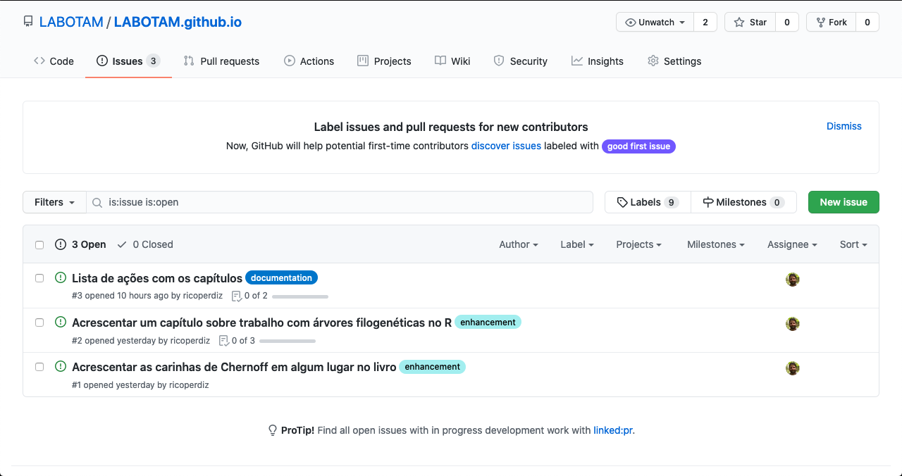

--- 
title: "Curso básico de introdução à linguagem R"
subtitle: "Disciplina BOT89 - PPGBOT INPA"
author:
  - "[Alberto Vicentini](http://www.botanicaamazonica.wiki.br/labotam/doku.php?id=alunos:a.vicentini:inicio) ([INPA](http://portal.inpa.gov.br/))"
  - "[Ricardo de Oliveira Perdiz](https://ricardoperdiz.com) - ricardoperdiz\\@yahoo.com"
date: "Última atualização: `r Sys.Date()`"
site: bookdown::bookdown_site
output: 
  bookdown::gitbook: default
documentclass: book
bibliography: [bot89-introR.bib, pkg-bib.bib]
biblio-style: apalike
link-citations: true
links-as-notes: true
colorlinks: true
lang: pt-br
github-repo: LABOTAM/LABOTAM.github.io 
description: "Este livro é um guia básico para conhecer a sintaxe básica da linguagem de programação R e o potencial de utilizá-la como ferramenta científica."
---

```{r, setup, include = FALSE}
knitr::opts_template$set(evalF = list(echo = TRUE,
                                      eval = FALSE))

knitr::opts_template$set(executa = list(echo = FALSE,
                                        eval = TRUE))

knitr::opts_template$set(executa_mostra = list(echo = TRUE,
                                               eval = TRUE))
# options(knitr.duplicate.label = "allow") # ve se com new_session: yes no bookdown.yml, esse problema e resolvido
```

```{r load_packages, include = FALSE, echo = FALSE, message = FALSE}
description <- readr::read_lines("DESCRIPTION")
libs <- unlist(stringr::str_split(gsub("Imports: ", "", grep("Imports: ", description, value = TRUE)), ", "))
sapply(libs, library, logical.return = T, character.only = T)
```


```{r build-pkg-bib, include = FALSE, echo = FALSE, message = FALSE}
knitr::write_bib(
  c(.packages(), "readxl", "readr", "data.table", "rgdal", "taxize"),
  'pkg-bib.bib')
```

```{r compila-readme, include = FALSE, echo = FALSE, message = FALSE}
rmarkdown::render("README.Rmd", output_format = "md_document", encoding = 'UTF-8')
```

# Prefácio {-}

Este livro foi criado inicialmente para servir como um material de apoio básico aos estudantes da disciplina [Preparação de dados para Análises Estatísticas - Introdução ao R (BOT-89)](http://www.botanicaamazonica.wiki.br/labotam/doku.php?id=disciplinas:bot89:inicio) do [Programa de Pós-Graduação em Ciências Biológicas (Botânica)](http://www.portais.atrio.scire.net.br/inpa-ppgbot/index.php/pt/) do INPA.
Porém, devido ao seu conteúdo abrangente, pode ser utilizado por qualquer pessoa que escolha conhecer esta linguagem para utilizá-la no dia a dia.  

Nosso meta é prover uma introdução básica 
<!-- (a) passar uma noção geral sobre dados e metadados e como criar e manter um banco de dados de forma simples e organizada e que facilite seu uso posterior; -->
da linguagem de programação R, que é extremamente poderosa para manipulação de dados, análises estatísticas, produção de gráficos e de documentos dinâmicos, e cujo domínio oferece um grande ganho de produtividade a todo cientista e facilita o entendimento de métodos analíticos.
Ressaltamos que **isto não é um curso de estatística**.  

# Sobre o livro {-}

Você pode encontrar os códigos fonte deste livro no endereço [https://github.com/LABOTAM/LABOTAM.github.io/tree/main](https://github.com/LABOTAM/LABOTAM.github.io/tree/main).
Caso você verifique algum erro de português, pense que algum conteúdo possa melhorar, ou possua o desejo de contribuir ativamente com a construção do livro, sinta-se à vontade para entrar em contato conosco.
Você pode nos enviar um email, pode criar um problema na página deste repositório ("open an issue" em inglês; acessa a aba **Issues** no endereço [github.com/LABOTAM/LABOTAM.github.io/issues](https://github.com/LABOTAM/LABOTAM.github.io/issues)) para solicitar alguma mudança ou informar algum erro no conteúdo desta obra (Fig. \@ref(fig:issues)).
Toda contribuição será bem vinda.  

```{r issues, fig.cap = 'Imagem do repositório https://github.com/LABOTAM/LABOTAM.github.io destacando a aba **Issues**. Nesta aba, o usuário pode fazer solicitações, informar aos desenvolvedores sobre possíveis erros no código, ou fazer comentários.', eval = TRUE, echo = FALSE}

```

Outra maneira é usar a opção de editar os arquivos fonte diretamente no GitHub, acessando o botão **Edit** disponível na versão digital do livro.
Ao optar por esse caminho, você será levado à página do código fonte e poderá editar o arquivo diretamente no GitHub.
Após as modificações, você terá a possibilidade de gerar um **[Pull request](https://docs.github.com/pt/github/collaborating-with-issues-and-pull-requests/about-pull-requests)** que será analisado por nós.
Caso aceitemos a modificação proposta, seu nome será incluído entre os contribuidores do livro.  

# Sobre os autores {-}

O texto deste livro foi escrito e aprimorado majoritariamente (mais de 90%) por Alberto Vicentini ao longo dos últimos 10 anos em disciplinas anuais ofertadas no Programa de pós-graduação em Ciências Biológicas (Botânica) do Instituto Nacional de Pesquisas da Amazônia (INPA).
Essas aulas podem ser visualizadas no endereço [http://www.botanicaamazonica.wiki.br/labotam/doku.php?id=disciplinas:bot89:inicio](http://www.botanicaamazonica.wiki.br/labotam/doku.php?id=disciplinas:bot89:inicio).
Ricardo Perdiz transpôs as aulas originais formatadas em `dokuwiki` para o formato [Rmarkdown](https://rmarkdown.rstudio.com/). Também corrigiu alguns detalhes e acrescentou novos conteúdos.  


<!-- incluir aqui a autores.Rmd - pedir ao Beto para revisar o texto XXX-->

# Pré-requisitos {-}

Devido ao modo como foi construído, este livro pode ser tanto lido quanto "executado", uma vez que seus arquivos são o que chamamos de *Rmarkdown*, uma linguagem que mistura texto com código.
Sendo assim, o livro pode ser visualizado em computadores, em celulares modernos, e em *tablets*.
Não é necessário ter um computador próprio, apesar de que possuir um facilita o aprendizado.
Entendemos que nosso país ainda carece de muito investimento na melhora da qualidade de vida da população em geral, o que inclui acesso facilitado aos bens de informática.
Desta forma, providenciamos duas maneiras de o leitor deste livro fazer bem uso das informações aqui contidas.  

## Caso você possua um computador  {-}

### Instale o R  {-}

Baixe e instale o [R](https://www.r-project.org/), próprio para o seu sistema operacional.  

### Instale um ambiente de desenvolvimento integrado - IDE  {-}

Recomendamos que o software [RStudio](https://www.rstudio.com/products/rstudio/download/) seja instalado no seu computador, pois ele foi criado facilitar a interação do usuário com os múltiplos recursos oferecidos pela linguagem, em especial os inúmeros pacotes desenvolvidos por funcionários desta empresa, entre os quais se inclui o pacote [bookdown](https://github.com/rstudio/bookdown), utilizado para construir este livro online.
Ademais, ambientes de desenvolvimento integrado (do inglês *Integrated Development Environment*, **IDE**) como este software têm o objetivo de prover ao usuário mais ferramentas na interação entre o código e o resultado da execução do código, além de facilitar o uso de ferramentas alternativas para construção de texto mesclado com códigos (e.g., LaTeX, Markdown etc), o que permite uma dinamicidade na construção de textos acadêmicos.  

Existem outras alternativas de software, tais como o [Atom](https://atom.io/) e o [Visual Studio Code](https://code.visualstudio.com/). Fique à vontade para escolher.  

## Caso você não possua um computador  {-}

O Google oferece um serviço chamado [Google Colab](https://research.google.com/colaboratory/faq.html) que pode ser utilizado em computadores, em celulares modernos com acesso à internet e possuídores de um navegador, e em tablets.  

Nós convertemos o conteúdo deste livro para um Jupyter Notebook e o colocamos nesta plataforma.
Você pode acessar este arquivo pelo endereço XXX INCLUIR ENDERECO AQUI.
Por ser uma ferramenta nova, nós não sabemos de possíveis erros que possam ocorrer ao executar os comandos deste livro nesta plataforma.
Caso você encontre algum erro, abra um problema em nosso repositório e nos informe do ocorrido.  

