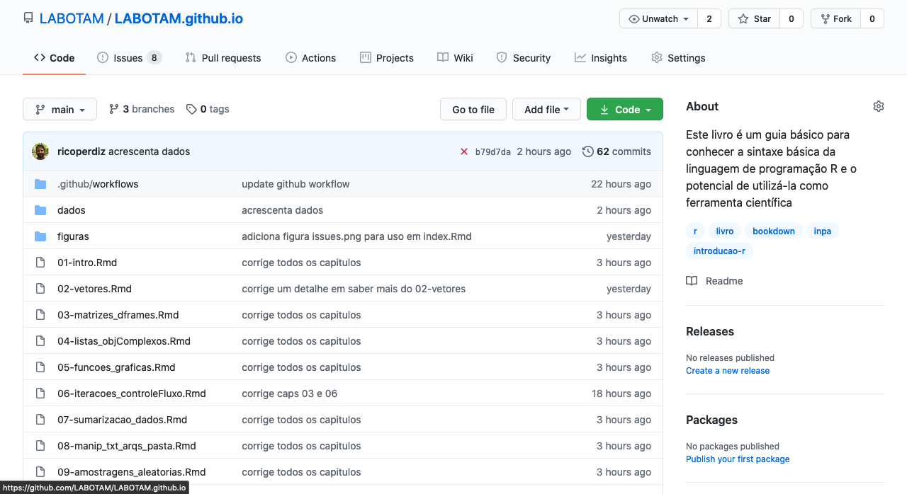
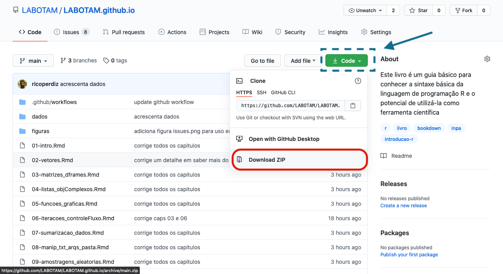
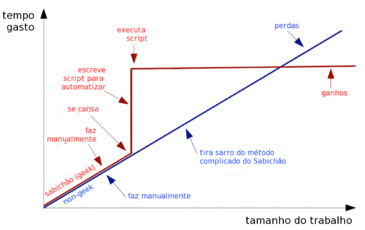

--- 
title: "Curso básico de introdução à linguagem R"
subtitle: "Disciplina BOT89 - PPGBOT INPA"
author:
  - "[Alberto Vicentini](http://www.botanicaamazonica.wiki.br/labotam/doku.php?id=alunos:a.vicentini:inicio) ([INPA](http://portal.inpa.gov.br/))"
  - "[Ricardo de Oliveira Perdiz](https://ricardoperdiz.com) - ricardoperdiz\\@yahoo.com"
date: "Última atualização: `r Sys.Date()`"
site: bookdown::bookdown_site
output: bookdown::gitbook
documentclass: book
bibliography: bot89-introR.bib
biblio-style: apalike
link-citations: true
links-as-notes: true
colorlinks: true
lang: pt-br
github-repo: LABOTAM/LABOTAM.github.io 
description: "Este livro é um guia básico para conhecer a sintaxe básica da linguagem de programação R e o potencial de utilizá-la como ferramenta científica."
---

```{r, setup, include = FALSE}
knitr::opts_template$set(evalF = list(echo = TRUE,
                                      eval = FALSE))

knitr::opts_template$set(executa = list(echo = FALSE,
                                        eval = TRUE))

knitr::opts_template$set(executa_mostra = list(echo = TRUE,
                                               eval = TRUE))
options(knitr.duplicate.label = "allow")
```

```{r load_packages, eval = TRUE, include = FALSE, echo = FALSE, message = FALSE}
description <- readr::read_lines("DESCRIPTION")
libs <- unlist(stringr::str_split(gsub("Imports: ", "", grep("Imports: ", description, value = TRUE)), ", "))
sapply(libs, library, logical.return = T, character.only = T)
```

```{r build-pkg-bib, eval = TRUE, include = FALSE, echo = FALSE, message = FALSE}
knitr::write_bib(
  c(.packages(), "readxl", "readr", "data.table", "rgdal", "taxize", "lattice"),
  'pkg-bib.bib')
```

```{r compila-readme, eval = TRUE, include = FALSE, echo = FALSE, message = FALSE}
rmarkdown::render("README.Rmd", output_format = "md_document", encoding = 'UTF-8')
```

```{r converte-rmd-r, eval = TRUE, include = FALSE, echo = FALSE, message = FALSE}
capitulos <- list.files(pattern = "^[0-9]")
capitulos_out <- gsub("\\.Rmd", ".R", capitulos)
capitulosR_output_names <- paste0("codigo/", capitulos_out)
purrr::walk2(
  capitulos,
  capitulosR_output_names,
  ~knitr::purl(.x, output = .y, documentation = 2)
)
```

# Prefácio {-}

Este livro foi criado inicialmente para servir como um material de apoio básico aos estudantes da disciplina [Preparação de dados para Análises Estatísticas - Introdução ao R (BOT-89)](http://www.botanicaamazonica.wiki.br/labotam/doku.php?id=disciplinas:bot89:inicio) do [Programa de Pós-Graduação em Ciências Biológicas (Botânica)](http://www.portais.atrio.scire.net.br/inpa-ppgbot/index.php/pt/) do INPA.
Porém, devido ao seu conteúdo abrangente, pode ser utilizado por qualquer pessoa que escolha conhecer esta linguagem para utilizá-la no dia a dia.  

Nossa meta é prover uma introdução básica 
<!-- (a) passar uma noção geral sobre dados e metadados e como criar e manter um banco de dados de forma simples e organizada e que facilite seu uso posterior; -->
da linguagem de programação R, que é extremamente poderosa para manipulação de dados, análises estatísticas, produção de gráficos e de documentos dinâmicos, e cujo domínio oferece um grande ganho de produtividade a todo cientista e facilita o entendimento de métodos analíticos.
Ressaltamos que **isto não é um curso de estatística**.  

## Estrutura do livro {-}

::: {.infobox .warning data-latex="warning"}

**Nota**: Este livro está em constante atualização. Os capítulos de 1 a 10 estão relativamente estáveis e devem passar por poucas mudanças daqui para a frente. Haverá uma reestruturação no que atualmente se chama [Material Suplementar](https://labotam.github.io/material-suplementar.html), e também a adição de ao menos uma parte contendo tutorials de análise exploratória de dados. Você pode encontrar os códigos fonte deste livro no endereço [https://github.com/LABOTAM/LABOTAM.github.io/tree/main](https://github.com/LABOTAM/LABOTAM.github.io/tree/main). Se você tiver alguma contribuição a fazer, seja na forma de correções, críticas, ou o desejo de contribuir ativamente com o projeto, sinta-se à vontade para [abrir um problema no repositório do livro](https://github.com/LABOTAM/LABOTAM.github.io/issues). Grato!

:::

O livro está dividido três partes.
A primeira parte contem 10 capítulos e aborda os ensinamentos básicos para o usuário aprender a usar a linguagem como uma ferramenta científica.  

* **Capítulo \@ref(intro)** aborda os aspectos básicos da linguagem R, o software que utilizamos para usar a linguagem, pacotes com funções, como solicitar ajuda sobre funções, dicas de organização das pastas, e o R como uma calculadora.
* **Capítulo \@ref(vetores)** aborda a criação, indexação, e operações matemáticas com vetores no R.
* **Capítulo \@ref(mat-dframe)** aborda a criação, indexação, filtragem, importação e exportação de matrizes e data.frames.
* **Capítulo \@ref(lista-objcompl)** ensina a criar, indexar, e filtrar listas e objetos complexos.
* **Capítulo \@ref(func-graf)** aborda as funções gráficas do pacote `base` do R.
* **Capítulo \@ref(iter-cflux)** aborda dois conceitos chave em qualquer linguagem de programação: iteração e controles de fluxo.
* **Capítulo \@ref(sumar-dados)** abrange o tópico de sumarização de dados, explicando tabelas de contagem, tabelas dinâmicas e junção de tabelas.<!-- NOTA! Junção de tabelas não parece se encaixar aqui, hein, Beto? -->
* **Capítulo \@ref(manip-txt-arq-pasta)** ensina ferramentas básicas para a manipulação de textos, arquivos e pastas.
* **Capítulo \@ref(amost-aleat)** ensina de maneira breve funções para amostragens aleatórias e distribuições de valores.
* **Capítulo \@ref(extr-dados)** abrange o uso de funções customizadas para extração de variáveis morfológicas de notas de texto obtidas de espécimes de plantas.  

A segunda parte (**em fase de preparação**) contem tutoriais curtos de análise exploratória de dado (AED).
A AED **deve ser iniciada ainda durante a coleta de dados**, pois através dela podemos conhecer nossos dados e acompanhar como estamos coletando esses dados.
AED baseia-se largamente em técnicas visuais (gráficos) e pode levar entre 20 a 50% do tempo das análises.
Os capítulos abaixo exemplificam algumas ferramentas do R para fazer AED:

* **Capítulo \@ref(aed-checa-dados)** aborda a checagem inicial dos dados;

* **Capítulo \@ref(aed-univar)** aborda a AED em dados univariados;

* **Capítulo \@ref(aed-bivar)** aborda a AED em dados biivariados;

* **Capítulo \@ref(aed-multivar)** aborda a AED em dados multivariados.  

Por fim, temos um apêndice contendo materiais suplementares:

* **Capítulo \@ref(mat-sup)** inclui uma discussão breve sobre o universo de pacotes conhecidos como [Tidyverse](https://www.tidyverse.org/), comparando-os com o pacote `base` do R; um tutorial para baixar e descomprimir arquivos `.zip`; e por fim uma lista de vídeos gravados por nós abordando diversos tópicos deste livro, disponíveis em uma lista para facilitar a consulta.  

<!-- Outra maneira é usar a opção de editar os arquivos fonte diretamente no GitHub, acessando o botão **Edit** disponível na versão digital do livro. -->
<!-- Ao optar por esse caminho, você será levado à página do código fonte e poderá editar o arquivo diretamente no GitHub. -->
<!-- Após as modificações, você terá a possibilidade de gerar um **[Pull request](https://docs.github.com/pt/github/collaborating-with-issues-and-pull-requests/about-pull-requests)** que será analisado por nós. -->
<!-- Caso aceitemos a modificação proposta, seu nome será incluído entre os contribuidores do livro.   -->

## Sobre os autores {-}

O texto deste livro foi escrito e aprimorado majoritariamente (mais de 90%) por Alberto Vicentini ao longo dos últimos 10 anos em disciplinas anuais ofertadas no Programa de pós-graduação em Ciências Biológicas (Botânica) do Instituto Nacional de Pesquisas da Amazônia (INPA).
Essas aulas podem ser visualizadas no endereço [http://www.botanicaamazonica.wiki.br/labotam/doku.php?id=disciplinas:bot89:inicio](http://www.botanicaamazonica.wiki.br/labotam/doku.php?id=disciplinas:bot89:inicio).
Ricardo Perdiz transpôs as aulas originais formatadas em `dokuwiki` para o formato [Rmarkdown](https://rmarkdown.rstudio.com/). Também corrigiu alguns detalhes e acrescentou novos conteúdos.  


<!-- incluir aqui a autores.Rmd - pedir ao Beto para revisar o texto XXX-->

## Pré-requisitos {-}

Devido ao modo como foi construído, este livro pode ser tanto lido quanto "executado", uma vez que seus arquivos são o que chamamos de *Rmarkdown*, uma linguagem que mistura texto com código.
Sendo assim, o livro pode ser visualizado em computadores, em celulares modernos, e em *tablets*.
Não é necessário ter um computador próprio, apesar de que possuir um facilita o aprendizado.
Entendemos que nosso país ainda carece de muito investimento na melhora da qualidade de vida da população em geral, o que inclui acesso facilitado aos bens de informática.
Desta forma, providenciamos duas maneiras de o leitor deste livro fazer bem uso das informações aqui contidas.  

## Caso você possua um computador {-}

### Instale o R {-}

Baixe e instale o [R](https://www.r-project.org/), próprio para o seu sistema operacional.  

### Instale um ambiente de desenvolvimento integrado - IDE {-}

Recomendamos que o software [RStudio](https://www.rstudio.com/products/rstudio/download/) seja instalado no seu computador, pois ele foi criado facilitar a interação do usuário com os múltiplos recursos oferecidos pela linguagem, em especial os inúmeros pacotes desenvolvidos por funcionários desta empresa, entre os quais se inclui o pacote [bookdown](https://github.com/rstudio/bookdown), utilizado para construir este livro online.
Ademais, ambientes de desenvolvimento integrado (do inglês *Integrated Development Environment*, **IDE**) como este software têm o objetivo de prover ao usuário mais ferramentas na interação entre o código e o resultado da execução do código, além de facilitar o uso de ferramentas alternativas para construção de texto mesclado com códigos (e.g., LaTeX, Markdown etc), o que permite uma dinamicidade na construção de textos acadêmicos.  

Existem outras alternativas de software, tais como o [Atom](https://atom.io/) e o [Visual Studio Code](https://code.visualstudio.com/). Fique à vontade para escolher.  

### Baixe o repositório para seu computador {-}

Acesse a [página do repositório]() contendo os códigos fontes deste livro (Fig. \@ref(fig:repo)).

```{r repo, fig.cap = 'Imagem inicial do repositório hospedado no GitHub contendo o código fonte deste livro.', eval = TRUE, echo = FALSE}

```

Busque um botão de cor **verde** chamado *Code* (Fig. \@ref(fig:baixa-repo)).
Clique neste botão e aparecerão algumas opções.
Clique no botão **Download Zip**, destacado em vermelho na figura \@ref(fig:baixa-repo), e escolha onde você quer salvar o arquivo.

```{r baixa-repo, fig.cap = 'Destaque do botão *Code* (retângulo **azul** pontilhado circundando o botão, com uma seta **azul** apontando para o mesmo botão) presente na página inicial do repositório hospedado no GitHub contendo o código fonte deste livro. Há um outro retângulo de cor **vermelha** destacando a opção **Download Zip**.', eval = TRUE, echo = FALSE}

```

Após baixar, descomprima este arquivo `.zip`, escolha onde você deseja guardar a pasta, e comece a acessar os arquivos.  

Os arquivos contendo cada capítulo deste livro são listados abaixo e podem ser encontrados na [página inicial do repositório](https://github.com/LABOTAM/LABOTAM.github.io):

```{r, eval = TRUE, echo = FALSE}
cat(capitulos, sep = "\n")
```

Você pode tanto utilizar os arquivos escritos em formato [Rmarkdown](http://www.botanicaamazonica.wiki.br/labotam/doku.php?id=bot89:precurso:rmarkdown:inicio) e executar os códigos em cada célula de código (**code chunks**) ou usar os scripts contidos na pasta `codigo`, que nada mais são do que os capítulos do livro convertidos para um script de R, isto é, em formato `.R`.
Nesses scripts, todos os pedaços de texto, incluindo cabeçalhos e comentários estão precedidos de `#'`; o que for código aparecerá sem `#'` precedentes.
Clique no nome dos scripts abaixo para levá-lo direto ao arquivo dentro do repositório.  

```{r mostra-scrpt-r, eval = TRUE, echo = FALSE, message = FALSE, results='asis'}
cat(paste0("* [", gsub("codigo/", "", capitulosR_output_names), "](https://github.com/LABOTAM/LABOTAM.github.io/tree/main/", capitulosR_output_names, ")"),
    sep = "\n")
```

## Caso você não possua um computador {-}

O Google oferece um serviço chamado [Google Colab](https://research.google.com/colaboratory/faq.html) que pode ser utilizado em computadores, em celulares modernos com acesso à internet e possuídores de um navegador, e em tablets.  

Em breve, apresentaremos aqui um endereço contendo todo o conteúdo deste livro já convertido para o formato de um Jupyter Notebook, que é o modelo de arquivo utilizado pelo Google Colab.  

<!-- Nós convertemos o conteúdo deste livro para um Jupyter Notebook e o colocamos nesta plataforma. -->
<!-- Você pode acessar este arquivo pelo endereço XXX INCLUIR ENDERECO AQUI. -->
<!-- Por ser uma ferramenta nova, nós não sabemos de possíveis erros que possam ocorrer ao executar os comandos deste livro nesta plataforma. -->
<!-- Caso você encontre algum erro, abra um problema em nosso repositório e nos informe do ocorrido.   -->

## O que é o R e por qual razão você deve se preocupar em programar {-}

### O R em poucas palavras {-}

> *O R é um software livre e gratuito de desenvolvimento coletivo e é muito útil para quem trabalha com ciências e precisa manipular e analisar dados, gerar gráficos e publicações dinâmicas. Tem uma comunidade enorme de usuários e colaboradores e está disponível gratuitamente em diversos repositórios espalhados pelo mundo* (https://cran.r-project.org/).  

> *O R foi criado para permitir a melhor e mais ampla exploração de dados possível, (...) mas sempre explicando a natureza dos métodos utilizados, num formato aberto (livre) e compreensível* [@Chambers2008].  

> *O R é uma linguagem de programação; você conversa com o R através de um código*.  

> Por ser uma linguagem de programação, **no R você pode fazer tudo**. A pergunta não é sobre **SE** o R faz alguma coisa, mas **COMO** fazer no R alguma coisa. E há várias maneiras de fazer a mesma coisa no R. É fundamental aprender a falar R, pois sabendo falar você pode dizer do seu jeito.  

> *Todo estudante de ciências deveria aprender a programar, porque programar lhe ensina a pensar* (Steve Jobs). Usar o R é a melhor forma de aprender estatística porque você precisa de fato entender o que está fazendo ao escrever um código.  

> **Aprender a programar é como aprender um novo idioma**; aprendendo o R fica mais fácil aprender outras linguagens de programação e lhe ajuda a aprender inglês, e o inglês lhe facilita falar R.  

> **O R é uma fantástica ferramenta para fazer gráficos**; veja exemplos em http://www.r-graph-gallery.com.  

> Com o desenvolvimento da linguagem na última década, você pode gerar aplicativos ([Shiny](https://shiny.rstudio.com/)) e relatório dinâmicos usando [Rmarkdown](http://www.botanicaamazonica.wiki.br/labotam/doku.php?id=bot89:precurso:rmarkdown:inicio), facilitando a formatação gráfica e a reprodutibilidade dos seus artigos, relatórios e projetos científicos.  

### Por que programar? {-}

> A maioria dos programas de computador não é muito boa. O código no seu laptop, televisor, telefone, carro é geralmente mal documentado, inconsistente e pouco testado. Por que isso importa para a ciência? Porque transformar dados brutos (`raw data`) em artigos científicos geralmente requer um pouco de programação, o que significa que a maioria dos cientistas escreve software (Nick Barnes, 2010, [Publish your computer code](http://www.nature.com/news/2010/101013/full/467753a.html), Nature News).  

> **É tentador tratar todas as coisas como se fossem pregos, se a única ferramenta que você tem é um martelo** (Abraham Maslow, 1996, [Lei do Instrumento](https://en.wikipedia.org/wiki/Law_of_the_instrument))! Liberte-se da camisa de força dos softwares de estatística que limitam as análises que você pode fazer e como pode fazer.  

> *Um dos objetivos da análise estatística é o de destilar um conjunto longo e complicado de dados em um número pequeno de estatísticas descritivas que façam sentido. Muitos dos pacotes estatísticos de computadores modernos, no entanto, fazem exatamente o oposto disso. Eles produzem automaticamente um número excessivo de resultados que termina sendo aceito sem crítica; pode levar à super interpretação dos dados; e incentiva o mal hábito de __jogar dados e cuspir resultados__ (data trawling). O R, por outro lado, não lhe diz nada a não ser aquilo que você peça explicitamente* [@Crawley2007].  

> (...) aprender a programar é importante porque desenvolve habilidades analíticas e de resolução de problemas. É uma atividade criativa, um meio de expressar idéias abstratas. Assim, programar é divertido e é muito mais do que uma habilidade profissional. Ao projetar programas, aprendemos muitas habilidades que são importantes para todas as profissões. Essas habilidades podem ser resumidas como: (1) Leitura crítica, (2) Pensamento analítico, (3) Síntese criativa ([Why programming is important](http://programmingstage.blogspot.com.br/2012/05/why-programming-is-important.html)).  

> *Uma das coisas mais importantes que você (como cientista) pode fazer é dedicar um tempo para aprender uma linguagem de programação de verdade. Aprender a programar é como aprender outro idioma: exige tempo e treinamento, e não há resultados práticos imediatos. Mas se você supera essa primeira subida íngreme da curva de aprendizado, os ganhos como cientista são enormes. Programar não vai apenas livrar você da camisa de força dos pacotes estatísticos, mas também irá aguçar suas habilidades analíticas e ampliar os horizontes de modelagem (..) e estatística* [@Gotelli2013].  

```{r, out.width="101%", fig.cap = "Curvas de aprendizagem do aluno Sabichão (Geek) e de um aluno que tem medo de código (non-geek).", eval = TRUE, echo = FALSE}

```

## Análise exploratória de dados (AED) {-}

### O que é AED e por que fazer AED? {-}

> Em estatística, análise exploratória de dados (AED) é uma abordagem para analisar conjuntos de dados visando resumir as suas principais características, particularmente com métodos gráficos e visuais.
Um modelo estatístico pode ou não ser usado, mas AED objetiva principalmente ver o que os dados podem nos dizer para além da modelagem ou de testes de hipóteses. A AED foi promovida por [John Tukey](https://en.wikipedia.org/wiki/John_Tukey) para incentivar estatísticos a explorar dados e, eventualmente, formular novas hipóteses que possam levar à nova coleta de dados e a experimentos.
AED é diferente de análise de dados inicial (AID), que foca mais estreitamente na verificação de suposições necessárias aos modelos de testes de hipóteses, manipulação de valores ausentes e transformações de variáveis, conforme necessário.
AED abrange AID (Texto traduzido da [WikiPedia](https://en.wikipedia.org/wiki/Exploratory_data_analysis)).  


```{r, out.width="100%", eval = TRUE, echo = FALSE}

```


> Muitas vezes esquecemos como funciona a ciência e a engenharia. Idéias vêm mais frequentemente de exploração anterior do que de descargas atmosféricas. (...) **Encontrar a pergunta é muitas vezes mais importante do que encontrar a resposta**. Análise exploratória de dados é uma atitude, uma flexibilidade que depende de visualização gráfica, não é um conjunto de técnicas [@Tukey1980].  

Em sistemática e taxonomia, uma ciência histórica, a análise exploratória é fundamental, pois é através dela que podemos postular boas hipóteses e usar teste de hipóteses para confirmá-las.

> Aplicar a análise exploratória de dados para criar hipóteses e então usar os mesmos dados para testar essas hipóteses deve ser evitado.
Se alguém tem conhecimento *a priori* limitado, então uma abordagem válida é criar dois conjuntos de dados: aplicar exploração de dados sobre o primeiro conjunto para criar hipóteses e usar o segundo conjunto de dados para testar essas hipóteses .
Tal processo, no entanto, só é prático para conjuntos de dados grandes.
Independentemente da situação específica, o uso constante e a estruturação de relatórios transparentes de exploração sistemática de dados melhorariam a qualidade da pesquisa ecológica e de quaisquer recomendações que ela produziria [@Zuuretal2010].  

A análise exploratória não é *dragagem* de dados! Assume-se que o pesquisador formulou hipóteses biológicas plausíveis *a priori* amparadas pela teoria.  

### Objetivos da AED {-}

* Controlar a qualidade dos dados;
* Sugerir hipóteses para os padrões observados (novos estudos);
* Apoiar a escolha dos procedimentos estatísticos de testes de hipótese;
* Avaliar se os dados atendem às premissas dos procedimentos estatísticos escolhidos.

### Para ler {-}

Dois artigos que você deveria ler: @Tukey1980 e @Zuuretal2010.  
